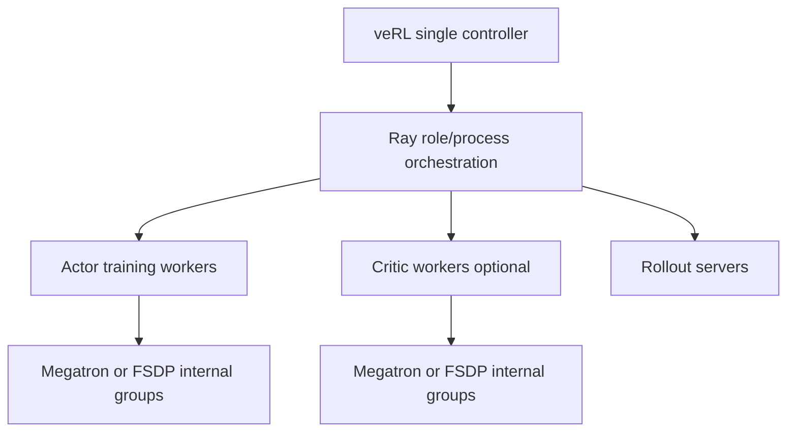
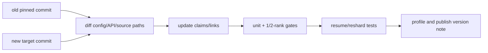

# 分布式训练源码、论文、术语与版本核验

这页不是“更多链接”，而是课程的证据索引。优先级固定为：**当前运行提交源码 → 同版本测试/文档 → PyTorch/NCCL 官方契约 → 论文设计动机 → 第三方解释。**

## 本课程固定版本

| 项目 | 提交 | 课程用途 |
| --- | --- | --- |
| Megatron-LM/Core | [`82e9dc6`](https://github.com/NVIDIA/Megatron-LM/tree/82e9dc69c9e6f8c27681f2cb6856a188187edf6b) | TP/SP/PP/CP/EP、distributed optimizer、DCP |
| TorchTitan | [`fec3e19`](https://github.com/pytorch/torchtitan/tree/fec3e196a4ceb87bfc87fb4f1a36a538d7e98ee4) | FSDP2/DTensor/DeviceMesh 与 PyTorch 原生训练主线 |
| DeepSpeed | [`53a2ac4`](https://github.com/deepspeedai/DeepSpeed/tree/53a2ac44fb664bea838df3981ba4366b91643070) | ZeRO stages、offload、engine/checkpoint 对照 |

固定提交不是宣称“最好”，而是让页面中的类名、配置和行为可以复查。你运行其他版本时，把差异当 migration，而不是默默套用。

## PyTorch 官方资料

### 分布式原语

- [Distributed overview](https://pytorch.org/tutorials/beginner/dist_overview.html)
- [`torch.distributed` API](https://pytorch.org/docs/stable/distributed.html)
- [Collective communications](https://pytorch.org/docs/stable/distributed.html#collective-functions)
- [DeviceMesh](https://pytorch.org/docs/stable/distributed.html#devicemesh)
- [DTensor](https://pytorch.org/docs/stable/distributed.tensor.html)

### 并行与状态

- [DistributedDataParallel](https://pytorch.org/docs/stable/generated/torch.nn.parallel.DistributedDataParallel.html)
- [FSDP `fully_shard`](https://pytorch.org/docs/stable/distributed.fsdp.fully_shard.html)
- [Tensor Parallel API](https://pytorch.org/docs/stable/distributed.tensor.parallel.html)
- [Pipeline Parallel API](https://pytorch.org/docs/stable/distributed.pipelining.html)
- [Distributed Checkpoint](https://pytorch.org/docs/stable/distributed.checkpoint.html)

### 诊断

- [ProcessGroupNCCL environment variables](https://pytorch.org/docs/stable/torch_nccl_environment_variables.html)
- [Flight Recorder tutorial](https://pytorch.org/tutorials/prototype/flight_recorder_tutorial.html)
- [CUDA memory snapshots](https://pytorch.org/docs/stable/torch_cuda_memory.html)
- [Reproducibility notes](https://pytorch.org/docs/stable/notes/randomness.html)

PyTorch `stable` 文档会随发布更新；先记录运行时 `torch.__version__`，再选择对应版本 URL/API，不要把最新 stable 的实验性参数强套到旧 wheel。

## TorchTitan 固定源码地图

| 问题 | 入口 |
| --- | --- |
| CLI 与生命周期 | [`torchtitan/train.py`](https://github.com/pytorch/torchtitan/blob/fec3e196a4ceb87bfc87fb4f1a36a538d7e98ee4/torchtitan/train.py) |
| Trainer 初始化/step | [`torchtitan/trainer.py`](https://github.com/pytorch/torchtitan/blob/fec3e196a4ceb87bfc87fb4f1a36a538d7e98ee4/torchtitan/trainer.py) |
| degrees/mesh views | [`distributed/parallel_dims.py`](https://github.com/pytorch/torchtitan/blob/fec3e196a4ceb87bfc87fb4f1a36a538d7e98ee4/torchtitan/distributed/parallel_dims.py) |
| Llama transform 顺序 | [`models/llama3/parallelize.py`](https://github.com/pytorch/torchtitan/blob/fec3e196a4ceb87bfc87fb4f1a36a538d7e98ee4/torchtitan/models/llama3/parallelize.py) |
| FSDP2 units/policy | [`distributed/fsdp.py`](https://github.com/pytorch/torchtitan/blob/fec3e196a4ceb87bfc87fb4f1a36a538d7e98ee4/torchtitan/distributed/fsdp.py) |
| PP stage/schedule | [`distributed/pipeline_parallel.py`](https://github.com/pytorch/torchtitan/blob/fec3e196a4ceb87bfc87fb4f1a36a538d7e98ee4/torchtitan/distributed/pipeline_parallel.py) |
| CP input/attention | [`distributed/context_parallel.py`](https://github.com/pytorch/torchtitan/blob/fec3e196a4ceb87bfc87fb4f1a36a538d7e98ee4/torchtitan/distributed/context_parallel.py) |
| DCP manager | [`components/checkpoint.py`](https://github.com/pytorch/torchtitan/blob/fec3e196a4ceb87bfc87fb4f1a36a538d7e98ee4/torchtitan/components/checkpoint.py) |
| config baseline | [`llama3/config_registry.py`](https://github.com/pytorch/torchtitan/blob/fec3e196a4ceb87bfc87fb4f1a36a538d7e98ee4/torchtitan/models/llama3/config_registry.py) |
| debug/reproducibility | [`docs/debugging.md`](https://github.com/pytorch/torchtitan/blob/fec3e196a4ceb87bfc87fb4f1a36a538d7e98ee4/docs/debugging.md) |
| checkpoint usage | [`docs/checkpoint.md`](https://github.com/pytorch/torchtitan/blob/fec3e196a4ceb87bfc87fb4f1a36a538d7e98ee4/docs/checkpoint.md) |

## Megatron 固定源码地图

| 问题 | 入口 |
| --- | --- |
| GPT 应用/data/forward | [`pretrain_gpt.py`](https://github.com/NVIDIA/Megatron-LM/blob/82e9dc69c9e6f8c27681f2cb6856a188187edf6b/pretrain_gpt.py) |
| 通用 pretrain/train step | [`training/training.py`](https://github.com/NVIDIA/Megatron-LM/blob/82e9dc69c9e6f8c27681f2cb6856a188187edf6b/megatron/training/training.py) |
| rank groups | [`core/parallel_state.py`](https://github.com/NVIDIA/Megatron-LM/blob/82e9dc69c9e6f8c27681f2cb6856a188187edf6b/megatron/core/parallel_state.py) |
| Transformer config | [`transformer_config.py`](https://github.com/NVIDIA/Megatron-LM/blob/82e9dc69c9e6f8c27681f2cb6856a188187edf6b/megatron/core/transformer/transformer_config.py) |
| GPT builder/spec | [`gpt_builders.py`](https://github.com/NVIDIA/Megatron-LM/blob/82e9dc69c9e6f8c27681f2cb6856a188187edf6b/gpt_builders.py) |
| TP layers | [`tensor_parallel/layers.py`](https://github.com/NVIDIA/Megatron-LM/blob/82e9dc69c9e6f8c27681f2cb6856a188187edf6b/megatron/core/tensor_parallel/layers.py) |
| TP mappings/autograd | [`tensor_parallel/mappings.py`](https://github.com/NVIDIA/Megatron-LM/blob/82e9dc69c9e6f8c27681f2cb6856a188187edf6b/megatron/core/tensor_parallel/mappings.py) |
| vocab loss | [`tensor_parallel/cross_entropy.py`](https://github.com/NVIDIA/Megatron-LM/blob/82e9dc69c9e6f8c27681f2cb6856a188187edf6b/megatron/core/tensor_parallel/cross_entropy.py) |
| PP schedules | [`pipeline_parallel/schedules.py`](https://github.com/NVIDIA/Megatron-LM/blob/82e9dc69c9e6f8c27681f2cb6856a188187edf6b/megatron/core/pipeline_parallel/schedules.py) |
| PP P2P | [`pipeline_parallel/p2p_communication.py`](https://github.com/NVIDIA/Megatron-LM/blob/82e9dc69c9e6f8c27681f2cb6856a188187edf6b/megatron/core/pipeline_parallel/p2p_communication.py) |
| MoE layer/dispatcher | [`transformer/moe/`](https://github.com/NVIDIA/Megatron-LM/tree/82e9dc69c9e6f8c27681f2cb6856a188187edf6b/megatron/core/transformer/moe) |
| DDP/distributed optimizer | [`core/distributed/`](https://github.com/NVIDIA/Megatron-LM/tree/82e9dc69c9e6f8c27681f2cb6856a188187edf6b/megatron/core/distributed) / [`core/optimizer/`](https://github.com/NVIDIA/Megatron-LM/tree/82e9dc69c9e6f8c27681f2cb6856a188187edf6b/megatron/core/optimizer) |
| distributed checkpoint | [`core/dist_checkpointing/`](https://github.com/NVIDIA/Megatron-LM/tree/82e9dc69c9e6f8c27681f2cb6856a188187edf6b/megatron/core/dist_checkpointing) |

### 官方固定指南

- [Parallelism Strategies Guide](https://github.com/NVIDIA/Megatron-LM/blob/82e9dc69c9e6f8c27681f2cb6856a188187edf6b/docs/user-guide/parallelism-guide.md)
- [Tensor Parallel API](https://github.com/NVIDIA/Megatron-LM/blob/82e9dc69c9e6f8c27681f2cb6856a188187edf6b/docs/api-guide/core/tensor_parallel.md)
- [Pipeline Parallel API](https://github.com/NVIDIA/Megatron-LM/blob/82e9dc69c9e6f8c27681f2cb6856a188187edf6b/docs/api-guide/core/pipeline_parallel.md)
- [Context Parallel](https://github.com/NVIDIA/Megatron-LM/blob/82e9dc69c9e6f8c27681f2cb6856a188187edf6b/docs/user-guide/features/context_parallel.md)
- [Distributed Checkpoint](https://github.com/NVIDIA/Megatron-LM/blob/82e9dc69c9e6f8c27681f2cb6856a188187edf6b/docs/api-guide/core/dist_checkpointing.md)
- [Deterministic Training](https://github.com/NVIDIA/Megatron-LM/blob/82e9dc69c9e6f8c27681f2cb6856a188187edf6b/docs/user-guide/deterministic-training.md)

源码与指南冲突时，以固定源码和测试为准，并记录冲突；文档中的简化 world-product 公式尤其要与 `parallel_state.py` 的 dense/expert generators 对照。

## DeepSpeed / ZeRO 固定入口

| 问题 | 入口 |
| --- | --- |
| engine initialize | [`deepspeed/__init__.py`](https://github.com/deepspeedai/DeepSpeed/blob/53a2ac44fb664bea838df3981ba4366b91643070/deepspeed/__init__.py) |
| runtime engine | [`runtime/engine.py`](https://github.com/deepspeedai/DeepSpeed/blob/53a2ac44fb664bea838df3981ba4366b91643070/deepspeed/runtime/engine.py) |
| ZeRO stages | [`runtime/zero/`](https://github.com/deepspeedai/DeepSpeed/tree/53a2ac44fb664bea838df3981ba4366b91643070/deepspeed/runtime/zero) |
| checkpoint | [`runtime/checkpoint_engine/`](https://github.com/deepspeedai/DeepSpeed/tree/53a2ac44fb664bea838df3981ba4366b91643070/deepspeed/runtime/checkpoint_engine) |
| 官方 ZeRO 文档 | [DeepSpeed ZeRO](https://www.deepspeed.ai/tutorials/zero/) |

课程把 DeepSpeed 当 state-sharding/engine 对照，不假设它与 FSDP2 的参数表示、hook、checkpoint 或 offload 细节相同。

## 经典论文：按问题阅读

| 问题 | 论文 |
| --- | --- |
| 大规模 Transformer model parallel | [Megatron-LM](https://arxiv.org/abs/1909.08053) |
| 数据并行状态分片 | [ZeRO](https://arxiv.org/abs/1910.02054) |
| pipeline microbatch/bubble | [GPipe](https://arxiv.org/abs/1811.06965) |
| 1F1B 与 pipeline schedules | [PipeDream](https://arxiv.org/abs/1806.03377) / [PipeDream-Flush](https://arxiv.org/abs/2006.09503) |
| 自动/多维 tensor sharding | [Mesh-TensorFlow](https://arxiv.org/abs/1811.02084) / [GSPMD](https://arxiv.org/abs/2105.04663) |
| 长序列并行 | [Sequence Parallelism](https://arxiv.org/abs/2105.13120) |
| 稀疏 experts | [Sparsely-Gated MoE](https://arxiv.org/abs/1701.06538) / [Switch Transformers](https://arxiv.org/abs/2101.03961) |
| PyTorch 原生训练平台 | [TorchTitan](https://openreview.net/forum?id=SFN6Wm7YBI) |

论文解释设计空间，不保证固定仓库仍采用同一 API/调度细节。

## 与 veRL / Ray 的边界

在 veRL 中，Ray 通常负责角色进程的生命周期、RPC、资源与 placement；actor/critic 等角色内部的 FSDP/Megatron/vLLM/SGLang 才负责 GPU tensor parallel/collective。两层可以组合，但不能互相替代：

配套课程：[veRL 设计原则与 HybridFlow](https://cass998.github.io/losh_has_blog/verl-learning/internals/architecture) 与 [Ray、角色和启动条件](https://cass998.github.io/losh_has_blog/verl-learning/internals/workers)。

## 术语表

| 术语 | 精确定义 |
| --- | --- |
| rank | 一个 distributed process 的全局编号；不是 GPU 本身 |
| local rank | 节点内 process/device index |
| world | 默认全局 process set |
| process group | collective 的参与 ranks 与顺序语义 |
| mesh | 将 ranks 组织成命名多维坐标的结构 |
| placement | global tensor 在 mesh axes 上 replicate/shard/partial 的语义 |
| collective | all-reduce/all-gather/reduce-scatter/all-to-all 等组通信 |
| P2P | 明确 source/destination 的 send/recv |
| DP | 不同 samples 的模型副本/状态 shard 维度 |
| TP | 同一 layer tensor dimension shard |
| SP | TP ranks 上部分 sequence activation shard |
| PP | transformer layers/stages shard |
| CP | 全网 sequence/context shard |
| EP | experts shard + token dispatch |
| ZeRO | 按 stage 分片 optimizer/gradient/parameter states 的家族 |
| FSDP2 | per-parameter DTensor + composable `fully_shard` 路径 |
| HSDP | 一维 replicate、一维 shard 的 hybrid data parallel mesh |
| microbatch | 一次进入 pipeline/gradient accumulation 的 local sample块 |
| bubble | pipeline stage 因依赖未就绪而 idle 的时间 |
| reshard | checkpoint load 或 runtime 中从一个 shard layout 变为另一个 |
| straggler | 使同步组等待的慢 rank/stage |

## 读一个新后端的七问

1. global tensor/训练 state 是什么？
2. 每 rank local shape、placement 与 owner 是什么？
3. forward 和 backward 分别触发什么 collective？
4. collective 使用哪个 group，group members 如何构造？
5. batch、valid tokens 与 loss 在什么 group 归一化？
6. peak HBM 在生命周期哪个时刻，包含哪些 temporary buffers？
7. checkpoint 怎样保存 logical state并在目标 layout 恢复？

若官方介绍只说“支持 5D parallel”，仍要用这七问落回可验证事实。

## 升级审计流程

重点搜索：deprecated flags、default degree/order、FSDP API、PP schedules、CP algorithms、EP dispatcher、loss group、checkpoint schema、async semantics。不要只把 commit hash 替换为新值。

## 最终学习产物

完成课程后应有：

1. 两卡 collective/topology 基线；
2. 一份六本显存账与峰值时间线；
3. DDP/ZeRO/FSDP2 数值与 HBM 对照；
4. TP linear shard 手算与 trace；
5. PP microbatch schedule 图；
6. CP KV 与 EP token dispatch 图；
7. 多维 rank/group/topology 审计表；
8. TorchTitan 与 Megatron one-step source trace；
9. save/resume/reshard/partial-failure checkpoint 矩阵；
10. hang/OOM/numerics/performance incident runbook。

这些产物比记住一组 64 卡启动参数更能迁移到新模型、新框架和新硬件。
