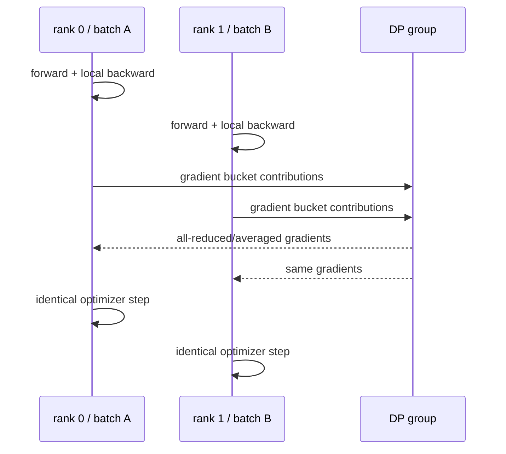
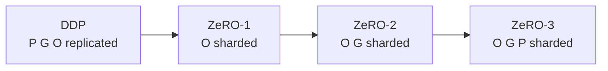
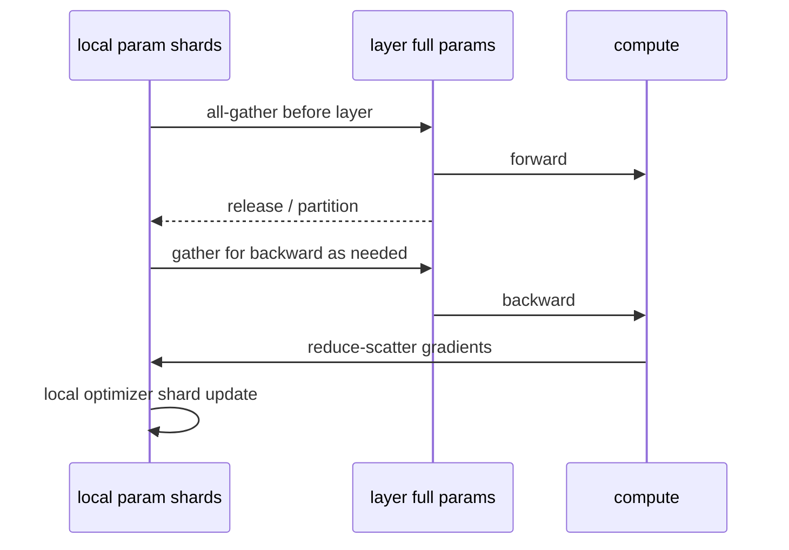
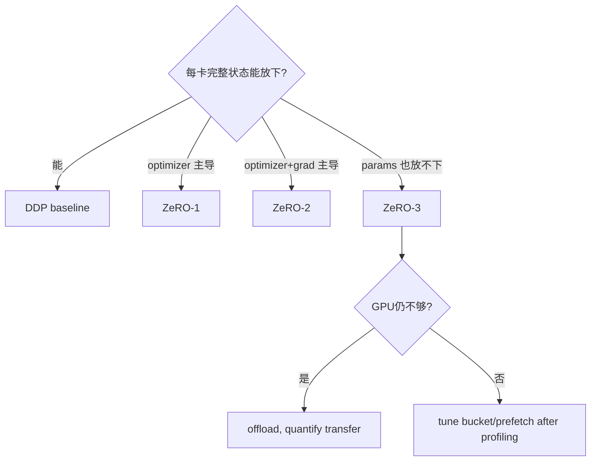

# DDP 与 DeepSpeed ZeRO：从复制到逐级切状态

DDP 和 ZeRO 都属于数据并行家族：每个 data rank 处理不同样本，目标是得到等价的全局 gradient/update。区别是：**DDP 让每卡长期保留完整训练状态；ZeRO 把原本在 data ranks 间冗余的 optimizer、gradient、parameter 逐级分片。**

## DDP 一步怎样同步



如果初始参数、optimizer state 与 step 顺序相同，同步 gradient 后各 rank 独立执行相同 optimizer update，参数继续一致。

### Gradient buckets

DDP 在 autograd 中等待参数 gradient ready，将多个 gradient 放入 bucket；bucket ready 后即可启动 all-reduce，与更早层的 backward 重叠。Bucket 太大延迟启动，太小受 collective latency 影响。`overlap` 必须用 profiler 证明。

参数使用顺序、unused parameters、static graph 与 gradient view 会影响 bucket 行为。控制流模型在不同 ranks 若使用不同参数路径，可能 hang 或得到错误同步。

## Gradient accumulation 与 `no_sync`

若每个 micro-batch 都 all-reduce，accumulation 会重复通信。DDP 可在非 update microsteps 禁用同步，最后一个 microstep 才 reduce：

```text
micro 1: local backward, no sync
micro 2: local backward, no sync
micro 3: local backward + DP all-reduce
optimizer step
```

前提是所有 ranks accumulation 边界一致，loss normalization 与全局有效 token 数正确。某 rank 因异常 batch 少一步，会让其他 ranks 卡在 collective。

## ZeRO 三个阶段

固定 DeepSpeed 的 [`ZeroStageEnum`](https://github.com/deepspeedai/DeepSpeed/blob/53a2ac44fb664bea838df3981ba4366b91643070/deepspeed/runtime/zero/config.py#L81) 精确命名：

| Stage | 分片 | 每 rank 仍完整拥有 | 关键通信/生命周期 |
| --- | --- | --- | --- |
| 0 | 无 | P、G、O | 类 DDP |
| 1 | optimizer | P、G | owner 更新 shard，再使参数一致 |
| 2 | optimizer + gradients | P | gradient reduce-scatter；更新后参数 gather/同步 |
| 3 | optimizer + gradients + parameters | 当前计算所需 full params 仅短暂 materialize | prefetch/all-gather params，backward reduce-scatter |

理想 steady-state model state 下界随着 stage 下降，但 communication scheduling、bucket、temporary full params 与 fragmentation 仍占显存。



## ZeRO-1/2 的直觉

ZeRO-2 backward 时把 gradient contributions reduce-scatter 到 owner ranks；每 rank 只保留负责的 gradient/optimizer shard。完成 local optimizer update 后，各 ranks 需要获得更新后的参数分片，使下一 forward 的完整参数一致。

固定实现主线是 [`DeepSpeedZeroOptimizer`](https://github.com/deepspeedai/DeepSpeed/blob/53a2ac44fb664bea838df3981ba4366b91643070/deepspeed/runtime/zero/stage_1_and_2.py#L134)。配置中的 reduce/all-gather bucket size 控制通信颗粒度与临时 buffer，不是越大越好。

## ZeRO-3 的参数生命周期



源码入口 [`DeepSpeedZeroOptimizer_Stage3`](https://github.com/deepspeedai/DeepSpeed/blob/53a2ac44fb664bea838df3981ba4366b91643070/deepspeed/runtime/zero/stage3.py#L148) 还管理 parameter coordinator、prefetch/persistence、offload/swapping 等。它不是“每层简单加一次 all-gather”这么少的状态机。

## 最小 DeepSpeed 配置

先从 stage 2 做 state reduction 对照：

```json
{
  "train_micro_batch_size_per_gpu": 2,
  "gradient_accumulation_steps": 8,
  "bf16": {"enabled": true},
  "zero_optimization": {
    "stage": 2,
    "contiguous_gradients": true,
    "overlap_comm": true,
    "reduce_scatter": true
  }
}
```

再把单一变量改成 stage 3。配置 class 是 [`DeepSpeedZeroConfig`](https://github.com/deepspeedai/DeepSpeed/blob/53a2ac44fb664bea838df3981ba4366b91643070/deepspeed/runtime/zero/config.py#L90)，以固定版本 validation/default 为准，不复制多年前教程中已废弃的 `cpu_offload` 字段。

原生集成概念：

```python
model_engine, optimizer, train_loader, scheduler = deepspeed.initialize(
    model=model,
    model_parameters=model.parameters(),
    config="ds_config.json",
)

loss = model_engine(batch)
model_engine.backward(loss)
model_engine.step()
```

Transformers/TRL 集成会替你调用 engine，不能再额外执行普通 optimizer/backward。

## Offload：容量换数据移动

| Offload | 可移走 | 新瓶颈 |
| --- | --- | --- |
| optimizer CPU | moments/master 与 optimizer compute | CPU compute、PCIe、host RAM |
| param CPU | ZeRO-3 parameter shards/full staging | PCIe、pin memory、NUMA |
| NVMe | params/optimizer states | SSD bandwidth/IOPS/endurance、AIO、CPU |

固定配置中 `offload_optimizer` 可用于 stages 1/2/3，`offload_param` 只对 stage 3 有效。Offload 让更大模型可运行，不保证更快；必须测 transfer 是否与 compute overlap、CPU/NVMe 是否共享争用。

## DDP/ZeRO 的训练语义门禁

保持 global batch 和 loss normalization，比较单卡参考：

1. 固定初始 checkpoint；
2. 固定全局样本与 rank shard；
3. 一次 update 前比较 global loss；
4. 比较关键 gradient/update checksum；
5. 两步后比较参数/optimizer state；
6. save-resume 后再跑一步。

浮点 reduction 顺序会带来容差差异；结构性大差异优先查 batch、loss scaling 与 gradient averaging。

## 性能决策



更高 stage 通常更省 persistent GPU state，但可能增加 parameter communication 与复杂度。模型在 DDP 已能放且 step 很短时，ZeRO-3 可能更慢。

## 常见失败

| 现象 | 首查 |
| --- | --- |
| DDP 多卡 OOM 与单卡相同 | DDP 复制状态，本来就不分片 |
| world 增大后收敛改变 | global batch/LR、sampler、loss averaging |
| 第一个 optimizer step hang | accumulation 边界、某 rank earlier error、grad partition |
| ZeRO-3 forward OOM | parameter prefetch/persistence、module 粒度、activation |
| overlap=true 但更慢 | bucket、compute 时长、network contention、timeline |
| offload GPU 省了但 step 极慢 | CPU/PCIe/NVMe bandwidth/NUMA |
| checkpoint 缺完整权重 | ZeRO shard 格式与 consolidation 流程 |

## 通关标准

你应能画 DDP bucket all-reduce 与 ZeRO-3 param lifecycle；推导 stages 逐级分片对象；解释 offload 的新资源账；用相同 global semantics 做两步数值对照。

继续沿固定源码逐函数阅读：[DDP Python→C++ Reducer](../internals/pytorch-ddp-runtime)与[DeepSpeed Engine→ZeRO 参数协调器](../internals/deepspeed-zero-flow)。

下一课看 PyTorch 原生的[FSDP2、DTensor 与 DeviceMesh](./fsdp2)。
