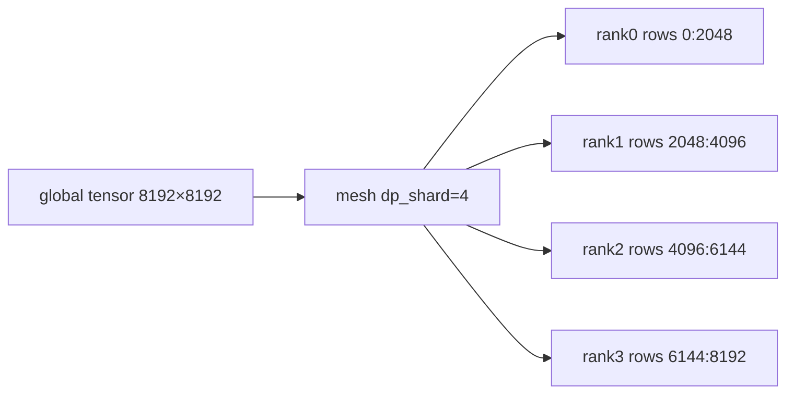
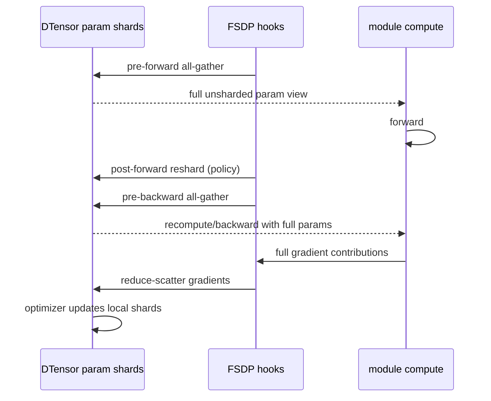

# FSDP2、DTensor、DeviceMesh 与 HSDP

FSDP2 的核心不是“自动省显存”开关，而是：**参数在 steady state 是 DeviceMesh 上带 placement 的 DTensor；`fully_shard` 为 module 安装 forward/backward hooks，在需要计算时 all-gather，再把 gradients reduce-scatter 回 shard。**

## DTensor 三要素

```text
global tensor shape + DeviceMesh + placements
```

例如全局权重 `[8192, 8192]` 在 4-rank mesh dim 上 `Shard(0)`：每 rank local shard 理想为 `[2048, 8192]`。`Replicate()` 则每 rank 都有完整值；`Partial(sum)` 表示本地是待归约 contribution。



Placement 是 tensor 语义，不只是“本地 shape”。算子若需要另一 layout，DTensor rule 会传播或触发 redistribute/collective；无法推导时应失败，而不是静默猜测。

## FSDP2 与传统 FSDP1 的心智差异

| 方面 | FSDP1 传统直觉 | FSDP2 直觉 |
| --- | --- | --- |
| 参数表示 | module 内 FlatParameter/handle | per-parameter DTensor |
| API | wrapper class | composable `fully_shard(module, ...)` |
| 组合 | wrapper nesting | bottom-up composable transforms |
| state dict | flat/unflat 处理 | DTensor + distributed state dict |

二者目标相似，但调试对象不同。看到 FSDP2 parameter 时检查 `.to_local()`/placement/mesh，而不是只找 FlatParameter。

## `fully_shard` 应用顺序

TorchTitan 的 [`apply_fsdp_to_decoder()`](https://github.com/pytorch/torchtitan/blob/fec3e196a4ceb87bfc87fb4f1a36a538d7e98ee4/torchtitan/distributed/fsdp.py#L81) 对 transformer blocks 逐个 `fully_shard`，最后对 root model 应用。概念上：

```python
from torch.distributed.fsdp import fully_shard, MixedPrecisionPolicy

mp = MixedPrecisionPolicy(param_dtype=torch.bfloat16, reduce_dtype=torch.float32)

for block in model.layers:
    fully_shard(block, mesh=dp_mesh, mp_policy=mp)

fully_shard(model, mesh=dp_mesh, mp_policy=mp)
```

API 签名以运行 PyTorch 版本为准。Bottom-up 让每个 block 成为独立 all-gather/reshard unit，root 捕获剩余 params（embedding/norm/head 等）。漏 root 可能让部分参数不分片；只 shard root 又可能一次 materialize 太大范围。

## Forward/backward 生命周期



FSDP sharding group 同时定义 parameter storage shard 与 gradient reduction。Data samples 沿该 group 也不同，因此 global loss normalization 要涵盖它。

## `reshard_after_forward` 权衡

| 策略 | forward 后 full params | HBM | backward 前通信 | PP 影响 |
| --- | --- | --- | --- | --- |
| true | 释放/reshard | 低 | 再 all-gather | 每 microbatch 可能频繁 gather |
| false | 保留 full | 高 | 可减少再 gather | PP 多 microbatch 可能更合适 |

TorchTitan 固定实现的 default 在启用 PP 时倾向不在 forward 后 reshard，以避免每 microbatch 的非重叠 all-gather；非 PP 倾向 reshard。最优值依 stage 参数量、microbatches 与 HBM，必须 profile。

## Prefetch 与 wrap 粒度

理想 overlap：当前 block compute 时 all-gather 下一 block。代价是当前和下一个 full params 同时驻留。OOM 若发生在 prefetch，不代表 steady shard 估算错，而是峰值 materialization window 未计入。

```text
coarse unit: fewer/larger collectives, high peak full params
fine unit:   more/smaller collectives, latency/overhead high
```

Transformer block 通常是合理起点；超大 MoE expert/embedding 可能需要专门 placement/unit。

## HSDP：二维 replicate × shard

假设 2 节点×8 GPU：节点内 shard=8，节点间 replicate=2：

```text
mesh[dp_replicate=2, dp_shard=8]
node0: shards 0..7 of replica A
node1: shards 0..7 of replica B
```

- shard dim 内 all-gather/reduce-scatter；
- replicate dim 间同步对应 shards；
- 好处是把频繁 parameter gather 留在快节点内域；
- 代价是每节点复制一套 sharded model state，内存节省只按 shard dim，不按总 16 ranks。

TorchTitan 将两维显式建模为 `dp_replicate` 与 `dp_shard`；[`ParallelDims`](https://github.com/pytorch/torchtitan/blob/fec3e196a4ceb87bfc87fb4f1a36a538d7e98ee4/torchtitan/distributed/parallel_dims.py#L131) 验证 degrees 并构建命名 meshes。

## DeviceMesh 与数据、loss group

多维 mesh 不只给 parameters：

- batch mesh 决定哪些 ranks 读取不同数据；
- loss mesh 决定 token count/loss 如何跨 DP/CP 汇总；
- FSDP mesh 决定 parameter sharding；
- TP/PP ranks 上某些数据可能复制或只在指定 rank 存在。

不能把 world group 用于所有 reduction。TP ranks 若看到相同 batch，错误地把它们也当 data replicas 平均，会重复计数。

## Mixed precision

`MixedPrecisionPolicy` 区分 param compute dtype 与 reduce dtype；原始 local shard/optimizer policy 还可能使用其他 dtype。检查：

- all-gather 后 compute param dtype；
- gradient reduce dtype；
- optimizer state/master dtype；
- input/activation autocast；
- CPU offload 与 dtype cast 顺序。

用 BF16 params + FP32 reduce 可提高 reduction 稳定性但增加通信 bytes；选择依网络与数值要求。

## FSDP2 与 TP/CP 的组合

多维 parameter placement 可能是：

```text
mesh[dp_shard, tp]
weight placements = [Shard(dp dimension), Shard(model dimension)]
```

TP 定义层内模型维度 shard，FSDP 再沿 DP dim 切每个 TP shard。组合后的 local param 大致按 `TP × DP_shard` 缩小，但 forward 只沿 FSDP dim gather，仍保留 TP layout；groups 不可混。

CP 时 activation 带 CP layout，参数通常不应被误沿 CP 当 data shards，具体框架可能把 mesh dims flatten 给 FSDP storage。TorchTitan 固定源码显式传 `DataParallelMeshDims`，避免仅靠名字错误推断。

## Checkpoint 语义

FSDP2 params/optimizer 是 DTensor shards。保存应使用 distributed state dict / PyTorch Distributed Checkpoint 这类知道 placements 的机制；直接每 rank `torch.save(model.state_dict())` 会得到 shards/重复 metadata，未必能作为完整模型加载。

需要测试：同 world resume、不同 DP shard degree reshard、转换为 inference/full checkpoint、optimizer state 恢复、故障中断后的原子性。

## 最小验证矩阵

| Run | DP config | 检查 |
| --- | --- | --- |
| A | 1 rank | reference loss/update |
| B | `dp_replicate=2, shard=1` | DDP equivalence |
| C | `replicate=1, dp_shard=2` | FSDP HBM/numerics |
| D | 2×2 HSDP | topology/group semantics |
| E | C save → different shard degree load | reshard checkpoint |

每个 run 打印 mesh coordinate、parameter global/local shape/placements、first two losses、update checksum、peak HBM 与 collective trace。

## 常见失败

| 现象 | 首查 |
| --- | --- |
| 一些 params 仍 replicated OOM | bottom-up/root shard 是否覆盖、ignored params |
| forward shape 对但 loss 错 | data/loss mesh、重复计数、TP ranks |
| pre-forward OOM | wrap unit、prefetch、reshard policy |
| backward hang | group/collective ordering、rank earlier error |
| optimizer state 爆内存 | optimizer 是否真正针对 sharded params 创建 |
| checkpoint 只能原 world 加载 | state dict API/metadata、reshard support |
| TP+FSDP tensor mismatch | placement 顺序、mesh dim、local/global shape |

## 通关标准

你应能从 global tensor/mesh/placements 得到 local shard；画 FSDP2 param lifecycle；解释 bottom-up+root、reshard/prefetch/HSDP 的权衡；说明为什么 data/loss/FSDP/TP groups 不可混用。

继续沿固定 PyTorch 源码逐函数阅读：[FSDPState、FSDPParamGroup 与 AG/RS 状态机](../internals/fsdp2-source)，并在[源码驱动实践](../practice/source-labs)完成 DCP round-trip。

下一阶段进入[Megatron Core 总体设计](../model-parallel/megatron)。
