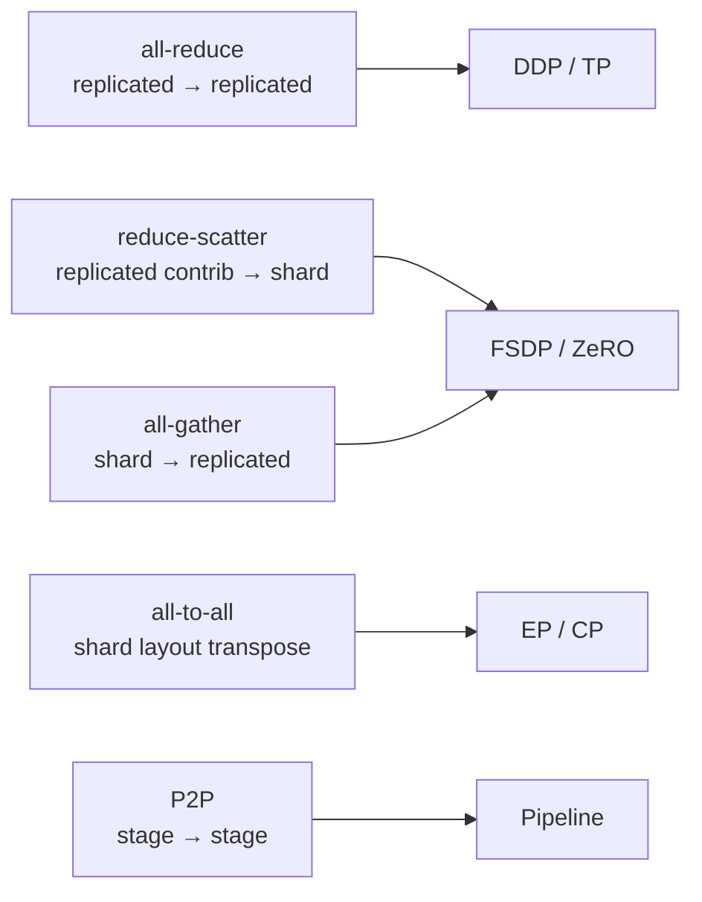

# Rank、Process Group、DeviceMesh 与集合通信

“做一次通信”信息不足。完整描述必须包含：**参与 group、每 rank 输入/输出 shape 与 dtype、操作语义、消息 bytes、同步/异步依赖和物理拓扑。**大多数 hang 都能归结为这些 contract 在某些 ranks 不一致。

## 进程与标识

| 名称 | 含义 |
| --- | --- |
| world size | 一个 distributed job 的进程总数 |
| global rank | world 中唯一编号 |
| local rank | 节点内进程/GPU 编号，不能当全局编号 |
| node rank | 节点编号 |
| process group | 一组 ranks 的通信上下文 |
| backend | NCCL/Gloo 等实际传输实现 |
| rendezvous/store | 让进程发现彼此并交换初始化信息的控制机制 |

通常一 GPU 一进程，但并非定义要求。`CUDA_VISIBLE_DEVICES` 会改变进程看到的 device 编号；日志应同时打印 hostname、global/local rank、physical/visible device。

## 从一维 group 到 DeviceMesh

假设 8 ranks，TP=2、DP=4：

```text
mesh[dp, tp]
dp0: rank 0 1
dp1: rank 2 3
dp2: rank 4 5
dp3: rank 6 7

TP groups: [0,1] [2,3] [4,5] [6,7]
DP groups: [0,2,4,6] [1,3,5,7]
```

同一 rank 同时属于多个 group。TP collective 只能在它的 TP slice，gradient data-parallel collective 只能在相同 TP coordinate 的 DP slice。

TorchTitan 的 [`ParallelDims`](https://github.com/pytorch/torchtitan/blob/fec3e196a4ceb87bfc87fb4f1a36a538d7e98ee4/torchtitan/distributed/parallel_dims.py#L131) 将多维 degrees 转成命名 `DeviceMesh`；Megatron 的 [`initialize_model_parallel()`](https://github.com/NVIDIA/Megatron-LM/blob/82e9dc69c9e6f8c27681f2cb6856a188187edf6b/megatron/core/parallel_state.py#L547) 构造多类 model/data/context/expert groups。两者表达形式不同，核心问题相同。

## 六种通信原语

### All-reduce

每 rank 输入同 shape tensor，按 sum/max 等 reduction 后每 rank 得到完整结果：

```text
rank0 [a0,a1] ┐
rank1 [b0,b1] ├─ sum → every rank [a0+b0+c0, a1+b1+c1]
rank2 [c0,c1] ┘
```

DDP gradient 同步、某些 TP row-parallel output 常见。语义是 reduce + distribute result。

### Reduce-scatter

先按元素 reduce，再把结果切给 ranks。每 rank 输出约为全 tensor 的 $1/N$：

```text
all ranks full gradient contributions
        ↓ sum + scatter
rank0 shard0, rank1 shard1, ...
```

ZeRO/FSDP gradient sharding、TP/SP layout 转换常见。它不是“all-reduce 后手动丢掉大部分”的实现细节，而是更匹配 sharded output 的原语。

### All-gather

每 rank 持一片，所有 ranks 收集为完整 tensor。FSDP forward materialize 参数、TP 某些 activation layout 转换常见。

### All-to-all

每 rank 给每个目标 rank 一片，并接收来自每个源的一片。EP token dispatch、某些 CP/SP transpose 常见。消息不均匀时需 all-to-all-v/split sizes，并面对 hot expert/straggler。

### Broadcast / reduce

一个 root 向 group 发送完整 tensor，或只把 reduction 结果交 root。初始化参数、metadata/标量或特定 stage loss 可能使用。

### Send/recv（P2P）

rank 对之间传 tensor。Pipeline stage forward activation 与 backward gradient 常见；schedule 必须让 send/recv 顺序匹配，否则容易死锁。



## Barrier 为什么不是修复

Barrier 只让 group 内所有 ranks 到达同一同步点。它可帮助定位控制流分叉，但不能修复不匹配 collective；随意插 barrier 还会破坏 overlap 并掩盖原始顺序。

若 rank0 调 all-reduce、rank1 调 all-gather，二者即使 tensor bytes 相同也违反 collective ordering。每个 group 的 collective 序列必须一致。

## α-β 成本模型

粗略把通信时间写为：

$$
T\approx \alpha\times steps+\beta\times bytes
$$

$\alpha$ 是每轮延迟，$\beta$ 是每字节传输成本。小 tensor/频繁 op 受 latency 主导；大 tensor 受 bandwidth 主导。Ring all-reduce 的每 rank 线性传输量常粗估为约 $2(N-1)/N$ 个 tensor bytes，但真实时间受 topology、算法、channels、contention 与 overlap 影响。

不要把 PCIe/NVLink/NIC 标称带宽直接当应用有效带宽。用实际 group、shape/dtype 和并发通信做 microbenchmark。

## 同步与异步的真实含义

`async_op=True` 通常返回 work handle，让 CPU 可继续 enqueue；要安全使用结果仍需 wait/stream dependency。GPU collective 可以与独立 compute overlap，但前提是：

- kernel 在合适 stream；
- tensor 的生产/消费依赖正确；
- compute 足够长；
- 通信没有抢光相同资源；
- bucket/预取时机正确。

Profiler 时间线而不是参数名证明 overlap。

## Collective contract 表

为每个热点通信记录：

| op | group | input layout/shape | output | bytes | trigger | next consumer |
| --- | --- | --- | --- | ---: | --- | --- |
| RS grad | dp_shard | replicated contrib `[P]` | shard `[P/N]` | … | backward hook | optimizer |
| AG param | dp_shard | shard `[P/N]` | full `[P]` | … | pre-forward | layer GEMM |
| A2A token | ep | routed `[tokens,H]` splits | expert-local | … | MoE router | experts |

这个表能直接连接性能 profile 与 hang 日志。

## 两卡最小实验

用 `torchrun --standalone --nproc_per_node=2` 写一个脚本，依次：

1. all-reduce rank tensor，断言双方得到和；
2. all-gather 不同 shard，断言顺序；
3. reduce-scatter，断言每 rank shard；
4. all-to-all 交换目标标记；
5. 在不同 message sizes 做 warmup + 多次测量。

每次 `torch.cuda.synchronize()` 的位置要明确；同步会影响 latency 但对准确计时必要。先正确性后性能。

## Hang 排查最小证据

- 每 rank 最后一个进入/完成的 collective sequence number；
- group ranks 与 group id/name；
- tensor shape、dtype、device、split sizes；
- 所有 ranks 的 Python/C++ stack；
- NCCL async error/timeout 与网络日志；
- 是否有 rank 更早 OOM/exception；
- 是否 collective ordering/control branch 不同。

“NCCL 卡了”只是症状描述。多数情况下需要先证明所有 ranks 真的以相同 contract 到达同一 collective。

## 通关标准

你应能画出 mesh slices；从 tensor layout 选择 all-reduce/RS/AG/A2A/P2P；用 α-β 模型判断 latency/bandwidth 主导；解释 barrier 与 async 不会自动修复错误或产生 overlap。

下一课建立[训练显存账本](./memory)。
