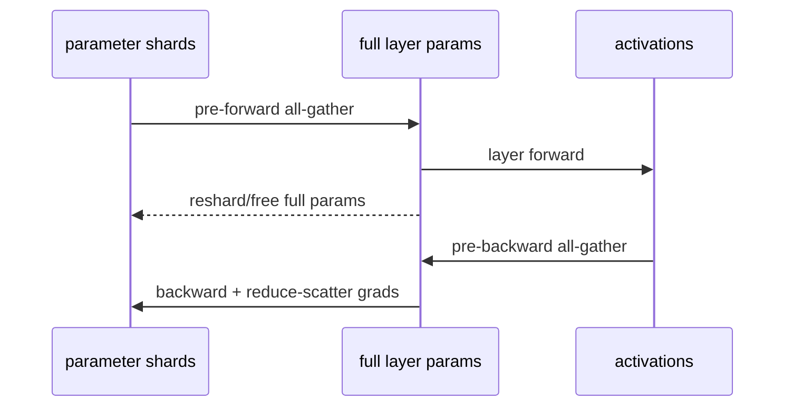

# 分布式训练显存账本：状态、Activation 与峰值

平均显存没有用，训练需要通过峰值。峰值常出现在：参数 all-gather 与 activation 共存、backward 梯度形成、optimizer state 首次创建、eval logits、full checkpoint gather。必须按时间线而非只按参数总量计算。

## 六本账

$$
M_{peak}=M_P+M_G+M_O+M_A+M_T+M_F
$$

| 符号 | 内容 | 典型决定因素 |
| --- | --- | --- |
| $M_P$ | model params/master/quant metadata | P、dtype、shard、materialize window |
| $M_G$ | gradients | trainable P、dtype、bucket、shard |
| $M_O$ | optimizer states | Adam moments/master、optimizer/shard |
| $M_A$ | saved activations | microbatch、sequence、hidden、layers、checkpoint |
| $M_T$ | temporary | logits、attention/GEMM workspace、flatten/cast |
| $M_F$ | framework/fragmentation | CUDA context、allocator reserved、compile/graph |

Offload 没让内存消失，只是把某本账移到 CPU/NVMe，并加入 PCIe/网络带宽、延迟和 host memory 账。

## 全参 Adam 的粗估

一种常见 BF16 mixed-precision 实现可能有：

```text
BF16 params       2P bytes
BF16 gradients    2P
FP32 master       4P
FP32 first moment 4P
FP32 second       4P
--------------------
state subtotal   ~16P bytes
```

有的实现不保留独立 master、gradient dtype 不同、optimizer state 压缩或融合，因此 16P 只是量级模型。70B 参数仅这部分约 1.12TB，尚未含 activation/temporary。

## DDP 与 ZeRO/FSDP 的理想下界

设 DP shard group size 为 $N$，忽略 buffer/peak：

| 策略 | params | grads | optimizer |
| --- | ---: | ---: | ---: |
| DDP | $M_P$ | $M_G$ | $M_O$ |
| ZeRO-1 | $M_P$ | $M_G$ | $M_O/N$ |
| ZeRO-2 | $M_P$ | $M_G/N$ | $M_O/N$ |
| ZeRO-3/FSDP full shard steady state | $M_P/N$ | $M_G/N$ | $M_O/N$ |

现实 FSDP forward 需要按 module all-gather full params，峰值近似还要加“当前/预取 module 的 full params”；gradient buckets、original parameters、mixed precision casts 与 optimizer step 也增加峰值。



Wrap 太粗会一次 materialize 巨大模型；太细会产生大量小 collective/latency。wrap unit 是内存与性能共同参数。

## Activation 粗估

Transformer activation 与架构/kernel有关，可先写：

$$
M_A\propto B_{micro}\times S\times H\times L\times c\times bytes
$$

$c$ 表示每层需保存的中间量。普通 attention score 可能产生 $B\times heads\times S^2$ 临时量，Flash/memory-efficient attention 可降低存储复杂度但不消除 attention FLOPs。

### Activation checkpointing

只保存部分层输入，在 backward 重算中间 activation：

- 降 $M_A$；
- 增 forward compute 与 step time；
- 不降 parameter/optimizer 状态；
- selective/full 的 checkpoint unit 影响收益；
- 与 PP/FSDP wrap/compile 的交互要测。

### Sequence/Context Parallel

把 sequence activation 分到 ranks 可降低部分 $B\times S\times H$ 项，但 attention 需要跨 shard 获得上下文，加入通信。它与 activation checkpoint 解决不同维度，可组合。

## TP、PP 怎样改变账本

### TP degree $T$

理想上被切的线性权重/activation 约除以 $T$，但 replicated layers、norm、embedding/loss、collective buffers 不一定切；每层通信增加。

### PP degree $K$

每 stage 持部分 layers，parameter/optimizer 近似按层分；但在途 microbatches 的 activation 数取决于 schedule。GPipe 一次积累多个 forward activation，1F1B 可更早释放，但仍有 warmup/cooldown 与不均衡。

### EP degree $E$

expert weights/optimizer 分片，shared/dense layers 仍复制或由其他维度切。token dispatch buffers 与容量因子/负载不均决定 activation peak。

## 峰值时间线


记录每个 boundary 的 `allocated/reserved/max_allocated`。第一步成功、optimizer step OOM 常因 lazy Adam states；训练稳定、保存 OOM 常因 full state dict gather。

## 一个算例

7B 模型，用上面的 ~16P 全参状态粗估约 112GB，单张 80GB 在 activation 前就不够。

- 8-way ideal full shard：训练状态约 14GB/rank；
- 若最大 wrapped layer full params 1GB，预取两个可能额外约数 GB；
- activation 由 microbatch/sequence 另算，例如长序列可再占几十 GB；
- CUDA context/temp/fragmentation 需留余量。

所以“112/8=14GB，肯定能跑”是错误结论。它只算 steady state ideal shard。

## 从 OOM 反推账本

| 现象 | 最强假设 | 对照 |
| --- | --- | --- |
| load 即 OOM | weights/加载临时副本 | meta init、sharded load、dtype |
| batch/seq 增长触发 | activation/temp | batch/seq sweep、checkpoint/flash |
| backward 才触发 | saved activation/grad/full param | checkpoint、shard policy |
| optimizer 首步触发 | moments/master lazy init | optimizer 前后 snapshot |
| FSDP prefetch 时触发 | 多个 full modules 共存 | limit/prefetch/wrap 对照 |
| eval 触发 | logits/generation cache/accumulation | prediction loss only、eval batch |
| save 触发 | full state dict on rank0/CPU | sharded save、DCP |

## 实测清单

```text
model global params / trainable params
local persistent params by dtype
local grad and optimizer state after first step
activation peak by microbatch/sequence
largest module materialization
communication/flatten/temp buffers
allocated vs reserved
CPU RAM + pinned memory + offload
save/load peak on GPU and CPU
```

TorchTitan 和 Megatron 都有理论/观测工具，但先理解口径，再相信报告；有的只估 model states，有的含 activation，不能直接横比。

## 通关标准

你应能用六本账解释峰值；推导 ZeRO stages 的理想 state 分片；说明 FSDP all-gather 导致的瞬时 full module；区分 activation checkpoint、TP、PP、CP/EP 各减少哪部分。

下一阶段先读[DDP 与 DeepSpeed ZeRO](../data-parallel/ddp-zero)。
