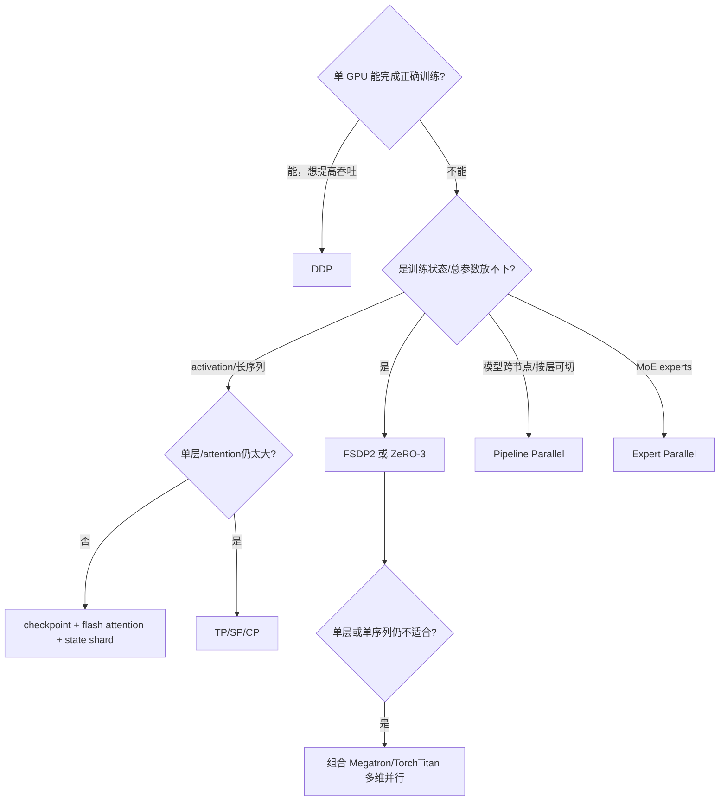
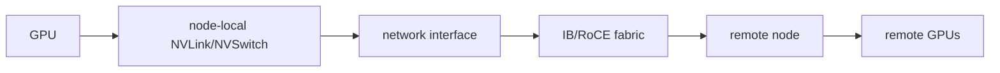

# DDP、ZeRO、FSDP2、TorchTitan 与 Megatron 决策地图

先选**切分维度**，再选实现框架。若只是每卡都放得下、需要吞吐，DDP 往往足够；若训练状态放不下，FSDP/ZeRO；若单层、超长序列、pipeline 或 MoE 通信主导，才进入模型结构感知的 TP/PP/CP/EP。

## 第一棵树：瓶颈是什么



## 第二棵树：实现栈

| 条件 | 建议起点 | 原因 |
| --- | --- | --- |
| 标准 PyTorch/Transformers 模型，DP/state shard 为主 | FSDP2；参考 TorchTitan | 原生 DTensor/DeviceMesh，组合透明 |
| 已有 DeepSpeed/Trainer 生态、需要 ZeRO/offload | DeepSpeed ZeRO | 配置与集成成熟，CPU/NVMe 路径丰富 |
| 极大 dense/MoE，需 TP+PP+CP+EP/TE | Megatron Core | 模型结构感知并行和成熟 schedule |
| 想学习 PyTorch 原生多维并行如何组装 | TorchTitan | 清晰展示 mesh、parallelize、trainer/checkpoint |
| 模型每卡能放，主要数据吞吐 | DDP | 最少额外状态与故障面 |

“参考 TorchTitan”不等于必须把产品迁入整个 repo；它也是 PyTorch 原生大模型训练的可读参考实现。Megatron Core 也可作为库集成，不等同于只运行历史 `pretrain_gpt.py`。

## 按切分对象比较

| 方案 | 切/复制对象 | 高频通信 | 不解决 |
| --- | --- | --- | --- |
| DDP | 复制模型/状态，切数据 | grad all-reduce | 每卡状态 OOM |
| ZeRO-1/2/3 | optimizer → grad → params 逐级切 | reduce-scatter/all-gather | 单层 activation 必然过大 |
| FSDP2 | module params/grads/optimizer 用 DTensor shard | per-module all-gather/reduce-scatter | PP bubble/MoE 专家布局 |
| TP | 单层权重与 activation | layer 内 collectives | layers 总数/PP bubble |
| SP | sequence activation（常与 TP 配套） | gather/reduce-scatter | attention context 本身全局依赖 |
| PP | layers/stages | activation/gradient P2P | 单层放不下 |
| CP | sequence/context | attention KV exchange/ring/all-to-all | 参数状态本身 |
| EP | experts 与 routed tokens | all-to-all dispatch/combine | dense 层状态 |

## 按团队成本比较

| 维度 | DDP | FSDP2/TorchTitan | DeepSpeed | Megatron Core |
| --- | --- | --- | --- | --- |
| 入门复杂度 | 低 | 中 | 中 | 高 |
| 标准模型改造 | 少 | wrap/parallel plan | config/integration | 模型层/配置适配较深 |
| 多维并行 | 有限 | 原生能力在扩展 | ZeRO 为强项，亦有更多模块 | 强项 |
| checkpoint | 普通 state dict | DCP/DTensor | ZeRO shards/universal 等 | distributed checkpointing |
| debug 表面 | rank + all-reduce | mesh/layout + reshard | engine/config/offload | 多 group/schedule/model chunks |

复杂度不是坏事，但必须对应真实瓶颈。团队无法在事故中画出 rank groups 时，不应直接把 5D parallel 当默认。

## 拓扑约束应进入选择



经验原则：

- TP 的层内 collective 高频，优先放高速节点内域；
- PP 跨 stage 消息频率/形态不同，常可跨节点，但要测 bubble 与 activation bytes；
- DP/FSDP 通信量大，可 bucket/overlap，仍受网络 bisection 影响；
- EP all-to-all 对 fabric/负载均衡敏感；
- CP 通信随序列/attention 方案变化，不要默认比 TP 便宜；
- placement 必须让 group 映射到预期物理拓扑。

## 一个例子：70B、32×80GB GPU

不要直接给唯一答案。按约束逐步：

1. BF16 weights 约 140GB，总状态远超单卡；
2. FSDP/ZeRO-3 在 32 卡可切状态，但每层 all-gather 与 activation 是否可接受要测；
3. 单层权重/activation 若仍适合，可先 FSDP；若需要更小 materialization 或成熟高吞吐，考虑节点内 TP；
4. 两/四节点可把 TP 留节点内，PP/DP 跨节点；
5. sequence 很长再引入 CP；MoE 才引入 EP；
6. 任何配置都需满足 $degrees$ 与 world size、heads/layers/experts 整除等模型约束。

不同网络、sequence、global batch、模型架构会得出不同结果。决策文档应列候选与实测，而不是写“70B 必须 TP8PP4”。

## 决策记录模板

```text
Constraint:
  model/optimizer/activation peak per rank
  sequence and global batch
  node/GPU/network topology
Observed bottleneck:
Candidate A/B:
  tensor placements
  collectives and estimated bytes
  expected memory
  checkpoint implications
Experiment result:
  correctness, HBM, step time, scaling, failures
Decision and rollback:
```

## 何时不做分布式

- 任务可用更小模型、LoRA/QLoRA 在单卡完成；
- 数据/labels/数值尚未验证；
- 多卡通信成本超过训练缩短；
- checkpoint/恢复要求尚未定义；
- 只有偶发峰值 OOM，可先解决异常 batch/activation；
- 集群网络不稳定，扩大只会增加失败概率。

分布式不是成熟度标志；可验证地完成训练才是。

## 通关标准

你应能从 OOM/吞吐/长序列/MoE 分别选择 state、tensor、pipeline、context 或 expert 维度；比较 FSDP2、DeepSpeed 与 Megatron 的工程边界；把硬件拓扑和 checkpoint 代价写进决策。

进入共同地基：[进程、拓扑与集合通信](../fundamentals/collectives)。
