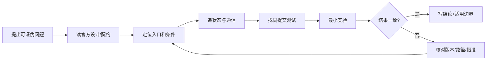

# 42 天源码学习计划：从集合通信到四套训练运行时

这不是“每天读一篇文章”的链接表，而是一套有证据链的训练计划。每天都必须留下四样东西：**源码定位、手工推导、可复现实验、验收结论**。读完却无法画出 rank/group/tensor 生命周期，等于没有通关。

课程固定四个官方仓库提交，所有行号、行为和结论都以这些提交为准：

| 仓库 | 固定提交 | 主问题 |
| --- | --- | --- |
| PyTorch | [`e11b512`](https://github.com/pytorch/pytorch/tree/e11b512fef37205cc3b83872eabd92c3cdf05a28) | DDP C++ Reducer、DeviceMesh/DTensor、FSDP2、DCP |
| TorchTitan | [`fec3e19`](https://github.com/pytorch/torchtitan/tree/fec3e196a4ceb87bfc87fb4f1a36a538d7e98ee4) | PyTorch 原生多维训练怎样组合成完整 Trainer |
| Megatron-LM | [`82e9dc6`](https://github.com/NVIDIA/Megatron-LM/tree/82e9dc69c9e6f8c27681f2cb6856a188187edf6b) | 结构感知 TP/PP/CP/EP 与 schedule |
| DeepSpeed | [`53a2ac4`](https://github.com/deepspeedai/DeepSpeed/tree/53a2ac44fb664bea838df3981ba4366b91643070) | Engine、ZeRO-1/2/3、offload 与参数状态机 |

## 0. 下载完整官方源码

不要只在网页上看零散文件。下面会得到可搜索、可打断点、可比较测试的完整源码；`--filter=blob:none` 只延迟下载历史 blob，不会得到“阉割版源码”。

```bash
mkdir -p ~/src/distributed-training && cd ~/src/distributed-training

git clone --filter=blob:none https://github.com/pytorch/pytorch.git
git -C pytorch switch --detach e11b512fef37205cc3b83872eabd92c3cdf05a28

git clone --filter=blob:none https://github.com/pytorch/torchtitan.git
git -C torchtitan switch --detach fec3e196a4ceb87bfc87fb4f1a36a538d7e98ee4

git clone --filter=blob:none https://github.com/NVIDIA/Megatron-LM.git
git -C Megatron-LM switch --detach 82e9dc69c9e6f8c27681f2cb6856a188187edf6b

git clone --filter=blob:none https://github.com/deepspeedai/DeepSpeed.git
git -C DeepSpeed switch --detach 53a2ac44fb664bea838df3981ba4366b91643070

for repo in pytorch torchtitan Megatron-LM DeepSpeed; do
  git -C "$repo" rev-parse HEAD
done
```

预期四行输出必须与上表完整 hash 一致。不要直接在这四个 detached worktree 上做笔记；把实验 patch 放到自己的 branch，或把读书笔记放到 Obsidian。

### 官方文档应该怎样与源码一起看

```text
官方设计/教程：先建立术语和作者意图
        ↓
固定提交源码：确认真实入口、默认值、条件分支和状态变化
        ↓
同提交测试：找作者认为必须保持的 contract
        ↓
最小实验/trace：验证运行时确实走到这条路径
        ↓
自己的原理图：只保留被上面四层证据支持的结论
```

PyTorch `stable` 文档会移动，适合查契约；固定 GitHub 链接适合核对本课程的实现。两者矛盾时，先确认运行 wheel 与源码提交是否相同，不要挑一个自己喜欢的答案。

## 1. 每天都用同一张源码卡

把下面模板复制到 Obsidian；一个重要函数一张卡：

```markdown
# <symbol / source path / commit>

- 上游是谁调用它：
- 启动/进入条件：
- 输入对象及 global/local shape：
- 读写哪些状态：
- 创建或使用哪个 process group：
- 触发什么 collective/P2P：
- async work 在哪里 wait：
- 正常退出后的 invariant：
- 一条故意破坏 invariant 的实验：
- 源码链接与测试链接：
```

“它做梯度同步”不算源码卡。合格描述必须类似：`Reducer::mark_variable_ready()` 使 bucket 的 `pending` 递减到 0，按 bucket 顺序启动 comm hook；最后一个 bucket ready 后向 autograd engine 排入 `finalize_backward()`，后者等待 future 并把扁平结果映回 grad views。

## 2. 三种硬件路线

| 环境 | 可以完成 | 不能声称完成 |
| --- | --- | --- |
| 无 GPU | Gloo collective、DDP CPU、DCP、全部静态源码 trace、公式推导 | NCCL overlap、HBM 峰值、CUDA kernel 性能 |
| 1–2 GPU | 再加 NCCL、DDP/FSDP2 两卡、TP=2、小模型 ZeRO | 多节点拓扑、PP/CP/EP 大规模效率 |
| 8+ GPU / 多节点 | 完整 Megatron/TorchTitan 组合、scaling、故障恢复 | 仍不能以一次成功 run 证明收敛或生产稳定性 |

硬件不足不妨碍学原理；它只限制实验结论的范围。课程中的 GPU 命令是**待在对应官方环境运行的实验配方**，不会伪装成本机已经跑过。

## 第 1 周：进程、collective、显存与 DDP

目标：从 `torchrun` 的多个进程，一直追到 C++ Reducer 的异步 all-reduce 完成。

| 日 | 必读源码 | 反推任务 | 实践与交付物 |
| ---: | --- | --- | --- |
| 1 | [`torch.distributed.run`](https://github.com/pytorch/pytorch/blob/e11b512fef37205cc3b83872eabd92c3cdf05a28/torch/distributed/run.py)、[`distributed_c10d.py`](https://github.com/pytorch/pytorch/blob/e11b512fef37205cc3b83872eabd92c3cdf05a28/torch/distributed/distributed_c10d.py) | 区分 launcher、rank、local rank、store、backend、process group | 两进程打印 PID/rank/host；画 rendezvous 时序；故意让一 rank 少一次 collective 并记录症状 |
| 2 | `all_reduce/all_gather_into_tensor/reduce_scatter_tensor/all_to_all_single` 的 API 与 c10d 实现 | 为每个 collective 写输入/输出 shape contract；推导 ring all-reduce 字节量 | 跑 Gloo shape 微实验；保存每 rank 输入输出，不做性能结论 |
| 3 | 本课程[显存账本](../fundamentals/memory)与 ZeRO 论文 | 将参数、梯度、master weights、moments、activation、临时 buffer 分账 | 对 7B/BF16/Adam 手算 DDP、ZeRO-1/2/3 下界；写清假设而非只写“约 16 bytes/param” |
| 4 | [`DistributedDataParallel.__init__`](https://github.com/pytorch/pytorch/blob/e11b512fef37205cc3b83872eabd92c3cdf05a28/torch/nn/parallel/distributed.py#L816-L1084) 与 [`_ddp_init_helper`](https://github.com/pytorch/pytorch/blob/e11b512fef37205cc3b83872eabd92c3cdf05a28/torch/nn/parallel/distributed.py#L1374-L1459) | 找参数 shape 校验、初始 state sync、bucket 建立和 `dist.Reducer` 构造 | 画 Python 对象到 C++ Reducer 的所有权图；记录构造时通信与每步通信的区别 |
| 5 | [`Reducer` 构造函数](https://github.com/pytorch/pytorch/blob/e11b512fef37205cc3b83872eabd92c3cdf05a28/torch/csrc/distributed/c10d/reducer.cpp#L87-L249) 与 [`autograd_hook`](https://github.com/pytorch/pytorch/blob/e11b512fef37205cc3b83872eabd92c3cdf05a28/torch/csrc/distributed/c10d/reducer.cpp#L668-L753) | 解释 grad accumulator post-hook 何时触发；unused param 如何影响 ready | 在两层反向上记录 hook 顺序；对照 bucket rebuild 后的顺序 |
| 6 | [`mark_variable_ready`](https://github.com/pytorch/pytorch/blob/e11b512fef37205cc3b83872eabd92c3cdf05a28/torch/csrc/distributed/c10d/reducer.cpp#L895-L961) 与 [`finalize_backward`](https://github.com/pytorch/pytorch/blob/e11b512fef37205cc3b83872eabd92c3cdf05a28/torch/csrc/distributed/c10d/reducer.cpp#L1730-L1824) | 找 bucket ready、comm hook、future wait、grad view 恢复 | 交付 DDP 一次 backward 时序图，标 compute/communication overlap 与最终同步点 |
| 7 | [`no_sync`](https://github.com/pytorch/pytorch/blob/e11b512fef37205cc3b83872eabd92c3cdf05a28/torch/nn/parallel/distributed.py#L1658-L1685)、[`_pre_forward/_post_forward`](https://github.com/pytorch/pytorch/blob/e11b512fef37205cc3b83872eabd92c3cdf05a28/torch/nn/parallel/distributed.py#L1744-L1882) | 解释为何 forward 也参与 Reducer 状态准备；为何 `no_sync` 必须包 forward | 跑[源码实验](../practice/source-labs)的 DDP 门禁；写一页“DDP 不分片参数”的源码证据 |

**周门禁**：不看资料，能说出“哪个梯度先 ready”与“哪个 bucket 先发通信”不是同一句话；能指出最终哪里等待所有 bucket future。否则不要进入 FSDP。

## 第 2 周：DeviceMesh、DTensor、FSDP2 与 DCP

目标：把“参数被分片”展开成 placement 变换、参数物化、释放和梯度 reduce-scatter。

| 日 | 必读源码 | 反推任务 | 实践与交付物 |
| ---: | --- | --- | --- |
| 8 | [`DeviceMesh`](https://github.com/pytorch/pytorch/blob/e11b512fef37205cc3b83872eabd92c3cdf05a28/torch/distributed/device_mesh.py#L153-L330) | 解释为何所有 ranks 必须构造相同 mesh；dimension PG 怎样建立 | 对 8 ranks 手算 `(dp=2,tp=4)` 坐标和每个 1D group members |
| 9 | [`DeviceMesh.__getitem__`](https://github.com/pytorch/pytorch/blob/e11b512fef37205cc3b83872eabd92c3cdf05a28/torch/distributed/device_mesh.py#L707-L781) 与 [`get_group`](https://github.com/pytorch/pytorch/blob/e11b512fef37205cc3b83872eabd92c3cdf05a28/torch/distributed/device_mesh.py#L783-L830) | 区分 mesh slice、group、coordinate；说明同一 rank 可属于多个语义 group | 做一张 `rank → coordinates → dp/tp groups` 审计表 |
| 10 | [`DTensor`](https://github.com/pytorch/pytorch/blob/e11b512fef37205cc3b83872eabd92c3cdf05a28/torch/distributed/tensor/_api.py#L356-L470) | 分清 global tensor、local tensor、mesh、placements；解释 `Partial` 不是“坏掉的 tensor” | 用 `Shard/Replicate/Partial` 画三种 layout，并标 logical/local shapes |
| 11 | [`redistribute`](https://github.com/pytorch/pytorch/blob/e11b512fef37205cc3b83872eabd92c3cdf05a28/torch/distributed/tensor/_api.py#L710-L770) | 从 placement 转换反推出通信：S→R、S→S、R→S、P→R、P→S | 交付 placement 转换表，注明何者只需 local chunk、何者需 collective |
| 12 | [`fully_shard`](https://github.com/pytorch/pytorch/blob/e11b512fef37205cc3b83872eabd92c3cdf05a28/torch/distributed/fsdp/_fully_shard/_fully_shard.py#L98-L296) | 找 mesh 校验、module class 动态改变、bottom-up 约束、managed params | 对一个 embedding+2 blocks+head 模型设计 FSDP units，列出 tied-weight 风险 |
| 13 | [`FSDPState` hooks](https://github.com/pytorch/pytorch/blob/e11b512fef37205cc3b83872eabd92c3cdf05a28/torch/distributed/fsdp/_fully_shard/_fsdp_state.py#L290-L478) 与 [`FSDPParamGroup`](https://github.com/pytorch/pytorch/blob/e11b512fef37205cc3b83872eabd92c3cdf05a28/torch/distributed/fsdp/_fully_shard/_fsdp_param_group.py#L382-L808) | 从 pre-forward 到 root post-backward callback 画完整状态机 | 标每个时刻参数是 sharded/unsharded、梯度何时出现、哪里可释放 full buffer |
| 14 | [`foreach_all_gather`](https://github.com/pytorch/pytorch/blob/e11b512fef37205cc3b83872eabd92c3cdf05a28/torch/distributed/fsdp/_fully_shard/_fsdp_collectives.py#L325-L378)、[`foreach_reduce`](https://github.com/pytorch/pytorch/blob/e11b512fef37205cc3b83872eabd92c3cdf05a28/torch/distributed/fsdp/_fully_shard/_fsdp_collectives.py#L522-L701)、DCP [`save`](https://github.com/pytorch/pytorch/blob/e11b512fef37205cc3b83872eabd92c3cdf05a28/torch/distributed/checkpoint/state_dict_saver.py#L89-L203)/[`load`](https://github.com/pytorch/pytorch/blob/e11b512fef37205cc3b83872eabd92c3cdf05a28/torch/distributed/checkpoint/state_dict_loader.py#L60-L155) | 区分 runtime shard 与 storage shard；追 async collective 的 wait | 跑 DCP round-trip；交付 FSDP2 峰值显存时间线，而非只写稳态 `P/N` |

**周门禁**：给定一个 `DTensor(placements=[Shard(0)])`，能说清它在 forward 前为何、在哪一层代码、通过什么 collective 变成可计算参数；能区分 HSDP 的 shard mesh 和 replicate mesh。

## 第 3 周：TorchTitan——框架如何组合 PyTorch 原语

目标：理解一个薄而完整的训练系统怎样处理配置、mesh、并行 transform、token normalization 和 checkpoint。

| 日 | 必读源码 | 反推任务 | 实践与交付物 |
| ---: | --- | --- | --- |
| 15 | [`train.main`](https://github.com/pytorch/torchtitan/blob/fec3e196a4ceb87bfc87fb4f1a36a538d7e98ee4/torchtitan/train.py#L17-L75)、[`Trainer.Config`](https://github.com/pytorch/torchtitan/blob/fec3e196a4ceb87bfc87fb4f1a36a538d7e98ee4/torchtitan/trainer.py#L59-L190) | 区分 launcher、config build 与 Trainer 生命周期 | 只解析 debug config；保存 resolved config 和所有 degree |
| 16 | [`Trainer.__init__`](https://github.com/pytorch/torchtitan/blob/fec3e196a4ceb87bfc87fb4f1a36a538d7e98ee4/torchtitan/trainer.py#L224-L533) | 画 distributed init、meta model、parallelize、optimizer、data、checkpointer 顺序 | 标每个对象在哪一步才有真实 storage/PG |
| 17 | [`ParallelDims`](https://github.com/pytorch/torchtitan/blob/fec3e196a4ceb87bfc87fb4f1a36a538d7e98ee4/torchtitan/distributed/parallel_dims.py#L131-L293) | 验证 dense world product；解释 batch/loss/fsdp/pp/tp/cp/ep mesh views | 手算一组合法与两组非法配置，找源码拒绝点 |
| 18 | [`parallelize_llama`](https://github.com/pytorch/torchtitan/blob/fec3e196a4ceb87bfc87fb4f1a36a538d7e98ee4/torchtitan/models/llama3/parallelize.py#L26-L91) | 解释 CP/TP→AC→compile→FSDP 的顺序依赖 | 为每次 transform 记录 model type、parameter placements、forward wrapper 变化 |
| 19 | [`apply_fsdp_to_decoder`](https://github.com/pytorch/torchtitan/blob/fec3e196a4ceb87bfc87fb4f1a36a538d7e98ee4/torchtitan/distributed/fsdp.py#L81-L191) | 找 mixed precision、reshard policy、per-block/root shard、MoE 特例 | 对 PP on/off 比较 `reshard_after_forward` 的通信/显存后果 |
| 20 | [`forward_backward_step`](https://github.com/pytorch/torchtitan/blob/fec3e196a4ceb87bfc87fb4f1a36a538d7e98ee4/torchtitan/trainer.py#L700-L756) 与 [`train_step`](https://github.com/pytorch/torchtitan/blob/fec3e196a4ceb87bfc87fb4f1a36a538d7e98ee4/torchtitan/trainer.py#L758-L876) | 追 global valid-token denominator、microbatch、PP/non-PP、grad norm、optimizer | 画一次 update 的真实时序；证明 loss normalization 为什么不能再被 FSDP 自动除一次 |
| 21 | [`train`](https://github.com/pytorch/torchtitan/blob/fec3e196a4ceb87bfc87fb4f1a36a538d7e98ee4/torchtitan/trainer.py#L879-L939)、[`CheckpointManager`](https://github.com/pytorch/torchtitan/blob/fec3e196a4ceb87bfc87fb4f1a36a538d7e98ee4/torchtitan/components/checkpoint.py#L176-L535) | 追 load/save/staging 与 optimizer mutation 的竞态边界 | 完成[TorchTitan 源码主线](../internals/torchtitan)的 two-step trace 表 |

**周门禁**：能够从一条 CLI 配置一路解释到每个 rank 的 mesh coordinate、local model、每 microbatch 的 forward/backward 和保存了哪些 state；不能只说“Trainer 帮我们封装了”。

## 第 4 周：Megatron-LM——TP、SP 与 PP

目标：把模型结构感知并行追到具体 linear layer 和 pipeline schedule。

| 日 | 必读源码 | 反推任务 | 实践与交付物 |
| ---: | --- | --- | --- |
| 22 | [`initialize_megatron`](https://github.com/NVIDIA/Megatron-LM/blob/82e9dc69c9e6f8c27681f2cb6856a188187edf6b/megatron/training/initialize.py#L42-L162)、[`_initialize_distributed`](https://github.com/NVIDIA/Megatron-LM/blob/82e9dc69c9e6f8c27681f2cb6856a188187edf6b/megatron/training/initialize.py#L265-L382) | 追 device、default PG、seed 和 model-parallel PG 建立条件 | 写出固定提交的 CUDA/环境前置条件；不要在裸主机伪称测试通过 |
| 23 | [`initialize_model_parallel`](https://github.com/NVIDIA/Megatron-LM/blob/82e9dc69c9e6f8c27681f2cb6856a188187edf6b/megatron/core/parallel_state.py#L547-L801) | 推导 dense/expert RankGenerator 与 world product | 给每个 rank 生成 `(tp,pp,dp,cp,ep)` 审计表，核对 group 创建顺序一致性 |
| 24 | [`get_model`](https://github.com/NVIDIA/Megatron-LM/blob/82e9dc69c9e6f8c27681f2cb6856a188187edf6b/megatron/training/training.py#L1685-L1765) 与 GPT builder/spec | 解释 `pre_process/post_process`、physical/virtual stage 与 model chunks | 画 PP=2 时两个 rank 各自拥有的 layers/embedding/head |
| 25 | [`ColumnParallelLinear`](https://github.com/NVIDIA/Megatron-LM/blob/82e9dc69c9e6f8c27681f2cb6856a188187edf6b/megatron/core/tensor_parallel/layers.py#L778-L1139) | 用矩阵代数推导切输出维；找 forward 中输入复制、输出 gather/SP 路径 | 对 $Y=X[A_1,A_2]$ 手算 local shape 和需要/不需要的通信 |
| 26 | [`RowParallelLinear`](https://github.com/NVIDIA/Megatron-LM/blob/82e9dc69c9e6f8c27681f2cb6856a188187edf6b/megatron/core/tensor_parallel/layers.py#L1142-L1402) 与 [`mappings.py`](https://github.com/NVIDIA/Megatron-LM/blob/82e9dc69c9e6f8c27681f2cb6856a188187edf6b/megatron/core/tensor_parallel/mappings.py#L492-L555) | 用 $Y=X_1A_1+X_2A_2$ 推导 all-reduce；追 autograd mapping | 交付 MLP 的 Column→activation→Row 通信图，标 SP 的 AG/RS |
| 27 | [`get_forward_backward_func`](https://github.com/NVIDIA/Megatron-LM/blob/82e9dc69c9e6f8c27681f2cb6856a188187edf6b/megatron/core/pipeline_parallel/schedules.py#L48-L163) | 列出无 PP、非交错 1F1B、交错 1F1B 的选择条件 | 对每一分支写最小触发配置与不允许组合 |
| 28 | [non-interleaved 1F1B](https://github.com/NVIDIA/Megatron-LM/blob/82e9dc69c9e6f8c27681f2cb6856a188187edf6b/megatron/core/pipeline_parallel/schedules.py#L2127-L2440) | 推导 warmup 数、steady 1F1B、cooldown；找 send/recv 次序 | 手画 `PP=4,microbatches=8` 每 stage 时间线，计算 bubble 并与源码 warmup 公式核对 |

**周门禁**：可以从线性代数而不是文档口号解释 TP collective；可以根据 schedule 条件预测选择哪条函数，并列出一个错误 microbatch 数会在哪里失败。

## 第 5 周：Megatron 数据、CP、EP 与完整更新

目标：追清不同角色 rank 如何取 batch、切 context、dispatch token、归一化 loss 并更新。

| 日 | 必读源码 | 反推任务 | 实践与交付物 |
| ---: | --- | --- | --- |
| 29 | [`pretrain_gpt.get_batch`](https://github.com/NVIDIA/Megatron-LM/blob/82e9dc69c9e6f8c27681f2cb6856a188187edf6b/pretrain_gpt.py#L94-L178) | 追 DP sample shard、TP rank-0 load/broadcast、CP slice、PP stage 数据需求 | 为 8 ranks 写“谁读 dataset、谁只接 activation、谁拥有 labels”表 |
| 30 | [`forward_step`](https://github.com/NVIDIA/Megatron-LM/blob/82e9dc69c9e6f8c27681f2cb6856a188187edf6b/pretrain_gpt.py#L279-L355) | 解释 output tensor + loss closure 为什么交给 schedule | 标 loss 只在哪些 stage/materialized layout 上成立 |
| 31 | CP 文档与 attention 实现；[`DotProductAttention` 的 CP guard](https://github.com/NVIDIA/Megatron-LM/blob/82e9dc69c9e6f8c27681f2cb6856a188187edf6b/megatron/core/transformer/dot_product_attention.py#L55-L60) | 区分 sequence parallel 与 context parallel；确认固定提交 local attention 对 CP 的限制 | 写 CP 的 Q 本地、K/V 交换或重排图；列出 Transformer Engine 前置条件 |
| 32 | [`MoEAlltoAllTokenDispatcher`](https://github.com/NVIDIA/Megatron-LM/blob/82e9dc69c9e6f8c27681f2cb6856a188187edf6b/megatron/core/transformer/moe/token_dispatcher.py#L359-L470) | 追 routing→permute→A2A→local experts→A2A→unpermute | 对 2 EP ranks 手算 token counts、capacity/imbalance 和两次 all-to-all shapes |
| 33 | [dispatch](https://github.com/NVIDIA/Megatron-LM/blob/82e9dc69c9e6f8c27681f2cb6856a188187edf6b/megatron/core/transformer/moe/token_dispatcher.py#L662-L760) 与 [combine](https://github.com/NVIDIA/Megatron-LM/blob/82e9dc69c9e6f8c27681f2cb6856a188187edf6b/megatron/core/transformer/moe/token_dispatcher.py#L820-L875) | 找 TP gather、EP A2A、async wait 与 reverse mapping | 交付一张 EP hang/shape/负载不均排障表 |
| 34 | [`train_step`](https://github.com/NVIDIA/Megatron-LM/blob/82e9dc69c9e6f8c27681f2cb6856a188187edf6b/megatron/training/training.py#L2284-L2492) | 追 zero buffers→schedule→optimizer→scheduler→DP/CP loss；处理 overflow/skipped update | 画一次 update；解释 loss 为什么在 DP×CP 而非 TP group 上汇总 |
| 35 | [`pretrain`](https://github.com/NVIDIA/Megatron-LM/blob/82e9dc69c9e6f8c27681f2cb6856a188187edf6b/megatron/training/training.py#L1007-L1430) 与 [`train`](https://github.com/NVIDIA/Megatron-LM/blob/82e9dc69c9e6f8c27681f2cb6856a188187edf6b/megatron/training/training.py#L3252-L3780) | 连接 initialize/model/data/loop/eval/checkpoint/exit；找真正 train_step 调用 | 完成[Megatron 源码主线](../internals/megatron-flow)的 rank-by-rank trace |

**周门禁**：对一个 `DP=2,TP=2,PP=2,CP=2` dense 配置，能解释 16 ranks 的每种 group、batch 路径、loss group 与四类通信；对 MoE 能指出 EP 不是简单再把 world product 乘一次。

## 第 6 周：DeepSpeed ZeRO 与跨框架比较

目标：从 `deepspeed.initialize()` 追到 stage-specific optimizer 和 ZeRO-3 参数 fetch/release。

| 日 | 必读源码 | 反推任务 | 实践与交付物 |
| ---: | --- | --- | --- |
| 36 | [`deepspeed.initialize`](https://github.com/deepspeedai/DeepSpeed/blob/53a2ac44fb664bea838df3981ba4366b91643070/deepspeed/__init__.py#L93-L267) 与 [`DeepSpeedEngine.__init__`](https://github.com/deepspeedai/DeepSpeed/blob/53a2ac44fb664bea838df3981ba4366b91643070/deepspeed/runtime/engine.py#L234-L403) | 追 distributed init、config、model、optimizer、dataloader、scheduler ownership | 写清原生 PyTorch loop 被 engine 接管哪些边界；列 tuple 返回对象 |
| 37 | [`_configure_optimizer`](https://github.com/deepspeedai/DeepSpeed/blob/53a2ac44fb664bea838df3981ba4366b91643070/deepspeed/runtime/engine.py#L1898-L1949) 与 [`_configure_zero_optimizer`](https://github.com/deepspeedai/DeepSpeed/blob/53a2ac44fb664bea838df3981ba4366b91643070/deepspeed/runtime/engine.py#L2231-L2401) | 从 config stage 找实际类；列 stage 0/1/2/3 分支和 offload 限制 | 为三份 JSON 解析出真正 optimizer wrapper，而不是只复述配置名 |
| 38 | [`DeepSpeedZeroOptimizer`](https://github.com/deepspeedai/DeepSpeed/blob/53a2ac44fb664bea838df3981ba4366b91643070/deepspeed/runtime/zero/stage_1_and_2.py#L134-L430) 与 [gradient hooks](https://github.com/deepspeedai/DeepSpeed/blob/53a2ac44fb664bea838df3981ba4366b91643070/deepspeed/runtime/zero/stage_1_and_2.py#L1086-L1184) | 区分 stage 1/2 的 persistent state；解释 `partition_gradients` 开关 | 画 gradient bucket 从 hook 到 owner partition 的路径 |
| 39 | [ZeRO-1/2 reduce](https://github.com/deepspeedai/DeepSpeed/blob/53a2ac44fb664bea838df3981ba4366b91643070/deepspeed/runtime/zero/stage_1_and_2.py#L1276-L1384) 与 [`step`](https://github.com/deepspeedai/DeepSpeed/blob/53a2ac44fb664bea838df3981ba4366b91643070/deepspeed/runtime/zero/stage_1_and_2.py#L2194-L2323) | 追 local partition optimizer update 和更新后 weight all-gather | 用状态表说明 stage 1 为什么仍保留完整 grad、stage 2 在何处丢弃非 owner grad |
| 40 | [`DeepSpeedZeroOptimizer_Stage3`](https://github.com/deepspeedai/DeepSpeed/blob/53a2ac44fb664bea838df3981ba4366b91643070/deepspeed/runtime/zero/stage3.py#L148-L434) 与 [`DeepSpeedZeRoOffload`](https://github.com/deepspeedai/DeepSpeed/blob/53a2ac44fb664bea838df3981ba4366b91643070/deepspeed/runtime/zero/parameter_offload.py#L117-L213) | 找 parameter conversion、coordinator、hooks、optimizer partitions | 交付 ZeRO-3 参数 `NOT_AVAILABLE→INFLIGHT→AVAILABLE→NOT_AVAILABLE` 状态图 |
| 41 | [`fetch_sub_module`](https://github.com/deepspeedai/DeepSpeed/blob/53a2ac44fb664bea838df3981ba4366b91643070/deepspeed/runtime/zero/partitioned_param_coordinator.py#L298-L469)、[`release_sub_module`](https://github.com/deepspeedai/DeepSpeed/blob/53a2ac44fb664bea838df3981ba4366b91643070/deepspeed/runtime/zero/partitioned_param_coordinator.py#L473-L509) | 追 immediate fetch、prefetch、wait、reuse distance、release；找 trace across ranks invariant | 改动态 control flow 的思想实验，解释 trace invalidation/hang 风险；量化 prefetch 的额外峰值 |
| 42 | [ZeRO-3 grad reduce-scatter](https://github.com/deepspeedai/DeepSpeed/blob/53a2ac44fb664bea838df3981ba4366b91643070/deepspeed/runtime/zero/stage3.py#L1715-L1746)、[`step`](https://github.com/deepspeedai/DeepSpeed/blob/53a2ac44fb664bea838df3981ba4366b91643070/deepspeed/runtime/zero/stage3.py#L2505-L2588) | 比较 DDP、FSDP2、ZeRO-3 的表示、hook、通信、checkpoint 与用户 loop | 完成[DeepSpeed 源码主线](../internals/deepspeed-zero-flow)和最终选型报告 |

**最终门禁**：不使用“某框架更快”这种无条件结论。选型报告至少控制模型、global tokens/update、精度、重算、offload、拓扑和 checkpoint 语义，并说明比较不能完全等价的部分。

## 3. 每周交付物清单

最终 Obsidian vault 应至少包含：

```text
distributed-training/
├── 00-source-manifest.md
├── 01-process-group-and-collectives.md
├── 02-memory-ledger.xlsx-or-md
├── 03-ddp-reducer-trace.md
├── 04-devicemesh-dtensor-layouts.md
├── 05-fsdp2-state-machine.md
├── 06-torchtitan-one-update.md
├── 07-megatron-rank-groups.md
├── 08-tp-linear-algebra.md
├── 09-pp-timeline.md
├── 10-cp-ep-token-flow.md
├── 11-deepspeed-zero-state-machine.md
├── 12-checkpoint-resume-matrix.md
├── 13-failure-runbook.md
└── 14-framework-decision-record.md
```

每个结论都要反链到固定源码卡；每次实验链接 resolved config、stdout、环境 manifest 和结果，而不是只贴最后一张显存截图。

## 4. 一次源码阅读的标准闭环



例如不要问“FSDP2 原理是什么”，而问：**一个 block 的 sharded parameter 在第一次 matmul 前，哪一个 hook 发出哪个 group 的 all-gather，调用方在哪里 wait，forward 后何时释放；PP 打开后为何可能改变 reshard policy？**问题越具体，源码越能回答。

## 5. 结业答辩题

1. DDP 为什么参数完整复制却仍可能有显存峰值高于简单 `P+G+O+A`？
2. `Shard→Replicate` 与 `Partial→Replicate` 都得到 replicated DTensor，为什么 collective 不同？
3. FSDP2 的“每参数 DTensor”与 ZeRO-3 的 parameter status/coordinator 表示有什么本质差别？
4. TorchTitan 为什么自己做 global valid-token normalization，并调整 FSDP gradient divide？
5. ColumnParallelLinear 和 RowParallelLinear 的 collective 位置怎样从矩阵乘法推导？
6. PP schedule、TP module collective、DP gradient reduce 分别由哪一层代码负责？
7. CP 与 SP 都切 sequence，为什么通信域与能解决的内存问题不同？
8. EP all-to-all 正确但训练仍慢，怎样区分网络瓶颈和 router imbalance？
9. ZeRO-3 参数 prefetch 增大为什么可能同时提高吞吐与触发 OOM？
10. 为什么 checkpoint “成功保存并能 load”仍不足以证明恢复语义正确？

下一步从[PyTorch DDP 运行时源码](../internals/pytorch-ddp-runtime)开始，随后进入[FSDP2 状态机](../internals/fsdp2-source)。
