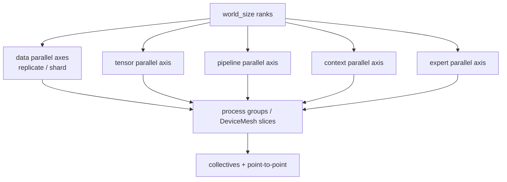
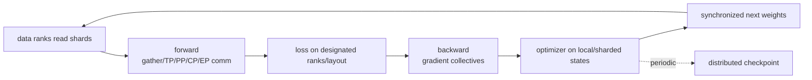

# 从这里开始：把分布式训练看成张量放置与通信计划

不要从框架参数名开始。任何分布式训练方案都必须回答三件事：**每个 rank 持有哪些 tensor 分片；forward/backward/step 的哪个时刻需要哪些 collective；样本、参数和优化器状态怎样在 checkpoint 中恢复。**DDP、ZeRO、FSDP、Megatron 只是这些答案的不同组合。

本站固定阅读 Megatron Core 提交 [`82e9dc6`](https://github.com/NVIDIA/Megatron-LM/tree/82e9dc69c9e6f8c27681f2cb6856a188187edf6b)、TorchTitan [`fec3e19`](https://github.com/pytorch/torchtitan/tree/fec3e196a4ceb87bfc87fb4f1a36a538d7e98ee4) 与 DeepSpeed [`53a2ac4`](https://github.com/deepspeedai/DeepSpeed/tree/53a2ac44fb664bea838df3981ba4366b91643070)。API 和默认值以固定提交为准，原理可迁移。

## 先回答六个问题

| 问题 | 考察 | 答不上从哪里开始 |
| --- | --- | --- |
| DDP 为什么四卡通常仍要每卡放完整模型？ | 数据并行复制语义 | [DDP 与 ZeRO](./data-parallel/ddp-zero) |
| FSDP 为什么 forward 前要 all-gather 参数？ | 参数分片的 materialize/reshard | [FSDP2、DTensor 与 DeviceMesh](./data-parallel/fsdp2) |
| TP 的 row/column parallel 为什么 collective 位置不同？ | 线性层代数与张量 layout | [Tensor / Sequence Parallel](./model-parallel/tensor-sequence) |
| PP 为什么有 bubble，microbatch 为什么能填它？ | stage 时间线 | [Pipeline Parallel](./model-parallel/pipeline) |
| 长上下文与 MoE 为什么需要 CP/EP？ | 切 sequence 与 experts | [Context / Expert Parallel](./model-parallel/context-expert) |
| 64 GPU 配置为什么不能只写 `TP=8, PP=4`？ | 剩余 ranks、group 映射、拓扑 | [3D/4D/5D 并行组合](./model-parallel/multidimensional) |

如果这些都模糊，不要先复制一个 200 行启动脚本。参数可让进程跑起来，却不能证明 group 或通信计划正确。

## 统一抽象：全局 rank 网格

某些维度彼此复用或受约束，尤其 EP 可能嵌入 DP/TP 网格，不能一概把所有 degree 相乘。一个常见 dense 起点是：

$$
world\_size=DP\times TP\times PP\times CP
$$

但最终以代码构造的 process groups/mesh 与每 rank 坐标为准。

## 两个正交目标

### 让训练放得下

- ZeRO/FSDP 切参数、gradient、optimizer states；
- TP 切单层权重/activation；
- PP 切 layers；
- CP/SP 切长序列 activation；
- EP 切 experts；
- activation checkpoint/offload 用重算或传输换显存。

### 让训练跑得快

- DP 增加并行样本吞吐；
- 让高频通信留在 NVLink/NVSwitch 等快域；
- 将跨节点较低频/较大消息放到适合的维度；
- 重叠 compute/communication；
- 减少 pipeline bubble、负载不均与 padding；
- dataloader/checkpoint 不阻塞 GPU。

“放得下”是约束，“跑得快”是优化；能启动的最大并行度往往不是最快配置。

## 一次训练 update 的全局闭环

每一维都要标出 tensor 的 global shape、local shape、placement、通信 group、何时 materialize、何时释放。只画 GPU 方块而不画 tensor layout，无法指导 debug。

## 四个学习阶段

| 阶段 | 任务 | 作品 |
| --- | --- | --- |
| 00 选择 | 建立 rank/mesh/策略地图 | 一张拓扑和并行决策表 |
| 01 地基 | collective、带宽/延迟、显存账 | 手算通信量与每卡状态 |
| 02 策略 | DDP/ZeRO/FSDP 与 Megatron 多维并行 | 每种维度的 tensor layout 图 |
| 03 源码生产 | TorchTitan/Megatron trace、checkpoint、hang/OOM | two-step trace、scaling report、runbook |

完整安排见[学习地图与版本边界](./guide/learning-path)，框架选择见[决策地图](./guide/decision-map)。

## 第一遍只追八类对象

- `rank / world_size / local_rank`；
- process group / `DeviceMesh`；
- global tensor 与 local shard/placement；
- model chunk / pipeline stage；
- microbatch 与 global batch；
- collective 或 P2P op；
- parameter/gradient/optimizer state；
- distributed state dict/checkpoint metadata。

对每个 tensor 问：本 rank 有多少；其他 ranks 有什么；下一次算子需要何种 layout；转换要哪次通信；失败时谁在等待谁。

## 通关检查

完成本站后，你应能：

- 从 world size 与 degrees 列出各 process group；
- 解释 all-reduce、reduce-scatter、all-gather、all-to-all 和 send/recv 分别出现在哪；
- 估算 full training state 与 FSDP/ZeRO shard 后的每卡数量级；
- 画出 TP row/column、PP 1F1B、CP ring 与 EP token dispatch；
- 说明 FSDP 与 TP/PP 切分对象不同，为什么能组合；
- 从 hang 的最后一个 collective 推断 group/shape/control-flow 问题；
- 设计能跨 world size 恢复的 checkpoint 测试。

现在先读[进程、拓扑与集合通信](./fundamentals/collectives)。
