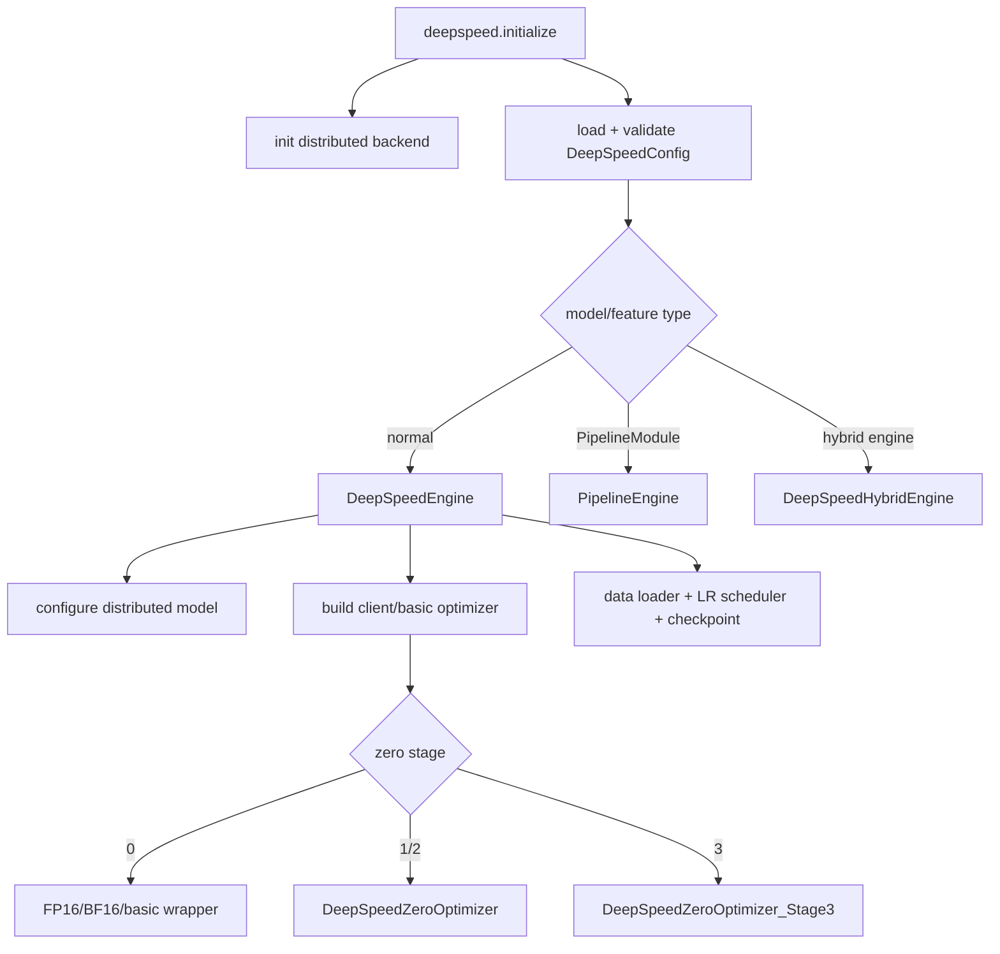
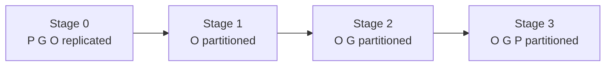
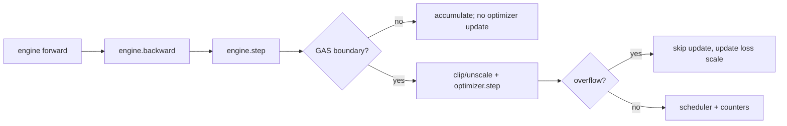
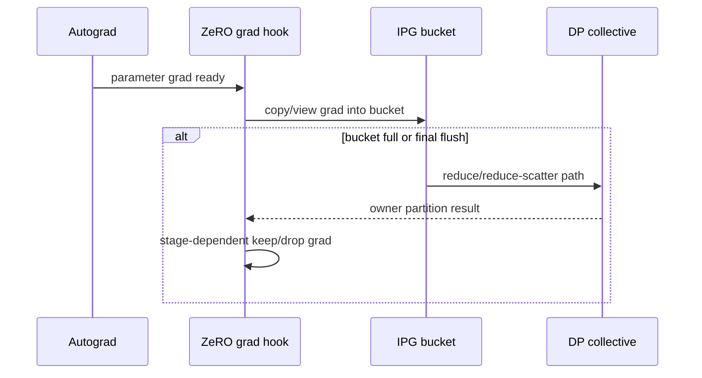
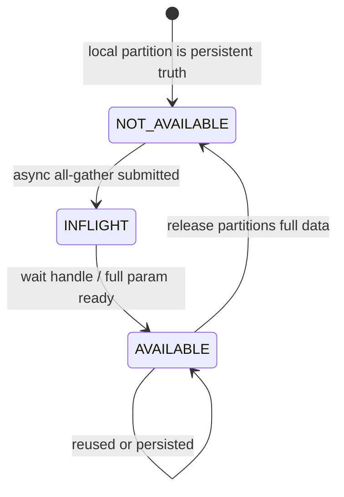

# DeepSpeed 源码主线：Engine、ZeRO-1/2/3 与参数协调器

DeepSpeed 的设计中心是 `Engine`：它接管 forward wrapper、loss scaling/backward、gradient accumulation boundary、optimizer/scheduler 和 checkpoint 协议，再按配置把普通 optimizer 包装成具体 ZeRO stage。ZeRO-3 还用 module hooks 与 `PartitionedParameterCoordinator` 把 parameter 的 fetch/prefetch/release 变成运行时状态机。

本文固定 DeepSpeed [`53a2ac4`](https://github.com/deepspeedai/DeepSpeed/tree/53a2ac44fb664bea838df3981ba4366b91643070)。官方概念先看 [ZeRO 教程](https://www.deepspeed.ai/tutorials/zero/)和 [ZeRO 配置参考](https://deepspeed.readthedocs.io/en/latest/zero3.html)，所有实现细节再回到固定提交源码。

## 1. 启动后真正得到四个对象

原生 loop：

```python
engine, optimizer, train_loader, scheduler = deepspeed.initialize(
    model=model,
    model_parameters=model.parameters(),
    training_data=dataset,
    config="ds_config.json",
)

for batch in train_loader:
    loss = engine(batch)
    engine.backward(loss)
    engine.step()
```

[`deepspeed.initialize`](https://github.com/deepspeedai/DeepSpeed/blob/53a2ac44fb664bea838df3981ba4366b91643070/deepspeed/__init__.py#L93-L267) 明确返回 `(engine, engine.optimizer, engine.training_dataloader, engine.lr_scheduler)`。用户不应再调用原始 `model(...)`、原始 optimizer 或额外 `loss.backward()`；否则会绕开 loss scaling、ZeRO hooks 或重复 update。

### 初始化调用链



固定入口 [167–256 行](https://github.com/deepspeedai/DeepSpeed/blob/53a2ac44fb664bea838df3981ba4366b91643070/deepspeed/__init__.py#L167-L256) 先初始化 DeepSpeed communication backend，再处理 config/mesh/model type。`PipelineModule` 会进入独立 `PipelineEngine`，且要求 `mpu is None`，不是普通 Engine 再打开一个 JSON flag。

## 2. Engine 拥有哪些责任

[`DeepSpeedEngine.__init__`](https://github.com/deepspeedai/DeepSpeed/blob/53a2ac44fb664bea838df3981ba4366b91643070/deepspeed/runtime/engine.py#L234-L403) 初始化：

| 类别 | 关键状态 |
| --- | --- |
| 分布式 | global/local rank、DP group、MPU/mesh、backend |
| 训练计数 | `global_steps/global_samples/micro_steps/skipped_steps` |
| model | client module、distributed wrapping、parameter names |
| optimizer | client optimizer、basic optimizer、ZeRO wrapper、grad scaler |
| accumulation | GAS、boundary override、loss scaling |
| 数据/调度 | optional DeepSpeedDataLoader、LR scheduler |
| 运行时 | timers、profilers、monitor、checkpoint engine |

`_configure_distributed_model()` 在 optimizer 前执行；`model_parameters` 未给时才读取 `self.module.parameters()`。这让 ZeRO 初始化、parameter conversion 与 optimizer wrapper 的顺序成为正确性边界，不是普通 boilerplate。

## 3. 配置怎样选择实际 ZeRO 类

[`ZeroStageEnum`](https://github.com/deepspeedai/DeepSpeed/blob/53a2ac44fb664bea838df3981ba4366b91643070/deepspeed/runtime/zero/config.py#L81-L100) 的固定定义：

```text
0 disabled
1 optimizer_states
2 gradients
3 weights
```

[`_configure_optimizer`](https://github.com/deepspeedai/DeepSpeed/blob/53a2ac44fb664bea838df3981ba4366b91643070/deepspeed/runtime/engine.py#L1898-L1949) 先得到 basic optimizer，再由 [`_configure_zero_optimizer`](https://github.com/deepspeedai/DeepSpeed/blob/53a2ac44fb664bea838df3981ba4366b91643070/deepspeed/runtime/engine.py#L2231-L2401) 选择：

| stage | 固定实现类 | 关键 constructor switch |
| ---: | --- | --- |
| 1 | `DeepSpeedZeroOptimizer` | `partition_grads=False` |
| 2 | `DeepSpeedZeroOptimizer` | `partition_grads=True` |
| 3 | `DeepSpeedZeroOptimizer_Stage3` | module、parameter offload/coordinator、prefetch/reuse policies |

stage 1 和 2 共用同一个类，因此读类名无法判断 stage；必须追 constructor 中 [`partition_gradients`](https://github.com/deepspeedai/DeepSpeed/blob/53a2ac44fb664bea838df3981ba4366b91643070/deepspeed/runtime/zero/stage_1_and_2.py#L214-L223) 与后续分支。

## 4. 三阶段到底分什么

令 DP group size 为 $N$，参数、梯度、optimizer state 每元素字节分别为 $b_p,b_g,b_o$。忽略 activation、bucket、padding、master/低精度具体重复与 allocator 时：

| stage | persistent 参数 | persistent 梯度 | optimizer state | 理想 per-rank 下界 |
| ---: | --- | --- | --- | --- |
| 0/DDP | full | full | full | $P(b_p+b_g+b_o)$ |
| 1 | full | full | $1/N$ | $P(b_p+b_g+b_o/N)$ |
| 2 | full | $1/N$ | $1/N$ | $P(b_p+(b_g+b_o)/N)$ |
| 3 | $1/N$ | $1/N$ | $1/N$ | $P(b_p+b_g+b_o)/N$ |

这是 persistent model-state 下界，不是显存峰值。stage 1/2 仍要 gradient communication buckets 和更新后 parameter all-gather；stage 3 还要当前/预取 modules 的 full parameter buffers、grad reduction buffer 与可能的 persistent small params。



更高 stage 只保证更低 persistent-state 理论下界，不保证更低每步通信等待或更高吞吐。

## 5. 用户 loop 中的 accumulation boundary

[`Engine.backward`](https://github.com/deepspeedai/DeepSpeed/blob/53a2ac44fb664bea838df3981ba4366b91643070/deepspeed/runtime/engine.py#L3063-L3111) 不只是 `loss.backward()`：它处理 GAS scale、ZeRO loss scale/AMP、compiled autograd 和 optimizer epilogue。`is_gradient_accumulation_boundary()` 在 [`3113–3129`](https://github.com/deepspeedai/DeepSpeed/blob/53a2ac44fb664bea838df3981ba4366b91643070/deepspeed/runtime/engine.py#L3113-L3129) 默认判断：

$$
(micro\_steps+1)\bmod GAS=0
$$

[`Engine.step`](https://github.com/deepspeedai/DeepSpeed/blob/53a2ac44fb664bea838df3981ba4366b91643070/deepspeed/runtime/engine.py#L3238-L3295) 每个 microbatch 都可被调用，但只在 boundary 进入 `_take_model_step()`：



这说明：

- `engine.step()` 被调用不等于 parameter 已更新；
- scheduler 不能由外部每 microbatch 再 step；
- global batch 必须满足 DeepSpeed config 的 microbatch×GAS×DP 语义；
- 手动 override boundary 是高级功能，所有 ranks 必须一致。

## 6. ZeRO-1/2：gradient hook 到 owner partition

共用实现 [`DeepSpeedZeroOptimizer`](https://github.com/deepspeedai/DeepSpeed/blob/53a2ac44fb664bea838df3981ba4366b91643070/deepspeed/runtime/zero/stage_1_and_2.py#L134-L430) 构建：

- bit16 parameter groups 与 flat partitions；
- 每 rank 负责的 real DP partition；
- single FP32 optimizer partition；
- IPG gradient buckets；
- stage-dependent gradient ownership/offset maps；
- offload、overflow、loss scale 与 streams。

[`create_gradient_handling_hooks`](https://github.com/deepspeedai/DeepSpeed/blob/53a2ac44fb664bea838df3981ba4366b91643070/deepspeed/runtime/zero/stage_1_and_2.py#L1086-L1115) 对每个 requires-grad parameter 注册 hook，进入 `process_gradients()`；[`reduce_independent_p_g_buckets_and_remove_grads`](https://github.com/deepspeedai/DeepSpeed/blob/53a2ac44fb664bea838df3981ba4366b91643070/deepspeed/runtime/zero/stage_1_and_2.py#L1127-L1184) 将梯度放进 contiguous bucket，满时启动 reduce。



### Stage 1 与 2 的真正分岔

在 stage 1，optimizer state 和 update ownership 分片，但用于训练语义的 gradients 仍完整保留；stage 2 的 `partition_gradients=True` 会在 reduce 完成后移除本 rank 不拥有的 parameter grads，只保留 optimizer partition 对应 gradient shard。固定实现的 reduction/partition 清理主线在 [`reduce_ipg_grads`](https://github.com/deepspeedai/DeepSpeed/blob/53a2ac44fb664bea838df3981ba4366b91643070/deepspeed/runtime/zero/stage_1_and_2.py#L1605-L1669)。

### Step 后为什么还要 parameter all-gather

[`ZeRO-1/2 step`](https://github.com/deepspeedai/DeepSpeed/blob/53a2ac44fb664bea838df3981ba4366b91643070/deepspeed/runtime/zero/stage_1_and_2.py#L2194-L2323) 大意：

```text
finish reductions / overflow check
→ compute norm and unscale/clip local partition grads
→ optimizer updates this rank's FP32 partition
→ copy updated local partition to low-precision partition
→ all-gather all updated partitions
→ every rank rebuilds full low-precision parameters
→ clear grads/state for next step
```

所以 stage 1/2 forward 仍使用 full parameters；它们不像 stage 3 那样逐 module gather parameters。

## 7. ZeRO-3 的参数不是一直可用的普通 Tensor

[`DeepSpeedZeroOptimizer_Stage3`](https://github.com/deepspeedai/DeepSpeed/blob/53a2ac44fb664bea838df3981ba4366b91643070/deepspeed/runtime/zero/stage3.py#L148-L450) 构造时记录：

```text
fp16_groups                      logical/unpartitioned parameter handles
fp16_partitioned_groups          local parameter partitions
fp16_partitioned_groups_flat     flat low-precision partitions
fp32_partitioned_groups_flat     this rank updates these master partitions
partition_size / padding         ownership metadata
prefetch_elements                parameter prefetch budget
sub_group_size                   optimizer update/offload unit
```

源码 [388–390 行](https://github.com/deepspeedai/DeepSpeed/blob/53a2ac44fb664bea838df3981ba4366b91643070/deepspeed/runtime/zero/stage3.py#L388-L390) 直接强调：param status 是 `NOT_AVAILABLE` 或 `INFLIGHT` 时，`param.data` 可能没有有意义的 full data。外部代码若在任意时刻偷偷读 `model.parameters()` 的 full values，会破坏 ZeRO-3 抽象。

## 8. Parameter offload 层先改造 module

Stage 3 constructor 在 [`269–291`](https://github.com/deepspeedai/DeepSpeed/blob/53a2ac44fb664bea838df3981ba4366b91643070/deepspeed/runtime/zero/stage3.py#L269-L291) 调 `initialize_ds_offload()`。得到的 [`DeepSpeedZeRoOffload`](https://github.com/deepspeedai/DeepSpeed/blob/53a2ac44fb664bea838df3981ba4366b91643070/deepspeed/runtime/zero/parameter_offload.py#L117-L213) 即使不把参数真正 offload 到 CPU/NVMe，也承担 stage-3 parameter lifecycle：

1. `_convert_to_zero_parameters()` 给 parameters 增加 partition metadata/method；
2. 标记小而频繁的 persistent parameters；
3. 构造 `PartitionedParameterCoordinator`；
4. 给 modules 安装 forward/backward hooks。

所以类名里的 `Offload` 容易误导；它是 ZeRO-3 module/parameter 协调层，不只在 offload 配置开启时有意义。

## 9. ZeRO-3 module hook 的四个边界

固定代码 [`pre/post_sub_module_forward_function`](https://github.com/deepspeedai/DeepSpeed/blob/53a2ac44fb664bea838df3981ba4366b91643070/deepspeed/runtime/zero/parameter_offload.py#L502-L538) 与 [`pre/post_sub_module_backward_function`](https://github.com/deepspeedai/DeepSpeed/blob/53a2ac44fb664bea838df3981ba4366b91643070/deepspeed/runtime/zero/parameter_offload.py#L540-L570)：

| 边界 | coordinator 操作 |
| --- | --- |
| module forward pre | trace module，`fetch_sub_module(forward=True)` |
| module forward post | `release_sub_module(forward=True)` |
| module backward pre | trace module，`fetch_sub_module(forward=False)` |
| module backward post | `release_sub_module(forward=False)` |



实际 metadata 还处理 external parameters、active submodules、secondary tensors、NVMe/CPU locations 和 quantization，不能只看三态名。

## 10. Coordinator 不只“按层 all-gather”

[`PartitionedParameterCoordinator.__init__`](https://github.com/deepspeedai/DeepSpeed/blob/53a2ac44fb664bea838df3981ba4366b91643070/deepspeed/runtime/zero/partitioned_param_coordinator.py#L64-L148) 持有三个关键预算：

- `prefetch_bucket_sz`：提前 fetch 多少 parameter elements；
- `max_reuse_distance_in_numel`：下次使用足够近时暂不释放；
- `max_available_parameters_in_numel`：允许同时 live 的 full parameters 上限。

还有限制在途 fetch events 数，避免 host thread 异步提交过多、先分配大量内存再等 GPU 使用。

### `fetch_sub_module()` 的精确顺序

[`fetch_sub_module`](https://github.com/deepspeedai/DeepSpeed/blob/53a2ac44fb664bea838df3981ba4366b91643070/deepspeed/runtime/zero/partitioned_param_coordinator.py#L298-L469)：

```text
找当前 module 立即需要且 NOT_AVAILABLE 的 params
→ 提交 immediate all-gather
→ 为当前 params 记录 active_sub_modules
→ 等当前 module 所需 inflight handles
→ 根据已记录的未来 module/param 顺序选择 prefetch set
→ 在 prefetch/live/reuse budgets 内提交异步 all-gather
→ step_id += 1
```

`release_sub_module()` 在 [`473–509`](https://github.com/deepspeedai/DeepSpeed/blob/53a2ac44fb664bea838df3981ba4366b91643070/deepspeed/runtime/zero/partitioned_param_coordinator.py#L473-L509) 先从 active set 删除当前 module，再仅释放满足 trace/reuse/persistence/external-param 条件的 full data。

这解释三个参数的权衡：

| 增大 | 可能收益 | 可能代价 |
| --- | --- | --- |
| prefetch bucket | hide all-gather latency | 更多 full params 同时 live、OOM |
| max reuse distance | 少重复 gather | 更长驻留、更高 HBM |
| max live params | 更多 overlap/reuse | 失去 stage-3 峰值优势 |

## 11. 第一次 iteration 为什么重要

Coordinator 会记录 module/parameter 使用 trace，并在 [`reset_step`](https://github.com/deepspeedai/DeepSpeed/blob/53a2ac44fb664bea838df3981ba4366b91643070/deepspeed/runtime/zero/partitioned_param_coordinator.py#L238-L278) 跨 ranks 校验 `ds_id` 顺序与 last-use step。完成后 trace 用于后续 prefetch/release。

rank-dependent 动态控制流可能造成：

```text
rank 0 next module = A → prefetch params A → collective X
rank 1 next module = B → prefetch params B → collective Y
```

即使两边最终都做相同 FLOPs，也可能因为 parameter collective 顺序不匹配而 hang。MoE 动态 token routing 不应通过 Python 分支跳过不同 expert module 的 collective contract；需要框架支持的 leaf-module/expert并行路径。

## 12. ZeRO-3 gradient 与 optimizer step

梯度聚合路径 [`__avg_scatter_grads`](https://github.com/deepspeedai/DeepSpeed/blob/53a2ac44fb664bea838df3981ba4366b91643070/deepspeed/runtime/zero/stage3.py#L1708-L1746) 将 full grads 交给 `reduce_scatter_coalesced()`，得到本 rank parameter partition 对应 gradient shards，再处理 averaging world size/dtype。

[`ZeRO-3 step`](https://github.com/deepspeedai/DeepSpeed/blob/53a2ac44fb664bea838df3981ba4366b91643070/deepspeed/runtime/zero/stage3.py#L2544-L2588)：

```text
partition all parameters
→ overflow/loss-scale update
→ global grad norm
→ for each optimizer subgroup:
     prepare local FP32 state + grad
     unscale/clip
     optimizer update local subgroup
     copy/reassign or swap low-precision partition
     release/swap optimizer state
→ gather configured persistent parameters
→ reset buffers/timers
```

普通 parameters 不在 step 末永久 all-gather；下一 forward 仍由 coordinator 按 module fetch。只有被策略标记为 persistent 的小 parameters 在 [`_post_step`](https://github.com/deepspeedai/DeepSpeed/blob/53a2ac44fb664bea838df3981ba4366b91643070/deepspeed/runtime/zero/stage3.py#L2505-L2521) 被 gather。

## 13. Offload 是三条数据通路，不是一个布尔项

| 配置 | 移动对象 | 新资源约束 | 只有哪个 stage 可用 |
| --- | --- | --- | --- |
| `offload_optimizer.device=cpu/nvme` | master weights、moments、optimizer compute/state | CPU算力、DRAM、PCIe或NVMe、NUMA | 1/2/3（按固定 config 约束） |
| `offload_param.device=cpu/nvme` | parameter partitions/full staging | PCIe/NVMe、pin memory、prefetch | 3 |
| activation checkpoint/offload | activations | 重算或传输 | 与 ZeRO 正交 |

Offload 后显存下降但 step 变慢通常不是“配置没生效”，而是容量问题转成了 bandwidth/IOPS/CPU 问题。至少记录：

```text
GPU↔CPU bytes/step
CPU optimizer time
pageable vs pinned memory
NUMA placement
NVMe queue depth/read-write bandwidth
overlap window and stall time
```

## 14. 最小配置与单变量实验

先做 stage 2 基线：

```json
{
  "train_micro_batch_size_per_gpu": 2,
  "gradient_accumulation_steps": 4,
  "bf16": {"enabled": true},
  "zero_optimization": {
    "stage": 2,
    "contiguous_gradients": true,
    "reduce_scatter": true,
    "overlap_comm": true,
    "reduce_bucket_size": 50000000,
    "allgather_bucket_size": 50000000
  }
}
```

再只改 `stage: 3`，增加显式可记录的策略：

```json
{
  "train_micro_batch_size_per_gpu": 2,
  "gradient_accumulation_steps": 4,
  "bf16": {"enabled": true},
  "zero_optimization": {
    "stage": 3,
    "contiguous_gradients": true,
    "reduce_scatter": true,
    "overlap_comm": true,
    "reduce_bucket_size": 50000000,
    "stage3_prefetch_bucket_size": 25000000,
    "stage3_param_persistence_threshold": 100000,
    "stage3_max_live_parameters": 100000000
  }
}
```

字段与默认值必须核对固定 [`DeepSpeedZeroConfig`](https://github.com/deepspeedai/DeepSpeed/blob/53a2ac44fb664bea838df3981ba4366b91643070/deepspeed/runtime/zero/config.py#L90-L330)。旧教程中的 deprecated 字段不要照抄；例如 `stage3_gather_fp16_weights_on_model_save` 在固定代码已经指向新字段。

## 15. 启动条件与框架集成边界

### 原生 DeepSpeed

- launcher/环境必须给每 rank 一致 world，且 local device 正确；
- model 必须在 `initialize` 前完成结构构造；stage 3 超大模型可用 `deepspeed.zero.Init` 避免先完整物化；
- config 的 global/micro/GAS/DP batch 关系必须一致；
- 使用返回的 engine、optimizer、loader、scheduler；
- 所有 ranks 在同一 accumulation boundary 进入 collective；
- checkpoint 由 engine 协议保存 model/optimizer/client state。

### Transformers/Accelerate/TRL 集成

上层 Trainer 通常替你调用 `deepspeed.initialize`、`engine.backward/step` 和 checkpoint。此时不要再在 callback 内调用第二次；应检查 resolved DeepSpeed config 和实际 `engine.optimizer` class，不能只看 YAML 中写了 `zero_stage`。

### 与 Megatron/PP/TP

DeepSpeed 可接收 `mpu` 获取 model/data parallel groups，但 `PipelineModule` 走 `PipelineEngine` 的独立 contract。不要假设 Megatron Core 的 PP schedule、DeepSpeed PipelineEngine 和普通 Engine 可以任意叠加；以具体 integration entry、process groups 和 checkpoint tests 为准。

## 16. 数值、显存与性能验收

每个 stage 运行同一初值/样本/global tokens/update，至少记录：

| 证据 | 要回答的问题 |
| --- | --- |
| resolved config + actual optimizer class | JSON 是否真的进入预期 stage |
| parameter/grad ownership map | 本 rank 更新哪一 partition |
| loss + logical update checksum | 分片前后训练语义是否一致 |
| peak allocated/reserved + timeline | 临时 full param/bucket 在哪里造成峰值 |
| collective trace | stage 2 的 grad reduce/param gather与stage 3的param gather/grad RS是否出现 |
| step breakdown | overlap 是隐藏通信还是只增加 buffer |
| save/restart/load/next step | shard checkpoint 与 optimizer/client state 是否恢复 |

## 17. 常见失败反推表

| 现象 | 最可能破坏的 invariant | 源码入口 |
| --- | --- | --- |
| `initialize` 卡住 | distributed world/config/model type 不一致 | `deepspeed.initialize` |
| 第一个 backward 卡住 | 某 rank graph/grad hook/reduction sequence 不同 | stage1/2 gradient hooks 或 stage3 module trace |
| 只有 accumulation 最后一轮错 | boundary/loss scale/外部 optimizer step 重复 | `Engine.backward/step` |
| Stage 2 HBM 仍接近 DDP parameters | 正常：stage 2 不切 P | stage1/2 state structures |
| Stage 3 forward OOM | prefetch/live/reuse/persistence/module granularity | coordinator budgets |
| 动态模型第二步 hang | module/parameter trace 在 ranks 间变化 | `reset_step` trace checks |
| Offload 极慢 | PCIe/CPU/NVMe 未被 compute 隐藏 | parameter/optimizer swap timeline |
| 保存后没有完整权重文件 | 保存的是 ZeRO shards，未走 consolidation/export | checkpoint/consolidation contract |
| `engine.step()` 后参数没变 | 非 GAS boundary 或 overflow | `is_gradient_accumulation_boundary`、`_take_model_step` |

## 18. 源码阅读练习

1. 从一份 stage 2 JSON 追到 `_configure_zero_optimizer` 创建的 constructor arguments，逐项写值；
2. 在 stage 1/2 类中以 `partition_gradients` 为搜索词，列出所有行为分岔；
3. 给一个三层模型记录 ZeRO-3 首轮 `ds_id` module trace，并预测下一轮 prefetch queue；
4. 将 prefetch bucket 减半，只比较 peak/live params/等待，不同时改 reuse distance；
5. 在 GAS=4 时记录四次 `engine.step()` 的 `micro_steps`、boundary、parameter checksum；
6. save→杀进程→重启→load→再 step，比较 uninterrupted run 的下一 logical update。

这些 GPU/DeepSpeed 实验必须在固定提交声明的 accelerator 环境中运行；本站的 CPU 测试不会伪称验证 stage-3 CUDA overlap。

## 通关标准

你应能从下面链条逐段指出类、状态和 collective：

```text
deepspeed.initialize
→ DeepSpeedConfig + Engine
→ basic optimizer
→ stage-specific ZeRO wrapper
→ engine forward/backward
→ param/grad hooks and accumulation boundary
→ stage1/2 owner gradient + local update + parameter all-gather
   or stage3 coordinator fetch/release + grad reduce-scatter + local subgroup update
→ scheduler/counters/checkpoint
```

再回到[FSDP2 源码](./fsdp2-source)做逐项对照，最后用[框架决策地图](../guide/decision-map)选型。
