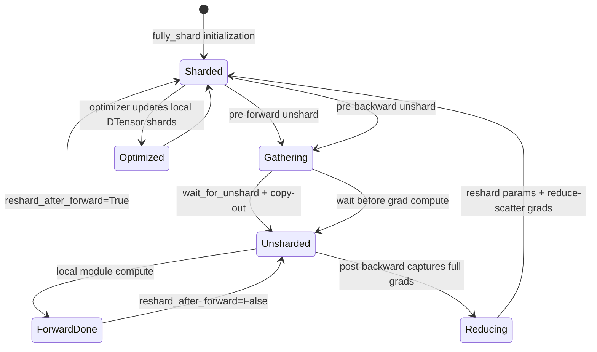
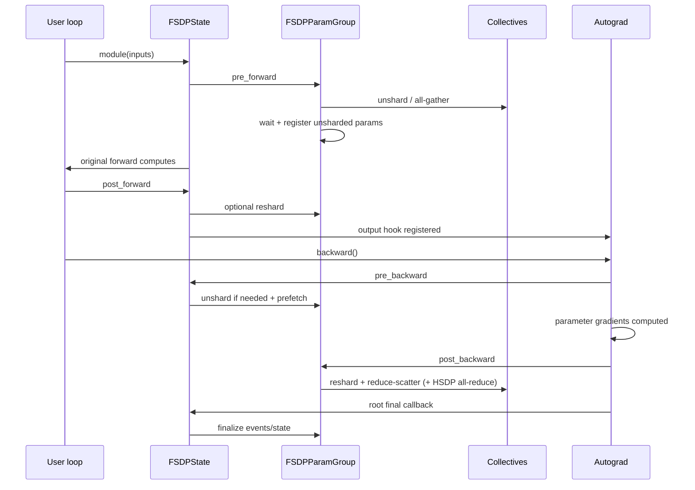

# FSDP2 源码解剖：DTensor 参数与 Unshard–Reshard 状态机

FSDP2 不能简化成“ZeRO-3 的 PyTorch 版”。它的核心表示是 **per-parameter DTensor shard**，核心调度是 **composable module hooks + parameter-group collectives**。用户仍调用普通 module forward/backward，hook 在每个 FSDP unit 的计算边界把参数从 sharded 变成 unsharded，再在正确时机恢复 shard 并 reduce-scatter gradient。

本文固定 PyTorch [`e11b512`](https://github.com/pytorch/pytorch/tree/e11b512fef37205cc3b83872eabd92c3cdf05a28)，这是源码语义说明，不保证其他 wheel 中实验性 API/参数完全相同。

## 1. 一张图先区分 persistent 与 transient state



在 1D FSDP mesh size 为 $S$ 时，persistent 参数/梯度/optimizer state 理想下界都按 $1/S$ 分片：

$$
M_{persistent}\approx \frac{P(b_p+b_g+b_o)}{S}
$$

但 peak 至少还要加当前/预取 FSDP unit 的 unsharded parameters、all-gather output、reduce-scatter input、activation 和 allocator。若最大 unit 参数量为 $U$，一个更有用但仍简化的峰值模型是：

$$
M_{peak}\gtrsim \frac{P(b_p+b_g+b_o)}{S}+kU b_{compute}+A+B_{collective}
$$

$k$ 取决于当前 unit、prefetch/overlap、mixed precision 和 reshard policy，绝不是固定 1。FSDP unit 过大时，稳态很省但 forward 峰值仍会 OOM。

## 2. `fully_shard()` 建立什么对象

公共入口 [`fully_shard()`](https://github.com/pytorch/pytorch/blob/e11b512fef37205cc3b83872eabd92c3cdf05a28/torch/distributed/fsdp/_fully_shard/_fully_shard.py#L98-L296) 的 docstring 已把生命周期写成可核验 contract：

- 初始化时分片 parameters；
- forward 前 all-gather；
- 可选 forward 后释放；
- backward 前按需再 gather；
- gradient 产生后释放 full params 并 reduce-scatter；
- sharded parameter 对 module/optimizer 表现为 DTensor。

实现部分不是给 module 套一个外部 wrapper：

```text
validate module/mesh
→ derive FSDPMeshInfo / HSDPMeshInfo / device
→ collect not-yet-managed params and buffers
→ FSDPState.init() registers hooks
→ _init_param_group() converts/groups parameters
→ dynamically change module.__class__ to FSDP<OriginalClass>
→ return the same module object
```

最后一步见 [`_apply_to_module`](https://github.com/pytorch/pytorch/blob/e11b512fef37205cc3b83872eabd92c3cdf05a28/torch/distributed/fsdp/_fully_shard/_fsdp_init.py#L404-L430)：动态 class 的 MRO 同时包含 `FSDPModule` 与原 module class。这就是 composable API 能让用户继续调用 `model(...)`、`model.unshard()` 和 `model.reshard()` 的原因。

## 3. 为什么必须 bottom-up 调用

固定源码 [133–143 行](https://github.com/pytorch/pytorch/blob/e11b512fef37205cc3b83872eabd92c3cdf05a28/torch/distributed/fsdp/_fully_shard/_fully_shard.py#L133-L143) 给出 grouping 规则：一次 `fully_shard(module)` 管理该 module 下尚未被更早 submodule call 管理的 parameters。于是正确常见顺序是：

```python
for block in model.layers:
    fully_shard(block, mesh=dp_mesh)
fully_shard(model, mesh=dp_mesh, reshard_after_forward=False)
```

得到的通信 unit：

```text
block 0 params → one grouped all-gather / reduce-scatter
block 1 params → one grouped all-gather / reduce-scatter
...
root remaining params → one group
```

若只 shard root，全部参数可能成为一个巨型 group：forward 前物化整模型，峰值失去 layer-wise sharding 的价值，通信也无法按层与计算重叠。若先 root 再 blocks，root 已认领后代 parameters，后续 call 也无法按预期重新划分。

### Unit 划分的三方权衡

| unit 太小 | unit 合理 | unit 太大 |
| --- | --- | --- |
| collective 次数多、启动延迟高 | 一层/若干层一组，容易 overlap | full materialization 峰值大、gather 晚、RS buffer 大 |

不要只按 module 数量分组；还要看参数 bytes、forward order、tied weights、shared module、activation checkpoint recompute 和 pipeline microbatch reuse。

## 4. 1D FSDP 与 2D HSDP 的 mesh 语义

固定 API 的 mesh contract 在 [`169–235`](https://github.com/pytorch/pytorch/blob/e11b512fef37205cc3b83872eabd92c3cdf05a28/torch/distributed/fsdp/_fully_shard/_fully_shard.py#L169-L235)：

| mesh | parameter placements | gradient communication |
| --- | --- | --- |
| 1D `(shard=S)` | `(Shard(0),)` | shard group reduce-scatter |
| 2D `(replicate=R, shard=S)` | `(Replicate(), Shard(0))` | shard group reduce-scatter，再 replicate group all-reduce |

HSDP 每个 replicate group 持有一套完整的 logical model shards，因此 persistent 参数总下界仍是 $P/S$，不是 $P/(R\times S)$。它以多份 shard replicas 换取较小/局部的高频 all-gather 域，并用 replicate group 同步对应 gradient shards。

在 [`foreach_reduce`](https://github.com/pytorch/pytorch/blob/e11b512fef37205cc3b83872eabd92c3cdf05a28/torch/distributed/fsdp/_fully_shard/_fsdp_collectives.py#L522-L701) 中可直接看到顺序：

```text
unsharded gradients
→ pack/cast/predivide
→ reduce_scatter on shard group
→ HSDP: all_reduce reduced shard on replicate group
→ postdivide/cast
→ view result as each sharded parameter.grad
```

这比“2D mesh 自动更快”更准确。跨节点拓扑应把高频 parameter all-gather/reduce-scatter 放在哪一维，要根据链路和 unit size profile 决定。

## 5. Parameter group 是通信和状态的单位

[`_init_param_group`](https://github.com/pytorch/pytorch/blob/e11b512fef37205cc3b83872eabd92c3cdf05a28/torch/distributed/fsdp/_fully_shard/_fsdp_init.py#L433-L533) 默认创建一个 `FSDPParamGroup`。若 `shard_placement_fn` 为不同参数返回不同 mesh，例如 dense params 用 DP mesh、expert params 用 expert-DP mesh，固定提交会按 `(shard_pg, replicate_pg)` 分成多个 groups。

因此“一个 fully_shard call 永远等于一次 collective”只在同 mesh 的普通 case 成立。per-param mesh 可让一个 module state 拥有多个 param groups，代码也把旧单数属性限制为最多一个 group。

每个 group 负责：

- sharded/unsharded parameter 表示切换；
- all-gather input/output storage；
- mixed precision param/reduce dtype；
- forward/backward prefetch；
- reduce-scatter input 和 sharded grad；
- HSDP all-reduce state；
- optional CPU offload；
- training state 与 event/stream lifetime。

## 6. Hook 是怎样注册的

[`FSDPState.init`](https://github.com/pytorch/pytorch/blob/e11b512fef37205cc3b83872eabd92c3cdf05a28/torch/distributed/fsdp/_fully_shard/_fsdp_state.py#L104-L135) 在 module 上注册：

- forward pre-hook：`_pre_forward`；
- forward hook：`_post_forward`；
- forward output tensors 上的 backward hook：`_pre_backward`；
- autograd engine 的 root final callback：`_root_post_backward_final_callback`。



## 7. Pre-forward：发 gather 与等 gather 是两个阶段

[`FSDPParamGroup.pre_forward`](https://github.com/pytorch/pytorch/blob/e11b512fef37205cc3b83872eabd92c3cdf05a28/torch/distributed/fsdp/_fully_shard/_fsdp_param_group.py#L550-L568) 顺序是：

```text
training_state = FORWARD
→ unshard(async policy)
→ wait_for_unshard()
→ restore unsharded parameter types on module
→ register post-backward hook once
```

`unshard()` 与 `wait_for_unshard()` 分开，才能在 prefetch 时提前发通信，在参数真正被 compute 使用前才等待。公共 [`FSDPModule.unshard(async_op=True)`](https://github.com/pytorch/pytorch/blob/e11b512fef37205cc3b83872eabd92c3cdf05a28/torch/distributed/fsdp/_fully_shard/_fully_shard.py#L345-L373) 也返回 handle；若用户不主动 wait，module pre-forward 会兜底等待。

### `foreach_all_gather()` 不只是 `dist.all_gather`

[`foreach_all_gather`](https://github.com/pytorch/pytorch/blob/e11b512fef37205cc3b83872eabd92c3cdf05a28/torch/distributed/fsdp/_fully_shard/_fsdp_collectives.py#L325-L378)：

1. 在 copy-in stream 收集每参数 all-gather inputs 与 dtype/numel metadata；
2. 分配一个合并 output buffer；
3. 把 local shards pack 到通信 input；
4. 让 all-gather stream 等 copy-in stream；
5. 在目标 group 发 collective，保存 work/event/result。

随后 `wait_for_unshard()` 等依赖并 copy-out，把合并 output 解释回每个原始参数 shape，再把 module 注册参数切到 unsharded representation。collective 完成与 module 已能安全读参数不是完全相同的时间点。

## 8. Post-forward：`reshard_after_forward` 是显存/通信政策

[`FSDPParamGroup.post_forward`](https://github.com/pytorch/pytorch/blob/e11b512fef37205cc3b83872eabd92c3cdf05a28/torch/distributed/fsdp/_fully_shard/_fsdp_param_group.py#L570-L582) 调 `reshard()`。行为由政策决定：

| 值 | forward 后 | backward 前 | 优点 | 代价 |
| --- | --- | --- | --- | --- |
| `True` | 恢复 shard，释放 full | 再 all-gather | 省 forward→backward 区间 HBM | 每 step/unit 多一次 gather |
| `False` | 保留 full | 不需再 gather | 少通信，适合 root/很快进入 backward | 占更多 HBM |
| 整数子组 | reshard 到较小 mesh | 较小域 gather | 中间折中 | 组合/拓扑更复杂，SPMD mesh 有限制 |
| `None` | 非 root 默认 true，root lazy init 改 false | 自动 | 常用基线 | 不保证对 PP/microbatch 最优 |

源码 contract 在 [`180–203`](https://github.com/pytorch/pytorch/blob/e11b512fef37205cc3b83872eabd92c3cdf05a28/torch/distributed/fsdp/_fully_shard/_fully_shard.py#L180-L203)。

### 为什么 pipeline parallel 常改变政策

若一个 PP stage 对多个 microbatches 重复调用同一 local module：

```text
每 microbatch forward 后立即 reshard
→ 下个 microbatch 又 all-gather
→ gather 次数随 microbatch 增长
```

保留 unsharded params 可减少重复通信，却提高整个 schedule 的驻留显存。选择必须同时看 PP schedule、unit reuse、activation 与 HBM，不能孤立调 FSDP flag。

## 9. Pre-backward：从 output hook 重新物化参数

[`FSDPState._register_pre_backward_hook`](https://github.com/pytorch/pytorch/blob/e11b512fef37205cc3b83872eabd92c3cdf05a28/torch/distributed/fsdp/_fully_shard/_fsdp_state.py#L440-L478) 在需要 grad 的 outputs 上注册 hook；一旦 backward 到达该 module 的 output，[`_pre_backward`](https://github.com/pytorch/pytorch/blob/e11b512fef37205cc3b83872eabd92c3cdf05a28/torch/distributed/fsdp/_fully_shard/_fsdp_state.py#L385-L398)：

- 进入 `PRE_BACKWARD`；
- 向 autograd engine 注册一次 root final callback；
- 每 group `pre_backward()`；
- 按反向执行顺序预取配置的 groups。

`FSDPParamGroup.pre_backward()` 在 [`592–605`](https://github.com/pytorch/pytorch/blob/e11b512fef37205cc3b83872eabd92c3cdf05a28/torch/distributed/fsdp/_fully_shard/_fsdp_param_group.py#L592-L605) 再次 `unshard + wait`；若 forward 后没 reshard，这一步可成为 no-op。

固定源码还特别警告：若 wrapped module 返回 view，用户在 output 上做 in-place op，可能让 pre-backward hook 丢失，造成缺 gather 或错误梯度。问题不是“FSDP 不支持所有 in-place”，而是该 output-hook 边界被破坏；源码 [440–458](https://github.com/pytorch/pytorch/blob/e11b512fef37205cc3b83872eabd92c3cdf05a28/torch/distributed/fsdp/_fully_shard/_fsdp_state.py#L440-L458) 给出提示。

## 10. Post-backward：先捕获 full grad，再恢复 shard

[`FSDPParamGroup.post_backward`](https://github.com/pytorch/pytorch/blob/e11b512fef37205cc3b83872eabd92c3cdf05a28/torch/distributed/fsdp/_fully_shard/_fsdp_param_group.py#L607-L787) 的关键顺序不能颠倒：

1. 累积可能的 unsharded gradient；
2. 从 unsharded parameters 取出 `.grad`，保存引用并清空；
3. 按政策 reshard parameter；
4. 控制在途 reduce-scatter input buffer 数，必要时等旧 event；
5. 调 `foreach_reduce()`；
6. 把 reduce 结果 view/accumulate 到 sharded parameter `.grad`；
7. 保存 stream/event 和必要的 keepalive references。

这证明 optimizer 最终看到的是与 sharded DTensor parameter 对齐的 local gradient shard，而不是完整 gradient。

### Reduce-scatter 的 buffer 生命周期

[`foreach_reduce`](https://github.com/pytorch/pytorch/blob/e11b512fef37205cc3b83872eabd92c3cdf05a28/torch/distributed/fsdp/_fully_shard/_fsdp_collectives.py#L579-L632) 会：

```text
reorder non-dim0 shards if needed
→ calculate padding and flat input/output sizes
→ pack all full grads into RS input
→ only after copy-in, release original grad refs
→ run reduce-scatter on communication stream
→ record completion event
```

因此 reduce-scatter input 在通信完成前不能被 allocator 安全复用。固定实现甚至保留一定数量的 `ReduceScatterState` 来平衡 memory 与 overlap；把这些 buffers 从显存账本漏掉，会低估 backward peak。

## 11. Root final callback：不是每层各自随意结束

[`FSDPState._root_post_backward_final_callback`](https://github.com/pytorch/pytorch/blob/e11b512fef37205cc3b83872eabd92c3cdf05a28/torch/distributed/fsdp/_fully_shard/_fsdp_state.py#L400-L438) 在整个 backward 结束时：

- 补跑未触发的 group post-backward；
- 恢复所有 state/group 到 `IDLE`；
- 最后一轮 backward 时调用每个 group `finalize_backward()`；
- 等并释放保留的 reduce-scatter states；
- 清理 post-forward order 与 callback 标志。

[`FSDPParamGroup.finalize_backward`](https://github.com/pytorch/pytorch/blob/e11b512fef37205cc3b83872eabd92c3cdf05a28/torch/distributed/fsdp/_fully_shard/_fsdp_param_group.py#L789-L808) 等 post-reduce/offload events，并兜底等待没有正确消费的 unshard work。

如果 forward/backward 中途抛异常，固定 API 明确说 per-iteration state 不再可直接复用。恢复流程是调用 root FSDP module 的 `reset_iter_state()`，并丢弃失败 iteration 的 gradients；不能捕获异常后直接下一个 batch。

## 12. Optimizer 为什么必须在 sharding 后创建

推荐顺序：

```python
model = build_model()
for block in model.layers:
    fully_shard(block, mesh=mesh)
fully_shard(model, mesh=mesh, reshard_after_forward=False)
optimizer = torch.optim.AdamW(model.parameters(), lr=...)
```

此时 `model.parameters()` 是持久 sharded parameters，optimizer state 按 local shards 延迟创建。若 optimizer 在 sharding 前捕获旧 parameter objects/state，可能造成引用或 state layout 不一致；某些迁移路径会显式处理，但不能依赖偶然行为。

一次 step 后的 logical invariant：

```text
每个 rank：只更新自己 local parameter shards
所有 shard 合并：等价于 logical full parameter 的一次 update
下一次 unshard：all ranks 得到一致的最新 logical parameter
```

## 13. DCP：runtime sharding 不等于保存 N 份不可迁移文件

Distributed Checkpoint 的 [`save`](https://github.com/pytorch/pytorch/blob/e11b512fef37205cc3b83872eabd92c3cdf05a28/torch/distributed/checkpoint/state_dict_saver.py#L89-L203) 由 planner 把 logical state dict 映射为 distributed write plan；[`load`](https://github.com/pytorch/pytorch/blob/e11b512fef37205cc3b83872eabd92c3cdf05a28/torch/distributed/checkpoint/state_dict_loader.py#L60-L155) 要求目标 state dict 先提供 shape/layout/storage，再将保存的 logical values 读入目标 shards。

最小语义：

```python
state = {"model": model.state_dict(), "optim": optimizer.state_dict()}
dcp.save(state, checkpoint_id=path)

# 重建目标 model/mesh/optimizer，然后取得目标 state objects
state = {"model": model.state_dict(), "optim": optimizer.state_dict()}
dcp.load(state, checkpoint_id=path)
model.load_state_dict(state["model"])
optimizer.load_state_dict(state["optim"])
```

生产代码通常使用 `get_state_dict/set_state_dict` 处理 FSDP/optimizer logical mapping；不要拿一段示意代码替代固定版本官方 recipe。验收必须 save→重启→load→再训练一步，并比较下一 loss/update，而不只是 `load()` 没报错。

## 14. FSDP2、DDP、ZeRO-3 的源码差异

| 维度 | DDP | FSDP2 | DeepSpeed ZeRO-3 |
| --- | --- | --- | --- |
| persistent param | 普通完整 Parameter | sharded DTensor Parameter | partitioned param + DeepSpeed status/metadata |
| runtime full param | 始终完整 | FSDP unit hook 中短暂 unshard | module hook/coordinator fetch/prefetch |
| grad communication | bucket all-reduce | per-group reduce-scatter；HSDP 再 AR | partitioned gradient reduce-scatter |
| optimizer owner | 每 rank 完整 | 每 rank local DTensor shard | local partition/subgroup owner |
| 调度核心 | C++ Reducer/autograd hooks | FSDPState + FSDPParamGroup hooks | Engine + ZeRO hooks + coordinator |
| checkpoint | 普通/分布式均可 | DCP logical state 支持 reshard | ZeRO shard checkpoint/consolidation 语义 |

三者可在数学目标上相似，但参数表示、hook 时机、prefetch 和 checkpoint contract 不可互换。

## 15. 启动条件与不应组合的做法

进入 FSDP2 前至少验证：

- 所有 ranks 构造同一 mesh；
- shard dimension 可合法切分，或清楚 padding 规则；
- 每 rank 以 local device 构造/搬运 model；
- `fully_shard` bottom-up，在 optimizer 之前；
- tied/shared parameters 只归属一个正确 group；
- TP 后 parameter 已是 DTensor 时，FSDP mesh/placements 与 full SPMD mesh contract 一致；
- checkpoint API 与运行 PyTorch 版本匹配。

不要同时使用 DDP 包住同一组 FSDP-sharded params；不要让两个独立 FSDP calls 重复管理同一参数；不要在 rank-dependent Python control flow 下使 collective group/order 不同。

## 16. 调试矩阵

| 现象 | 源码层假设 | 首查 |
| --- | --- | --- |
| 第一次 forward hang | mesh/group 或某 rank 没进入 unit | mesh coordinates、`pre_forward→foreach_all_gather` |
| forward 后仍 OOM | unit 太大、prefetch 太多、policy 保留 full | `reshard_after_forward`、all-gather buffers、activation |
| backward 开始 hang | output hook 未触发/不同 rank graph | `_register_pre_backward_hook`、view in-place、control flow |
| grad shape/layout 错 | RS pack/padding/placement 与 param 不一致 | global/local shape、`fsdp_placement`、`foreach_reduce` |
| accumulation 数值偏 | `no_sync/set_requires_gradient_sync`、loss divide、HSDP partial reduce | global token denominator 和 final sync boundary |
| 第二个 iteration 状态错 | 上轮异常后没 reset | `reset_iter_state` |
| checkpoint 能 load 但下一 loss 错 | optimizer/RNG/data state 或 logical keys 未恢复 | state dict keys、resume step、dataloader、next update checksum |

## 17. 必做实践

1. 为 2 blocks 模型分别用 root-only 与 block-wise FSDP，记录 profiler 的 AG/RS 次数和理论 peak 差异；
2. 对 `reshard_after_forward=True/False` 只改一个变量，记录 forward→backward 驻留和 backward gather；
3. 构造 `(replicate=2, shard=2)` HSDP mesh，打印每 rank 两类 groups；
4. 保存 DCP checkpoint，重建不同支持 topology 后 load，比较 logical parameter 与下一 update；
5. 故意在 wrapped module 的 view output 上做 in-place，观察固定版本 warning/失败，再改 out-of-place；
6. 记录每个结论的 PyTorch version/commit，CPU/Gloo 结果不外推为 NCCL 性能。

可执行入口和验收格式见[源码驱动实践](../practice/source-labs)。

## 通关标准

你应能从这一条链逐段指到源码：

```text
fully_shard bottom-up
→ sharded DTensor params + FSDPState/ParamGroup
→ pre-forward grouped all-gather
→ wait/copy-out/register full params
→ forward
→ optional reshard
→ pre-backward re-gather/prefetch
→ capture full grads + reshard params
→ grouped reduce-scatter (+ HSDP all-reduce)
→ local sharded grads
→ final callback waits/cleans state
→ optimizer updates local shards
```

下一课看[TorchTitan 如何把这些原语组合成完整训练系统](./torchtitan)。
