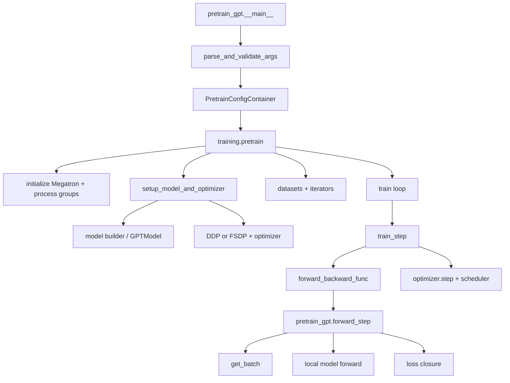
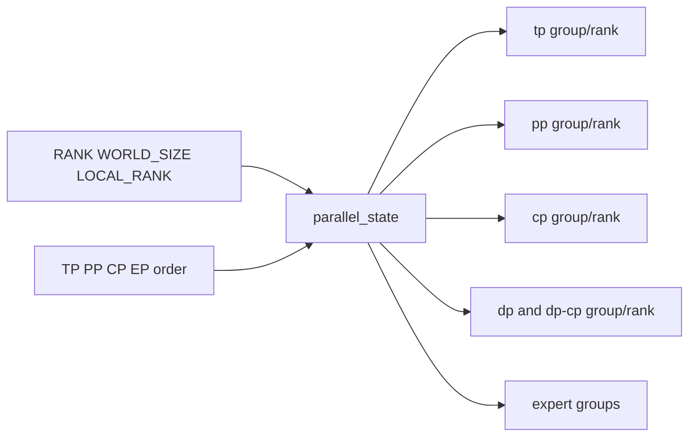
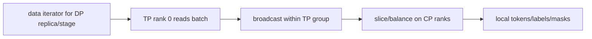
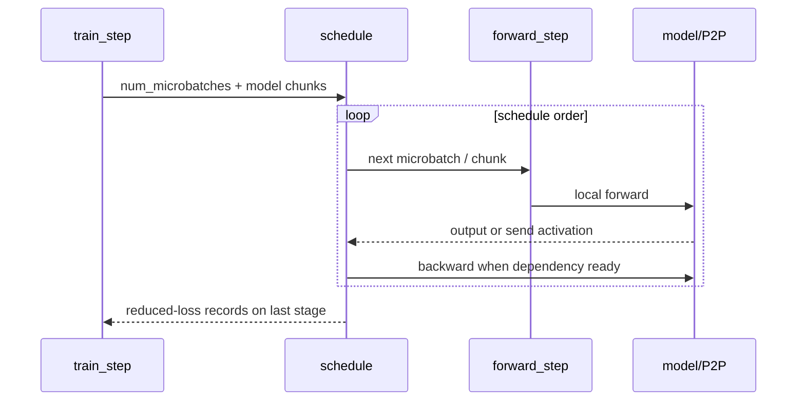
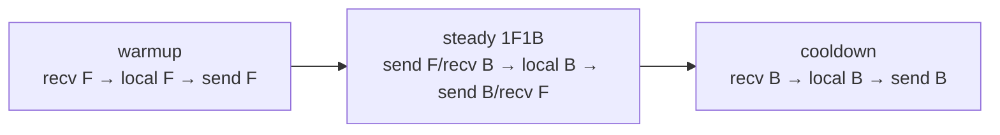
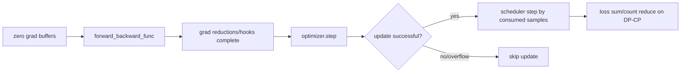

# Megatron 源码主线：从 pretrain_gpt 到一次更新

Megatron 是 SPMD 程序：launcher 创建的每个 rank 都执行同一个 `pretrain_gpt.py`。差异来自 rank coordinates、`pre_process/post_process`、local layer range、parameter shards 与 process groups。**阅读时跟一个 `(dp,tp,pp,cp)` 坐标，而不是只跟 rank 0。**

本文固定官方提交 [`82e9dc6`](https://github.com/NVIDIA/Megatron-LM/tree/82e9dc69c9e6f8c27681f2cb6856a188187edf6b)。下载完整源码，而不是只复制启动参数：

```bash
git clone --filter=blob:none https://github.com/NVIDIA/Megatron-LM.git
git -C Megatron-LM switch --detach 82e9dc69c9e6f8c27681f2cb6856a188187edf6b
git -C Megatron-LM rev-parse HEAD
```

Megatron 的固定训练入口默认要求 CUDA：[`initialize_megatron`](https://github.com/NVIDIA/Megatron-LM/blob/82e9dc69c9e6f8c27681f2cb6856a188187edf6b/megatron/training/initialize.py#L42-L67) 只有显式 `allow_no_cuda=True` 才绕过检查，并注明该选项主要用于 CPU 数据处理。项目自己的[构建技能](https://github.com/NVIDIA/Megatron-LM/blob/82e9dc69c9e6f8c27681f2cb6856a188187edf6b/skills/mcore-build-and-dependency/SKILL.md#L10-L47) 要求在 CI container 中开发，venv 是 `/opt/venv`；[测试技能](https://github.com/NVIDIA/Megatron-LM/blob/82e9dc69c9e6f8c27681f2cb6856a188187edf6b/skills/mcore-testing/SKILL.md#L27-L64) 说明 unit tests 通常由 1 节点 8 GPU distributed runner 执行。本站没有在裸主机伪称这些 GPU tests 已通过。

## 主调用链



固定应用入口 [`pretrain_gpt.py:492–523`](https://github.com/NVIDIA/Megatron-LM/blob/82e9dc69c9e6f8c27681f2cb6856a188187edf6b/pretrain_gpt.py#L492-L523) 解析 args，构造 GPT config 与 `PretrainConfigContainer`，最后把 dataset provider、model type 与 `forward_step` 交给 [`pretrain()`](https://github.com/NVIDIA/Megatron-LM/blob/82e9dc69c9e6f8c27681f2cb6856a188187edf6b/megatron/training/training.py#L1007-L1095)。

## 1. 参数解析不只是 argparse

`parse_and_validate_args()` 会推导/校验：

- world 与 TP/PP/CP/DP degrees；
- global/micro batch 与 num microbatches；
- model dimensions/head/expert divisibility；
- precision、distributed optimizer、overlap 组合；
- pipeline/virtual pipeline layout；
- dataset/tokenizer/checkpoint 设置。

固定入口随后把 args 转成 GPT model config 与 `PretrainConfigContainer`。较旧教程常描述直接传 `model_provider_func`；固定提交的 `pretrain_gpt.py` 已优先构造 config container，由 builder 建 distributed models。概念仍相同，调用细节必须按提交校准。

进入真实 train loop 还要满足 [`pretrain:1407–1430`](https://github.com/NVIDIA/Megatron-LM/blob/82e9dc69c9e6f8c27681f2cb6856a188187edf6b/megatron/training/training.py#L1407-L1430) 的条件：不处于普通 skip-train 分支，并且 `args.do_train` 且 `train_iters>0`。正常初始化、打印 model、甚至构造 optimizer，都不等于执行了更新。

## 2. 初始化先建立运行时坐标

`pretrain()` 调 [`initialize_megatron`](https://github.com/NVIDIA/Megatron-LM/blob/82e9dc69c9e6f8c27681f2cb6856a188187edf6b/megatron/training/initialize.py#L42-L162)，再由 [`_initialize_distributed`](https://github.com/NVIDIA/Megatron-LM/blob/82e9dc69c9e6f8c27681f2cb6856a188187edf6b/megatron/training/initialize.py#L265-L382) 设置 local CUDA device、创建 default PG，并进入 [`initialize_model_parallel()`](https://github.com/NVIDIA/Megatron-LM/blob/82e9dc69c9e6f8c27681f2cb6856a188187edf6b/megatron/core/parallel_state.py#L547-L830)。



在此处打印每个 rank 的 coordinate/group members，是后续所有 shape 与 collective 的基准。若这里错，模型 forward 中的错误只是下游症状。

### Dense 与 expert 使用两套 RankGenerator

固定 dense world 公式在 [`727–739`](https://github.com/NVIDIA/Megatron-LM/blob/82e9dc69c9e6f8c27681f2cb6856a188187edf6b/megatron/core/parallel_state.py#L727-L739)：

$$
model\_size=TP\times PP\times CP,\qquad DP=world/model\_size
$$

随后 [`770–801`](https://github.com/NVIDIA/Megatron-LM/blob/82e9dc69c9e6f8c27681f2cb6856a188187edf6b/megatron/core/parallel_state.py#L770-L801) 分别创建：

```text
decoder RankGenerator: tp=TP, ep=1, dp=DP, pp=PP, cp=CP
expert RankGenerator:  tp=expert_TP, ep=EP, dp=expert_DP, pp=PP, cp=1
```

EP 并非无条件再乘到 dense product；它重新分解 expert ranks，而且要求 `world` 可被 `expert_TP×EP×PP` 整除。代码还断言两套 generator 的 PP groups 相同。读 MoE 配置必须同时列 dense DP 与 expert DP，不能只写一个 `DP`。

### Process group 创建顺序也是 contract

所有 ranks 必须以相同全局顺序调用 `new_group`，即使本 rank 不是某 subgroup member。`parallel_state.py` 从 [`816`](https://github.com/NVIDIA/Megatron-LM/blob/82e9dc69c9e6f8c27681f2cb6856a188187edf6b/megatron/core/parallel_state.py#L816) 起依次建立 DP/DP+CP、CP、TP、PP、embedding、expert 等 groups；不要在 rank-dependent 分支里临时创建不同组。

## 3. Model builder 决定 local model

固定 [`gpt_builder()`](https://github.com/NVIDIA/Megatron-LM/blob/82e9dc69c9e6f8c27681f2cb6856a188187edf6b/gpt_builders.py#L25) 选择 local/Transformer Engine/MoE/heterogeneous layer spec，再构造 `GPTModel`：

```text
model config
  → transformer layer/block spec
  → GPTModel(pre_process, post_process, vp_stage, pg_collection)
  → local TransformerBlock layers
  → TP linear / attention / optional MoE modules
```

`pre_process` 控制 embedding/input 责任，`post_process` 控制 output/loss 责任；PP middle stage 通常两者都 false。virtual PP 时一个 physical rank 可能得到多个 `model_chunk`。

[`setup_model_and_optimizer()`](https://github.com/NVIDIA/Megatron-LM/blob/82e9dc69c9e6f8c27681f2cb6856a188187edf6b/megatron/training/training.py#L1993-L2100) 再：

1. build local model chunks；
2. 包装 DDP/Megatron-FSDP/Torch FSDP2（依配置）；
3. 建 optimizer 与 parameter scheduler；
4. 加载 checkpoint/恢复 RNG、iteration 等 state。

“model” 在训练主线里常是 list，即使没有 virtual PP 也不要默认是单个裸 `GPTModel`。

固定 [`get_model`](https://github.com/NVIDIA/Megatron-LM/blob/82e9dc69c9e6f8c27681f2cb6856a188187edf6b/megatron/training/training.py#L1685-L1765) 根据 PP/virtual PP 计算每 chunk 的 `pre_process/post_process`，构造 local model；若启用 CPU initialization/meta path，也是在 local stage 语义确定后处理。换言之，PP rank 1 的“model”不是 rank 0 完整模型的副本，而是不同 stage/chunks。

## 3.1 TP 不是一个 flag，而是两种线性代数

### ColumnParallelLinear：切输出维

[`ColumnParallelLinear`](https://github.com/NVIDIA/Megatron-LM/blob/82e9dc69c9e6f8c27681f2cb6856a188187edf6b/megatron/core/tensor_parallel/layers.py#L778-L1045) 定义：

$$
A=[A_1,\ldots,A_p],\qquad Y_i=XA_i
$$

每 rank weight storage 是 `[output_size/TP, input_size]`，源码 [`854–920`](https://github.com/NVIDIA/Megatron-LM/blob/82e9dc69c9e6f8c27681f2cb6856a188187edf6b/megatron/core/tensor_parallel/layers.py#L854-L920) 计算 `output_size_per_partition` 并分配 local weight。forward 可保持 $Y_i$ sharded，也可按 `gather_output` all-gather；backward 的 input-gradient需要跨 TP 汇总，sequence parallel 时以相应 RS/AG 变体替代。

### RowParallelLinear：切输入维

[`RowParallelLinear`](https://github.com/NVIDIA/Megatron-LM/blob/82e9dc69c9e6f8c27681f2cb6856a188187edf6b/megatron/core/tensor_parallel/layers.py#L1142-L1364) 定义：

$$
X=[X_1,\ldots,X_p],\quad A=\begin{bmatrix}A_1\\ \vdots\\ A_p\end{bmatrix},\quad
Y=\sum_i X_iA_i
$$

每 rank 先算 partial output，再在 [`1348–1357`](https://github.com/NVIDIA/Megatron-LM/blob/82e9dc69c9e6f8c27681f2cb6856a188187edf6b/megatron/core/tensor_parallel/layers.py#L1348-L1357) 选择：expert 显式通信、sequence-parallel reduce-scatter，或普通 TP all-reduce。

典型 MLP 不在 Column 后立刻 gather：Column 输出 shard 经本地激活直接成为 Row 的 sharded input，直到 Row partial sums 才 reduce。这样既省 activation communication，也解释 Column/Row 必须成对理解。

[`mappings.py:492–555`](https://github.com/NVIDIA/Megatron-LM/blob/82e9dc69c9e6f8c27681f2cb6856a188187edf6b/megatron/core/tensor_parallel/mappings.py#L492-L555) 的 autograd wrappers 决定 forward/backward 对偶通信；只看 forward profiler会漏掉 backward all-reduce/AG/RS。

## 4. 数据并非所有 ranks 各读一遍

固定 [`get_batch()`](https://github.com/NVIDIA/Megatron-LM/blob/82e9dc69c9e6f8c27681f2cb6856a188187edf6b/pretrain_gpt.py#L94-L178) 的层级很关键：



- 某些 PP middle stages不需要 tokens/labels，只接收 activation；
- TP group 中通常由 TP rank 0 取 batch，再广播所需 tensors；
- CP 随后沿 sequence 切 batch；
- DP replicas 才消费不同 samples。

因此“每 rank dataloader batch size”不是 global sample count。排查重复数据时同时看 DP coordinate、TP broadcast 与 CP slice。

固定代码 [113–118 行](https://github.com/NVIDIA/Megatron-LM/blob/82e9dc69c9e6f8c27681f2cb6856a188187edf6b/pretrain_gpt.py#L113-L118) 让不需要数据的 middle stage 直接返回 Nones；[120–145](https://github.com/NVIDIA/Megatron-LM/blob/82e9dc69c9e6f8c27681f2cb6856a188187edf6b/pretrain_gpt.py#L120-L145) 只有 TP rank 0 `next(data_iterator)` 并搬到 CUDA，再在 TP group broadcast；[164–170](https://github.com/NVIDIA/Megatron-LM/blob/82e9dc69c9e6f8c27681f2cb6856a188187edf6b/pretrain_gpt.py#L164-L170) 最后做 CP slice。

## 5. `forward_step` 返回结果和 loss closure

[`forward_step()`](https://github.com/NVIDIA/Megatron-LM/blob/82e9dc69c9e6f8c27681f2cb6856a188187edf6b/pretrain_gpt.py#L279-L355) 做三件事：

1. `get_batch()`；
2. 构造 packed-sequence/CP metadata；
3. 调 local model，返回 `output_tensor` 与绑定 `loss_mask` 的 loss function。

为什么不直接在这里无条件 `loss.backward()`？因为 pipeline schedule 需要控制哪个 microbatch、哪个 stage 在何时 forward/backward；末 stage 才真正有 language-model loss，其余 stages 通过 activation gradient参与反向。

## 6. schedule 是一次 step 的执行引擎

训练循环通过 [`get_forward_backward_func()`](https://github.com/NVIDIA/Megatron-LM/blob/82e9dc69c9e6f8c27681f2cb6856a188187edf6b/megatron/core/pipeline_parallel/schedules.py#L48) 选择：

- no-pipeline；
- non-interleaved 1F1B；
- interleaved 1F1B。

schedule 接收 `forward_step_func`、model chunks、microbatch 数与 P2P communicator；内部多次调用 `forward_step`，管理 activation send/recv、loss closure、backward 和 optional overlap。



TP/CP/EP collective 在 model modules 内触发；PP P2P 由 schedule 管；DP gradient communication 通常由 DDP/optimizer hooks 管。不能用一个“schedule 通信”概括全部。

### 无 PP 路径也有 microbatch schedule

[`forward_backward_no_pipelining`](https://github.com/NVIDIA/Megatron-LM/blob/82e9dc69c9e6f8c27681f2cb6856a188187edf6b/megatron/core/pipeline_parallel/schedules.py#L672-L850) 对前 `m-1` microbatches 进入 no-sync context，最后一个 microbatch 才恢复 gradient sync；然后调用 `finalize_model_grads_func` 完成 DP full all-reduce/reduce-scatter 与 SP layernorm reduction。它不是 Python for-loop 后再统一随意同步。

### Non-interleaved 1F1B 的三个阶段

[`forward_backward_pipelining_without_interleaving`](https://github.com/NVIDIA/Megatron-LM/blob/82e9dc69c9e6f8c27681f2cb6856a188187edf6b/megatron/core/pipeline_parallel/schedules.py#L2127-L2460) 首先拒绝 model chunking，且固定代码 [2160–2164](https://github.com/NVIDIA/Megatron-LM/blob/82e9dc69c9e6f8c27681f2cb6856a188187edf6b/megatron/core/pipeline_parallel/schedules.py#L2160-L2164) 不支持该 schedule 下 `overlap_p2p_comm`。

当前 stage 的 warmup microbatch 数在 [`2264–2267`](https://github.com/NVIDIA/Megatron-LM/blob/82e9dc69c9e6f8c27681f2cb6856a188187edf6b/megatron/core/pipeline_parallel/schedules.py#L2264-L2267)：

$$
warmup=\min(total\_stages-current\_stage-1,\ m)
$$



warmup [2321–2356](https://github.com/NVIDIA/Megatron-LM/blob/82e9dc69c9e6f8c27681f2cb6856a188187edf6b/megatron/core/pipeline_parallel/schedules.py#L2321-L2356) 保存 activation；steady [2366–2436](https://github.com/NVIDIA/Megatron-LM/blob/82e9dc69c9e6f8c27681f2cb6856a188187edf6b/megatron/core/pipeline_parallel/schedules.py#L2366-L2436) 组合 `send_forward_recv_backward` 与 `send_backward_recv_forward`；cooldown 处理剩余 backward。最后一个可用 backward 才重新 enable grad sync，避免每 microbatch做 DP reduction。

对等速 stage 的 GPipe flush 粗略 bubble fraction 是 $(p-1)/(m+p-1)$；1F1B 主要降低 activation驻留，不会凭空消除 fill/drain bubble。真实性能还受 stage imbalance、P2P、virtual chunks 和通信重叠影响。

## 7. `train_step` 的精确顺序

固定 [`train_step()`](https://github.com/NVIDIA/Megatron-LM/blob/82e9dc69c9e6f8c27681f2cb6856a188187edf6b/megatron/training/training.py#L2284-L2503)：



optimizer 可因 loss scaling overflow 跳过 update；scheduler 只在成功时按 `num_microbatches × micro_batch × DP` 递增。若忽略 skipped iteration，resume/学习率对照会错位。

真实选择 schedule 的位置不在 `pretrain_gpt.py`，而在 [`train:3517–3529`](https://github.com/NVIDIA/Megatron-LM/blob/82e9dc69c9e6f8c27681f2cb6856a188187edf6b/megatron/training/training.py#L3517-L3529)；循环 [`3630–3785`](https://github.com/NVIDIA/Megatron-LM/blob/82e9dc69c9e6f8c27681f2cb6856a188187edf6b/megatron/training/training.py#L3630-L3785) 还处理 async checkpoint finalization、microbatch ramp-up、CUDA graph、skip iteration、RL branch和故障注入。训练 update 的真正调用是 [3753–3767](https://github.com/NVIDIA/Megatron-LM/blob/82e9dc69c9e6f8c27681f2cb6856a188187edf6b/megatron/training/training.py#L3753-L3767)。

## 8. loss 为什么在 `dp_cp` group 汇总

固定 loss function返回 `[loss_sum, valid_token_count]` 形式的 report；`train_step` 跨 `dp_cp_group` all-reduce 两者，再用总和相除。

$$
L=\frac{\sum_r\sum_{t\in r}\ell_t}{\sum_r N_{valid,r}}
$$

CP ranks 持有同一样本的不同 tokens，DP ranks持有不同 samples，所以二者都应进入 global token loss；TP ranks处理同一 token 的 feature shards，不应重复计数。这个 group 选择正是训练语义，而非日志细节。

对应实现 [`2475–2492`](https://github.com/NVIDIA/Megatron-LM/blob/82e9dc69c9e6f8c27681f2cb6856a188187edf6b/megatron/training/training.py#L2475-L2492) 把各 microbatch `[loss_sum, token_count]` 先相加，再在 `dp_cp_group` all-reduce，最终两者相除；legacy 单元素 report 才走旧的 microbatch average。自定义 loss closure 返回 shape 不同，会改变整个 reporting 语义。

## 9. optimizer 与 distributed optimizer

普通 DDP 可在 backward bucket ready 时启动 gradient reduce；distributed optimizer 进一步把 state/grad/param 片段映射到 DP domain，并可 overlap grad reduce / param gather。`optimizer.step()` 内可能包含：

```text
finish gradient synchronization
→ unscale/check finite
→ grad norm/clip
→ update owned state shards
→ prepare/gather next parameter shards
```

所以 profile 中的 `optimizer` 不等于纯 Adam elementwise kernel。查看 [`core/optimizer/`](https://github.com/NVIDIA/Megatron-LM/tree/82e9dc69c9e6f8c27681f2cb6856a188187edf6b/megatron/core/optimizer) 与 [`core/distributed/`](https://github.com/NVIDIA/Megatron-LM/tree/82e9dc69c9e6f8c27681f2cb6856a188187edf6b/megatron/core/distributed) 才能解释 overlap 与等待。

## 10. 外层 train loop 还负责什么

`pretrain()` 建好 model/data 后进入训练循环，外层还管理：

- iteration 与 consumed samples；
- logging/timers/straggler metrics；
- evaluation；
- periodic/exit checkpoint；
- profiler、memory、NaN/spiky loss/rerun state；
- signal/timeout/exit conditions。

某个 step “没有 optimizer update”可能是 overflow、rerun 或退出协议，不一定是 backward 没执行。

## 11. Context Parallel：切完整 context，不等于 SP

Sequence Parallel 通常把 TP region 内 layernorm/dropout 等 activation 的 sequence dimension 分散到 TP ranks，并在 TP linear 边界用 AG/RS；Context Parallel 则让 attention 的完整 sequence/context 横跨独立 CP group，目标是降低长上下文 attention activation/KV-like working state。

固定 local [`DotProductAttention`](https://github.com/NVIDIA/Megatron-LM/blob/82e9dc69c9e6f8c27681f2cb6856a188187edf6b/megatron/core/transformer/dot_product_attention.py#L45-L69) 在 [57–59 行](https://github.com/NVIDIA/Megatron-LM/blob/82e9dc69c9e6f8c27681f2cb6856a188187edf6b/megatron/core/transformer/dot_product_attention.py#L57-L59) 直接断言 `context_parallel_size==1`；固定主线的 CP attention需要 Transformer Engine `TEDotProductAttention`/对应 backend。只把 `--context-parallel-size` 改大而仍用 local transformer implementation不是可运行组合。

CP 还影响：

- `get_batch_on_this_cp_rank` 的 token/label/mask切片；
- pipeline activation shape按 `seq_length/CP` 计算，SP 再除 TP；
- attention内部 K/V exchange或 backend特定通信；
- loss/token count必须跨 DP×CP；
- sequence length 与 load-balancing/padding 约束。

## 12. Expert Parallel：两次 A2A 加 TP AG/RS

[`MoEAlltoAllTokenDispatcher`](https://github.com/NVIDIA/Megatron-LM/blob/82e9dc69c9e6f8c27681f2cb6856a188187edf6b/megatron/core/transformer/moe/token_dispatcher.py#L359-L470) 在 docstring 中给出完整 contract：

```text
router metadata + local permutation
→ EP all-to-all dispatch
→ optional TP all-gather
→ sort by local expert
→ local expert compute
→ optional TP reduce-scatter
→ EP all-to-all combine
→ unpermute to original token order
```

dispatch 的 token/probability A2A 在 [`662–706`](https://github.com/NVIDIA/Megatron-LM/blob/82e9dc69c9e6f8c27681f2cb6856a188187edf6b/megatron/core/transformer/moe/token_dispatcher.py#L662-L706)，TP gather在 [`708–765`](https://github.com/NVIDIA/Megatron-LM/blob/82e9dc69c9e6f8c27681f2cb6856a188187edf6b/megatron/core/transformer/moe/token_dispatcher.py#L708-L765)，反向 combine A2A 在 [`817–854`](https://github.com/NVIDIA/Megatron-LM/blob/82e9dc69c9e6f8c27681f2cb6856a188187edf6b/megatron/core/transformer/moe/token_dispatcher.py#L817-L854)。`input_splits/output_splits` 是按 routing 动态得到的 per-rank token counts，shape/metadata必须在所有 participants 一致。

EP 性能不能只看 A2A bandwidth。某 expert 收到的 token 多，其他 ranks 即使通信完成也会等其 GEMM；要同时记录每 expert token histogram、capacity/drop/padding、dispatch bytes、local expert compute 和 shared-expert overlap。

## 13. Rank 角色与代码责任

| 角色/条件 | 本 rank 的 local code责任 | 主要通信 |
| --- | --- | --- |
| TP rank 0 of data-using PP stage | 从 data iterator取 batch并搬 CUDA | TP broadcast |
| TP peer | 不独立取样本，接收 batch字段 | TP broadcast/linear collectives |
| PP first | embedding/输入，`pre_process=True` | send forward、recv backward |
| PP middle | local layers，通常无 token/label | recv/send activation/gradient |
| PP last | output/head/loss，`post_process=True` | recv forward、send backward、DP×CP loss |
| CP rank | 同一样本 context slice | attention backend CP comm |
| EP rank | local experts，动态 token subset | dispatch/combine all-to-all |
| DP rank | 不同 sample replica/optimizer shard domain | gradient reduction/param gather |
| virtual PP rank | 同一 physical rank上的一个 model chunk | interleaved schedule P2P |

PP first/last、TP rank 0、DP rank 0 是不同坐标条件，不要统一叫“主进程”。一个 global rank可能同时满足多个条件。

## 14. 启动条件与不允许的组合

进入训练前至少逐项核对：

- `world % (TP×PP×CP) == 0`，由源码推导 DP；
- `world % (expert_TP×EP×PP) == 0`，expert generator可构造；
- hidden/head/query-group/vocab/FFN/expert counts满足对应 TP/EP divisibility；
- virtual PP 只在 PP>1，non-interleaved schedule不接受 model chunking；
- CP>1 使用固定提交支持的 TE attention/backend，而非 local attention；
- sequence length可被 CP/SP分割，并满足 packed/variable sequence contract；
- pipeline每 stage tensor shape与 P2P peer一致；
- global batch、micro batch、DP、num microbatches关系正确；
- Transformer Engine、APEX extensions、DeepEP等启用功能的依赖存在；
- 使用项目 CI container/锁定环境，真实 GPU tests从仓库 test recipe开始。

不要删除 assert去“支持”一个组合。断言通常位于 process-group/shape/schedule contract的最早可诊断位置，绕过后更可能变成 NCCL hang。

## 15. 一次 update 的逐层 trace

| 层次 | 入口 | 谁负责什么 | 完成条件 |
| --- | --- | --- | --- |
| 应用 | `pretrain_gpt.__main__` | args→model config→container | 调入 `pretrain` |
| bootstrap | `initialize_megatron` | CUDA/default PG/seeds/deps | 所有 process groups一致 |
| model | `setup_model_and_optimizer/get_model` | local PP chunks、TP/CP/EP modules、DDP/FSDP/optimizer | 每 rank local state确定 |
| data | `get_batch` | TP0 read→TP broadcast→CP slice | 当前 stage所需字段就绪 |
| schedule | `get_forward_backward_func` | microbatch F/B/P2P次序 | 所有 local backward完成 |
| module | TP/CP/EP implementations | layer-internal collectives | local outputs/grads布局正确 |
| data parallel | finalize grads/optimizer | grad reduce、unscale、clip、owned shard update | `update_successful` 全 MP一致 |
| semantics | DP×CP loss | sum loss/token counts | global token-average loss |
| outer loop | `train` | counters、eval、checkpoint、timeout/fault | iteration提交或明确skip |

## 16. 必做实践与证据

1. 使用固定 functional test recipe，而不是从 70B 性能脚本开始；保存 container digest、commit、完整 args和数据 revision；
2. TP=2：打印 Column/Row local weight shapes，分别定位 forward与backward TP collective；
3. PP=2：记录每 microbatch warmup/steady/cooldown P2P，验证 first/last stage数据与loss角色；
4. CP=2：先验证 TE依赖和 seq divisibility，再记录每 rank token slice与DP×CP loss counts；
5. EP=2：打印 expert rank generator groups、input/output splits、per-expert token counts和两次 A2A；
6. 每次只开一个新维度，保持 global tokens/update；用 logical tensor checksum而非 local shard checksum比较；
7. checkpoint→重启→恢复→再跑一步，对比 uninterrupted run 的 consumed samples、RNG、optimizer、下一 loss/update；
8. 若没有 8 GPU/固定容器，只交付静态 source trace和公式，明确标记 GPU recipe未实测。

完整日程见[42 天源码学习计划](../guide/source-study-plan)，实验记录模板见[源码驱动实践](../practice/source-labs)。

## 17. 两个源码追踪练习

### 练习 A：TP=2、PP=1

对 rank0/1 记录：

```text
TP group/rank
batch reader rank
first ColumnParallelLinear weight local shape
forward TP collectives
loss owner/report group
optimizer state ownership
```

### 练习 B：TP=1、PP=2

对两个 stage 记录：

```text
local layer ids
pre_process/post_process
data iterator是否真正取 tokens
each microbatch F/B/P2P order
which rank produces loss
both stages parameter checksum before/after step
```

## 常见读错

| 误读 | 校正 |
| --- | --- |
| `pretrain_gpt.py` 自己实现训练循环 | 它提供 model/data/forward contract，通用 loop 在 training.py |
| 每个 rank 都独立读取不同 batch | TP 内广播、CP 切 sequence、DP 才换 sample |
| `forward_step` 就完成 backward | schedule 控制 microbatch backward |
| loss 只在 DP group 平均 | token report 在固定主线跨 DP-CP 汇总 |
| optimizer.step 只是 Adam kernel | 可能含分片、同步、overflow、overlap 收尾 |
| 一个 model 对象等于完整 GPT | 常是 local stage/shard，且外层为 model chunks list |

## 通关标准

你应能从 `pretrain_gpt.__main__` 走到 `train_step`；解释 builder为何给每 rank不同 local model；复述 batch 的 DP/TP/CP 分发；区分 PP schedule、TP/CP/EP module collective 与 DP optimizer communication；并推导 `dp_cp` loss reduction 的 token 语义。

下一课处理跨布局保存和恢复：[分布式 Checkpoint](../practice/checkpointing)。
