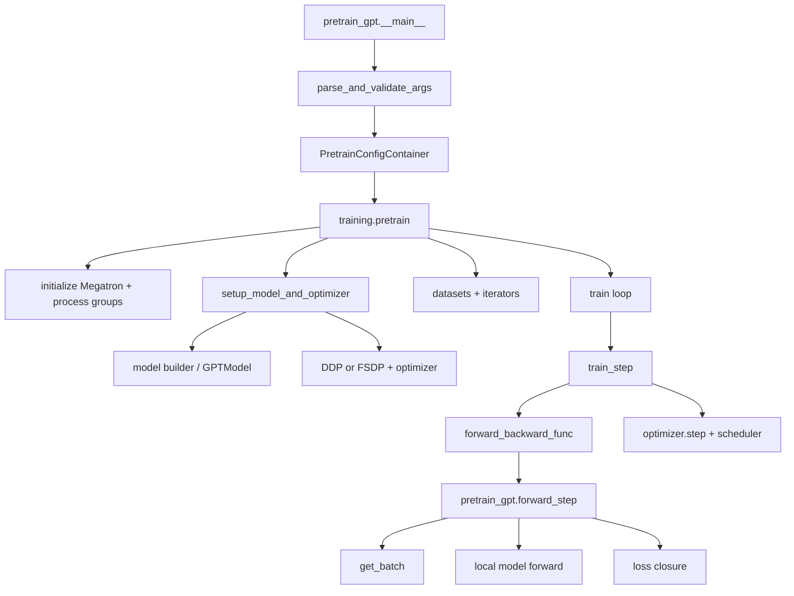
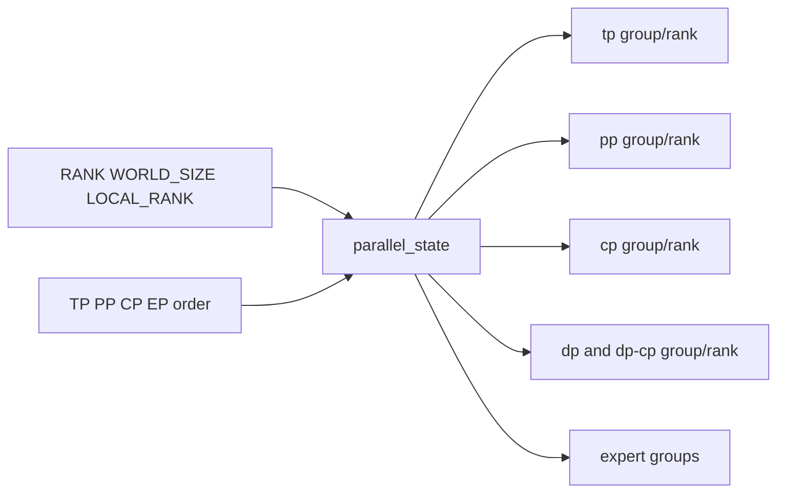
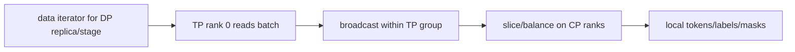
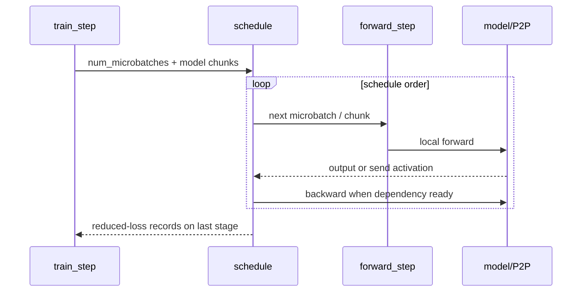
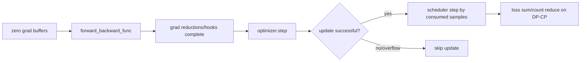

# Megatron 源码主线：从 pretrain_gpt 到一次更新

Megatron 是 SPMD 程序：launcher 创建的每个 rank 都执行同一个 `pretrain_gpt.py`。差异来自 rank coordinates、`pre_process/post_process`、local layer range、parameter shards 与 process groups。**阅读时跟一个 `(dp,tp,pp,cp)` 坐标，而不是只跟 rank 0。**

## 主调用链



固定应用入口 [`pretrain_gpt.py`](https://github.com/NVIDIA/Megatron-LM/blob/82e9dc69c9e6f8c27681f2cb6856a188187edf6b/pretrain_gpt.py) 最后把 dataset provider、model type 与 `forward_step` 交给 [`pretrain()`](https://github.com/NVIDIA/Megatron-LM/blob/82e9dc69c9e6f8c27681f2cb6856a188187edf6b/megatron/training/training.py#L1007)。

## 1. 参数解析不只是 argparse

`parse_and_validate_args()` 会推导/校验：

- world 与 TP/PP/CP/DP degrees；
- global/micro batch 与 num microbatches；
- model dimensions/head/expert divisibility；
- precision、distributed optimizer、overlap 组合；
- pipeline/virtual pipeline layout；
- dataset/tokenizer/checkpoint 设置。

固定入口随后把 args 转成 GPT model config 与 `PretrainConfigContainer`。较旧教程常描述直接传 `model_provider_func`；固定提交的 `pretrain_gpt.py` 已优先构造 config container，由 builder 建 distributed models。概念仍相同，调用细节必须按提交校准。

## 2. 初始化先建立运行时坐标

`pretrain()` 初始化 `torch.distributed`、随机数/日志和 model-parallel groups。核心仍是 [`initialize_model_parallel()`](https://github.com/NVIDIA/Megatron-LM/blob/82e9dc69c9e6f8c27681f2cb6856a188187edf6b/megatron/core/parallel_state.py#L547)。



在此处打印每个 rank 的 coordinate/group members，是后续所有 shape 与 collective 的基准。若这里错，模型 forward 中的错误只是下游症状。

## 3. Model builder 决定 local model

固定 [`gpt_builder()`](https://github.com/NVIDIA/Megatron-LM/blob/82e9dc69c9e6f8c27681f2cb6856a188187edf6b/gpt_builders.py#L25) 选择 local/Transformer Engine/MoE/heterogeneous layer spec，再构造 `GPTModel`：

```text
model config
  → transformer layer/block spec
  → GPTModel(pre_process, post_process, vp_stage, pg_collection)
  → local TransformerBlock layers
  → TP linear / attention / optional MoE modules
```

`pre_process` 控制 embedding/input 责任，`post_process` 控制 output/loss 责任；PP middle stage 通常两者都 false。virtual PP 时一个 physical rank 可能得到多个 `model_chunk`。

[`setup_model_and_optimizer()`](https://github.com/NVIDIA/Megatron-LM/blob/82e9dc69c9e6f8c27681f2cb6856a188187edf6b/megatron/training/training.py#L1993) 再：

1. build local model chunks；
2. 包装 DDP/Megatron-FSDP/Torch FSDP2（依配置）；
3. 建 optimizer 与 parameter scheduler；
4. 加载 checkpoint/恢复 RNG、iteration 等 state。

“model” 在训练主线里常是 list，即使没有 virtual PP 也不要默认是单个裸 `GPTModel`。

## 4. 数据并非所有 ranks 各读一遍

固定 [`get_batch()`](https://github.com/NVIDIA/Megatron-LM/blob/82e9dc69c9e6f8c27681f2cb6856a188187edf6b/pretrain_gpt.py#L94) 的层级很关键：



- 某些 PP middle stages不需要 tokens/labels，只接收 activation；
- TP group 中通常由 TP rank 0 取 batch，再广播所需 tensors；
- CP 随后沿 sequence 切 batch；
- DP replicas 才消费不同 samples。

因此“每 rank dataloader batch size”不是 global sample count。排查重复数据时同时看 DP coordinate、TP broadcast 与 CP slice。

## 5. `forward_step` 返回结果和 loss closure

[`forward_step()`](https://github.com/NVIDIA/Megatron-LM/blob/82e9dc69c9e6f8c27681f2cb6856a188187edf6b/pretrain_gpt.py#L279) 做三件事：

1. `get_batch()`；
2. 构造 packed-sequence/CP metadata；
3. 调 local model，返回 `output_tensor` 与绑定 `loss_mask` 的 loss function。

为什么不直接在这里无条件 `loss.backward()`？因为 pipeline schedule 需要控制哪个 microbatch、哪个 stage 在何时 forward/backward；末 stage 才真正有 language-model loss，其余 stages 通过 activation gradient参与反向。

## 6. schedule 是一次 step 的执行引擎

训练循环通过 [`get_forward_backward_func()`](https://github.com/NVIDIA/Megatron-LM/blob/82e9dc69c9e6f8c27681f2cb6856a188187edf6b/megatron/core/pipeline_parallel/schedules.py#L48) 选择：

- no-pipeline；
- non-interleaved 1F1B；
- interleaved 1F1B。

schedule 接收 `forward_step_func`、model chunks、microbatch 数与 P2P communicator；内部多次调用 `forward_step`，管理 activation send/recv、loss closure、backward 和 optional overlap。



TP/CP/EP collective 在 model modules 内触发；PP P2P 由 schedule 管；DP gradient communication 通常由 DDP/optimizer hooks 管。不能用一个“schedule 通信”概括全部。

## 7. `train_step` 的精确顺序

固定 [`train_step()`](https://github.com/NVIDIA/Megatron-LM/blob/82e9dc69c9e6f8c27681f2cb6856a188187edf6b/megatron/training/training.py#L2284)：



optimizer 可因 loss scaling overflow 跳过 update；scheduler 只在成功时按 `num_microbatches × micro_batch × DP` 递增。若忽略 skipped iteration，resume/学习率对照会错位。

## 8. loss 为什么在 `dp_cp` group 汇总

固定 loss function返回 `[loss_sum, valid_token_count]` 形式的 report；`train_step` 跨 `dp_cp_group` all-reduce 两者，再用总和相除。

$$
L=\frac{\sum_r\sum_{t\in r}\ell_t}{\sum_r N_{valid,r}}
$$

CP ranks 持有同一样本的不同 tokens，DP ranks持有不同 samples，所以二者都应进入 global token loss；TP ranks处理同一 token 的 feature shards，不应重复计数。这个 group 选择正是训练语义，而非日志细节。

## 9. optimizer 与 distributed optimizer

普通 DDP 可在 backward bucket ready 时启动 gradient reduce；distributed optimizer 进一步把 state/grad/param 片段映射到 DP domain，并可 overlap grad reduce / param gather。`optimizer.step()` 内可能包含：

```text
finish gradient synchronization
→ unscale/check finite
→ grad norm/clip
→ update owned state shards
→ prepare/gather next parameter shards
```

所以 profile 中的 `optimizer` 不等于纯 Adam elementwise kernel。查看 [`core/optimizer/`](https://github.com/NVIDIA/Megatron-LM/tree/82e9dc69c9e6f8c27681f2cb6856a188187edf6b/megatron/core/optimizer) 与 [`core/distributed/`](https://github.com/NVIDIA/Megatron-LM/tree/82e9dc69c9e6f8c27681f2cb6856a188187edf6b/megatron/core/distributed) 才能解释 overlap 与等待。

## 10. 外层 train loop 还负责什么

`pretrain()` 建好 model/data 后进入训练循环，外层还管理：

- iteration 与 consumed samples；
- logging/timers/straggler metrics；
- evaluation；
- periodic/exit checkpoint；
- profiler、memory、NaN/spiky loss/rerun state；
- signal/timeout/exit conditions。

某个 step “没有 optimizer update”可能是 overflow、rerun 或退出协议，不一定是 backward 没执行。

## 两个源码追踪练习

### 练习 A：TP=2、PP=1

对 rank0/1 记录：

```text
TP group/rank
batch reader rank
first ColumnParallelLinear weight local shape
forward TP collectives
loss owner/report group
optimizer state ownership
```

### 练习 B：TP=1、PP=2

对两个 stage 记录：

```text
local layer ids
pre_process/post_process
data iterator是否真正取 tokens
each microbatch F/B/P2P order
which rank produces loss
both stages parameter checksum before/after step
```

## 常见读错

| 误读 | 校正 |
| --- | --- |
| `pretrain_gpt.py` 自己实现训练循环 | 它提供 model/data/forward contract，通用 loop 在 training.py |
| 每个 rank 都独立读取不同 batch | TP 内广播、CP 切 sequence、DP 才换 sample |
| `forward_step` 就完成 backward | schedule 控制 microbatch backward |
| loss 只在 DP group 平均 | token report 在固定主线跨 DP-CP 汇总 |
| optimizer.step 只是 Adam kernel | 可能含分片、同步、overflow、overlap 收尾 |
| 一个 model 对象等于完整 GPT | 常是 local stage/shard，且外层为 model chunks list |

## 通关标准

你应能从 `pretrain_gpt.__main__` 走到 `train_step`；解释 builder为何给每 rank不同 local model；复述 batch 的 DP/TP/CP 分发；区分 PP schedule、TP/CP/EP module collective 与 DP optimizer communication；并推导 `dp_cp` loss reduction 的 token 语义。

下一课处理跨布局保存和恢复：[分布式 Checkpoint](../practice/checkpointing)。
