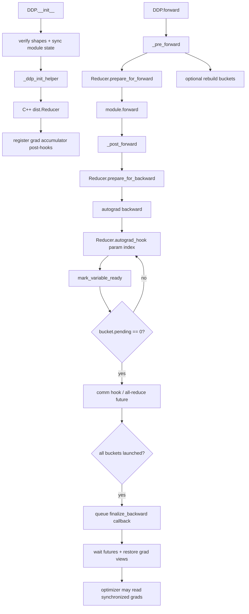
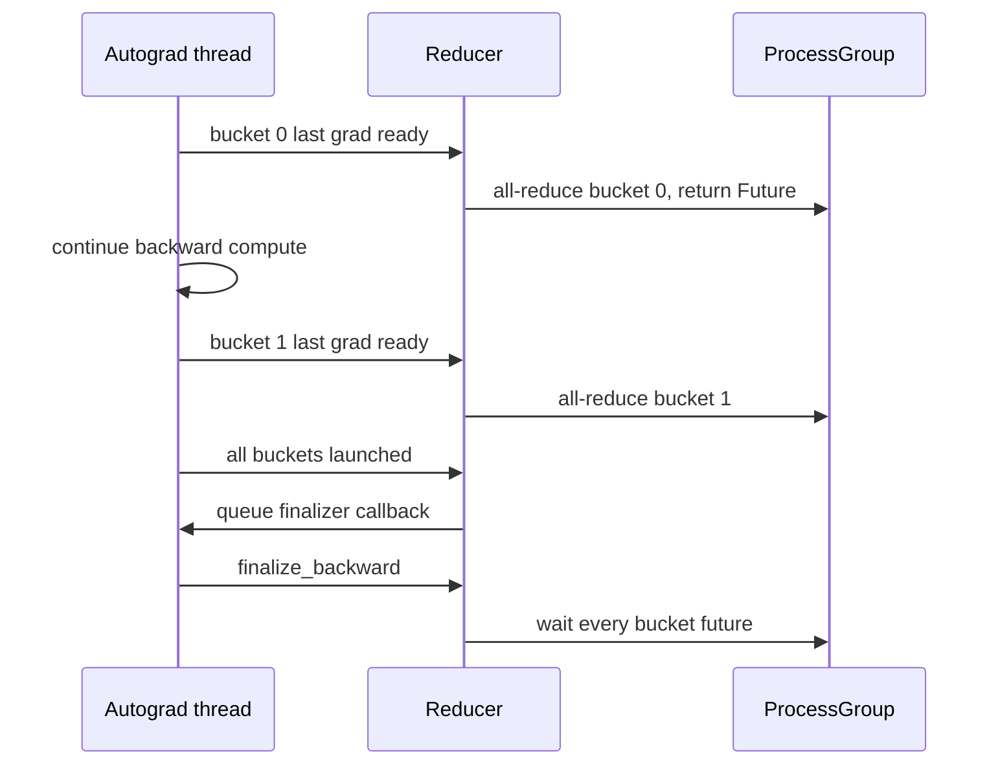

# PyTorch DDP 源码解剖：从 Python forward 到 C++ Reducer

DDP 的核心不是“在 backward 后调用一次 all-reduce”，而是一个嵌入 autograd 的 bucket 状态机：参数梯度逐个 ready，bucket 满足依赖后尽早发通信，最后一个 bucket ready 时向 autograd engine 排入 finalizer。这样 backward compute 才有机会与前面 bucket 的通信重叠。

本文固定 PyTorch [`e11b512`](https://github.com/pytorch/pytorch/tree/e11b512fef37205cc3b83872eabd92c3cdf05a28)。若本机 wheel 不是该提交，源码 trace 与实际 profiler 名称可能不同。

## 1. 先给结论：一次 iteration 的真实调用链



四条边界不能混在一起：

1. 构造时参数/缓冲区同步；
2. forward 前后准备 Reducer 的 iteration 状态；
3. autograd 中逐 bucket 发通信；
4. backward finalizer 等通信并恢复梯度。

## 2. 构造：DDP 复制模型，不切模型

用户在每个 rank 上先构造完整 module，再调用 `DistributedDataParallel(module, ...)`。[`DDP.__init__`](https://github.com/pytorch/pytorch/blob/e11b512fef37205cc3b83872eabd92c3cdf05a28/torch/nn/parallel/distributed.py#L816-L1084) 选择通信域：

```text
显式 process_group ─┐
                    ├→ self.process_group
1D device_mesh ─────┤
两者都没给 → default group
```

固定实现拒绝同时指定 `process_group` 和 `device_mesh`，而且 DDP 这里只接受 1D mesh。若传入从 root mesh 切出的 1D DP mesh，源码在 [854–883 行](https://github.com/pytorch/pytorch/blob/e11b512fef37205cc3b83872eabd92c3cdf05a28/torch/nn/parallel/distributed.py#L854-L883) 还会做 DDP+TP 的预处理；这说明“DDP 永远只用 world group”并不准确。

### `init_sync=True` 做了两件不同的事

[`1058–1084`](https://github.com/pytorch/pytorch/blob/e11b512fef37205cc3b83872eabd92c3cdf05a28/torch/nn/parallel/distributed.py#L1058-L1084)：

1. `_verify_param_shape_across_processes()`：验证各 rank 参数 shape 相容；
2. `_sync_module_states()`：从 source rank 广播参数和可选 buffers，使初值一致；
3. 然后才 `_ddp_init_helper()` 构造 Reducer。

这不是每 step 的 gradient all-reduce。禁用 `init_sync` 代表你自己保证初值/shape，不代表 DDP 从此不通信。

### 状态账本

令参数总数为 $P$，参数/梯度每元素字节分别为 $b_p,b_g$，优化器额外状态为 $b_o$。忽略 activation/bucket/allocator 时，每 rank 的 persistent model state 近似：

$$
M_{DDP}\approx P(b_p+b_g+b_o)
$$

world size 增大不会把这部分除以 world size，因为每个 rank 的 module、grad 和普通 optimizer state 都完整。额外峰值还包括 gradient buckets、通信临时区、mixed precision 副本、activation 与 allocator fragmentation；`gradient_as_bucket_view=True` 可减少 grad 与 bucket 的重复 storage，但不会把逻辑 gradient 分片。

## 3. Python 如何构造 C++ Reducer

[`_ddp_init_helper()`](https://github.com/pytorch/pytorch/blob/e11b512fef37205cc3b83872eabd92c3cdf05a28/torch/nn/parallel/distributed.py#L1374-L1459) 先根据 dtype/device/sparse 属性和 bucket capacity 计算 `bucket_indices`，再反转 bucket 列表传给 `dist.Reducer`。

反转不是随意的：通常 forward 按参数定义顺序使用，backward 的梯度到达顺序近似相反。源码 [1434–1439 行](https://github.com/pytorch/pytorch/blob/e11b512fef37205cc3b83872eabd92c3cdf05a28/torch/nn/parallel/distributed.py#L1434-L1439) 明确写出这个近似。

但构造时并不知道动态 backward 的真实 ready order。固定实现允许首轮后按观测顺序 rebuild bucket；[`_pre_forward`](https://github.com/pytorch/pytorch/blob/e11b512fef37205cc3b83872eabd92c3cdf05a28/torch/nn/parallel/distributed.py#L1769-L1777) 在 forward 峰值之前尝试 rebuild，以降低新旧 bucket 同时存在的峰值。

### Reducer 构造函数做什么

C++ [`Reducer::Reducer`](https://github.com/pytorch/pytorch/blob/e11b512fef37205cc3b83872eabd92c3cdf05a28/torch/csrc/distributed/c10d/reducer.cpp#L87-L249) 的关键状态：

| 状态 | 含义 |
| --- | --- |
| `params_` | 由 DDP 管理的参数引用 |
| `buckets_` | 扁平 gradient buckets 及 views/futures |
| `variable_locators_` | parameter index → bucket/intra-bucket index |
| `next_bucket_` | 必须按一致顺序启动的下一个 bucket |
| `expect_autograd_hooks_` | 当前 backward 是否应该触发 reduction |
| `require_finalize_` | 已有梯度 ready，因此本轮必须 finalize |
| `unused_parameters_` / local-used map | 动态图未使用参数协同 |

它在 [164–169 行](https://github.com/pytorch/pytorch/blob/e11b512fef37205cc3b83872eabd92c3cdf05a28/torch/csrc/distributed/c10d/reducer.cpp#L164-L169) 初始化 buckets，然后对每个叶子参数取得 gradient accumulator，在 [171–235 行](https://github.com/pytorch/pytorch/blob/e11b512fef37205cc3b83872eabd92c3cdf05a28/torch/csrc/distributed/c10d/reducer.cpp#L171-L235) 注册 post-hook：

```text
parameter leaf
  → AccumulateGrad node
  → DDP LambdaPostHook(variable_index)
  → Reducer::autograd_hook(variable_index)
```

因此 DDP 不需要用户在 `loss.backward()` 后手写同步；hook 已位于 autograd graph 的梯度生产边界。

## 4. Forward 为什么也要进入 DDP wrapper

[`DDP.forward`](https://github.com/pytorch/pytorch/blob/e11b512fef37205cc3b83872eabd92c3cdf05a28/torch/nn/parallel/distributed.py#L1884-L1892) 不是简单代理 module：

### `_pre_forward`

[`1744–1813`](https://github.com/pytorch/pytorch/blob/e11b512fef37205cc3b83872eabd92c3cdf05a28/torch/nn/parallel/distributed.py#L1744-L1813) 可能：

- lazy init；
- 调 `reducer.prepare_for_forward()`；
- 处理 join context；
- rebuild buckets；
- 同步 buffers；
- 搬运/转换输入。

### `_post_forward`

[`1815–1882`](https://github.com/pytorch/pytorch/blob/e11b512fef37205cc3b83872eabd92c3cdf05a28/torch/nn/parallel/distributed.py#L1815-L1882) 调 `prepare_for_backward()`。若 `find_unused_parameters=True`，它从 forward outputs 遍历 autograd graph，以发现本轮不会触发 hook 的参数；否则传空列表。

这解释了两个常见错误：

```python
# 错：绕开 wrapper，Reducer 没看到正常 forward 边界
loss = ddp.module(x).sum()

# 对：始终通过 DDP wrapper
loss = ddp(x).sum()
```

## 5. Backward：从一份 grad 到一个 ready bucket

梯度 accumulator 执行后进入 [`Reducer::autograd_hook`](https://github.com/pytorch/pytorch/blob/e11b512fef37205cc3b83872eabd92c3cdf05a28/torch/csrc/distributed/c10d/reducer.cpp#L668-L753)。它的主要分支：

1. 在需要时标记本 rank 该参数已使用；
2. `no_sync` 期间 `expect_autograd_hooks_` 为 false，直接返回；
3. 处理 unused params；
4. 收集真实 gradient ready order 供 bucket rebuild；
5. 调 `mark_variable_ready(index)`。

[`mark_variable_ready`](https://github.com/pytorch/pytorch/blob/e11b512fef37205cc3b83872eabd92c3cdf05a28/torch/csrc/distributed/c10d/reducer.cpp#L895-L961) 完成局部状态转换：

```text
param grad ready
  → 检查本轮没有被标记两次
  → 找 variable_locators_[index]
  → 将 grad copy/view 到 bucket，应用 division factor
  → bucket.pending -= 1
  → 若 pending == 0，mark_bucket_ready()
```

`bucket.pending == 0` 只说明这个 bucket 的所有本地 gradients 都就绪；它还必须遵守所有 ranks 相同的 bucket collective 顺序。否则 rank A 的第一个 all-reduce 可能匹配 rank B 的另一 tensor，轻则 shape error，重则 hang 或静默错误。

## 6. 通信：comm hook 返回 Future

默认 [`run_comm_hook`](https://github.com/pytorch/pytorch/blob/e11b512fef37205cc3b83872eabd92c3cdf05a28/torch/csrc/distributed/c10d/reducer.cpp#L963-L975) 选择 `_AllReduceBySumCommHook`；用户注册 comm hook 时改由自定义实现返回 future。

关键不是函数名叫 all-reduce，而是它是异步 future：



ring all-reduce 对每 rank 的理想链路 payload 约为：

$$
V_{ring}\approx 2\frac{N-1}{N}G
$$

其中 $G$ 是全部 dense gradient bytes，$N$ 是 group size；这是算法 payload 量，不是 step 时间，也不包含协议、拓扑、延迟和可能的 unused-map collective。bucket size 主要影响启动延迟、重叠窗口和临时内存，不改变 $G$ 的数量级。

## 7. 最终同步点：`finalize_backward`

最后一个 bucket 发出后，[`mark_variable_ready`](https://github.com/pytorch/pytorch/blob/e11b512fef37205cc3b83872eabd92c3cdf05a28/torch/csrc/distributed/c10d/reducer.cpp#L939-L959) 向 autograd engine 排 callback。真正的完成逻辑在 [`Reducer::finalize_backward`](https://github.com/pytorch/pytorch/blob/e11b512fef37205cc3b83872eabd92c3cdf05a28/torch/csrc/distributed/c10d/reducer.cpp#L1730-L1824)：

- 关闭本轮 `expect_autograd_hooks_`；
- 对每个 bucket 等 `future_work`；
- 解析 comm hook 结果；
- 为 dense bucket 重建 output views；
- `finalize_bucket_dense()` 使参数 `.grad` 获得最终结果；
- 等用户安装的其他 futures；
- 必要时等 local-used map reduction；
- 清理本轮 accounting。

`loss.backward()` 返回后，普通用户才能假设 DDP gradients 已具备 optimizer step 所需语义。不要通过插入全局 `barrier()` 来“修复”错误同步；barrier 只会掩盖或移动问题，不会满足 Reducer invariant。

## 8. `no_sync` 的精确语义

[`DDP.no_sync`](https://github.com/pytorch/pytorch/blob/e11b512fef37205cc3b83872eabd92c3cdf05a28/torch/nn/parallel/distributed.py#L1658-L1685) 临时将 `require_backward_grad_sync=False`。因此 context 必须包住 **forward 和 backward**：

```python
for i, (x, y) in enumerate(microbatches):
    sync_now = i == len(microbatches) - 1
    context = nullcontext() if sync_now else ddp.no_sync()
    with context:
        loss = criterion(ddp(x), y) / len(microbatches)
        loss.backward()
optimizer.step()
```

最后一次 synchronized backward 看到累积的 `.grad` 并进行通信。还必须自己确保 loss scaling/global batch 语义正确；`no_sync` 只控制通信，不自动除 accumulation steps。

## 9. `find_unused_parameters` 与 static graph

| 配置 | Reducer 必须解决的问题 | 代价/约束 |
| --- | --- | --- |
| 默认 | 假设受管参数都会产生梯度 | 动态分支丢参数可能报 unfinished reduction |
| `find_unused_parameters=True` | 从 outputs 遍历 graph，提前把 unused 参数 ready | 每轮 graph traversal 与 used-map 协同 |
| `static_graph=True` | 利用首轮 hook 计数保持固定图 | 后续参数使用集合/触发次数不能变化 |
| `skip_all_reduce_unused_params=True` | 各 rank 都跳过同一批 unused params | unused 集合跨 rank/iteration 必须一致，否则 desync |

固定实现的错误消息是状态机 invariant 的线索，不要一遇到 unused parameter 就机械打开所有兼容开关。

## 10. 两个 rank 的手工 trace

假设 module 定义 `Linear1 → Linear2 → Linear3`，每层参数各进入一个 bucket。典型 backward ready 顺序：

| 时间 | rank 0 | rank 1 | collective 状态 |
| --- | --- | --- | --- |
| t0 | Linear3 grad ready | Linear3 grad ready | bucket 0 all-reduce 启动 |
| t1 | 计算 Linear2 backward | 计算 Linear2 backward | bucket 0 网络进行中 |
| t2 | Linear2 grad ready | Linear2 grad ready | bucket 1 启动 |
| t3 | Linear1 grad ready | rank 1 仍在计算 | rank 0 必须等匹配参与者 |
| t4 | finalizer queued | Linear1 grad ready | bucket 2 启动 |
| t5 | wait futures | finalizer queued | 完成并落回 grad views |

straggler 不一定让程序 hang；同步 collective 会把它变成其他 ranks 的等待。真正 hang 常来自某 rank 根本没走同一 collective 序列、shape/group 不一致或更早异常。

## 11. 调试矩阵：症状对应哪段源码

| 现象 | 首查状态 | 源码断点 |
| --- | --- | --- |
| 初始化 hang | 所有 ranks 是否构造 DDP、shape/group 是否一致 | `__init__` 的 verify/sync state |
| 第二轮提示上一轮未完成 reduction | 某参数没触发 hook或某输出未进 loss | `prepare_for_backward`、`autograd_hook`、`require_finalize_` |
| `no_sync` 仍通信 | forward 是否放在 context 内 | `_pre_forward/_post_forward` |
| 通信没有 overlap | bucket 太晚 ready、单 bucket、计算太短、timeline 误判 | `mark_bucket_ready` 与 profiler |
| 开 `find_unused` 后更慢 | graph traversal/used-map communication | `_post_forward` 与 local-used map |
| 不同 rank 梯度不同 | 自定义 comm hook、不同 group、optimizer 提前读 grad | `run_comm_hook`、`finalize_backward` |
| 偶发 collective mismatch | 动态控制流导致各 rank bucket/其他 collective 次序不同 | actual ready order 与 group trace |

## 12. 源码实验

运行[源码驱动实践](../practice/source-labs)中的 CPU/Gloo DDP 脚本。至少完成四个 case：

1. 正常两 rank，比较 step 后参数 checksum；
2. 两个 microbatch，第一个 `no_sync`，确认 update 等价；
3. 一个 rank 不使用第二分支，观察默认配置失败，再用正确 unused 策略；
4. 调小 bucket cap，在 profiler 中观察 bucket 数变化，但不要把 CPU/Gloo 延迟外推为 GPU/NCCL 吞吐。

## 通关标准

关闭本文后，你应能准确复述：

```text
DDP constructor
→ parameter verification/state broadcast
→ bucket assignment
→ Reducer registers AccumulateGrad post-hooks
→ forward prepares reducer/backward graph
→ each grad hook marks parameter ready
→ ready bucket launches comm future in common order
→ final autograd callback waits futures
→ synchronized bucket results become parameter grads
→ optimizer step
```

下一课把同样的方法用于[FSDP2 的 unshard/reshard/reduce-scatter 状态机](./fsdp2-source)。
