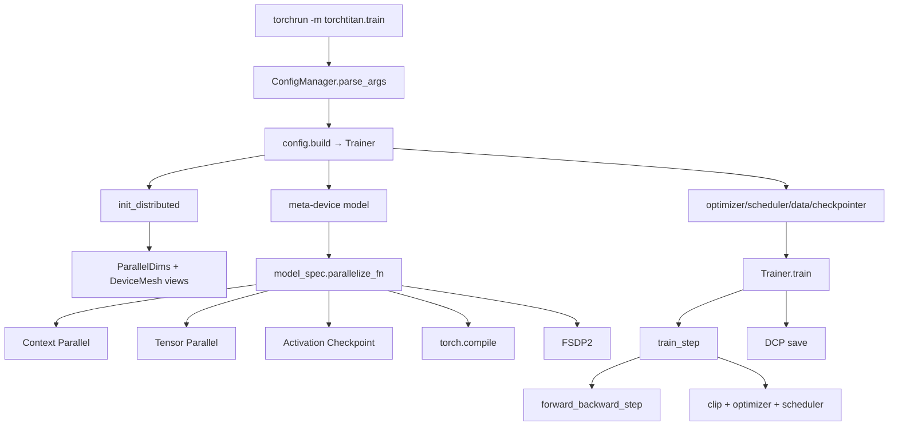
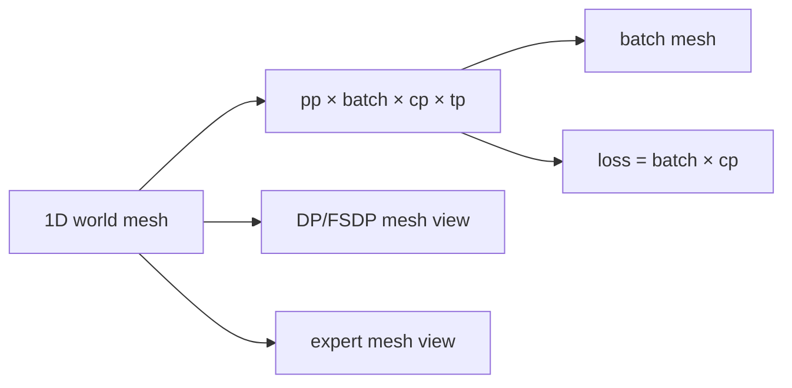
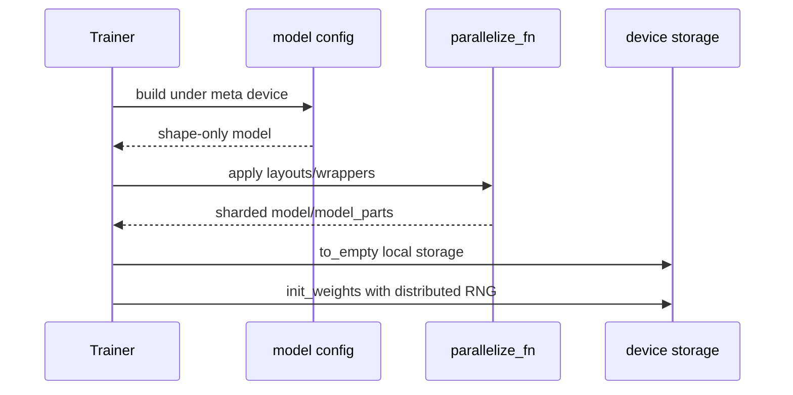
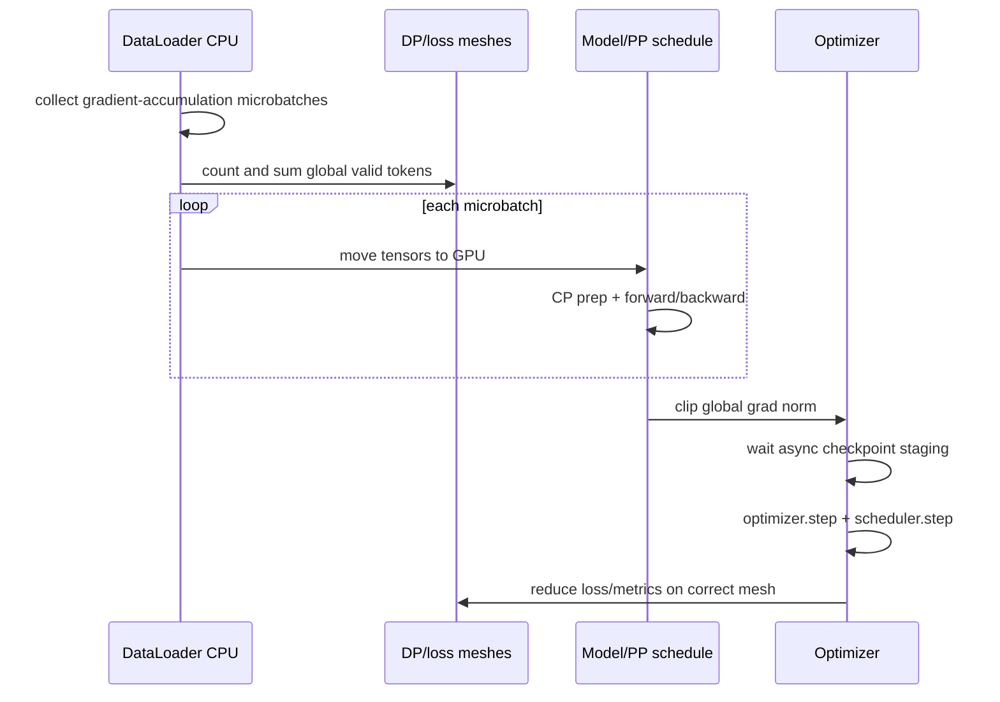

# TorchTitan 源码主线：Config、Mesh、Parallelize 与 Train Step

TorchTitan 很适合学习 PyTorch 原生分布式，因为主线没有藏在大型 Trainer 生态里：**配置构建 Trainer，Trainer 初始化 mesh 和 meta model，model-specific function 组合 CP/TP/AC/compile/FSDP，训练循环再处理 token normalization、forward/backward、optimizer 与 DCP。**

本文固定官方提交 [`fec3e19`](https://github.com/pytorch/torchtitan/tree/fec3e196a4ceb87bfc87fb4f1a36a538d7e98ee4)。先把完整源码放到本地，后续所有 `rg`、断点和配置核验都在这个 detached commit 上做：

```bash
git clone --filter=blob:none https://github.com/pytorch/torchtitan.git
git -C torchtitan switch --detach fec3e196a4ceb87bfc87fb4f1a36a538d7e98ee4
git -C torchtitan rev-parse HEAD
```

依赖、启动器和模型资产以该提交的 `README.md`、`pyproject.toml`、`run_train.sh` 与 `docs/` 为准；不要把任意 PyTorch nightly 与固定源码拼接后仍称为同版本复现。

## 一张总图



固定入口是 [`torchtitan/train.py:17–75`](https://github.com/pytorch/torchtitan/blob/fec3e196a4ceb87bfc87fb4f1a36a538d7e98ee4/torchtitan/train.py#L17-L75)，主体是 [`Trainer`](https://github.com/pytorch/torchtitan/blob/fec3e196a4ceb87bfc87fb4f1a36a538d7e98ee4/torchtitan/trainer.py#L59-L224)。

## 1. `main()` 只做生命周期

`main()` 的职责很克制：

1. 初始化日志；
2. 解析 module/config/CLI overrides；
3. 初始化 structured logger；
4. `config.build()` 构造 Trainer；
5. 创建 seed checkpoint，或 `trainer.train()`；
6. 正常或异常路径都 close components；正常路径 destroy process group。

它不实现 FSDP/TP，也不逐 rank 手写 RPC。`torchrun` 已为每个 rank 创建相同 Python program；每个进程都运行 `main()`，再从环境取得 `RANK/WORLD_SIZE/LOCAL_RANK`。

固定代码还有两个启动条件容易被教程漏掉：`comm.mode == "local_tensor"` 时 [47–49 行](https://github.com/pytorch/torchtitan/blob/fec3e196a4ceb87bfc87fb4f1a36a538d7e98ee4/torchtitan/train.py#L43-L51) 明确跳过真实训练；创建 seed checkpoint 时 [53–62 行](https://github.com/pytorch/torchtitan/blob/fec3e196a4ceb87bfc87fb4f1a36a538d7e98ee4/torchtitan/train.py#L53-L62) 要求 `WORLD_SIZE=1` 且 checkpoint 已启用。看到程序正常退出，先确认它没有走“只构图不训练”的分支。

## 2. Config 是可构造对象树

[`Trainer.Config`](https://github.com/pytorch/torchtitan/blob/fec3e196a4ceb87bfc87fb4f1a36a538d7e98ee4/torchtitan/trainer.py#L59-L190) 包含 model spec、training、parallelism、loss、optimizer、data、checkpoint、metrics 等可替换组件配置。model registry 提供如 [`llama3_debugmodel()`](https://github.com/pytorch/torchtitan/blob/fec3e196a4ceb87bfc87fb4f1a36a538d7e98ee4/torchtitan/models/llama3/config_registry.py#L27) 的基线，再由 CLI override。

```text
--module llama3 --config llama3_debugmodel
  → registry function returns Trainer.Config
  → CLI overrides nested fields
  → validate Config.__post_init__
  → config.build() calls Trainer(config)
```

排错第一断点不是 model forward，而是 config manager 输出的最终对象。

`Config.__post_init__` 也编码了固定提交的组合限制，例如 PP 与 SPMD typechecking、FlexAttention+selective AC+SPMD typechecking、memory-budget AC 与 compile 的依赖，见 [`109–149`](https://github.com/pytorch/torchtitan/blob/fec3e196a4ceb87bfc87fb4f1a36a538d7e98ee4/torchtitan/trainer.py#L109-L149)。配置在这里被拒绝属于设计约束，不应删断言强行启动。

## 3. `ParallelDims` 把整数变成 mesh 语义

[`ParallelDims`](https://github.com/pytorch/torchtitan/blob/fec3e196a4ceb87bfc87fb4f1a36a538d7e98ee4/torchtitan/distributed/parallel_dims.py#L131-L184) 保存 `dp_replicate/dp_shard/cp/tp/pp/ep`，并验证 dense world product。`dp_shard=-1` 表示用剩余 world 自动推导，不表示关闭 FSDP：

$$
world=dp_{replicate}\times dp_{shard}\times cp\times tp\times pp
$$

注意固定 assert **没有再乘 `ep`**。EP 不是额外创造一批 ranks，而是把 dense 网格中的 `fsdp×tp` ranks 重新解释为 sparse `efsdp×ep`：[`build_mesh`](https://github.com/pytorch/torchtitan/blob/fec3e196a4ceb87bfc87fb4f1a36a538d7e98ee4/torchtitan/distributed/parallel_dims.py#L266-L357) 计算 `fsdp=dp_shard×cp`、`efsdp=fsdp×tp/ep`。因此 `ep` 必须能合法重排该因子，不能把所有 degree 机械相乘。

`build_mesh()` 不只产生一张网格，而产生多个语义视图：

| mesh/view | 语义 |
| --- | --- |
| `batch` | data loader 的独立 sample replicas，含 DP replicate×shard |
| `loss` | global loss/token count 汇总，含 batch×CP |
| `fsdp` / DP axes | parameter state sharding/replication |
| `tp` | layer tensor layouts |
| `cp` | context chunks |
| `pp` | pipeline stages |
| `ep` / `efsdp` | experts 与 expert state sharding |



同一组 devices 可有多个 view；mesh name/axis 与 tensor dimension 必须区分。

### 8 ranks 的具体例子

取 `dp_replicate=1, dp_shard=2, cp=1, tp=2, pp=2, ep=2`：

```text
dense product = 1 × 2 × 1 × 2 × 2 = 8
batch degree  = 2
loss degree   = batch × cp = 2
fsdp degree   = dp_shard × cp = 2
efsdp degree  = fsdp × tp / ep = 2
sparse mesh   = pp(2) × dp_replicate(1) × efsdp(2) × ep(2) = 8
```

TP group合作计算 dense layers；EP group用同一批 ranks dispatch sparse experts。两张 view 描述相同 world 的不同通信关系，而非 16 张卡。

## 4. model 先在 meta device 构造

Trainer 在 [`280–310`](https://github.com/pytorch/torchtitan/blob/fec3e196a4ceb87bfc87fb4f1a36a538d7e98ee4/torchtitan/trainer.py#L280-L310) 的 `torch.device("meta")` 下 build model，只创建 shape/metadata，不立刻为完整模型分配 storage。随后才应用并行，再 `to_empty()` 到 CPU/GPU 并按 DTensor layout 初始化。



这解释了为什么“先单卡初始化完整权重再切”与“先定义 shards 再各 rank 初始化”随机结果可能不同，也解释 seed checkpoint 的用途。

## 5. Llama 并行应用顺序

固定 [`parallelize_llama()`](https://github.com/pytorch/torchtitan/blob/fec3e196a4ceb87bfc87fb4f1a36a538d7e98ee4/torchtitan/models/llama3/parallelize.py#L26-L91) 的关键顺序：

```text
CP forward transform
→ TP/model layout transform
→ optional async TP
→ activation checkpointing
→ torch.compile per block
→ FSDP2 bottom-up sharding
```

顺序属于 correctness contract。AC 要包住正确 forward；compile 在 AC 后、FSDP 前；FSDP 最后接收已经 TP/CP 处理的 modules/params。随意交换 wrapper 顺序可能不报错，却改变 trace、hook 或 layout。

固定提交还会在 shard degree=1 时调用 `apply_fsdp_to_decoder`，因为 FSDP wrapper 仍用于 mixed-precision policy，[`69–90`](https://github.com/pytorch/torchtitan/blob/fec3e196a4ceb87bfc87fb4f1a36a538d7e98ee4/torchtitan/models/llama3/parallelize.py#L69-L90) 有明确注释。因此 profiler 看见 FSDP 名称不自动证明参数被多卡分片；必须打印实际 mesh size/placements。

## 6. FSDP2 为何 bottom-up

[`apply_fsdp_to_decoder()`](https://github.com/pytorch/torchtitan/blob/fec3e196a4ceb87bfc87fb4f1a36a538d7e98ee4/torchtitan/distributed/fsdp.py#L81-L210) 处理 embedding/head/tied weights，再逐 block `fully_shard`，最后覆盖 root/剩余参数。它还设置 mixed precision、CPU offload、reshard policy 与 MoE expert 特殊 placement。weight tying 时 embedding/head 要在同一 group，避免同一参数重复 all-gather；MoE 参数可通过 per-param mesh 在 dense DP 与 expert-DP 之间分组。

PP 开启时 default 通常不在 forward 后立即 reshard，避免每个 pipeline microbatch 重复非重叠 all-gather；非 PP 默认倾向 reshard 以省 HBM。这里是策略，不能脱离 profile 称为普遍最优。

这不是推测：[`get_fsdp_reshard_after_forward_policy`](https://github.com/pytorch/torchtitan/blob/fec3e196a4ceb87bfc87fb4f1a36a538d7e98ee4/torchtitan/distributed/fsdp.py#L54-L78) 将 `default` 解析成 `not pp_enabled`。同文件 [`disable_fsdp_gradient_division`](https://github.com/pytorch/torchtitan/blob/fec3e196a4ceb87bfc87fb4f1a36a538d7e98ee4/torchtitan/distributed/fsdp.py#L27-L41) 把 FSDP divide factor 设为 1，因为 Trainer 自己按 global valid tokens 缩放 loss。

## 7. PP 是另一条构造分支

若 PP>1，Trainer 调用 `model_spec.pipelining_fn`，返回：

```text
pp_schedule
model_parts owned by this rank
pp_has_first_stage
pp_has_last_stage
```

原始完整 model 之后不再使用。固定 helper 入口在 [`distributed/pipeline_parallel.py`](https://github.com/pytorch/torchtitan/blob/fec3e196a4ceb87bfc87fb4f1a36a538d7e98ee4/torchtitan/distributed/pipeline_parallel.py#L64)。每个 local stage 仍会应用 model-specific parallelize function，所以 PP 与 TP/FSDP 不是两套互斥 Trainer。

## 8. 初始化剩余组件

parallelized model 就绪后，Trainer 依次建立：

- optimizer container 与 LR schedulers；
- tokenizer 和按 `batch_mesh` 分片的 dataloader；
- `CheckpointManager`，注册 model/optimizer/scheduler/dataloader/train state；
- SPMD train context；
- optional validator/profiler/metrics。

checkpoint 必须在这些 stateful objects 建成后 load，才能恢复的不只是模型。

## 9. `train()` 的外循环

固定 [`Trainer.train()`](https://github.com/pytorch/torchtitan/blob/fec3e196a4ceb87bfc87fb4f1a36a538d7e98ee4/torchtitan/trainer.py#L879) 先 load checkpoint，再循环：


第一步后缩短 process group timeout，因为 lazy init/compile 通常已完成；排错时要知道首 step 与稳态 timeout/性能不能直接比较。

## 10. `train_step()` 的 token-correct 路径

[`train_step()`](https://github.com/pytorch/torchtitan/blob/fec3e196a4ceb87bfc87fb4f1a36a538d7e98ee4/torchtitan/trainer.py#L758-L876) 的顺序值得逐行读：



它先拿齐本 update 的 CPU microbatches并统计有效 tokens，再用 global denominator 缩放各 local loss。FSDP 自动 gradient divide 被显式处理/关闭的原因也在这里：框架自己按 token 语义规范化，不能再无条件除 DP world。

batch 数学在 [`349–368`](https://github.com/pytorch/torchtitan/blob/fec3e196a4ceb87bfc87fb4f1a36a538d7e98ee4/torchtitan/trainer.py#L349-L368)：

$$
GAS=\frac{global\_batch}{local\_batch\times batch\_degree}
$$

`global_batch` 必须整除分母。TP/PP ranks 合作处理同一 batch，不进入 `batch_degree`；CP 切同一样本 tokens，也不是独立样本 replica。混淆这些 axes 会让代码能跑、有效 batch 却改变。

## 11. `forward_backward_step()` 的两条路径

- PP：调用 `pp_schedule.step()`；只有首 stage给 inputs，末 stage给 labels/收集 losses；
- 非 PP：普通 model forward → loss → `backward()`；FSDP/TP/CP hooks 和 DTensor dispatch 在内部触发。

固定实现见 [`697–756`](https://github.com/pytorch/torchtitan/blob/fec3e196a4ceb87bfc87fb4f1a36a538d7e98ee4/torchtitan/trainer.py#L697-L756)。中间 PP stage 的本地 `loss` 是 sentinel `-1`，不能拿所有 ranks 的 loss 日志做普通平均；真正 loss 由 last stage 的 microbatch losses 汇总并通过正确可见性路径记录。

CP input 在 [`prepare_context_parallel_input`](https://github.com/pytorch/torchtitan/blob/fec3e196a4ceb87bfc87fb4f1a36a538d7e98ee4/torchtitan/distributed/context_parallel.py) 中按 load-balancer 切 sequence；`ntokens_seen` 在 CP sharding 后计数，避免把同一 token 重复算作多个样本。

## 12. Checkpoint 的时序

optimizer step 前 `maybe_wait_for_staging()` 防止正在异步 staging 的旧 state 与即将修改的新参数竞态；step 后 `save()` 可以同步或异步写入。关闭 Trainer 时还必须 drain/close checkpointer。

[`CheckpointManager`](https://github.com/pytorch/torchtitan/blob/fec3e196a4ceb87bfc87fb4f1a36a538d7e98ee4/torchtitan/components/checkpoint.py#L176-L220) 专门说明 PP 下每 stage optimizer 的整数 param-group index 会碰撞，因此 container 把 state flatten 成 FQN-keyed dict；复杂 schedule 的多个 model chunks 也先合并 logical state。构造函数 [`456–535`](https://github.com/pytorch/torchtitan/blob/fec3e196a4ceb87bfc87fb4f1a36a538d7e98ee4/torchtitan/components/checkpoint.py#L456-L535) 注册 model/optimizer/dataloader/scheduler/train state，并为 async 模式建立独立 Gloo group。只保存 model weights 不能称为可恢复训练 checkpoint。

## 13. 一次 update 的逐对象 trace

| 顺序 | 对象/函数 | 当前 rank 必须具备的条件 | 关键副作用 |
| ---: | --- | --- | --- |
| 1 | `train.main` | `RANK/WORLD_SIZE/LOCAL_RANK` 一致可用 | parse config，构造 Trainer |
| 2 | `Trainer.init_distributed` | local device 已 set | default PG + `ParallelDims` + meshes |
| 3 | meta model build | model registry/spec 有效 | shape-only module tree |
| 4 | PP split 或 `parallelize_fn` | degrees/seq divisibility通过 | local stages、TP/CP layouts、FSDP groups |
| 5 | `to_empty/init_weights` | local placements 已确定 | 只分配本 rank 需要的 storage |
| 6 | optimizer build | sharding 已完成 | optimizer state绑定 local params |
| 7 | dataloader build | batch mesh rank/size 已确定 | DP replicas 读取不同 samples |
| 8 | checkpoint load | 所有 stateful objects 已注册 | model/optim/data/scheduler/step 恢复 |
| 9 | `train_step` collect CPU microbatches | 每 rank GAS 相同 | 统计 local valid tokens |
| 10 | `dist_sum` on batch mesh | DP ranks走相同 collective | global denominator |
| 11 | PP/non-PP fwd-bwd | 首/末 stage角色正确 | TP/CP/PP/FSDP communication |
| 12 | grad norm + optimizer | 所有 microbatches完成 | update local logical shards |
| 13 | checkpoint save | 旧 staging 已在 update 前等待 | 保存新 step 的一致 state |

## 14. 角色与启动条件

TorchTitan 所有 ranks 执行同一个 Trainer，但职责由 mesh coordinate 决定：

| 角色条件 | 本 rank 做什么 | 不做什么 |
| --- | --- | --- |
| DP/batch coordinate | 读取该 replica 的 sample shard | TP/CP peers 不重复读取独立样本 |
| PP first stage | 接收原始 model inputs | 不拥有末端 labels/loss head（除单 stage） |
| PP middle stage | 从上一 stage 收 activation，向下发送 | 不从 dataloader消费完整语义 inputs |
| PP last stage | 拥有 labels/loss，返回 microbatch losses | 无下一 stage activation send |
| TP coordinate | 持有 layer tensor shard并参加 TP collective | 不代表独立数据 replica |
| CP coordinate | 持有同一样本的 context slice | token count/loss不能重复计算 |
| EP coordinate | 接收路由到本地 experts 的 token | dense world product不额外乘 EP |

启动前至少满足：

- `world_size=dp_replicate×dp_shard×cp×tp×pp`；
- sequence length 可被 `tp` 的 sequence-parallel factor及 `2×cp` 约束整除，源码在 [`242–251`](https://github.com/pytorch/torchtitan/blob/fec3e196a4ceb87bfc87fb4f1a36a538d7e98ee4/torchtitan/trainer.py#L242-L251) 校验；
- model spec 提供所启用 PP/parallelize functions；
- global batch 整除 `local_batch×batch_degree`；
- model/tokenizer assets 与 model config 匹配；
- checkpoint format、state adapter 与目标 model/mesh受支持；
- 每 rank 使用项目声明的相同 PyTorch/CUDA/NCCL 环境。

## 15. 从源码反推三个常见故障

### 进程启动后立刻断言 world product

先把 resolved degrees 代入 [`ParallelDims._validate`](https://github.com/pytorch/torchtitan/blob/fec3e196a4ceb87bfc87fb4f1a36a538d7e98ee4/torchtitan/distributed/parallel_dims.py#L162-L184)。不要把 EP 再乘进去；再核对 `dp_shard=-1` 推导是否把剩余 ranks 全部消费。

### Loss 随 DP/CP 改变

追 [`train_step:769–851`](https://github.com/pytorch/torchtitan/blob/fec3e196a4ceb87bfc87fb4f1a36a538d7e98ee4/torchtitan/trainer.py#L769-L851)：local valid tokens、batch-mesh global tokens、loss-mesh metrics 是三个对象。若自定义 loss 已 local-average，再按 global denominator缩放，会重复除；若把 CP ranks 当独立 samples，会重复计数 token。

### Async checkpoint 偶发恢复错位

追 `maybe_wait_for_staging → optimizer.step → save`。异步 staging 捕获的旧 tensor storage 不能与正在 mutation 的 optimizer 并发。还要验证 dataloader snapshot interval按 `checkpoint.interval×GAS` 设置，源码在 [`498–509`](https://github.com/pytorch/torchtitan/blob/fec3e196a4ceb87bfc87fb4f1a36a538d7e98ee4/torchtitan/trainer.py#L498-L509)。

## 16. 必做源码实验

1. 只运行 config parser，保存完整 resolved config；构造一组 world-product 错误和一组 seq-divisibility 错误，记录源码拒绝点；
2. debug model 先单 rank 两步，再 FSDP2=2，两者保持 global tokens/update，使用 seed checkpoint 对齐初值；
3. 分别只开 TP=2、PP=2，打印每 rank coordinate、parameter global/local shape、first/last stage；
4. PP=2 下对 `fsdp_reshard_after_forward=default/always` 记录 all-gather 次数与 HBM，不同时改 microbatch；
5. checkpoint 保存后重启，核对 `step/ntokens_seen`、dataloader next sample、optimizer state与下一 loss；
6. 所有 GPU 结果保存环境 manifest；未在固定环境实际运行的命令标成“实验配方”，不能标成“验证通过”。

完整 42 天顺序见[源码学习计划](../guide/source-study-plan)，实验记录模板见[源码驱动实践](../practice/source-labs)。

## 17. 建议断点与打印

```text
train.py: config after parse
Trainer.__init__: ParallelDims and every mesh coordinate
after parallelize: parameter FQN/global/local shape/placement
train_step: local/global valid tokens
forward_backward_step: PP role or non-PP tensor layouts
before/after optimizer: logical parameter checksum
CheckpointManager.load/save: step and state keys
```

每个断点只在有限 ranks 打印，带 rank/host/mesh coordinate；否则 64 rank 日志会淹没最早异常。

## 通关标准

你应能沿 `main → config.build → Trainer.__init__ → ParallelDims → parallelize_llama → train → train_step → checkpoint` 解释一次 update；说明 meta init、多个 mesh views、并行 transform 顺序、global valid-token normalization 与 async checkpoint staging 的必要性。

下一课沿另一套设计阅读[Megatron 源码主线](./megatron-flow)。
