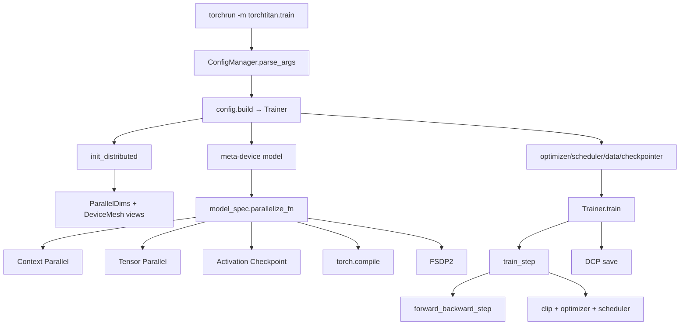
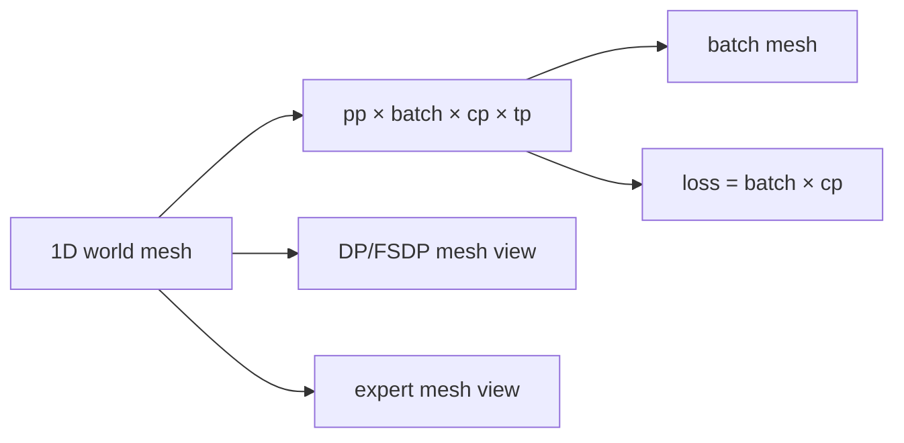
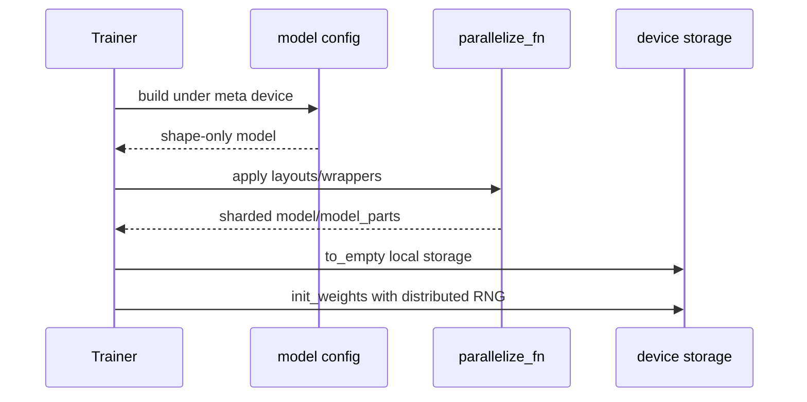
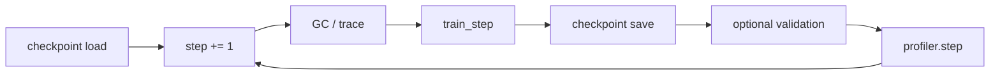
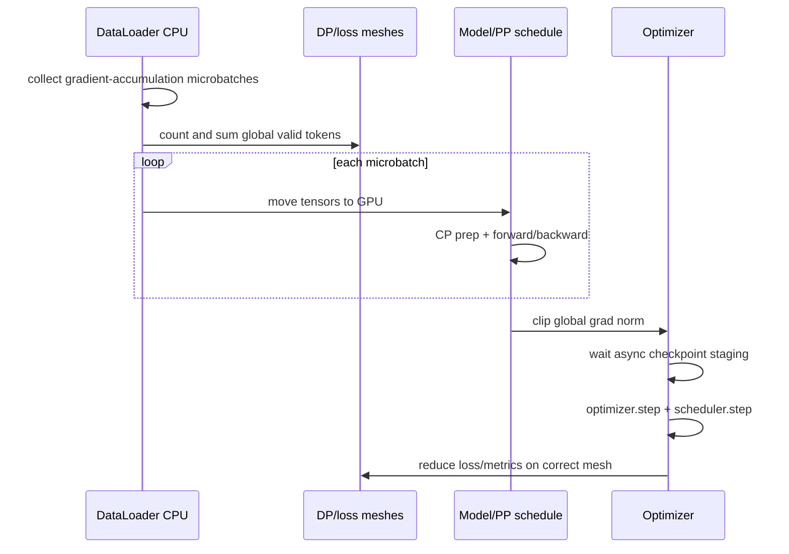

# TorchTitan 源码主线：Config、Mesh、Parallelize 与 Train Step

TorchTitan 很适合学习 PyTorch 原生分布式，因为主线没有藏在大型 Trainer 生态里：**配置构建 Trainer，Trainer 初始化 mesh 和 meta model，model-specific function 组合 CP/TP/AC/compile/FSDP，训练循环再处理 token normalization、forward/backward、optimizer 与 DCP。**

## 一张总图



固定入口是 [`torchtitan/train.py`](https://github.com/pytorch/torchtitan/blob/fec3e196a4ceb87bfc87fb4f1a36a538d7e98ee4/torchtitan/train.py#L17)，主体是 [`Trainer`](https://github.com/pytorch/torchtitan/blob/fec3e196a4ceb87bfc87fb4f1a36a538d7e98ee4/torchtitan/trainer.py#L46)。

## 1. `main()` 只做生命周期

`main()` 的职责很克制：

1. 初始化日志；
2. 解析 module/config/CLI overrides；
3. 初始化 structured logger；
4. `config.build()` 构造 Trainer；
5. 创建 seed checkpoint，或 `trainer.train()`；
6. close components 并 destroy process group。

它不实现 FSDP/TP，也不逐 rank 手写 RPC。`torchrun` 已为每个 rank 创建相同 Python program；每个进程都运行 `main()`，再从环境取得 `RANK/WORLD_SIZE/LOCAL_RANK`。

## 2. Config 是可构造对象树

[`Trainer.Config`](https://github.com/pytorch/torchtitan/blob/fec3e196a4ceb87bfc87fb4f1a36a538d7e98ee4/torchtitan/trainer.py#L48) 包含 model spec、training、parallelism、loss、optimizer、data、checkpoint、metrics 等可替换组件配置。model registry 提供如 [`llama3_debugmodel()`](https://github.com/pytorch/torchtitan/blob/fec3e196a4ceb87bfc87fb4f1a36a538d7e98ee4/torchtitan/models/llama3/config_registry.py#L27) 的基线，再由 CLI override。

```text
--module llama3 --config llama3_debugmodel
  → registry function returns Trainer.Config
  → CLI overrides nested fields
  → validate Config.__post_init__
  → config.build() calls Trainer(config)
```

排错第一断点不是 model forward，而是 config manager 输出的最终对象。

## 3. `ParallelDims` 把整数变成 mesh 语义

[`ParallelDims`](https://github.com/pytorch/torchtitan/blob/fec3e196a4ceb87bfc87fb4f1a36a538d7e98ee4/torchtitan/distributed/parallel_dims.py#L131) 保存 `dp_replicate/dp_shard/cp/tp/pp/ep`，并验证 dense world product。`dp_shard=-1` 表示用剩余 world 自动推导，不表示关闭 FSDP。

`build_mesh()` 不只产生一张网格，而产生多个语义视图：

| mesh/view | 语义 |
| --- | --- |
| `batch` | data loader 的独立 sample replicas，含 DP replicate×shard |
| `loss` | global loss/token count 汇总，含 batch×CP |
| `fsdp` / DP axes | parameter state sharding/replication |
| `tp` | layer tensor layouts |
| `cp` | context chunks |
| `pp` | pipeline stages |
| `ep` / `efsdp` | experts 与 expert state sharding |



同一组 devices 可有多个 view；mesh name/axis 与 tensor dimension 必须区分。

## 4. model 先在 meta device 构造

Trainer 在 `torch.device("meta")` 下 build model，只创建 shape/metadata，不立刻为完整模型分配 storage。随后才应用并行，再 `to_empty()` 到 CPU/GPU 并按 DTensor layout 初始化。



这解释了为什么“先单卡初始化完整权重再切”与“先定义 shards 再各 rank 初始化”随机结果可能不同，也解释 seed checkpoint 的用途。

## 5. Llama 并行应用顺序

固定 [`parallelize_llama()`](https://github.com/pytorch/torchtitan/blob/fec3e196a4ceb87bfc87fb4f1a36a538d7e98ee4/torchtitan/models/llama3/parallelize.py#L26) 的关键顺序：

```text
CP forward transform
→ TP/model layout transform
→ optional async TP
→ activation checkpointing
→ torch.compile per block
→ FSDP2 bottom-up sharding
```

顺序属于 correctness contract。AC 要包住正确 forward；compile 在 AC 后、FSDP 前；FSDP 最后接收已经 TP/CP 处理的 modules/params。随意交换 wrapper 顺序可能不报错，却改变 trace、hook 或 layout。

## 6. FSDP2 为何 bottom-up

[`apply_fsdp_to_decoder()`](https://github.com/pytorch/torchtitan/blob/fec3e196a4ceb87bfc87fb4f1a36a538d7e98ee4/torchtitan/distributed/fsdp.py#L81) 处理 embedding/head/tied weights，再逐 block `fully_shard`，最后覆盖 root/剩余参数。它还设置 mixed precision、CPU offload、reshard policy 与 MoE expert 特殊 placement。

PP 开启时 default 通常不在 forward 后立即 reshard，避免每个 pipeline microbatch 重复非重叠 all-gather；非 PP 默认倾向 reshard 以省 HBM。这里是策略，不能脱离 profile 称为普遍最优。

## 7. PP 是另一条构造分支

若 PP>1，Trainer 调用 `model_spec.pipelining_fn`，返回：

```text
pp_schedule
model_parts owned by this rank
pp_has_first_stage
pp_has_last_stage
```

原始完整 model 之后不再使用。固定 helper 入口在 [`distributed/pipeline_parallel.py`](https://github.com/pytorch/torchtitan/blob/fec3e196a4ceb87bfc87fb4f1a36a538d7e98ee4/torchtitan/distributed/pipeline_parallel.py#L64)。每个 local stage 仍会应用 model-specific parallelize function，所以 PP 与 TP/FSDP 不是两套互斥 Trainer。

## 8. 初始化剩余组件

parallelized model 就绪后，Trainer 依次建立：

- optimizer container 与 LR schedulers；
- tokenizer 和按 `batch_mesh` 分片的 dataloader；
- `CheckpointManager`，注册 model/optimizer/scheduler/dataloader/train state；
- SPMD train context；
- optional validator/profiler/metrics。

checkpoint 必须在这些 stateful objects 建成后 load，才能恢复的不只是模型。

## 9. `train()` 的外循环

固定 [`Trainer.train()`](https://github.com/pytorch/torchtitan/blob/fec3e196a4ceb87bfc87fb4f1a36a538d7e98ee4/torchtitan/trainer.py#L879) 先 load checkpoint，再循环：



第一步后缩短 process group timeout，因为 lazy init/compile 通常已完成；排错时要知道首 step 与稳态 timeout/性能不能直接比较。

## 10. `train_step()` 的 token-correct 路径

[`train_step()`](https://github.com/pytorch/torchtitan/blob/fec3e196a4ceb87bfc87fb4f1a36a538d7e98ee4/torchtitan/trainer.py#L758) 的顺序值得逐行读：



它先拿齐本 update 的 CPU microbatches并统计有效 tokens，再用 global denominator 缩放各 local loss。FSDP 自动 gradient divide 被显式处理/关闭的原因也在这里：框架自己按 token 语义规范化，不能再无条件除 DP world。

## 11. `forward_backward_step()` 的两条路径

- PP：调用 `pp_schedule.step()`；只有首 stage给 inputs，末 stage给 labels/收集 losses；
- 非 PP：普通 model forward → loss → `backward()`；FSDP/TP/CP hooks 和 DTensor dispatch 在内部触发。

CP input 在 [`prepare_context_parallel_input`](https://github.com/pytorch/torchtitan/blob/fec3e196a4ceb87bfc87fb4f1a36a538d7e98ee4/torchtitan/distributed/context_parallel.py) 中按 load-balancer 切 sequence；`ntokens_seen` 在 CP sharding 后计数，避免把同一 token 重复算作多个样本。

## 12. Checkpoint 的时序

optimizer step 前 `maybe_wait_for_staging()` 防止正在异步 staging 的旧 state 与即将修改的新参数竞态；step 后 `save()` 可以同步或异步写入。关闭 Trainer 时还必须 drain/close checkpointer。

## 建议断点与打印

```text
train.py: config after parse
Trainer.__init__: ParallelDims and every mesh coordinate
after parallelize: parameter FQN/global/local shape/placement
train_step: local/global valid tokens
forward_backward_step: PP role or non-PP tensor layouts
before/after optimizer: logical parameter checksum
CheckpointManager.load/save: step and state keys
```

每个断点只在有限 ranks 打印，带 rank/host/mesh coordinate；否则 64 rank 日志会淹没最早异常。

## 通关标准

你应能沿 `main → config.build → Trainer.__init__ → ParallelDims → parallelize_llama → train → train_step → checkpoint` 解释一次 update；说明 meta init、多个 mesh views、并行 transform 顺序、global valid-token normalization 与 async checkpoint staging 的必要性。

下一课沿另一套设计阅读[Megatron 源码主线](./megatron-flow)。
