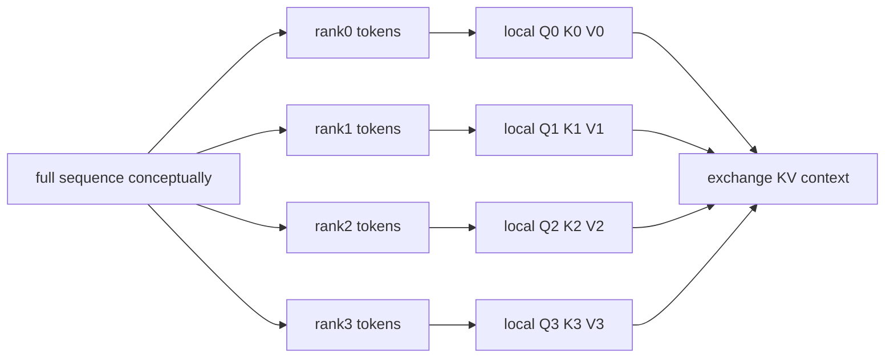
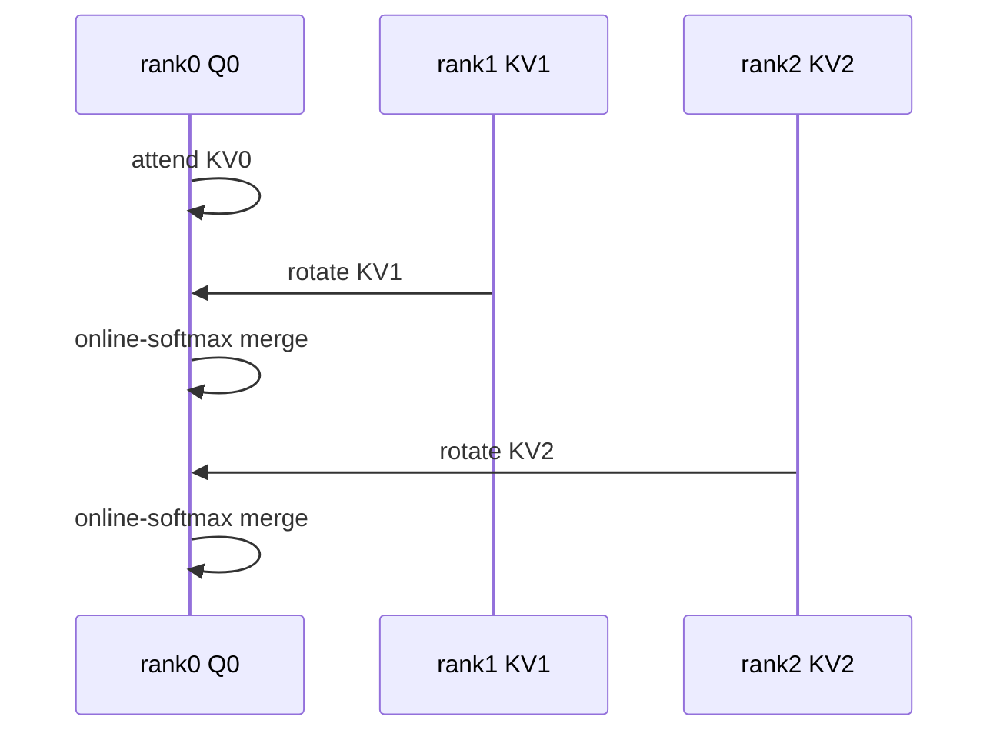
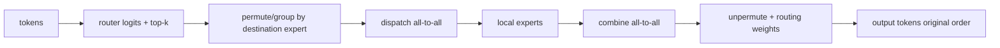

# Context Parallel 与 Expert Parallel

CP 沿 sequence 切整网 activation，并在 attention 内交换 KV context；EP 沿 experts 切参数，并按 router 结果交换 tokens。二者都大量依赖“数据移动”，但对象、group 和负载模型不同。

## 四种名字先拆开

| 维度 | 切分对象 | 每 rank 的输入差异 | 核心通信 |
| --- | --- | --- | --- |
| TP | hidden/head/linear weights | 同一 token 的 feature shard | reduction / gather |
| SP | 部分 non-TP activation 的 sequence | sequence shard | TP 边界 RS/AG |
| CP | 整个网络的 sequence/context | 不同 token chunk | attention KV exchange |
| EP | experts | route 后的 token 子集 | all-to-all dispatch/combine |

SP 通常依附 TP group，CP 与 EP 有自己的 groups。把 `sequence_parallel` 和 `context_parallel_size` 当同义配置会直接破坏 layout 推理。

## CP 为什么 attention 需要通信

假设 sequence $S$ 沿 CP=4 切分。每 rank 可本地算自己 token chunk 的 $Q,K,V$，但每个 query 的 attention 需要可见上下文中的其他 K/V。



MLP、norm 等 token-wise 模块可以只处理 local sequence shard；attention 才需要跨 CP group 恢复全局 context 语义。Backward 还要把对远端 KV 的 gradient 送回所有者。

## CP 通信算法

固定版本配置支持每层选择 [`p2p`、`allgather`、`a2a`、`a2a+p2p`](https://github.com/NVIDIA/Megatron-LM/blob/82e9dc69c9e6f8c27681f2cb6856a188187edf6b/megatron/training/arguments.py#L2896)。它们不是只改一个 NCCL op 的等价性能选项，而会改变 local layout、通信/计算重叠与支持条件。

### P2P ring

每 rank 保持 local Q，分步接收不同 rank 的 KV block，边通信边累计稳定 softmax 结果。



优点是不用一次 materialize 全量 KV；性能依赖 ring 拓扑、chunk 大小和 overlap。

### All-gather

先聚齐 KV，再本地 attention。实现直观，但 peak KV memory 和一次性通信可能更高，长上下文下尤其明显。

### All-to-all

在 sequence/head 维之间重新布局，让 attention 在另一维局部化，再反向转换。需要 head/degree 等 divisibility，且 A2A 对网络和消息尺寸敏感。

官方 CP 设计说明见 [`context_parallel.md`](https://github.com/NVIDIA/Megatron-LM/blob/82e9dc69c9e6f8c27681f2cb6856a188187edf6b/docs/user-guide/features/context_parallel.md)。

## causal attention 的负载并不均匀

简单连续切块时，靠后 query 能看到更多历史 token，计算量比靠前块大。实现可用成对/交错 token 分配等策略平衡 causal workload。验证不能只看每 rank `S/CP` 个 tokens；要比较实际 attention FLOPs、KV bytes 与 idle time。

MQA/GQA 的 KV heads 更少，CP 交换的 KV 量可下降，但同时影响 head layout 与 A2A 支持约束。不要拿普通 MHA 的字节公式直接套用。

## CP 的 memory 与 batch 语义

CP 理想地把主要 sequence activation 约缩到 $1/C$，但以下对象未必同比例下降：

- parameters/optimizer states；
- communication buffers 与临时 gathered KV；
- attention workspace；
- duplicated masks/positions/metadata；
- PP outstanding microbatches。

CP ranks 处理的是同一样本的不同 context，不是新的 data replicas；loss/token count reduction 不能错误地把 CP 当 DP 扩大 global batch。

## EP：从 router 到 expert 再回来

MoE layer 的逻辑链：



固定实现入口 [`moe_layer.py`](https://github.com/NVIDIA/Megatron-LM/blob/82e9dc69c9e6f8c27681f2cb6856a188187edf6b/megatron/core/transformer/moe/moe_layer.py) 根据配置创建 `allgather`、`alltoall` 或 `flex` token dispatcher；数据变换细节在 [`token_dispatcher.py`](https://github.com/NVIDIA/Megatron-LM/blob/82e9dc69c9e6f8c27681f2cb6856a188187edf6b/megatron/core/transformer/moe/token_dispatcher.py)。

EP 切的是 experts，不表示每个 rank 只看固定 token。token 的目标 rank 每 batch 都由 router 决定，所以 all-to-all 的 send counts 是数据相关的。

## 三个 expert 相关 group

概念上至少区分：

| group | 同组 ranks 的关系 | 主要用途 |
| --- | --- | --- |
| Expert parallel | 持有不同 experts | token dispatch/combine |
| Expert tensor parallel | 共同切一个 expert 的矩阵 | expert 内 TP collectives |
| Expert data parallel | 持有对应 expert replica | expert gradients/state sync |

它们与 dense TP/DP domain 的组合依实现而定。固定 `parallel_state.py` 会单独构造 expert tensor/model/data groups；所以不要仅凭 `world = DP×TP×PP×CP×EP` 猜 membership。实际 group 列表与 rank coordinates 才是事实。

## load balance 是正确性与性能交界

若大量 tokens 路由到少数 experts：

- hot ranks 计算和接收更多 tokens，其他 ranks idle；
- dispatch buffers 变大，可能 OOM；
- capacity 限制时 tokens 可能被 drop 或改变权重；
- auxiliary/z-loss 等会影响训练目标；
- 平均 tokens/expert 掩盖 p95/max hot expert。

至少监控：router probability entropy、tokens/expert histogram、max/mean、dropped tokens、dispatch bytes、A2A time、expert GEMM time 与 aux loss。

```text
perfect mean = total routed assignments / num_experts
imbalance ratio = max tokens on one expert / perfect mean
```

top-k routing 中 routed assignments 通常是 tokens 的 $k$ 倍；统计口径必须说明是否含 padding/dropped tokens。

## CP、EP、TP 的组合约束

- TP+EP 在 Megatron 推荐配置中通常要求 SP，避免 activation 复制与 layout 不一致；
- attention 的 TP/CP groups 与 MoE 的 expert groups 不能误复用；
- expert count、EP degree、expert TP degree 需满足实现 divisibility；
- CP communication type 可能按 layer 配置，所有 ranks 必须走一致顺序；
- MoE PP split 要考虑各 stage 的 MoE/dense layer 成本，而非只数 layers；
- DP loss/gradient normalization 需要理解 tokens 在 CP/EP 中是切分还是路由。

## 两组最小实验

### CP=2

1. 同一短序列，CP=1 保存 logits/loss/update；
2. CP=2，打印 token indices、Q/K/V local shapes 与 CP group；
3. 先用默认/最简单通信类型；
4. 比较 attention output 和 gradient；
5. 再增长 sequence，比较 peak HBM/step time/通信。

### EP=2

1. 小 MoE、固定 router input，让目标 experts 可预测；
2. 打印 token → expert → destination rank；
3. 检查 dispatch 后 counts、unpermute 后原顺序；
4. 与单 rank experts 的 output/gradient 比较；
5. 构造全路由一个 expert 的反例，观察 imbalance/容量行为。

## 常见失败

| 现象 | 首查 |
| --- | --- |
| CP loss 错但 shape 对 | causal mask/global positions、KV merge、token normalization |
| CP hang | 每层 communication type/order、P2P peer、早期 OOM |
| CP 不省 HBM | gathered KV、workspace、其他 activation/PP microbatches |
| EP A2A 慢 | message size、topology、token imbalance、expert GEMM 太小 |
| 少数 rank OOM | hot expert/capacity/dispatch buffers |
| token 顺序错 | permute/unpermute indices、dropped/padded tokens |
| TP+EP assertion | SP、head/expert divisibility、expert TP group |

## 通关标准

你应能解释 CP 为什么只在 attention 交换 context；区分 SP 与 CP；比较 P2P/AG/A2A 的 memory/layout；画出 EP route→dispatch→expert→combine；列出三种 expert groups，并用 token histogram 而不是平均 GPU utilization 判断负载。

下一课把所有 degrees 放进同一张网格：[3D/4D/5D 并行组合](./multidimensional)。
