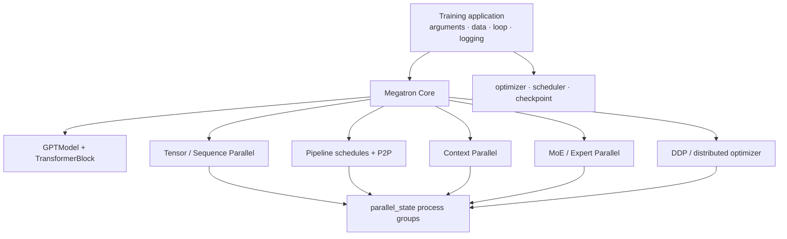
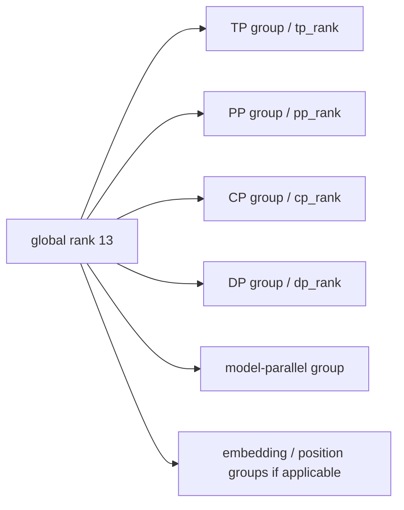
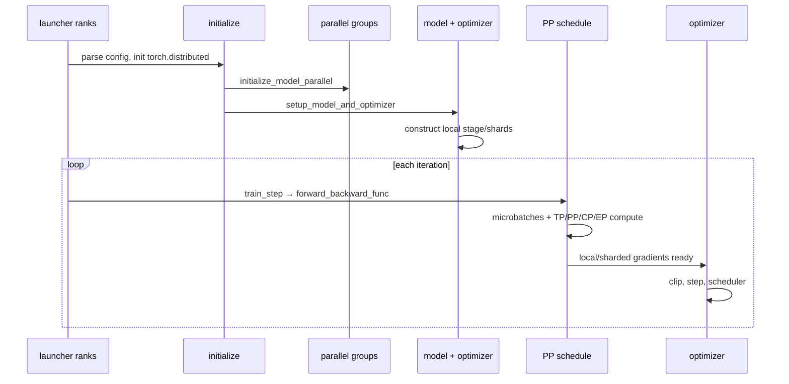

# Megatron Core 总体设计

先给结论：**Megatron Core 把 Transformer 的层、序列、深度和专家映射到明确的 process groups；训练应用负责配置、数据、优化器、循环和保存。**并行算法在 Core 内，实验策略在 application 层。只记启动参数而不认识这条边界，后面很难判断一个问题属于模型、调度还是集群。

## 两层，不是一个黑盒



| 层 | 固定提交中的入口 | 主要问题 |
| --- | --- | --- |
| Training application | [`megatron/training/training.py`](https://github.com/NVIDIA/Megatron-LM/blob/82e9dc69c9e6f8c27681f2cb6856a188187edf6b/megatron/training/training.py) | 何时建模、取 batch、forward/backward、step、保存？ |
| Core model | [`core/models/gpt/gpt_model.py`](https://github.com/NVIDIA/Megatron-LM/blob/82e9dc69c9e6f8c27681f2cb6856a188187edf6b/megatron/core/models/gpt/gpt_model.py) | 一个逻辑 GPT 怎样由并行 layer 组成？ |
| Parallel state | [`core/parallel_state.py`](https://github.com/NVIDIA/Megatron-LM/blob/82e9dc69c9e6f8c27681f2cb6856a188187edf6b/megatron/core/parallel_state.py#L547) | 每个 rank 属于哪些 group、坐标是什么？ |
| Transformer config/spec | [`transformer_config.py`](https://github.com/NVIDIA/Megatron-LM/blob/82e9dc69c9e6f8c27681f2cb6856a188187edf6b/megatron/core/transformer/transformer_config.py#L54) | hidden/head/layer 与并行 degrees 是否兼容？ |
| Distributed optimizer | [`core/optimizer/`](https://github.com/NVIDIA/Megatron-LM/tree/82e9dc69c9e6f8c27681f2cb6856a188187edf6b/megatron/core/optimizer) | gradient/parameter/optimizer state 怎样跨 DP ranks 分片？ |
| Distributed checkpoint | [`core/dist_checkpointing/`](https://github.com/NVIDIA/Megatron-LM/tree/82e9dc69c9e6f8c27681f2cb6856a188187edf6b/megatron/core/dist_checkpointing) | logical tensors 怎样脱离当前 rank layout 保存？ |

Core 可以被 veRL 等上层系统当作训练 engine 使用；这时全局 RL 编排不在 Megatron 内，但 Megatron 仍掌管一个模型角色内部的 TP/PP/CP/EP 与 collective。

## 五种切分各切什么

| 维度 | 切分对象 | 角色内通信 | 主要收益 | 典型代价 |
| --- | --- | --- | --- | --- |
| DP | samples + model states | gradient reduce / state shard collectives | 扩大吞吐、切状态 | global batch、跨副本同步 |
| TP | 单层 hidden/head/MLP dimensions | all-reduce、all-gather、reduce-scatter | 单层模型放不下/算不动 | 高频、对链路敏感 |
| PP | transformer layers | activation/gradient P2P | 切模型深度 | bubble、stage imbalance |
| CP | sequence tokens | attention KV P2P/all-gather/A2A | 长序列 activation/attention | 通信与 causal load balance |
| EP | experts/token routes | all-to-all dispatch/combine | MoE 参数与计算扩展 | hot expert、token imbalance |

不要把 “Megatron parallelism” 当作一次性开全的套餐。每个维度都必须由具体瓶颈触发，并单独通过数值与通信门禁。

## process group 才是运行时事实

启动参数只是意图；[`initialize_model_parallel()`](https://github.com/NVIDIA/Megatron-LM/blob/82e9dc69c9e6f8c27681f2cb6856a188187edf6b/megatron/core/parallel_state.py#L547) 创建出的 group membership 才决定 collective 同谁发生。

对 dense model，基本约束是：

$$
W = D \times T \times P \times C
$$

其中 $W$ 是 world size，$D/T/P/C$ 分别为 data/tensor/pipeline/context degree。每个 global rank 会得到多组坐标，而不是只有一个“GPU 编号”。



专家并行有额外组合规则，不能永远再把 `EP` 机械乘进上式；固定源码会为 expert tensor/data groups 重新组织部分 rank domain。到[多维组合](./multidimensional)再精确展开。

## 一个模型怎样被构造

[`TransformerConfig`](https://github.com/NVIDIA/Megatron-LM/blob/82e9dc69c9e6f8c27681f2cb6856a188187edf6b/megatron/core/transformer/transformer_config.py#L54) 保存结构、精度、重计算和并行设置；layer spec 决定具体模块实现。model provider 在每个 rank 构造**该 rank 的逻辑 stage 与 local shards**，不是先在 rank 0 建完整模型再随意切开。

```text
arguments / YAML
  → TransformerConfig
  → model provider + layer spec
  → GPTModel(pre_process?, post_process?)
  → local TransformerBlocks
  → TP linear / attention / MoE modules
```

PP 首 stage 通常 `pre_process=True`，末 stage `post_process=True`；中间 stage 不应持有完整 embedding/loss 责任。TP layer 在构造时就决定 weight shard 和 forward/backward collective contract。

## 从启动到一个 optimizer step

固定训练主入口 [`pretrain()`](https://github.com/NVIDIA/Megatron-LM/blob/82e9dc69c9e6f8c27681f2cb6856a188187edf6b/megatron/training/training.py#L1007) 可压缩为：



关键源码断点：

1. [`setup_model_and_optimizer()`](https://github.com/NVIDIA/Megatron-LM/blob/82e9dc69c9e6f8c27681f2cb6856a188187edf6b/megatron/training/training.py#L1993)：模型、DDP、optimizer 与 checkpoint restore；
2. [`train_step()`](https://github.com/NVIDIA/Megatron-LM/blob/82e9dc69c9e6f8c27681f2cb6856a188187edf6b/megatron/training/training.py#L2284)：选择 forward/backward schedule，再执行 optimizer step；
3. [`get_forward_backward_func()`](https://github.com/NVIDIA/Megatron-LM/blob/82e9dc69c9e6f8c27681f2cb6856a188187edf6b/megatron/core/pipeline_parallel/schedules.py#L48)：按 PP/virtual PP 选择调度器。

## 什么时候才应启动 Megatron 路径

满足下列条件再进入：

- 模型结构已被对应 Megatron model/spec 支持；
- 单卡或简单 DP 有可对照的 loss/update 基线；
- world size 可被所选 dense degrees 整除；
- hidden size、attention heads、layers、experts 等满足各维 divisibility；
- 所有 ranks 使用一致代码、Transformer Engine/PyTorch/CUDA/NCCL 组合；
- 节点拓扑能把高频 TP 放进快链路；
- global batch 可被 `micro_batch × DP × num_microbatches` 表达；
- checkpoint 格式与目标并行变化有恢复测试。

`torchrun`、Slurm 或上层 Ray 只负责创建/放置 ranks；进入进程后仍由 Megatron 初始化 process groups。launcher 成功不证明 group、collective 或模型 layout 正确。

## Megatron 与 FSDP2 的选择

| 问题 | FSDP2 起点 | Megatron 起点 |
| --- | --- | --- |
| 模型单副本能算，只是 states 太大 | 很合适 | 可能过重 |
| 单层矩阵已无法放下/高效计算 | 需组合 TP | 原生 TP 是主路径 |
| 深层模型需分 stage | 可结合 PP | 成熟 PP schedules |
| 超长上下文 | 可结合 CP | CP 是核心维度 |
| 大规模 MoE | 依具体组合 | 原生 EP/token dispatcher |
| 模型改动频繁、PyTorch 原生优先 | 通常更直接 | 需维护 spec/并行契约 |

这不是品牌选择，而是切分对象和工程约束选择。

## 第一遍源码路线

```text
parallelism-guide.md
  → parallel_state.initialize_model_parallel
  → TransformerConfig + GPTModel
  → tensor_parallel/layers.py
  → pipeline_parallel/schedules.py
  → training.pretrain / train_step
```

每读一层都记录：local tensor shape、process group、collective、forward/backward 是否对称、谁持有 optimizer state。

## 通关标准

你应能说明 Core 与 training application 的边界；从 degrees 写出 dense world-size 约束；指出一个 rank 同时属于哪些 groups；沿 `pretrain → setup_model_and_optimizer → train_step → schedule` 定位一次更新，并解释为什么 Ray/Slurm 不是 Megatron 的 tensor 通信后端。

下一课从一层线性代数开始拆解[Tensor / Sequence Parallel](./tensor-sequence)。
