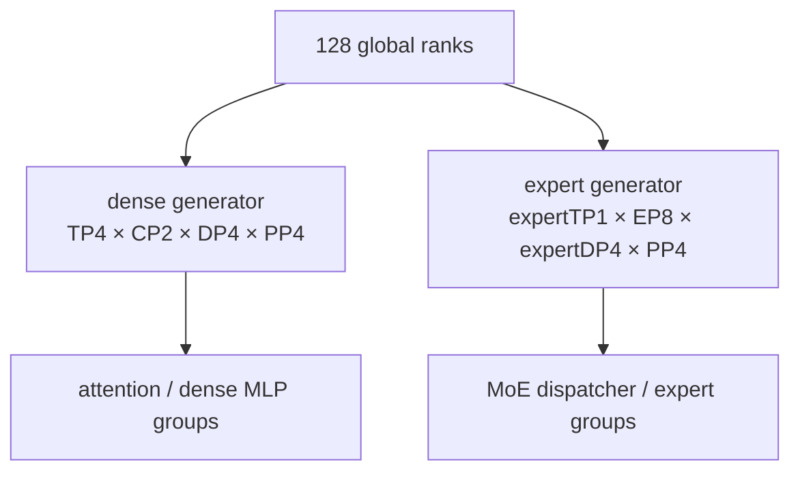
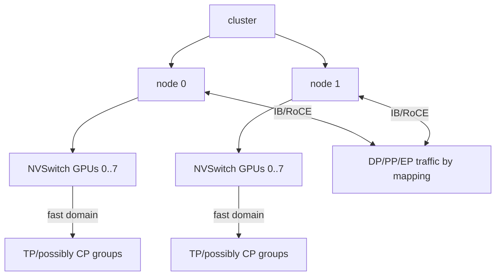
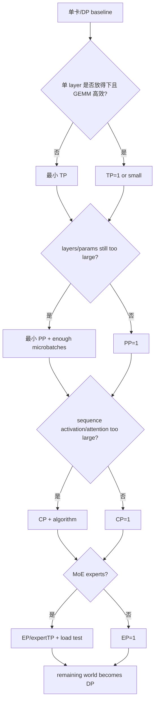

# 3D、4D、5D 并行组合与拓扑映射

“3D/4D/5D”只是维度数量的口语，不是统一标准。有人把 3D 指 DP×TP×PP，也有人把 state sharding、SP 或 EP 算作一维。工程上应直接写 **degree tuple、每维切分对象、group members 和 tensor layout**。

## 从 dense 约束开始

固定 Megatron dense rank domain 满足：

$$
W=D\times T\times P\times C
$$

其中 model size 是 $T\times P\times C$，剩余 ranks 构成 $D$。例如 world=64：

```text
TP=4, PP=2, CP=2
model-parallel size = 16
DP = 64 / 16 = 4
```

这只证明整数可分，不证明是好配置。还要过结构、batch、memory、通信与 topology 五层约束。


## 每个 degree 的正交直觉

| 维度 | 同组 ranks 共同处理 | 不同之处 | 最敏感资源 |
| --- | --- | --- | --- |
| DP | 同一参数版本/模型 shard 位置 | 不同 samples | 跨副本 gradient/state 通信 |
| TP | 同一 layer、同一 tokens | hidden/head shard | 高频低延迟带宽 |
| PP | 同一 batch/microbatch stream | 不同 layers | stage balance、P2P |
| CP | 同一样本 | 不同 sequence chunk | attention KV 通信 |
| EP | 同一 MoE layer | 不同 experts/route tokens | A2A、负载均衡 |

“正交”表示切分对象可概念区分，不表示实现中 groups 和 degrees 可任意笛卡尔乘积。

## EP 为什么不是永远再乘一次

固定源码 [`initialize_model_parallel()`](https://github.com/NVIDIA/Megatron-LM/blob/82e9dc69c9e6f8c27681f2cb6856a188187edf6b/megatron/core/parallel_state.py#L547) 先为 dense/attention layers 建：

```python
model_size = TP * PP * CP
DP = world_size // model_size
```

随后为 expert layers 另建 rank generator：

```python
expert_model_size = expert_TP * EP * PP
expert_DP = world_size // expert_model_size
```

CP 在 expert generator 中是 1；EP 重新解释了部分 rank domain，而不是在 dense 公式末尾无条件追加因子。

例如 world=128，dense `TP=4, PP=4, CP=2` 得 `DP=4`；若 `expert_TP=1, EP=8, PP=4`，则 `expert_DP=4`。attention 和 expert layers 在相同 global ranks 上使用不同 group views。



因此文档或论文里的简化乘积只能帮助形成直觉；排错必须打印固定版本真实 group membership。

## rank order 决定邻接关系

Megatron 的 [`RankGenerator`](https://github.com/NVIDIA/Megatron-LM/blob/82e9dc69c9e6f8c27681f2cb6856a188187edf6b/megatron/core/parallel_state.py#L446) 按 order 把线性 global ranks 映射为多维坐标。固定默认形如 `tp-cp-ep-dp-pp`，低阶/高阶邻接会影响哪些 group 连续、跨哪些节点。

```text
global rank
  ↔ (tp_rank, cp_rank, dp_rank, pp_rank)
  ↔ hostname, local_rank, GPU, NUMA, NIC
```

order 改变不会改变数学 degree，却可能把 TP 从节点内变成跨节点，或使相邻 PP stages 跨越不理想路径。启动前必须联立 launcher rank placement 与 Megatron order，而不是只看其中一个。

## 把高频通信映射到快域

一个常见启发式：

1. TP 放在 NVLink/NVSwitch 域；
2. CP ring/A2A 尽量留在高带宽域，或使用与网络层级匹配的 hierarchical 配置；
3. EP A2A 需要关注 NIC injection 与 oversubscription；
4. PP 跨较慢边界时每 microbatch 只搬 stage activation，但仍需测量；
5. DP/optimizer collectives 往往跨最广域，应使用分层/重叠并控制 bucket。

这不是固定优先级。长上下文 CP bytes 或 MoE EP A2A 可能超过 TP，需由 trace 的 op×bytes×frequency 决定。



## tensor layout 要逐算子组合

以一个 dense linear weight 为例，多维 local storage 可能同时受 TP 与 state sharding：

```text
global W[H, K]
TP: shard K → local logical W[H, K/T]
FSDP/DistOpt over DP: shard optimizer/grad/param state of that TP shard
PP: only ranks owning this layer have W
CP: weights replicated across CP, activations sequence-sharded
```

不能简单说“每卡参数是总参数除以 TP×PP×CP×DP”：

- PP layer 数可能不均；
- CP 不切 weights；
- DP 是否切 parameter depends on DDP/ZeRO/FSDP/distributed optimizer stage；
- embedding/head/shared weights 有特殊所有权；
- EP 只影响 MoE expert parameters；
- padding/alignment 与 buffers 不按理想比例。

## group 不止五个

真实运行常出现组合/辅助 groups：

| group | 典型用途 |
| --- | --- |
| TP | layer collectives |
| PP | adjacent stage P2P |
| CP | attention context exchange |
| DP | dense gradient synchronization |
| DP-with-CP | CP replicas也参与 weight gradient/state 语义 |
| model parallel | TP×PP 等控制/统计 |
| embedding / position embedding | 首末 stage shared weights |
| EP | token dispatch/combine |
| expert TP / expert DP | expert layer tensor/data parallel |
| distributed optimizer instance groups | partial state sharding/replicas |

“用 world group all-reduce 一下最省事”常常会重复计数或 deadlock。每个 reduction 都应回答：数学上要跨哪一维？这个 group 是否恰好代表那一维？

## global batch 与 tokens/update

最常见关系仍是：

$$
B_{global}=B_{micro}\times D\times M
$$

TP、PP、CP ranks 合作处理同一数据，不扩大 DP sample count；EP 只路由 tokens，也不扩大 global batch。若 sequence packing/CP 改变 local token 数，loss numerator 与 valid-token denominator 应在正确 group 聚合。

做等价实验时固定：

- global samples 和 valid tokens/update；
- data order/seed；
- optimizer/LR schedule；
- loss normalization；
- dropout RNG 的 parallel-aware 语义；
- parameter initialization 与 checkpoint 起点。

只固定 `micro_batch_size` 不足以证明多维配置等价。

## 配置推导顺序

从瓶颈倒推，而不是凑满 GPU：



最后剩余资源给 DP 只是起点；若 global batch 过大或 DP collective 成为瓶颈，宁可减少 world 或调整其他维度，也不要为了“卡都用上”破坏训练语义。

## 一个 64 GPU 审计表

假设 8 节点×8 GPU、dense `TP=4, PP=2, CP=2, DP=4`：

| 检查 | 必须给出的证据 |
| --- | --- |
| 整数 | `4×2×2×4=64` |
| model | heads/hidden/layers 与 TP/PP 可分，CP sequence layout 支持 |
| batch | `micro × 4 × num_microbatches = global` |
| topology | 每个 TP/CP/PP group 的 host/local ranks |
| local tensors | 每类 layer weight/activation global→local shape |
| communication | TP/CP/PP/DP op、bytes、frequency、link |
| memory | params/grads/optim/activations/temp/fragmentation peak |
| numerics | 与逐维 baseline 的 loss/grad/update 容差 |
| checkpoint | 当前 layout 保存并在目标 layout 恢复 |

若表中任何一行只能写“框架会处理”，就还没到大规模启动阶段。

## 逐维扩展，不跳级

```text
A: world1, all degrees 1
B: DP2
C: TP2, DP adjusted
D: TP2 + PP2
E: TP2 + PP2 + CP2
F: add EP only for an MoE model
```

每步保留上一配置作为回滚，比较 layout、数值、HBM 和时间分解。若 E 失败，先回 D，不在 E 上同时改 NCCL、batch、precision、recompute 和 checkpoint。

## 组合失败矩阵

| 现象 | 更可能的维度/边界 |
| --- | --- |
| init divisibility error | TP heads/hidden、PP layers、CP sequence、EP experts |
| loss 恰好重复/缩小整数倍 | DP/CP/TP group 中重复计数 |
| 只有首末 PP rank OOM | embedding/head/loss/stage split |
| 节点内快、跨节点骤降 | rank order/topology/NIC/TP 或 A2A 跨域 |
| 少数 MoE ranks 慢/OOM | EP token imbalance/capacity |
| 所有 rank 同一 collective hang | 更早的某 rank异常或 group order mismatch |
| checkpoint 仅原 world 可载 | logical tensor metadata/reshard support |

## 通关标准

你应能拒绝含糊的“5D 配置”，改写为明确 degree tuple；推导 dense 与 expert rank domain；列出一个 rank 的所有关键 groups；把每类通信映射到物理链路；解释 batch为何只乘 DP，并完成一份可验证的多维配置审计表。

理论维度到此齐全。下一阶段用真实命令完成[FSDP2 与 Megatron 实验](../practice/first-runs)。
