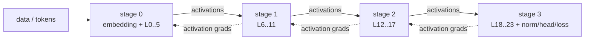
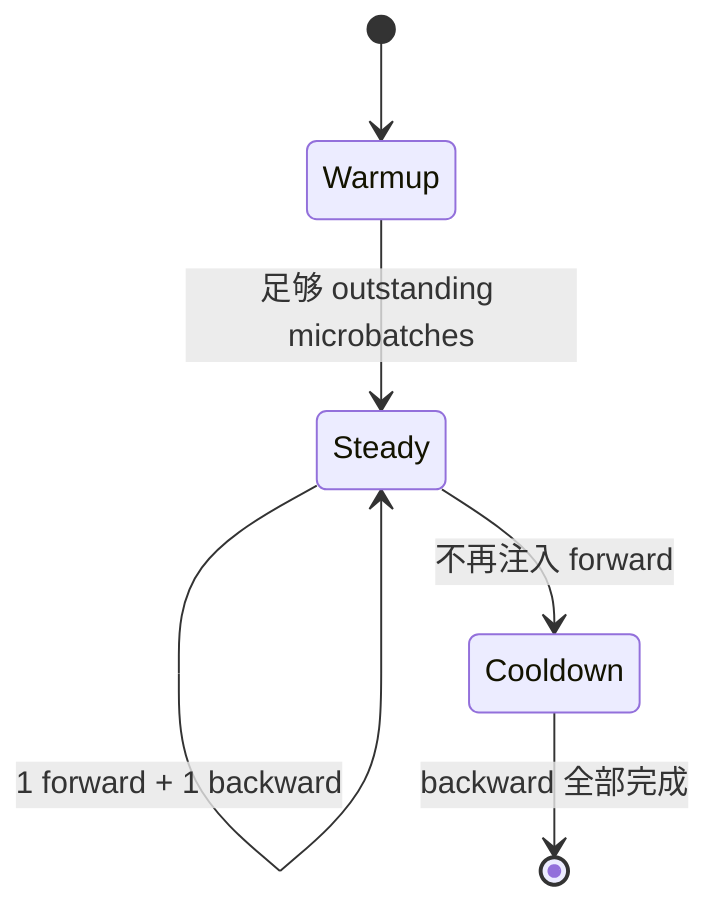
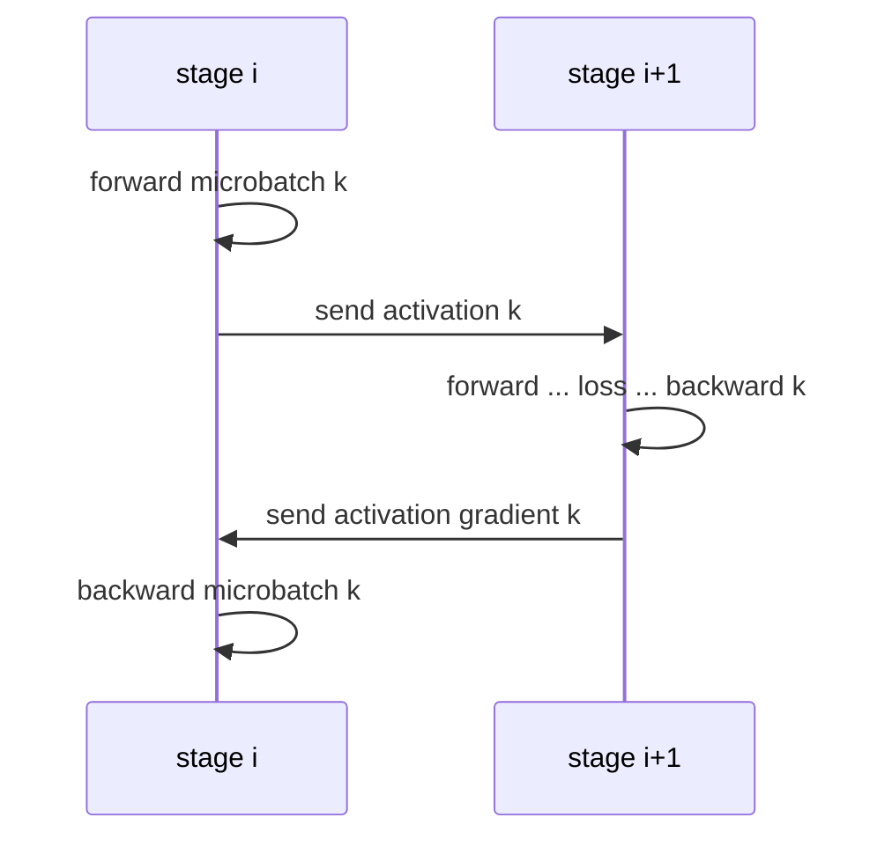
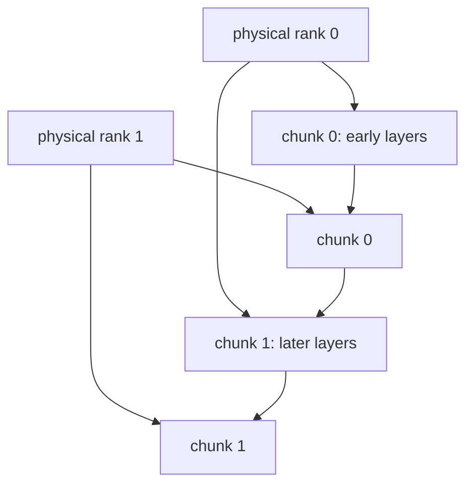

# Pipeline Parallel、Microbatch 与 1F1B

PP 沿模型深度切 layers。相邻 stage 用 P2P 发送 forward activation、反向发送 activation gradient；为了不让后续 stage 一直等，global batch 再切成多个 microbatches 进入流水线。**PP 的核心对象不是“第几张卡”，而是 stage、microbatch 与 schedule。**

## 先画清 stage 边界

以 24-layer、PP=4 为例，均匀起点是每 stage 6 层：

只有首 stage 需要原始输入/embedding 责任，只有末 stage 直接产出 logits/loss。中间 stage 接收 hidden states。每个 stage 内还可有 TP/CP ranks，所以一条 P2P 边通常是对应 parallel coordinates 之间的通信，不是“GPU0 随便发给 GPU1”。

## batch 的四个量

常见 dense 训练关系：

$$
B_{global}=B_{micro}\times D\times M
$$

- $B_{micro}$：每个 DP replica 每次送入 pipeline 的样本数；
- $D$：data parallel degree；
- $M$：一次 optimizer step 累积的 microbatch 数；
- $B_{global}$：一次 update 覆盖的全局样本数。

PP degree 不直接乘进 global batch；PP ranks 共同处理同一组样本的不同 layers。改变 PP 时若意外也改变 $M$，优化语义和 bubble 都变了。

token-based loss 还要按有效 token 数归一化；最后一个不齐 microbatch、packing 或变长序列都可能让“microbatch 平均再平均”产生偏差。

## 最直观但低效的 schedule

若每个 microbatch 走完整 forward 后再统一 backward（GPipe 风格），开始和结束存在空洞：

```mermaid
gantt
    title PP=3 的概念时间线
    dateFormat X
    axisFormat %s
    section Stage 0
    F0 :0, 1
    F1 :1, 2
    F2 :2, 3
    idle :3, 5
    B2 :5, 6
    B1 :6, 7
    B0 :7, 8
    section Stage 1
    F0 :1, 2
    F1 :2, 3
    F2 :3, 4
    B2 :4, 5
    B1 :5, 6
    B0 :6, 7
    section Stage 2
    F0 :2, 3
    F1 :3, 4
    F2 :4, 5
    B2 :5, 6
    B1 :6, 7
    B0 :7, 8
```

忽略 forward/backward 时间差时，forward-only pipeline 的 bubble fraction 常用近似：

$$
\frac{P-1}{M+P-1}
$$

$M$ 远大于 $P$ 才能摊薄 bubble；但盲目增大 $M$ 会增加调度/通信次数，并可能改变 batch 或 activation 保留量。

## 1F1B：warmup、steady、cooldown

Megatron 常用 non-interleaved 1F1B。每个 stage 先 warm up 若干 forward；进入 steady state 后交替执行一个 forward 和一个 backward；最后 drain 剩余 backward。

相比“全 forward 再全 backward”，1F1B 限制 outstanding activations，通常显著降低峰值。不同 stage 的 warmup 长度不同：越靠前需要先填满更多下游 stage。

固定调度选择位于 [`get_forward_backward_func()`](https://github.com/NVIDIA/Megatron-LM/blob/82e9dc69c9e6f8c27681f2cb6856a188187edf6b/megatron/core/pipeline_parallel/schedules.py#L48)：

- PP=1：[`forward_backward_no_pipelining`](https://github.com/NVIDIA/Megatron-LM/blob/82e9dc69c9e6f8c27681f2cb6856a188187edf6b/megatron/core/pipeline_parallel/schedules.py#L672)；
- PP>1、无 virtual stages：non-interleaved 1F1B；
- PP>1、配置 virtual pipeline：interleaved 1F1B。

## P2P 传什么

[`P2PCommunicator`](https://github.com/NVIDIA/Megatron-LM/blob/82e9dc69c9e6f8c27681f2cb6856a188187edf6b/megatron/core/pipeline_parallel/p2p_communication.py) 封装相邻 stage 的 send/recv 组合。

P2P contract 至少包含 shape、dtype、requires-grad 语义、microbatch 顺序和对应 rank。变长序列/动态 shape 若双方推导不同，会在 recv 或更晚的 layer 失败。某 rank 在 send 前 OOM，邻居常表现为 recv hang；因此先找最早错误，而不是把所有 timeout 都归因网络。

## Virtual Pipeline 与 interleaving

Virtual pipeline 把一个物理 stage 再分成多个 model chunks。例如每个 rank 不只持连续一段 layers，而持两个间隔 chunk；schedule 在 chunks 间交错，让 bubble 更细，并增加通信重叠机会。

代价是：schedule 状态、P2P 次数、参数同步和 debugging 更复杂。先让 non-interleaved 数值与 stage balance 正确，再启用 virtual stages；不能把它当成自动修复负载不均的开关。

## stage balance 不能只数 layers

同样 6 层不一定同样快：

- 首 stage 有 embedding、输入与可能的数据处理；
- 末 stage 有 norm、vocab projection、loss；
- MoE layers 与 dense layers 负载不同；
- sequence length / causal distribution 会影响 CP attention；
- activation checkpoint/recompute 策略可能不同；
- 网络边界、shared embedding 与 tied weights 产生额外通信。

记录每 stage、每 microbatch 的 forward/backward/P2P 时间和 peak HBM，再调整 split；平均 step time 看不出哪个 stage 是节拍器。

## activation checkpoint 与 PP

PP 切参数深度，checkpoint/recompute 切 activation 生命周期。两者可组合：stage 为每个 outstanding microbatch 保存必要边界与 checkpoint inputs，backward 时重算内部 activation。

权衡包括：

- 更多 microbatches 可降 bubble，但增加调度对象；
- 1F1B 降低 outstanding count；
- recompute 降 HBM、增 FLOPs；
- FSDP `reshard_after_forward` 在 PP 多 microbatch 下还会改变 parameter gather 次数。

必须用峰值时间线而不是静态 `activation_bytes / PP` 估算。

## loss、gradient 与 optimizer step

末 stage 计算 loss，但所有 stages 都需收到对应 backward。一个 optimizer step 必须等待本 step 的全部 microbatches 完成；随后 DP gradient sync/distributed optimizer 才能以一致参数版本更新。

常见语义错误：

- 每 microbatch 都 optimizer step，破坏 global batch；
- loss scale 未除以正确 microbatch/token count；
- pipeline flush 前进入 evaluation/save；
- 不同 stages 的 data iterator/labels 消费不一致；
- tied embedding/head 的 gradient sync 漏掉。

## 最小实验

1. 单 rank/PP=1 保存两步 loss、grad checksum；
2. PP=2、M 至少为 2，关闭 virtual PP，复用同一 global batch；
3. 打印 `pp_rank → layers → pre/post_process`；
4. 记录每个 microbatch 的 send/recv/F/B 顺序；
5. 比较 loss/update；
6. 扫 $M$，观察 bubble、峰值 HBM 与 step time；
7. 最后再开启 interleaving。

## 常见失败

| 现象 | 首查 |
| --- | --- |
| 初始化 divisibility 失败 | layers 与 PP/virtual chunks 的约束 |
| recv hang | peer 是否先 OOM/异常、microbatch 顺序、shape metadata |
| 首末 stage OOM | embedding/head/loss、split balance、tied weights |
| GPU utilization 锯齿明显 | microbatch 数、stage imbalance、P2P 同步等待 |
| loss 与 PP=1 不同 | loss/token normalization、data consumption、shared params |
| virtual PP 后死锁 | chunk schedule、P2P order、版本支持组合 |

## 通关标准

你应能写出 global/micro/DP/microbatch 关系；画出 1F1B 三阶段与 P2P 双向对象；解释 bubble、outstanding activation、virtual chunks 和 stage balance 的权衡；并用 PP=1/2 等价实验定位错误属于 schedule、数据还是通信。

下一课继续沿序列和稀疏专家切分：[Context / Expert Parallel](./context-expert)。
