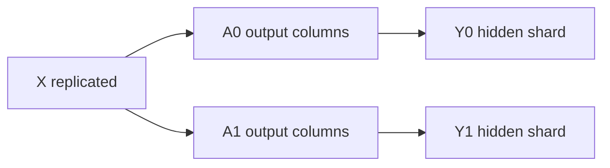
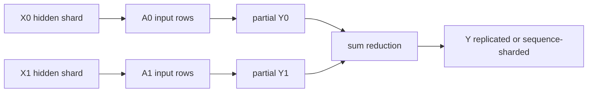
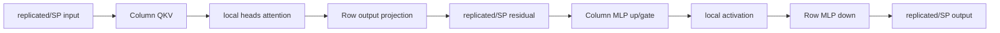
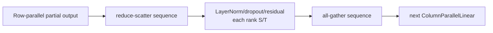

# Tensor Parallel 与 Sequence Parallel

TP 不是“把模型平均放到几张卡”。它给每个权重规定一个 shard 轴，并给前后向规定 collective。Megatron 的经典组合是：**列并行产生分片输出，行并行消费这些分片并在末端求和；SP 再把原本在 TP ranks 上重复的 sequence activation 切开。**

## 从一层线性变换推导

设 $Y=XA$，batch/sequence 合并后 $X\in\mathbb{R}^{N\times H}$，$A\in\mathbb{R}^{H\times K}$。

### Column parallel：切输出维

$$
A=[A_0,A_1,\ldots,A_{T-1}],\qquad Y_i=XA_i
$$

每个 TP rank 保存 $A_i\in\mathbb{R}^{H\times K/T}$，输入 $X$ 复制，输出 $Y_i$ 沿最后一维分片。若下一层能直接消费 shard，就不应立刻 all-gather。



固定实现见 [`ColumnParallelLinear`](https://github.com/NVIDIA/Megatron-LM/blob/82e9dc69c9e6f8c27681f2cb6856a188187edf6b/megatron/core/tensor_parallel/layers.py#L778)。`gather_output` 决定是否物化完整 $Y$，但它不是免费的格式转换。

### Row parallel：切输入维

$$
X=[X_0,X_1,\ldots],\quad
A=\begin{bmatrix}A_0\\A_1\\\vdots\end{bmatrix},\quad
Y=\sum_i X_iA_i
$$

每 rank 算 partial output，再对 TP group 求和。固定实现见 [`RowParallelLinear`](https://github.com/NVIDIA/Megatron-LM/blob/82e9dc69c9e6f8c27681f2cb6856a188187edf6b/megatron/core/tensor_parallel/layers.py#L1142)。



## Transformer block 中的成对布局

Attention 的 QKV projection 与 MLP 的 first projection 常用 column parallel；attention output projection 与 MLP second projection 常用 row parallel。中间 nonlinear/attention head computation 在 local hidden/head shards 上完成。



设计目的不是消灭通信，而是把两次大 GEMM 之间的中间 activation 保持 shard，避免每层每个子算子都 gather。

## backward 是 forward 的通信共轭

一个自定义 distributed op 不能只画 forward。复制输入在 backward 会汇聚来自各 shard 的梯度；forward 的 reduce/all-gather 对 backward 有对应 split/reduce-scatter 语义。Megatron 将这些算子封装在 [`tensor_parallel/mappings.py`](https://github.com/NVIDIA/Megatron-LM/blob/82e9dc69c9e6f8c27681f2cb6856a188187edf6b/megatron/core/tensor_parallel/mappings.py)。

审查 TP layer 时写一张四列契约：

| 边界 | global shape | local layout | backward collective |
| --- | --- | --- | --- |
| layer input | `[S,B,H]` | replicated 或 sequence shard | reduce / all-gather 依 op |
| column output | `[S,B,K]` | shard `K` | input grad reduction |
| row partial | `[S,B,H]` | partial sum | output grad broadcast/split |
| block output | `[S,B,H]` | replicated 或 sequence shard | 对称转换 |

只看 local shape 对不够；`Partial(sum)` 与 `Replicate` 可能 shape 相同而语义完全不同。

## Sequence Parallel 到底切什么

纯 TP 在一些区域仍让每个 rank 保存完整 `[S,B,H]` activation，例如 layer norm、dropout 和 residual 周边。SP 沿 sequence 轴把这些 activation 切成 `[S/T,B,H]`，并把 TP 边界的 all-reduce 改造成 reduce-scatter / all-gather 对。



收益主要是 non-TP 区域的 activation memory；权重 TP shard 不因 SP 再缩一次。通信总字节未必大幅下降，但 layout 让复制 activation 消失，并可改善峰值。

官方建议 TP 与 SP 一起使用，因为 TP degree 增大时 replicated activation 浪费也随之突出。

## SP 不是 CP

| 维度 | Sequence Parallel | Context Parallel |
| --- | --- | --- |
| 覆盖范围 | block 中部分 non-TP activation | 整个网络输入/activation sequence |
| attention | 通常仍获得完整 sequence 语义 | Q 分片，需要跨 ranks 获得 KV context |
| group | 通常复用 TP group | 独立 CP group |
| 核心通信 | TP 边界 RS/AG | attention KV P2P/AG/A2A |
| 主要目标 | 消除 TP ranks 上重复 activation | 扩展超长上下文 |

看到 `sequence_parallel=True` 不能推出“支持任意长上下文”；那是 CP 课程的问题。

## attention heads、GQA 与 divisibility

最基本检查：

- hidden/FFN sizes 与 TP shard 轴可整除；
- attention heads 能映射到 TP ranks；
- GQA 的 KV heads 与 TP 组合有实现约束；
- vocab size 的 padding/divisibility 与输出 head 一致；
- rotary/position embedding 的 local head layout 正确；
- MoE 同时启用 TP/EP 时满足框架的 sequence-parallel 约束。

不能仅用 `hidden_size % TP == 0` 作为全部验收。

## Vocab parallel 与交叉熵

语言模型输出权重可沿 vocabulary shard。每 rank 只计算 local vocab logits，但全局 softmax 需要跨 ranks 得到 max 与 denominator；目标 token 可能只落在一个 shard。Megatron 的 [`VocabParallelCrossEntropy`](https://github.com/NVIDIA/Megatron-LM/blob/82e9dc69c9e6f8c27681f2cb6856a188187edf6b/megatron/core/tensor_parallel/cross_entropy.py) 避免先 gather 完整 `[tokens, vocab]` logits。

```text
local logits
  → global max reduction
  → local exp/sum
  → global denominator reduction
  → select target logit owner
  → global loss
```

核验 loss 时还要检查 padded vocab tokens 是否被正确屏蔽。

## TP degree 的性能边界

TP 提高后：

- local GEMM 变小，可能落出高效 kernel 区间；
- 高频 collective latency/带宽占比上升；
- 节点间 TP 会显著受慢链路影响；
- activation/weight HBM 下降，但 framework buffer 与通信 workspace 不同比例下降；
- batch/sequence 太小会让每 rank 工作量不足。

因此常见起点是把 TP group 留在 NVLink/NVSwitch 域内，再用 PP/DP 跨节点；这是一条 topology heuristic，不是永远正确的定律。

## 两卡手算与实验

先用小矩阵，不要直接上 70B：

```python
# conceptual reference
Y_ref = X @ A
Y0 = X @ A[:, :k_half]
Y1 = X @ A[:, k_half:]
assert close(concat(Y0, Y1), Y_ref)

Z0 = X[:, :h_half] @ B[:h_half, :]
Z1 = X[:, h_half:] @ B[h_half:, :]
assert close(Z0 + Z1, X @ B)
```

真实 2-rank run 记录：每个 parameter global/local shape、forward boundary layout、collective bytes、loss、gradient checksum、peak HBM 与 step time。然后只打开 SP，验证 loss/update 等价并比较 activation peak。

## 常见错误

| 现象 | 首查 |
| --- | --- |
| init 时 shape/assert | hidden/head/KV head/vocab divisibility |
| loss 有限但与单卡不同 | vocab loss reductions、sample duplication、layout semantic |
| TP=2 反而慢 | GEMM 太小、collective 跨慢链路、batch 不足 |
| 开 SP 后 tensor mismatch | RS/AG 边界、sequence layout 标记、残差分支 |
| backward hang | 各 rank 是否走相同 conditional/collective order |
| 某 rank HBM 异常高 | gather_output、未切 activation、embedding/output sharing |

## 通关标准

你应能手推 column/row parallel 的 local shapes 和 collective；画出 attention/MLP 中的成对布局；解释 SP 省的是哪些 activation、为什么不等于 CP；并用两卡实验同时证明数值、layout 与性能行为。

下一课把层沿深度切开，学习[Pipeline Parallel](./pipeline)。
