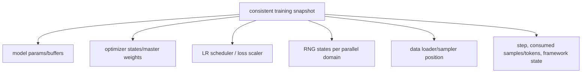
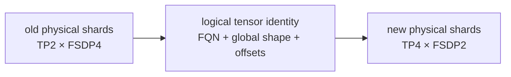
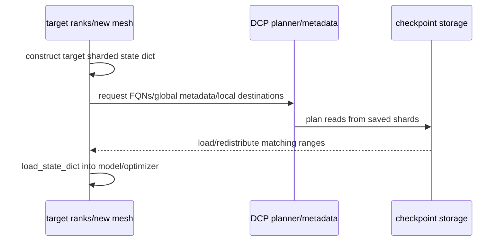

# 分布式 Checkpoint：一致快照、Reshard 与恢复验证

Checkpoint 不是“把每张卡的 `state_dict` 存一下”。它必须表示一个**逻辑上的同一训练时刻**，并能把 logical tensors/state 映射到目标 ranks。真正的验收不是目录存在，而是恢复后下一步与未中断对照一致。

## 两种产物先分开

| 产物 | 用途 | 必需状态 | 常见格式 |
| --- | --- | --- | --- |
| Full training checkpoint | 精确继续训练 | model、optimizer、scheduler、step、RNG、data position、scaler/算法状态 | DCP/Megatron distributed format |
| Model-only/export checkpoint | 推理、SFT、发布 | canonical model weights + config/tokenizer | HF safetensors、单文件/分片权重 |

model-only checkpoint 能成功推理，不证明 optimizer/data/RNG 可继续；full checkpoint 能在训练框架恢复，也不表示能被普通 Transformers 直接加载。一个作业通常同时设计周期性 full snapshots 与低频/最终 export。

## 六类状态缺一不可



还应记录模型/数据/tokenizer/config/code/container revisions。若 sequence packing、mixture routing 或 curriculum 有额外 state，也要进入 checkpoint contract。

只恢复 model+optimizer 但 dataloader 从头开始，会重复数据；只恢复 step 但 scheduler 未恢复，会在日志上“步数正确、学习率错误”；PP/TP RNG 未恢复会改变 dropout/初始化流。

## logical tensor 与 physical shard

假设 global weight `[8192,8192]`：旧布局可能是 TP=2 再 FSDP=4，新布局可能 TP=4 再 FSDP=2。local file shard shape 可以完全不同，但它们应指向同一个 logical FQN/global shape/offset。



Distributed Checkpoint 的 metadata/planner 需要知道保存侧 shards 与加载侧目标 state dict layouts，才能直接做 reshard。裸 `torch.save(local_state_dict)` 只保留 local tensors，通常缺少安全重组所需的全局语义。

## DCP load 的关键直觉

加载前，目标程序已按**新配置**构造 model/optimizer shards；它们的 state dict 是“我要什么 layout”的模板。DCP planner 读取 checkpoint metadata，计算哪些 byte ranges 由哪些 readers 加载到哪些 target shards。



因此“格式支持 reshard”仍需满足：FQNs/architecture兼容、target layout有映射、optimizer state格式支持、共享参数和PP chunks能规范化。

## TorchTitan 的 checkpoint contract

固定 [`CheckpointManager`](https://github.com/pytorch/torchtitan/blob/fec3e196a4ceb87bfc87fb4f1a36a538d7e98ee4/torchtitan/components/checkpoint.py#L176) 注册：model parts、optimizer container、LR scheduler、dataloader 和 train state。它用 wrapper 将多 PP chunks 与 optimizer states按 canonical FQN flatten，避免不同 stage 都用 `param_group[0]` 时键冲突。

[`save()`](https://github.com/pytorch/torchtitan/blob/fec3e196a4ceb87bfc87fb4f1a36a538d7e98ee4/torchtitan/components/checkpoint.py#L706) 和 [`load()`](https://github.com/pytorch/torchtitan/blob/fec3e196a4ceb87bfc87fb4f1a36a538d7e98ee4/torchtitan/components/checkpoint.py#L801) 处理间隔、last-step、initial load、model-only 与 DCP/HF adapter。

官方固定使用说明见 [`docs/checkpoint.md`](https://github.com/pytorch/torchtitan/blob/fec3e196a4ceb87bfc87fb4f1a36a538d7e98ee4/docs/checkpoint.md)。

### Seed checkpoint

不同 parallel layouts 下分片后初始化不一定逐元素重现单卡初始化。TorchTitan 支持在单 CPU/device 创建 step-0 seed checkpoint，再靠 DCP 加载到任意受支持 mesh：

```bash
NGPU=1 MODULE=llama3 CONFIG=llama3_debugmodel ./run_train.sh \
  --checkpoint.enable \
  --checkpoint.create_seed_checkpoint \
  --parallelism.data_parallel_replicate_degree 1 \
  --parallelism.data_parallel_shard_degree 1 \
  --parallelism.tensor_parallel_degree 1 \
  --parallelism.pipeline_parallel_degree 1 \
  --parallelism.context_parallel_degree 1 \
  --parallelism.expert_parallel_degree 1
```

这不是为了故障恢复，而是为不同布局数值对照提供同一 logical initialization。

## Megatron distributed checkpoint

Megatron Core 的 [`dist_checkpointing`](https://github.com/NVIDIA/Megatron-LM/tree/82e9dc69c9e6f8c27681f2cb6856a188187edf6b/megatron/core/dist_checkpointing) 用 sharded state dict 描述 logical tensors；固定指南将 `torch_dist` 作为当前 distributed format，并区分 optimizer state 的 reshard 能力。

固定文档 [`dist_checkpointing.md`](https://github.com/NVIDIA/Megatron-LM/blob/82e9dc69c9e6f8c27681f2cb6856a188187edf6b/docs/api-guide/core/dist_checkpointing.md) 特别说明：默认 optimizer 形式主要面向 DP reshard；若要任意改变 model-parallel degrees，需使用 fully-reshardable optimizer 格式，代价是保存/加载更慢。不能从“model weights 可改 TP”推断 optimizer 也一定可改。

配置审查必须写明：

```text
checkpoint format
model reshard dimensions supported
optimizer reshard dimensions supported
PP/virtual PP compatibility
shared/tied parameter handling
strictness policy for missing/unexpected keys
```

## 同步与异步保存

### 同步

所有 state frozen → 写持久存储 → 完成/返回。语义直接，但训练完全停顿。

### 异步线程

GPU state 先拷到 host snapshot，训练恢复；后台线程写盘。阻塞缩短，但 host staging 和 GIL/I/O 仍有成本。

### pinned-memory + process

预分配 pinned shared memory，GPU→CPU DMA 与下一 step overlap，独立进程持久化。吞吐更好，但固定占用大量 host RAM，内存不足会 paging 甚至拖垮作业。

```mermaid
gantt
    title 异步 checkpoint 概念时间线
    dateFormat X
    axisFormat %s
    section Training
    step N compute :0, 3
    short staging barrier :3, 4
    step N+1 compute :4, 8
    section Checkpoint
    GPU to host snapshot :3, 5
    host to storage :5, 9
```



TorchTitan 固定 `async_mode` 提供 `disabled`、`async`、`async_with_pinned_mem` 三种语义。optimizer 修改下一版本前会 `maybe_wait_for_staging()`，防止后台仍读取同一参数 storage 而得到混合版本。

## 一致快照与完成标记

分布式 save 中 rank 3 写完而 rank 7 失败，目录可能存在但 snapshot 不完整。生产设计需要：

1. 唯一临时 checkpoint ID；
2. 所有 ranks/data shards 写入；
3. metadata/manifest 校验；
4. 全局成功后写完成标记或原子发布；
5. `latest` 只指向已完成版本；
6. retention 不删除仍在写或唯一可恢复的上一个版本。

对象存储的 rename/一致性语义与 POSIX 不同，不能假设本地目录技巧自动成立。框架/filesystem backend 的 commit protocol 必须纳入故障注入测试。

## checkpoint 带宽账

近似 checkpoint bytes：

```text
model params + gradients(if saved) + optimizer states + scheduler/train/data metadata
```

Adam FP32 master/first/second moments 可远大于低精度 model weights。理论最短保存时间：

$$
t_{min}\ge\frac{bytes}{aggregate\ sustained\ storage\ bandwidth}
$$

真实时间还包含 GPU→host、serialization/planning、small files、metadata coordination、network contention。异步只隐藏时间，不消灭 bytes；后台 I/O 若跨越下一个 checkpoint interval，会形成 backpressure。

## 恢复矩阵

至少自动化这些 case：

| Case | Save | Load | 验收 |
| --- | --- | --- | --- |
| same layout | DP2/TP1 | DP2/TP1 | next loss/update equals uninterrupted |
| DP reshard | DP2 | DP4 | model+optim support范围内一致 |
| model-parallel reshard | TP2/PP1 | TP1/PP2 | 仅在格式明确支持时 |
| seed | world1 step0 | FSDP/TP variants | initial logical weights一致 |
| model-only export | distributed | HF/single consumer | logits/tokenizer/config一致 |
| mid-save kill | async save时杀 rank | latest | 不选择partial snapshot |
| corrupt shard | 删除/篡改一片 | load | 快速失败并指出文件/FQN |

### 恢复后比较什么

- restored step、consumed tokens/samples；
- learning rate/loss scale；
- model与optimizer logical checksum；
- next batch sample IDs；
- RNG-dependent dropout output；
- 下一步 loss、grad norm、parameter update；
- dataloader不重不漏。

只比较 load 后模型 checksum，会漏掉大多数训练恢复错误。

## strictness 与迁移

模型代码升级可能重命名 FQN、拆分 fused weight、改变 tied weights或 optimizer param groups。加载策略应：

- 默认 strict，列出 missing/unexpected/mismatched keys；
- migration 用显式版本化 adapter；
- model-only initial load 与 full resume 使用不同政策；
- 保存 manifest 中记录 schema/model/config version；
- 迁移前保留原 checkpoint，不原地覆盖。

“strict=False 跑起来了”可能让一部分参数随机初始化，是高风险静默错误。

## 外部 checkpoint 安全

只从可信来源加载可执行/ pickle 类格式；发布或跨信任边界优先 safetensors/weights-only，并验证 hash、模型 revision 与配置。checkpoint 路径和对象存储凭证不应来自未校验的任意用户输入。

## 常见失败

| 现象 | 首查 |
| --- | --- |
| latest 目录存在但 load 失败 | 完成标记、metadata、某 rank partial write |
| model 恢复、optimizer shape错 | optimizer reshard support/FQN param mapping |
| resume 后 loss 突跳 | LR/scaler/RNG/data position/normalization |
| async save 后偶发坏权重 | staging 是否完成、source storage是否被下一 step 修改 |
| host OOM/paging | pinned staging bytes、并发 snapshots、retention thread |
| 改 TP/PP 后 missing keys | logical FQN、PP flatten、格式支持矩阵 |
| HF export logits不同 | adapter、tied weights、dtype、tokenizer/config |

## 通关标准

你应能区分 full resume 与 model export；列出六类训练状态；解释 target state dict如何驱动 reshard；画同步/异步 snapshot 生命周期；写出原子完成协议，并用“恢复后的下一步”等价”而非“文件存在”验收。

最后一课把所有失败证据串成[Hang、OOM 与性能排障](./debugging)。
