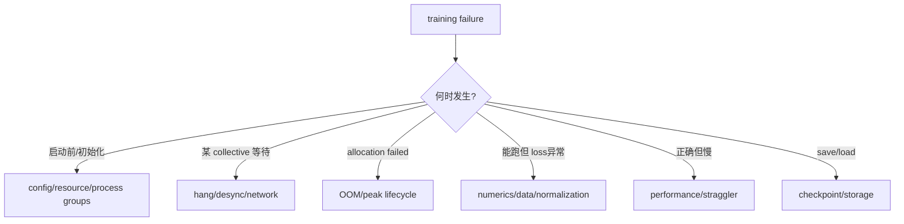
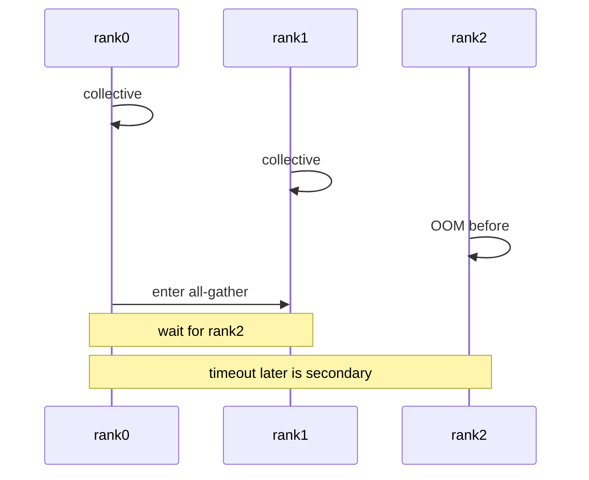
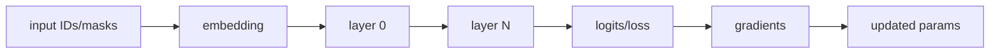

# 分布式训练排障：Hang、OOM、数值错与性能退化

第一原则：**timeout 往往是最后被发现的症状，不是最早发生的错误。**rank 3 先 OOM/抛异常，rank 4 仍在等它的 collective，半小时后才报 NCCL timeout。排障应重建所有 ranks 的时间线，找第一个偏离共同协议的事件。

## 先归类，再动配置



不要同时降低 batch、打开 recompute、换 NCCL 算法和关 compile。每次假设要有可反驳的证据和单变量实验。

## 第 0 步：保存现场

在重启/清日志前收集：

```text
exact command + resolved config + env diff
code/container/package/CUDA/NCCL revisions
node/GPU/NIC topology and rank mapping
all-rank logs with timestamp/rank/host/PID
first traceback and last completed phase/collective per rank
GPU Xid/ECC/thermal/clock state
memory snapshot / profiler / flight-recorder dumps
checkpoint/storage events
last batch sample IDs, shapes, token counts
```

只保存 rank0 尾部 100 行通常会丢掉根因。日志需要统一时钟或至少记录每节点时间偏差。

## 启动/初始化失败

按从外到内检查：

1. launcher 是否创建预期 `WORLD_SIZE`；
2. 每 rank 的 `RANK/LOCAL_RANK/device/hostname` 是否唯一且正确；
3. world 是否满足 degree product；
4. process group members/order 是否一致；
5. model hidden/head/layer/expert/sequence divisibility；
6. 路径、包、custom code 在每节点是否相同；
7. checkpoint format/layout是否支持目标配置。

```bash
nvidia-smi topo -m
env | sort
python -m torch.distributed.run --help
```

环境输出可能含凭证，不应原样上传；只保存白名单变量或先脱敏。

## Hang：用 collective 协议思考

一个 collective 要完成，组内所有 ranks 必须以相同顺序进入兼容 op：

```text
same process group
same collective kind
compatible shape/count/dtype
same sequence number/order
all peers alive and network-reachable
```

任一条件破坏，其他 rank 都可能表现为等待。



### 最常见根因

- 某 rank 更早 OOM/NaN/assert/segfault；
- data-dependent branch 让 ranks 走不同 collective；
- PP microbatch send/recv 顺序或 shape 不一致；
- group 创建/调用顺序不一致；
- 某节点网络接口、路由、防火墙、IB/RoCE 配置错误；
- GPU/NIC 硬件错误或进程被调度器杀死；
- async op 未正确 wait，buffer 生命周期被破坏；
- checkpoint/storage stall 被误认为 NCCL hang。

### 证据顺序

1. 所有 ranks 的第一条异常；
2. Flight Recorder 中最后匹配/不匹配的 collective sequence；
3. op、group members、input shape/dtype/count；
4. rank→host/GPU/NIC mapping；
5. NCCL/transport logs 和系统 GPU errors；
6. 用两节点 collective microbenchmark 隔离网络。

TorchTitan 固定版在 timeout 时可生成 Flight Recorder dumps，说明见 [`docs/debugging.md`](https://github.com/pytorch/torchtitan/blob/fec3e196a4ceb87bfc87fb4f1a36a538d7e98ee4/docs/debugging.md)。`TORCH_NCCL_*` Flight Recorder/desync/timing 环境变量随 PyTorch 版本演进，使用前按实际安装版本的官方 ProcessGroupNCCL 文档核对名称，不复制未知版本的一整套变量。

### 二分方法

```text
multi-node → same config single-node
multi-dim → remove one dimension
real data → fixed synthetic batch
async/overlap → synchronous
compile/fusion → eager/reference
full model → tiny same-structure model
```

若单节点同 world 通过、跨节点失败，优先 topology/transport；若固定 batch 通过、真实数据失败，优先 shape/control-flow/data edge case。

## OOM：定位峰值发生在哪个阶段

只看 `nvidia-smi` 的最后数值不够。把显存分成六本账：params、grads、optimizer、activations、temporary/communication、allocator/framework；再标时间。


### 不同峰值的对策不同

| OOM 时刻 | 可能对象 | 优先实验 |
| --- | --- | --- |
| model init | 完整权重/optimizer先物化 | meta init、先 shard 后 init/load |
| FSDP pre-forward | full unit + prefetch next unit | 缩 wrap unit、关/调 prefetch、reshard policy |
| attention forward | activation/score/workspace | sequence/batch、SDPA backend、CP、recompute |
| PP steady | outstanding microbatches | 1F1B、microbatch/schedule、recompute |
| MoE dispatch | hot expert/A2A buffers | route histogram、capacity、EP mapping |
| optimizer | master/moments/temp grad norm | state sharding、dtype、offload |
| checkpoint | clone/pinned host staging/HF consolidate | async mode、staging buffers、export频率 |

“减 microbatch 后不 OOM”只能证明与 batch-dependent memory相关，不能说明究竟是 attention activation、PP outstanding还是临时 workspace。

### TorchTitan memory snapshot

固定版支持：

```bash
MODULE=llama3 CONFIG=llama3_debugmodel ./run_train.sh \
  --profiler.enable_memory_snapshot \
  --profiler.save_memory_snapshot_folder memory_snapshot
```

snapshot 在 OOM 附近保存 allocation history，可用 PyTorch memory visualizer查看。对照 allocated/reserved/inactive split；reserved 大不自动等于泄漏，也可能是 caching allocator 或 fragmentation。

## 数值错误：从第一个不一致 tensor 二分

症状包括 loss有限但偏移、NaN/Inf、不同并行布局曲线分叉、某 rank grad 为零。排查顺序：

1. 同一 seed checkpoint；
2. 固定 sample IDs/tokenization/masks/labels；
3. 固定 global valid tokens/update 和 loss normalization；
4. 单步、无 dropout或确定 RNG；
5. FP32/eager/reference kernel；
6. layer-by-layer logical output/grad checksum；
7. 再逐个恢复 BF16、fusion、compile、overlap。



找出首个分叉边界，比盯最终 loss 猜原因有效。

### 高频语义错误

- TP/CP ranks 重复计入 loss denominator；
- padding/packing labels未正确 mask；
- vocab-parallel softmax max/sum/target owner错；
- CP causal positions/mask错；
- PP stages消费 batch/microbatch顺序错；
- FSDP gradient又被框架除一次；
- activation checkpoint未恢复 RNG；
- MoE dropped tokens/aux loss口径不同；
- optimizer overflow时 scheduler仍推进。

确定性模式可帮助定位，但会改变 kernel和性能；通过 deterministic run 不代表生产 fast path 正确，仍需逐特性恢复。

## 性能退化：先拆 step，不看单一利用率

$$
t_{step}=t_{data}+t_{compute}+t_{exposed\ comm}+t_{optimizer}+t_{checkpoint}+t_{idle}
$$

overlap 后不能简单相加所有 kernel duration，应看 critical path 与 exposed gaps。

| 现象 | 需要的证据 | 常见原因 |
| --- | --- | --- |
| 所有 GPU 利用率低 | CPU/GPU timeline | data/tokenizer、compile、频繁小 op、sync |
| 周期性长尾 | per-rank step + checkpoint | save/GC/eval/thermal/storage |
| 一 rank 慢拖全局 | stage/rank time distribution | hardware、NUMA/NIC、MoE hot expert、data skew |
| TP 扩展差 | GEMM size + TP collective | local GEMM太小、跨节点、消息 latency |
| PP bubble大 | per-microbatch stage timeline | M不足、stage imbalance、blocking P2P |
| CP/EP慢 | KV/A2A bytes + imbalance | topology、chunk、head/expert constraints |
| FSDP慢 | AG/RS overlap timeline | wrap粒度、prefetch、network、reshard policy |

### profile 的正确对照

- 跳过 warmup/compile首步；
- 同一 global tokens/update；
- 同一 precision/model/data；
- 同时报告 median 和 p95/p99；
- 分 rank，不只 rank0；
- 记录 profiler 自身 overhead；
- 至少一个无 profiler 的长稳态吞吐 run。

MFU/TFLOP/s 的 FLOPs 估算对 MoE、varlen、recompute可能不同，比较前先统一公式。

## 网络与拓扑核查

```text
rank → hostname → local GPU PCIe/NVLink → NUMA → NIC/HCA → switch path
```

检查：

- launcher rank order 与 process-group order；
- `NCCL_SOCKET_IFNAME`/HCA 选择是否一致；
- MTU、RoCE PFC/ECN 或 IB 状态；
- GPU Direct RDMA 实际启用情况；
- 容器内设备/NIC visibility；
- 多个 jobs 是否 oversubscribe NIC/CPU/storage；
- TP/CP/EP 高频 group 是否跨慢链路。

先运行 NCCL Tests 的 message sizes覆盖训练真实 collective范围；单个 1GB all-reduce 带宽不能代表许多 64KB消息的 latency。

## 一张症状到首查层的表

| 症状 | 第一层证据 | 不要先做 |
| --- | --- | --- |
| actor/rank没启动 | launcher/resource/env | 调 NCCL算法 |
| collective timeout | 全rank最早异常 + flight record | 只增加 timeout |
| 某 rank OOM | allocation timeline + local role | 全局盲减 batch |
| loss差整数倍 | token/sample count + reduction group | 调 learning rate |
| 多卡比单卡慢 | step breakdown + local GEMM/bytes | 加更多卡 |
| save后作业抖动 | staging/storage/host RAM | 关所有 checkpoint |
| resume后分叉 | full state + next batch/RNG | 只比较 model weights |

## 最小故障演练

在非生产小作业中主动注入：

1. 一个 rank 在 collective 前抛异常；
2. 一个 rank sleep 超过 timeout；
3. 将 sequence/microbatch推到刚好 OOM；
4. 制造 MoE hot expert；
5. async save 中 kill 一个 rank；
6. 删除一个 checkpoint shard；
7. 降低一张 GPU clock/制造慢 rank（在可控环境）。

验收报警能指出 rank/phase/op，作业能终止而非无限挂起，checkpoint不会发布为 complete，runbook能在目标时间内定位。

## 可交付的 incident bundle

```text
summary: impact + first bad timestamp
expected vs actual topology/config
timeline of all ranks around first divergence
first exception, last collective, memory phase
minimal reproducer and last-known-good config
single-variable experiments and outcomes
root cause with evidence
fix + regression test + observability gap
```

“重启后好了”是恢复动作，不是 root cause。

## 通关标准

你应能从所有 rank 时间线找最早错误；用 collective contract解释 hang；按阶段定位 OOM；从首个 tensor分叉定位数值问题；用 critical-path step breakdown诊断性能，并完成一次 rank crash/partial checkpoint 故障演练。

课程最后用[源码、论文与术语](../appendix/references)建立长期更新入口。
