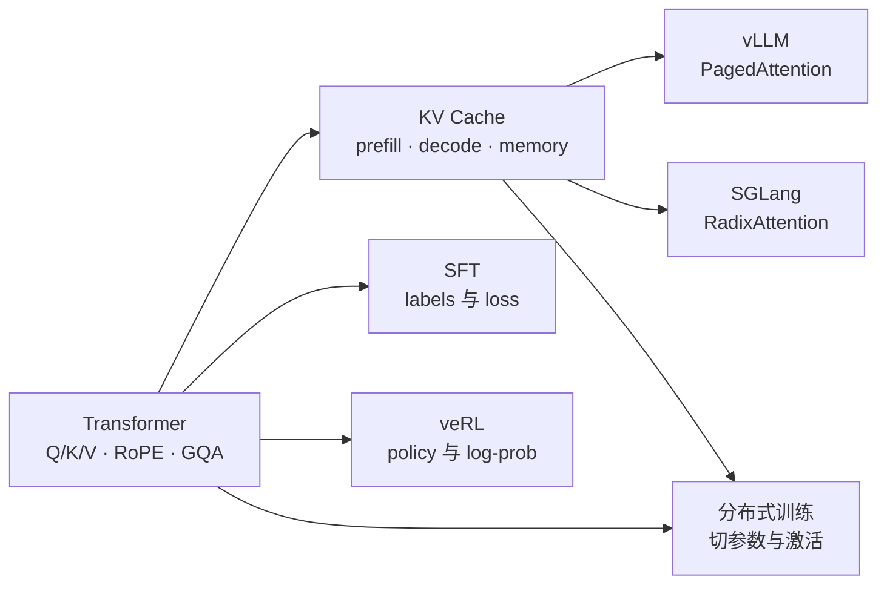

# Transformer 与 KV Cache 共同基础

这不是第六个框架，而是其余五条路线共享的语言。学完后，你应该能从张量形状解释一个 decoder block，能证明 KV Cache 为什么与完整因果注意力等价，也能算出一条请求真实占用多少缓存。

## 固定源码边界

| 项目 | 固定提交 | 本课程用它回答什么 |
| --- | --- | --- |
| Transformers | [`e52d0fd`](https://github.com/huggingface/transformers/tree/e52d0fd6fa9eb874f7c2da048198276b04c919b9) | Llama decoder、RoPE、GQA、Dynamic/Static Cache 的真实调用链 |
| PyTorch | [`e11b512`](https://github.com/pytorch/pytorch/tree/e11b512fef37205cc3b83872eabd92c3cdf05a28) | scaled dot-product attention 的数学参考实现与后端边界 |
| vLLM | [`61141ed`](https://github.com/vllm-project/vllm/tree/61141ed265bfef41a0ca19e992567ea980919b96) | 语义正确的 KV Cache 如何进入分页内存和调度系统 |

固定提交意味着行号、判断和实验能复查；它不意味着这些实现永远不变。

## 14 天学习路径

| 天 | 学习任务 | 当天必须交付的证据 |
| --- | --- | --- |
| 1 | 建立 `B/T/D/H/Dh` 张量语言 | 手画一张 decoder-only 数据流图 |
| 2 | embedding、RMSNorm、残差 | 写出每步输入输出 shape |
| 3 | 推导 scaled dot-product attention | 手算一个 2-token attention |
| 4 | causal mask 与自回归生成 | 解释为什么未来 token 不可见 |
| 5 | MHA、GQA、MQA 与 RoPE | 算三种结构的 K/V shape |
| 6 | SwiGLU、LM head、交叉熵 | 从 token 走到 next-token loss |
| 7 | 对照 Llama 与 PyTorch 源码 | 留下固定链接和调用链笔记 |
| 8 | 从因果不变性推导 KV Cache | 说清为什么缓存 K/V，不缓存 Q |
| 9 | prefill 与逐 token decode | 画出 cache 每步增长过程 |
| 10 | 算显存账本 | 给自己的模型算 bytes/token |
| 11 | DynamicCache 与 StaticCache | 对比增长、编译和浪费 |
| 12 | 跑等价性实验 | 保存命令、参数和 PASS 输出 |
| 13 | cache 失效条件与常见 bug | 构造 position/mask 错误案例 |
| 14 | 连接 PagedAttention/RadixAttention | 写一页“语义缓存 vs 内存管理”总结 |

## 两门必修

1. [Transformer：从张量到 Llama 源码](./transformer)——先能解释 Q/K/V、RoPE、GQA、MLP、残差与 logits。
2. [KV Cache：从等价性证明到显存账本](./kv-cache)——再理解 prefill/decode、动态/静态缓存、失效条件和可下载实验。

## 结业门槛

不要用“看完了”作为完成标准。你需要不看答案完成下面五件事：

- 给定 `hidden_size=4096, num_attention_heads=32, num_key_value_heads=8`，写出 Q/K/V 的 shape；
- 解释 causal 模型中历史 token 的 K/V 为什么不会因未来 token 到来而改变；
- 区分“每步 decode 读取历史的复杂度”和“不用 cache 重算整个前缀的复杂度”；
- 用模型配置算出 KV bytes/token、单请求容量与并发容量；
- 沿固定源码指出 cache 在哪里创建、更新、增长，并说明 vLLM 分页解决的是哪一层问题。

通过后再进入 [vLLM](../vllm/)、[SGLang](../sglang/)、[SFT](../sft/)、[veRL](../verl/) 或[分布式训练](../distributed/)，后面的源码会少很多“看懂每一行却不知道为什么”的断点。

