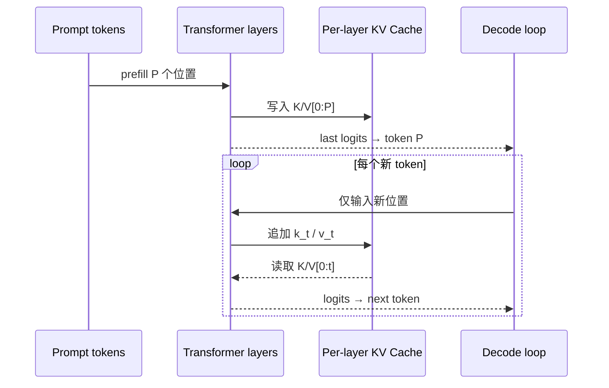

<script setup>
import kvCacheEquivalenceUrl from './code/kv_cache_equivalence.py?url'
</script>

# KV Cache：从等价性证明到显存账本

KV Cache 是**每一层历史 token 的 key/value 张量**。它不是模型权重，不是最终 hidden state，也不是“把答案记住”。它让下一步只计算新 token 的层内表示，同时复用不会改变的历史 K/V。

## 为什么成立：因果不变性

在正确的 causal attention 中，位置 $i$ 只能看 $0\ldots i$。未来 token $x_{i+1}$ 到来时，历史位置 $i$ 的输入上下文没有变化，因此每一层历史 hidden state 以及由它投影出的 $K_i,V_i$ 都不变。

新位置 $t$ 只需计算：

$$
q_t=h_tW_Q,\quad k_t=h_tW_K,\quad v_t=h_tW_V
$$

然后把 $k_t,v_t$ 追加到缓存，并求：

$$
o_t=\operatorname{softmax}\left(\frac{q_t[K_{0:t}]^\top}{\sqrt{D_h}}+M_t\right)[V_{0:t}]
$$

为什么不缓存 Q？历史 query 的输出已经算完，未来不会再次用它们发起查询；新一轮只需要新位置的 $q_t$。K 是可匹配的历史“地址”，V 是被读取的历史“内容”，两者会被所有未来 query 反复使用。

::: warning 等价性有前提
模型权重/LoRA、token 前缀、position/RoPE、attention mask、KV dtype 与相关 attention 语义必须相容。切换 adapter、错一个 position、复用了不同 token 的 cache，都可能 shape 正常但结果错误。
:::

## Prefill 与 decode



| 方法 | 第 $t$ 步做什么 | 代价直觉 |
| --- | --- | --- |
| 无 cache | 再次 forward 整个长度 $t$ 的前缀 | 所有历史层和历史 attention 被反复重算 |
| 有 cache | 只计算新位置，读取历史 K/V | 单步 attention 仍随历史长度 $O(t)$ 增长 |

要严谨地区分：cache 没把 attention 变成常数复杂度。标准 decode 每一步仍需让新 query 读全部历史 K/V，生成 $N$ 个 token 的 attention 读取累计仍是 $O(N^2)$；而每步重算整个前缀会连历史位置之间的 attention 也重做，在只看 attention 矩阵运算时累计可达 $O(N^3)$。

## 显存账本

单层 cache 的逻辑 shape 通常是 `[B,Hkv,T,Dh]`。忽略对齐、元数据、混合层和量化细节，每 token 字节数：

$$
B_{token}=2\times L\times H_{kv}\times D_h\times B_{dtype}
$$

其中 2 表示 K 与 V。32 层、8 KV heads、head dim 128、BF16：

$$
2\times32\times8\times128\times2=131072\text{ bytes}=128\text{ KiB/token}
$$

8K token 约 1 GiB；32 条各 4K token 的活跃请求约 16 GiB，仅是 KV，不含权重、激活、CUDA graph 和工作区。GQA/MQA 降低的是 $H_{kv}$，所以能直接缩小缓存。

::: tip 容量规划顺序
先从模型 config 读取层数、KV heads、head dim 和 cache dtype，再乘活跃 token 总量。不要拿“7B 大约多少缓存”的经验值替代计算。
:::

## Transformers 源码中的真实更新链

按数据流读四处即可：

1. [`LlamaModel.forward`](https://github.com/huggingface/transformers/blob/e52d0fd6fa9eb874f7c2da048198276b04c919b9/src/transformers/models/llama/modeling_llama.py#L355-L425) 在需要时创建 `DynamicCache`，用已缓存长度生成后续 position，再逐层 forward；
2. [`LlamaAttention.forward`](https://github.com/huggingface/transformers/blob/e52d0fd6fa9eb874f7c2da048198276b04c919b9/src/transformers/models/llama/modeling_llama.py#L225-L289) 对新 hidden states 生成 Q/K/V、应用 RoPE，然后调用 `past_key_values.update(...)`；
3. [`Cache.update`](https://github.com/huggingface/transformers/blob/e52d0fd6fa9eb874f7c2da048198276b04c919b9/src/transformers/cache_utils.py#L1157-L1189) 把请求路由到对应 layer；
4. [`DynamicLayer.update`](https://github.com/huggingface/transformers/blob/e52d0fd6fa9eb874f7c2da048198276b04c919b9/src/transformers/cache_utils.py#L112-L188) 沿序列维拼接新 K/V；静态实现则由 [`StaticLayer`](https://github.com/huggingface/transformers/blob/e52d0fd6fa9eb874f7c2da048198276b04c919b9/src/transformers/cache_utils.py#L344-L447) 预分配并按 `cache_position` 原地写入。

官方固定版本文档也分别解释了 [cache 数据流](https://github.com/huggingface/transformers/blob/e52d0fd6fa9eb874f7c2da048198276b04c919b9/docs/source/en/cache_explanation.md) 与 [cache 策略](https://github.com/huggingface/transformers/blob/e52d0fd6fa9eb874f7c2da048198276b04c919b9/docs/source/en/kv_cache.md)。注意：KV Cache 面向推理，训练时启用会破坏预期的训练数据流和显存账本。

## 动态、静态、滑窗、量化与分页不是一回事

| 方案 | 主要解决的问题 | 主要代价 |
| --- | --- | --- |
| Dynamic cache | 长度未知时按步增长 | 拼接/分配形状变化，不利于完整静态编译 |
| Static cache | 预分配最大长度、固定 shape | 未使用槽位浪费，需正确维护 cache position |
| Sliding/chunked cache | 模型只保留有限注意力窗口 | 不能访问窗口外历史，必须由模型语义允许 |
| Offloaded cache | GPU 放不下时把层 cache 转移到 CPU | PCIe/NVLink 传输与延迟 |
| Quantized cache | 降低每元素字节数 | 量化/反量化成本和精度风险 |
| Paged cache | 在线多请求以 block 管理物理 KV | block table、调度和 kernel 都更复杂 |

前五项多在回答“张量怎样保存”；PagedAttention 还回答“许多变长请求怎样共享有限物理显存、避免连续预留和碎片”。继续阅读 [vLLM 的 KV Cache 与 PagedAttention](../vllm/fundamentals/kv-cache)；共享前缀的树结构则见 [SGLang RadixAttention](../sglang/fundamentals/radix-attention)。

## 可下载等价性实验

下载 <a v-bind="{ href: kvCacheEquivalenceUrl, download: 'kv_cache_equivalence.py' }"><code>kv_cache_equivalence.py</code></a>。脚本只用 Python 标准库，做两件事：逐步比较“完整重算”和“追加 K/V”的 tiny causal attention 输出；按传入模型配置计算 cache 容量。

```bash
python3 kv_cache_equivalence.py
python3 kv_cache_equivalence.py \
  --layers 32 --kv-heads 8 --head-dim 128 \
  --bytes-per-element 2 --tokens 4096 --requests 32
```

第一条应输出 `PASS`，默认配置得到 `bytes_per_token: 131072` 和 `total_gib: 1.0`。第二条得到约 16 GiB。实验不是高性能 kernel benchmark；它是可审查的**语义等价性与容量计算器**。

### 必做改造

1. 修改脚本中的一个历史 K，证明断言会失败；
2. 把 `kv_heads` 从 32 改成 8，记录容量倍率；
3. 自己加一个错误的 position-dependent 旋转，只改新 K 不改对应 Q，观察结果偏离；
4. 用你要部署的模型 `config.json` 重算，写出最大 token 预算，不要只写最大请求数。

## 最常见的四类 bug

- **position 错位**：cache 已有 $P$ 个 token，新 token 却又从 position 0 开始；
- **mask 长度错误**：attention mask 没覆盖 `past + current`，或 padding 侧与 position 规则不一致；
- **cache 身份错误**：不同请求、不同 adapter 或不同前缀错误共享；
- **复杂度误判**：以为用了 cache 后每个 decode step 都是 $O(1)$，忽略历史 KV 读取和显存带宽。

## 七天验收

完成实验后，闭卷回答：

1. 为什么缓存历史 hidden state 仍不如直接保存每层 K/V 贴近 attention 使用点？
2. GQA 的 `num_attention_heads` 和 `num_key_value_heads` 哪个进入容量公式？
3. Dynamic cache 与 paged cache 分别解决哪一层问题？
4. prefix cache 命中时，哪些身份条件必须一致？
5. 为什么 KV Cache 降低重复计算，却可能降低服务并发？

能把答案落到公式、shape、源码和实验输出，才算真正掌握。
