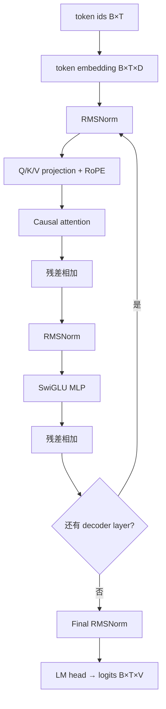

# Transformer：从张量到 Llama 源码

先记住一条主线：**token id → embedding → 多个 decoder layer → norm → logits → 下一个 token**。Attention 负责在序列中取信息，MLP 负责逐位置变换信息，残差让表示和梯度都能沿深层网络流动。

## 先统一 shape 语言

| 符号 | 含义 | 示例 |
| --- | --- | --- |
| $B$ | batch size | 2 |
| $T$ | 序列长度 | 4 |
| $D$ | hidden size | 4096 |
| $H_q$ | query heads | 32 |
| $H_{kv}$ | key/value heads | 8 |
| $D_h$ | head dimension，通常 $D/H_q$ | 128 |
| $V$ | vocabulary size | 128256 |

隐藏状态通常是 `[B,T,D]`。以表中数字为例，Q 是 `[2,32,4,128]`，K/V 是 `[2,8,4,128]`。GQA 在真正做注意力前，让多组 query 共享同一组 K/V。



## 一个 decoder layer 做什么

### 1. RMSNorm：控制尺度

对向量 $x\in\mathbb{R}^{D}$，忽略数值稳定项时：

$$
\operatorname{RMSNorm}(x)=\gamma\odot\frac{x}{\sqrt{\frac{1}{D}\sum_i x_i^2+\epsilon}}
$$

Llama 使用 pre-norm：先归一化，再进入 attention/MLP，最后与旧 residual 相加。固定源码中的 [`LlamaRMSNorm`](https://github.com/huggingface/transformers/blob/e52d0fd6fa9eb874f7c2da048198276b04c919b9/src/transformers/models/llama/modeling_llama.py#L53-L67) 正好对应平方、求均值、开方和可学习权重。

### 2. Q/K/V：查询、地址和值

对隐藏状态 $X$ 做三个线性投影：

$$
Q=XW_Q,\qquad K=XW_K,\qquad V=XW_V
$$

直觉上，Q 表示“当前位置要找什么”，K 表示“每个历史位置可被怎样匹配”，V 表示“匹配后取走什么内容”。单头 scaled dot-product attention 为：

$$
\operatorname{Attention}(Q,K,V)=\operatorname{softmax}\left(\frac{QK^\top}{\sqrt{D_h}}+M\right)V
$$

$M$ 是 causal mask：允许位置 $t$ 看 $0\ldots t$，把未来位置加成负无穷。缩放 $\sqrt{D_h}$ 避免维度增大后点积过大、softmax 过早饱和。

PyTorch 在 [`scaled_dot_product_attention`](https://github.com/pytorch/pytorch/blob/e11b512fef37205cc3b83872eabd92c3cdf05a28/torch/nn/functional.py#L6367-L6503) 文档里给出了等价参考代码；实际运行可能选择 FlashAttention、memory-efficient 或 math backend，**数学语义和具体 kernel 不是同一层**。

### 3. MHA、GQA 与 MQA

| 结构 | $H_q$ 与 $H_{kv}$ | 结果 |
| --- | --- | --- |
| MHA | $H_q=H_{kv}$ | 每个 query head 有独立 K/V，表达力直接，缓存最大 |
| GQA | $1<H_{kv}<H_q$ | 一组 query heads 共享 K/V，质量与缓存折中 |
| MQA | $H_{kv}=1$ | 所有 query heads 共享 K/V，缓存最小 |

Llama 的 [`repeat_kv`](https://github.com/huggingface/transformers/blob/e52d0fd6fa9eb874f7c2da048198276b04c919b9/src/transformers/models/llama/modeling_llama.py#L187-L196) 把 K/V 扩展到 query head 数以供 eager attention 使用；[`eager_attention_forward`](https://github.com/huggingface/transformers/blob/e52d0fd6fa9eb874f7c2da048198276b04c919b9/src/transformers/models/llama/modeling_llama.py#L199-L221) 随后执行缩放点积、mask、softmax 和与 V 相乘。

### 4. RoPE：把位置信息放进 Q/K 的几何关系

RoPE 把每对通道看作二维平面，按位置和频率旋转 Q、K。两个位置的点积因此包含相对位置差。V 不参与“地址匹配”，所以通常不旋转 V。

固定源码里，[`LlamaRotaryEmbedding`](https://github.com/huggingface/transformers/blob/e52d0fd6fa9eb874f7c2da048198276b04c919b9/src/transformers/models/llama/modeling_llama.py#L73-L135) 生成 cos/sin，[`apply_rotary_pos_emb`](https://github.com/huggingface/transformers/blob/e52d0fd6fa9eb874f7c2da048198276b04c919b9/src/transformers/models/llama/modeling_llama.py#L145-L168) 把相同位置规则应用到 Q/K。位置编号一旦和 cache 长度错位，即使 shape 全对，结果也会静默错误。

### 5. SwiGLU MLP 与残差

Llama MLP 可写成：

$$
\operatorname{MLP}(x)=W_{down}\left(\operatorname{SiLU}(W_{gate}x)\odot W_{up}x\right)
$$

源码 [`LlamaMLP`](https://github.com/huggingface/transformers/blob/e52d0fd6fa9eb874f7c2da048198276b04c919b9/src/transformers/models/llama/modeling_llama.py#L171-L184) 与公式逐项对应。完整 [`LlamaDecoderLayer`](https://github.com/huggingface/transformers/blob/e52d0fd6fa9eb874f7c2da048198276b04c919b9/src/transformers/models/llama/modeling_llama.py#L292-L332) 则是两次 `norm → 子层 → residual add`。

## 沿固定源码走一次 forward

按下面顺序读，不要从文件第一行漫游：

1. [`LlamaModel.forward`](https://github.com/huggingface/transformers/blob/e52d0fd6fa9eb874f7c2da048198276b04c919b9/src/transformers/models/llama/modeling_llama.py#L355-L425)：embedding、cache/position、mask、RoPE、layer loop、final norm；
2. [`LlamaAttention.forward`](https://github.com/huggingface/transformers/blob/e52d0fd6fa9eb874f7c2da048198276b04c919b9/src/transformers/models/llama/modeling_llama.py#L225-L289)：投影、reshape、RoPE、cache update 和 attention backend；
3. [`LlamaForCausalLM.forward`](https://github.com/huggingface/transformers/blob/e52d0fd6fa9eb874f7c2da048198276b04c919b9/src/transformers/models/llama/modeling_llama.py#L429-L499)：hidden states 经过 LM head 变为 logits，训练时再计算 loss。

源码主线可压缩为：

```text
input_ids
  → embed_tokens
  → causal_mask + shared position_embeddings
  → decoder_layer × L
      → q_proj/k_proj/v_proj → RoPE → cache.update → attention
      → residual → MLP → residual
  → norm → lm_head → logits
```

## Prefill 与 decode 的结构差异

同一个模型 forward 有两种典型形状：

| 阶段 | 本轮新输入长度 | 历史 K/V | 特点 |
| --- | ---: | ---: | --- |
| prefill | prompt 长度 $P$ | 0 | 大矩阵并行建立整段 prompt 的 cache |
| decode | 通常 1 | $P+t$ | 只投影新 token，但 query 要读取全部历史 K/V |

自回归依赖意味着第 $t+1$ 个输出必须等第 $t$ 个 token 被选出；并行系统能批处理多个请求，却不能凭空消除这条依赖。

## 七天练习与验收

每天完成首页学习表对应任务，并留下三类证据：手算、shape trace、固定源码链接。最终闭卷回答：

1. 为什么 causal mask 是加在 attention score 而不是 V 上？
2. GQA 中 K/V head 少于 Q head，哪一步建立共享关系？
3. RoPE 为什么必须和 cache position 一致？
4. attention backend 换成 FlashAttention 后，模型数学定义是否改变？
5. logits `[B,T,V]` 中哪个位置用于生成下一个 token？训练时为什么可以同时监督多个位置？

答完后进入 [KV Cache：从等价性证明到显存账本](./kv-cache)。

