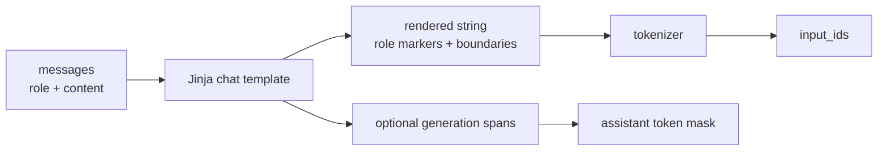

# Chat Template、特殊 token 与训练/推理一致性

聊天模型仍然只读取 token 序列。`role`、多轮边界和工具调用之所以有意义，是因为 chat template 把结构编码成模型训练过的特殊 token 与文本格式。**模板是模型协议，不是网页排版。**

## 从 messages 到 token



Transformers 的入口是 [`PreTrainedTokenizerBase.apply_chat_template()`](https://github.com/huggingface/transformers/blob/e52d0fd6fa9eb874f7c2da048198276b04c919b9/src/transformers/tokenization_utils_base.py#L3002)。TRL 的 `SFTTrainer` 对 conversational dataset 调用它，并可请求 `return_assistant_tokens_mask=True`。

继续读固定实现的 3135–3143 行会看到：渲染后调用 tokenizer 时明确 `add_special_tokens=False`。这证明直接 `apply_chat_template(tokenize=True)` 不会再让 tokenizer 自动补一轮 BOS/EOS；若你先渲染字符串再单独 tokenize，必须自行复现这个开关。

一个抽象模板可能渲染为：

```text
<bos><|system|>你是数学老师。<|eot|>
<|user|>2+3=?<|eot|>
<|assistant|>2+3=5。<|eot|>
```

换成另一模型的 `[INST]...[/INST]` 协议，即使自然语言相同，token 分布也不同。base model 没有 chat template 时，必须明确选择并训练一种协议；不能临时借模板却在部署时换回另一种。

## 训练与推理的两个开关

| 场景 | 完整 assistant answer 已存在 | `add_generation_prompt` 直觉 |
| --- | --- | --- |
| SFT 完整对话 | 是 | 通常 false；不要再加空 assistant 头 |
| 推理 prompt | 否，最后是 user/tool | true；追加 assistant 起始 cue |
| prompt-completion 分别 tokenize | prompt 阶段无 answer | prompt 常需 generation cue，拼接一致性必须检查 |

`SFTTrainer._prepare_dataset()` 对 conversational prompt-completion 会分别 tokenize prompt 和 prompt+completion，并检查前者是否是后者的前缀。whitespace、special token 或模板条件分支破坏 prefix 时，completion boundary 会错位。

## 特殊 token 的三类重复

### 1. 模板已经写 BOS，tokenizer 又自动加 BOS

若先 `apply_chat_template(..., tokenize=False)`，再调用 tokenizer 默认 `add_special_tokens=True`，可能得到重复 BOS/EOS。最安全的是直接让 `apply_chat_template(tokenize=True)` 处理，或明确 `add_special_tokens=False` 并检查 ids。

### 2. EOS 与 EOT 不是同一个概念

- EOS：模型/生成 API 的序列结束 token；
- EOT：某一轮对话结束 token；
- 某些模型复用同一个 id，另一些不复用；
- `pad_token` 也可能临时回退为 EOS，但 attention/labels 必须正确 mask。

不要凭 token 字符串名称假设 id 与语义。打印 tokenizer 的 `bos/eos/pad` ids 与模板实际输出。

### 3. 数据文本里已经含模板标记

若 `content` 已含 `<|assistant|>`，模板又添加一遍，模型会学到双标记。清洗时区分用户本来讨论标记文本的合法样本与管线残留。

## Assistant-only 的 generation markers

模板里的 Jinja 扩展标记：

```jinja
<|assistant|>
{{ message.content }}<|eot|>
```

告诉 tokenizer 哪一段属于 assistant target。它们不会作为字面文本输出，而是产生 assistant mask。

边界放置很重要：

```jinja
{{ message.content }}<|eot|>
```

上面把 EOT 排除在 loss 外；模型可能没学会停止。应逐 token 验证 end-of-turn 是否被 mask 为有效 label。

固定 TRL 在 `assistant_only_loss=True` 时先要求 conversational dataset，再检测 generation marker、尝试为已知模型家族换 training template，并检查停止 token 是否落在监督 span 内；真实分支见 [`SFTTrainer.__init__` 1219–1240](https://github.com/huggingface/trl/blob/f3adc504b93d634666c5628e7bdaa99ec8861028/trl/trainer/sft_trainer.py#L1219)。

“尝试”不是对所有模板生效。[`get_training_chat_template` 875–1024](https://github.com/huggingface/trl/blob/f3adc504b93d634666c5628e7bdaa99ec8861028/trl/chat_template_utils.py#L875) 只为源码列举的模板提供补丁，未知且不兼容的模板在 1021–1024 行报错。是否训练停止 token 的探针位于 [`is_chat_template_stop_token_trained` 747–813](https://github.com/huggingface/trl/blob/f3adc504b93d634666c5628e7bdaa99ec8861028/trl/chat_template_utils.py#L747)，warning 也不等于自动修复。

Transformers 怎样把 Jinja 字符 span 变成 token mask，可直接读 [`apply_chat_template` 3146–3167](https://github.com/huggingface/transformers/blob/e52d0fd6fa9eb874f7c2da048198276b04c919b9/src/transformers/tokenization_utils_base.py#L3146)：对每个 generation 字符区间调用 `char_to_token`，再把对应 token 位置置 1。截断导致起始字符越界时会停止处理后续 span，因此长对话必须在截断后检查 mask。

## Prefix preservation 与多轮/工具调用

对话追加新消息时，之前消息的渲染最好保持完全相同：

$$
render(m_1,\ldots,m_k)\;\text{是}\;render(m_1,\ldots,m_k,m_{k+1})\;\text{的前缀}
$$

若模板根据 `loop.last` 改写之前 assistant 的 reasoning/tool 格式，训练 mask、prompt-completion boundary、推理 prefix cache 都可能不一致。

工具数据还要验证状态机：assistant tool call → tool result → assistant response。schema 只是内容；模板必须用模型认识的 token/格式表达这些角色。

## 五个必须保存的模板测试

```python
cases = {
    "single_turn": [...],
    "system_turn": [...],
    "multi_turn": [...],
    "tool_call": [...],
    "reasoning": [...],
}

for name, messages in cases.items():
    rendered = tokenizer.apply_chat_template(messages, tokenize=False)
    encoded = tokenizer.apply_chat_template(
        messages,
        tokenize=True,
        return_dict=True,
        return_assistant_tokens_mask=True,
    )
    print(name, repr(rendered), encoded)
```

不同 Transformers 版本的可用参数/返回字段会变化，以固定环境签名为准。测试应断言：

- 无意外重复 BOS/EOS；
- 每轮 role/order 正确；
- assistant mask 只覆盖目标且包含 EOT；
- 推理 prompt 末尾有正确 generation cue；
- append message 后旧前缀保持不变；
- tokenize(rendered) 与直接 tokenize 模式语义一致。

### 可直接运行的 golden probe

```python
# MODEL 必须固定 revision；示例要求 tokenizer 自带 chat template。
import hashlib
import json
import os
from transformers import AutoTokenizer

model_id = os.environ["MODEL"]
revision = os.environ["REVISION"]
template_name = os.environ.get("CHAT_TEMPLATE_NAME")
tok = AutoTokenizer.from_pretrained(model_id, revision=revision)
# chat_template 可以是字符串，也可以是多模板 dict。统一通过公开解析入口
# 选出本次真正使用的 Jinja 字符串；多模板且无 default 时需显式给名称。
selected_template = tok.get_chat_template(template_name)
messages = [
    {"role": "system", "content": "回答要简短。"},
    {"role": "user", "content": "2+3=?"},
    {"role": "assistant", "content": "5。"},
]

rendered = tok.apply_chat_template(
    messages, chat_template=selected_template, tokenize=False
)
out = tok.apply_chat_template(
    messages,
    chat_template=selected_template,
    tokenize=True,
    return_dict=True,
    return_assistant_tokens_mask=True,
)
ids = out["input_ids"]
mask = out["assistant_masks"]
assert len(ids) == len(mask) and any(mask)
assert all(bit in (0, 1) for bit in mask)

# 直接 tokenize 的实现就是 add_special_tokens=False；这条断言防重复 BOS/EOS。
manual = tok(rendered, add_special_tokens=False)["input_ids"]
assert ids == manual

prompt = messages[:-1]
prompt_ids = tok.apply_chat_template(
    prompt,
    chat_template=selected_template,
    tokenize=True,
    return_dict=False,
    add_generation_prompt=True,
)
assert len(prompt_ids) > 0
print(json.dumps({
    "template_name": template_name or "resolved-default",
    "template_sha256": hashlib.sha256(selected_template.encode()).hexdigest(),
    "ids": ids,
    "assistant_positions": [i for i, bit in enumerate(mask) if bit],
    "prompt_tail": prompt_ids[-8:],
}, ensure_ascii=False, indent=2))
```

```bash
MODEL=your/model REVISION=full-commit python template_probe.py > template-golden.json
```

多模板 tokenizer 需要再设置 `CHAT_TEMPLATE_NAME=具体名称`。预期不是某组通用 token id，而是：退出码 0、assistant positions 非空、直接/间接 tokenization 相同，并把“解析后的模板名称 + hash”纳入版本控制。若报“模板不支持 generation”，不要伪造全 1 mask；先选择/修正训练模板，再逐 token 检查 EOT。

## 源码反推的四个互斥/依赖条件

| 条件 | 固定源码 | 结论 |
| --- | --- | --- |
| assistant mask 请求 | [`3092–3093`](https://github.com/huggingface/transformers/blob/e52d0fd6fa9eb874f7c2da048198276b04c919b9/src/transformers/tokenization_utils_base.py#L3092) | 必须同时 `tokenize=True, return_dict=True` |
| continue final message | [`3112–3118`](https://github.com/huggingface/transformers/blob/e52d0fd6fa9eb874f7c2da048198276b04c919b9/src/transformers/tokenization_utils_base.py#L3112) | 不能与 generation prompt 或 assistant mask 同时使用 |
| conversational prompt-completion | [`1464–1481`](https://github.com/huggingface/trl/blob/f3adc504b93d634666c5628e7bdaa99ec8861028/trl/trainer/sft_trainer.py#L1464) | prompt 单独编码时加 generation cue，full 编码时取 assistant mask |
| mask 为空 | [`1521–1527`](https://github.com/huggingface/trl/blob/f3adc504b93d634666c5628e7bdaa99ec8861028/trl/trainer/sft_trainer.py#L1521) | 任一样本无 assistant token 时直接 RuntimeError |

## 训练/部署一致性清单

```text
[ ] same tokenizer files and revision
[ ] same chat_template content/hash
[ ] same BOS/EOS/EOT/pad ids
[ ] same tool/reasoning template kwargs
[ ] inference uses add_generation_prompt correctly
[ ] stop token ids match trained turn boundaries
[ ] serving engine does not apply a second template
```

模型在离线脚本正常、服务端胡言乱语时，第一步比较最终 `input_ids`，不要先换采样参数。

## 通关标准

你应能从 messages 手工画出 rendered string 与 special tokens；解释 generation marker 如何产生 assistant mask；识别 double-templating、double-BOS、EOT 未监督和 prefix 不保持四类错误。

下一课进入[Label Mask、截断与 Packing](./masking-packing)。
