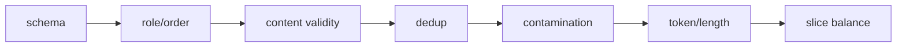

# SFT 数据格式、质量与切分

SFT 的上限通常先由数据定义。更多样本不自动更好：重复、互相矛盾、模板污染、评估泄漏和错误角色会给模型更强、更一致的坏信号。

## 先分“类型”与“格式”

固定 TRL 支持的两类常用任务表示：

| 类型 | 标准格式 | 对话格式 | 默认监督直觉 |
| --- | --- | --- | --- |
| language modeling | `{"text": "..."}` | `{"messages": [...]}` | 整段，除非 assistant mask |
| prompt-completion | `{"prompt": "...", "completion": "..."}` | prompt/completion 都是 messages | 通常 completion-only |

例子：

```json
{"messages": [
  {"role": "system", "content": "你是严谨的数学老师。"},
  {"role": "user", "content": "2+3=?"},
  {"role": "assistant", "content": "2+3=5。"}
]}
```

```json
{
  "prompt": [{"role": "user", "content": "2+3=?"}],
  "completion": [{"role": "assistant", "content": "2+3=5。"}]
}
```

两者渲染后可能相同，但 trainer 识别 dataset type 后对 `completion_only_loss=None` 的决策不同。schema 是训练语义的一部分，不只是存储偏好。

## 数据契约先于清洗代码

为每个 dataset 写一页 contract：

```yaml
task: chinese_math_instruction
unit: one multi-turn conversation
allowed_roles: [system, user, assistant, tool]
required_last_role: assistant
language: zh-CN
max_raw_chars: 20000
quality_rules:
  - answer is independently verifiable
  - no hidden benchmark solutions
  - tool result follows a tool call
split_key: problem_family_id
license: ...
source_revision: ...
```

这份契约让 validation 可执行，也避免多人处理后任务定义漂移。

## 七层质量检查



### 1. Schema

字段存在、类型一致、content 非空、编码可解、数值范围正确。不要让 `None` 被字符串化成 `"None"` 后悄悄进入模板。

### 2. Role 与状态机

检查 system 位置、user/assistant 顺序、tool call 与 tool result 配对、多轮最后角色。错误 role 会改变 special token 和 loss mask。

### 3. 内容正确性

用规则、执行器、检索或专家抽样验证事实/代码/数学答案。SFT 会忠实模仿标签；高置信错误比少量噪声更危险。

### 4. 去重

至少区分 exact duplicate、规范化文本 duplicate、near duplicate 和同题不同表述。重复会改变样本权重，也可能跨 train/eval 泄漏。

### 5. 污染与泄漏

先 split 再按全量去重通常太晚。应基于原始来源、problem id、document family 或近似 hash 建组，再按组切分，确保同源变体不跨 split。

### 6. Token 与长度

用**训练时同一个 tokenizer/template**统计长度、有效 labels、截断比例和 EOS。字符数不能替代 token 数。

### 7. Slice 平衡

按任务、语言、难度、来源、答案长度、工具使用和安全类别查看占比。总体指标很好可能只因简单 slice 过多。

## 切分单位决定泄漏风险

| 数据形态 | 错误切法 | 更可靠的 group key |
| --- | --- | --- |
| 同一文档切多个 QA | 按 QA row 随机 | document id |
| 同一题多种改写 | 按文本 exact hash | canonical problem/fuzzy cluster |
| 多轮对话滑窗 | 按 window 随机 | conversation id |
| 代码仓库片段 | 按函数随机 | repo + commit/project |
| 用户历史 | 按 message 随机 | user/tenant（需隐私审查） |

eval 不应只是 train 的换一种标点。

## 混合数据集不是简单 concat

若数据集 $i$ 有采样概率 $q_i$，它实际贡献还受平均有效 target tokens $E[T_i]$ 影响：

$$
share_i\approx\frac{q_i E[T_i]}{\sum_j q_j E[T_j]}
$$

按“样本数 50/50”混合长推理与短分类，token 监督可能远非 50/50。记录每个来源的 sampled examples、input tokens 和 non-masked labels。

还要处理冲突：不同来源对语气、拒答、思维过程、单位或工具格式定义不一致时，应先建立优先规则，而不是指望模型自动折中。

## Reasoning 数据的特殊问题

训练 `<think>` 或 reasoning content 前明确产品目标：

- 是否希望模型对用户展示推理；
- 推理是否真实、可验证，还是答案反推的叙事；
- 部署 template/parser 是否与训练一致；
- 是否只监督 final answer，还是 reasoning+answer；
- 超长 reasoning 被截断后还剩多少答案 target。

“有更长 CoT”不等于更优监督。错误或模板化推理会教模型产生看似合理的噪声。

## 数据版本清单

每次 run 保存：

```json
{
  "dataset_revision": "sha256-or-repo-commit",
  "source_counts": {"source_a": 12000, "source_b": 8000},
  "split_group_key": "problem_family_id",
  "dedup_method": "normalized_exact+minhash-v2",
  "template_hash": "...",
  "tokenizer_revision": "...",
  "num_train": 18000,
  "num_eval": 2000,
  "p50_p95_p99_tokens": [420, 1800, 3900],
  "truncated_fraction": 0.017,
  "fully_masked_fraction": 0.0
}
```

不要在 manifest 中存原始隐私文本或访问 token。保存统计、版本与受控数据地址即可。

## 最小审计程序要输出什么

对全量统计：schema failure、role failure、empty content、exact/near duplicate cluster、split overlap、长度直方图、有效 label 比例、截断/EOS、每来源占比。再从每个 slice 抽 20 条人工查看渲染结果。

自动规则擅长发现格式问题，不擅长判断回答是否真正有帮助；人工抽样也不能替代全量泄漏检测。两者都需要。

## 通关练习

一个数据集有 10 万条 QA，由 1 万篇文档各生成 10 条；你随机按 row 做 90/10 split，eval 很高。最先怀疑 document-level leakage。重建 split 时用 document id 分组，再在 train/eval 全量做 exact 与 near-duplicate 检查。

## 通关标准

你应能区分数据 type 与 format；为数据写可执行 contract；说明为什么 split 必须早于某些清洗/增强步骤；用有效 target token 而不是 row 数衡量混合权重。

下一课进入[Chat Template 与特殊 token](./chat-template)。
