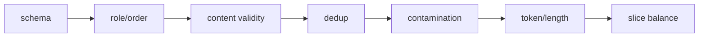

# SFT 数据格式、质量与切分

SFT 的上限通常先由数据定义。更多样本不自动更好：重复、互相矛盾、模板污染、评估泄漏和错误角色会给模型更强、更一致的坏信号。

## 先分“类型”与“格式”

固定 TRL 支持的两类常用任务表示：

| 类型 | 标准格式 | 对话格式 | 默认监督直觉 |
| --- | --- | --- | --- |
| language modeling | `{"text": "..."}` | `{"messages": [...]}` | 整段，除非 assistant mask |
| prompt-completion | `{"prompt": "...", "completion": "..."}` | prompt/completion 都是 messages | 通常 completion-only |

例子：

```json
{"messages": [
  {"role": "system", "content": "你是严谨的数学老师。"},
  {"role": "user", "content": "2+3=?"},
  {"role": "assistant", "content": "2+3=5。"}
]}
```

```json
{
  "prompt": [{"role": "user", "content": "2+3=?"}],
  "completion": [{"role": "assistant", "content": "2+3=5。"}]
}
```

两者渲染后可能相同，但 trainer 识别 dataset type 后对 `completion_only_loss=None` 的决策不同。schema 是训练语义的一部分，不只是存储偏好。

源码证据：固定 [`SFTTrainer` 文档与构造参数 831–850](https://github.com/huggingface/trl/blob/f3adc504b93d634666c5628e7bdaa99ec8861028/trl/trainer/sft_trainer.py#L831) 明确列出 LM/prompt-completion、standard/conversational 与预 tokenized 三组维度；实际默认判定在 [`1170–1176`](https://github.com/huggingface/trl/blob/f3adc504b93d634666c5628e7bdaa99ec8861028/trl/trainer/sft_trainer.py#L1170)，只检查首条样本是否同时含 `prompt` 和 `completion`。因此一个 dataset 混入异构 schema 时不会逐行替你选择目标，必须在进入 trainer 前拒绝。

## 数据契约先于清洗代码

为每个 dataset 写一页 contract：

```yaml
task: chinese_math_instruction
unit: one multi-turn conversation
allowed_roles: [system, user, assistant, tool]
required_last_role: assistant
language: zh-CN
max_raw_chars: 20000
quality_rules:
  - answer is independently verifiable
  - no hidden benchmark solutions
  - tool result follows a tool call
split_key: problem_family_id
license: ...
source_revision: ...
```

这份契约让 validation 可执行，也避免多人处理后任务定义漂移。

## 七层质量检查



### 1. Schema

字段存在、类型一致、content 非空、编码可解、数值范围正确。不要让 `None` 被字符串化成 `"None"` 后悄悄进入模板。

### 2. Role 与状态机

检查 system 位置、user/assistant 顺序、tool call 与 tool result 配对、多轮最后角色。错误 role 会改变 special token 和 loss mask。

### 3. 内容正确性

用规则、执行器、检索或专家抽样验证事实/代码/数学答案。SFT 会忠实模仿标签；高置信错误比少量噪声更危险。

### 4. 去重

至少区分 exact duplicate、规范化文本 duplicate、near duplicate 和同题不同表述。重复会改变样本权重，也可能跨 train/eval 泄漏。

### 5. 污染与泄漏

先 split 再按全量去重通常太晚。应基于原始来源、problem id、document family 或近似 hash 建组，再按组切分，确保同源变体不跨 split。

### 6. Token 与长度

用**训练时同一个 tokenizer/template**统计长度、有效 labels、截断比例和 EOS。字符数不能替代 token 数。

### 7. Slice 平衡

按任务、语言、难度、来源、答案长度、工具使用和安全类别查看占比。总体指标很好可能只因简单 slice 过多。

## 切分单位决定泄漏风险

| 数据形态 | 错误切法 | 更可靠的 group key |
| --- | --- | --- |
| 同一文档切多个 QA | 按 QA row 随机 | document id |
| 同一题多种改写 | 按文本 exact hash | canonical problem/fuzzy cluster |
| 多轮对话滑窗 | 按 window 随机 | conversation id |
| 代码仓库片段 | 按函数随机 | repo + commit/project |
| 用户历史 | 按 message 随机 | user/tenant（需隐私审查） |

eval 不应只是 train 的换一种标点。

## 混合数据集不是简单 concat

若数据集 $i$ 有采样概率 $q_i$，它实际贡献还受平均有效 target tokens $E[T_i]$ 影响：

$$
share_i\approx\frac{q_i E[T_i]}{\sum_j q_j E[T_j]}
$$

按“样本数 50/50”混合长推理与短分类，token 监督可能远非 50/50。记录每个来源的 sampled examples、input tokens 和 non-masked labels。

还要处理冲突：不同来源对语气、拒答、思维过程、单位或工具格式定义不一致时，应先建立优先规则，而不是指望模型自动折中。

## Reasoning 数据的特殊问题

训练 `<think>` 或 reasoning content 前明确产品目标：

- 是否希望模型对用户展示推理；
- 推理是否真实、可验证，还是答案反推的叙事；
- 部署 template/parser 是否与训练一致；
- 是否只监督 final answer，还是 reasoning+answer；
- 超长 reasoning 被截断后还剩多少答案 target。

“有更长 CoT”不等于更优监督。错误或模板化推理会教模型产生看似合理的噪声。

## 数据版本清单

每次 run 保存：

```json
{
  "dataset_revision": "sha256-or-repo-commit",
  "source_counts": {"source_a": 12000, "source_b": 8000},
  "split_group_key": "problem_family_id",
  "dedup_method": "normalized_exact+minhash-v2",
  "template_hash": "...",
  "tokenizer_revision": "...",
  "num_train": 18000,
  "num_eval": 2000,
  "p50_p95_p99_tokens": [420, 1800, 3900],
  "truncated_fraction": 0.017,
  "fully_masked_fraction": 0.0
}
```

不要在 manifest 中存原始隐私文本或访问 token。保存统计、版本与受控数据地址即可。

## 最小审计程序要输出什么

对全量统计：schema failure、role failure、empty content、exact/near duplicate cluster、split overlap、长度直方图、有效 label 比例、截断/EOS、每来源占比。再从每个 slice 抽 20 条人工查看渲染结果。

自动规则擅长发现格式问题，不擅长判断回答是否真正有帮助；人工抽样也不能替代全量泄漏检测。两者都需要。

### 可运行的零依赖结构/泄漏门禁

下面脚本实现示例 contract 的最早一道门：JSONL 可解析、system 只能在首位、user/assistant 顺序合法、assistant `tool_calls[].id` 与随后 `tool_call_id` 全部配对、最后角色满足参数、同一 `group_key` 不跨 train/eval、规范化 exact 文本不跨 split。它不声称解决 near-duplicate 或答案事实性；那两项必须另做模型/规则/人工验证。

```python
# audit_sft_jsonl.py
import argparse
import hashlib
import json
import re
import sys
from pathlib import Path

ROLES = {"system", "user", "assistant", "tool"}


def read_jsonl(path):
    for line_no, line in enumerate(Path(path).read_text(encoding="utf-8").splitlines(), 1):
        if not line.strip():
            continue
        try:
            yield line_no, json.loads(line)
        except json.JSONDecodeError as exc:
            raise ValueError(f"{path}:{line_no}: invalid JSON: {exc}") from exc


def validate_messages(messages, where, required_last_role):
    if not isinstance(messages, list) or not messages:
        raise ValueError(f"{where}: messages must be a non-empty list")
    texts = []
    previous = None
    pending_tool_ids = set()
    for i, msg in enumerate(messages):
        if not isinstance(msg, dict) or msg.get("role") not in ROLES:
            raise ValueError(f"{where}: message[{i}] has invalid role/schema")
        role = msg["role"]
        raw_calls = msg.get("tool_calls")
        call_ids = []
        if raw_calls is not None:
            if role != "assistant" or not isinstance(raw_calls, list) or not raw_calls:
                raise ValueError(f"{where}: message[{i}] has invalid tool_calls")
            for j, call in enumerate(raw_calls):
                call_id = call.get("id") if isinstance(call, dict) else None
                if not isinstance(call_id, str) or not call_id:
                    raise ValueError(f"{where}: message[{i}].tool_calls[{j}] missing id")
                if call_id in call_ids:
                    raise ValueError(f"{where}: message[{i}] repeats tool call id {call_id!r}")
                call_ids.append(call_id)

        content = msg.get("content")
        content_is_text = isinstance(content, str) and bool(content.strip())
        # 发起 tool call 的 assistant 可没有自然语言 content；其他消息必须有文本。
        if not content_is_text and not (role == "assistant" and call_ids and content in (None, "")):
            raise ValueError(f"{where}: message[{i}].content is empty/non-string")

        if role == "system":
            if i != 0:
                raise ValueError(f"{where}: system is only allowed at message[0]")
        elif role == "user":
            if previous not in (None, "system", "assistant"):
                raise ValueError(f"{where}: user cannot follow {previous!r}")
            if pending_tool_ids:
                raise ValueError(f"{where}: user arrived before tool results {sorted(pending_tool_ids)}")
        elif role == "assistant":
            if previous not in ("user", "tool"):
                raise ValueError(f"{where}: assistant cannot follow {previous!r}")
            if pending_tool_ids:
                raise ValueError(f"{where}: missing tool results {sorted(pending_tool_ids)}")
            pending_tool_ids = set(call_ids)
        else:  # tool
            if previous not in ("assistant", "tool") or not pending_tool_ids:
                raise ValueError(f"{where}: tool result has no pending assistant tool call")
            tool_call_id = msg.get("tool_call_id")
            if tool_call_id not in pending_tool_ids:
                raise ValueError(
                    f"{where}: message[{i}].tool_call_id {tool_call_id!r} is not pending"
                )
            pending_tool_ids.remove(tool_call_id)

        texts.append(json.dumps(msg, ensure_ascii=False, sort_keys=True))
        previous = role

    if pending_tool_ids:
        raise ValueError(f"{where}: unresolved tool calls {sorted(pending_tool_ids)}")
    if required_last_role and messages[-1]["role"] != required_last_role:
        raise ValueError(
            f"{where}: last role must be {required_last_role!r}, "
            f"got {messages[-1]['role']!r}"
        )
    return texts


def validate_row(row, where, required_last_role):
    if not isinstance(row, dict):
        raise ValueError(f"{where}: row must be an object")
    if "messages" in row:
        if "prompt" in row or "completion" in row:
            raise ValueError(f"{where}: mixed LM and prompt-completion schema")
        return validate_messages(row["messages"], where, required_last_role)
    if "prompt" not in row or "completion" not in row:
        raise ValueError(f"{where}: expected messages or prompt+completion")
    prompt, completion = row["prompt"], row["completion"]
    if isinstance(prompt, str) and isinstance(completion, str):
        if not prompt.strip() or not completion.strip():
            raise ValueError(f"{where}: prompt/completion must be non-empty")
        return [f"prompt:{prompt}", f"completion:{completion}"]
    if isinstance(prompt, list) and isinstance(completion, list):
        # conversational prompt-completion 的状态机必须在拼接后验证，不能把
        # 以 user 结尾的 prompt 和以 assistant 开头的 completion 分开误判。
        return validate_messages(prompt + completion, where, required_last_role)
    raise ValueError(f"{where}: prompt/completion must both be strings or both be message lists")


def fingerprint(parts):
    normalized = re.sub(r"\s+", " ", "\n".join(parts)).strip().casefold()
    return hashlib.sha256(normalized.encode()).hexdigest()


def audit(path, split, group_key, required_last_role):
    rows, groups, hashes = 0, set(), set()
    for line_no, row in read_jsonl(path):
        where = f"{path}:{line_no}"
        parts = validate_row(row, where, required_last_role)
        if group_key:
            if group_key not in row:
                raise ValueError(f"{where}: missing group key {group_key!r}")
            groups.add(str(row[group_key]))
        hashes.add(fingerprint(parts))
        rows += 1
    if rows == 0:
        raise ValueError(f"{path}: no rows")
    print(json.dumps({"split": split, "rows": rows, "groups": len(groups), "exact_hashes": len(hashes)}))
    return groups, hashes


def main():
    p = argparse.ArgumentParser()
    p.add_argument("train")
    p.add_argument("eval")
    p.add_argument("--group-key", required=True)
    p.add_argument("--required-last-role", choices=sorted(ROLES), default="assistant")
    args = p.parse_args()
    train_groups, train_hashes = audit(
        args.train, "train", args.group_key, args.required_last_role
    )
    eval_groups, eval_hashes = audit(
        args.eval, "eval", args.group_key, args.required_last_role
    )
    overlap_groups = train_groups & eval_groups
    overlap_text = train_hashes & eval_hashes
    if overlap_groups or overlap_text:
        print(json.dumps({"group_overlap": len(overlap_groups), "exact_text_overlap": len(overlap_text)}), file=sys.stderr)
        raise SystemExit(2)
    print("PASS: schema/role/tool state valid; no group/exact-text overlap")


if __name__ == "__main__":
    main()
```

运行：

```bash
python audit_sft_jsonl.py data/train.jsonl data/eval.jsonl --group-key problem_family_id
```

成功时最后一行必须是 `PASS`、退出码为 0；角色跳转、悬空/错误 tool id、末角色不符会直接打印文件与行号；发现跨 split group/text 时退出码为 2。若你的 contract 允许不同末角色，显式传 `--required-last-role`，不要删掉状态机。下一道门再用训练时 tokenizer/template 产生 ids/labels，统计 p50/p95/p99、截断率、有效监督率和 EOT。

固定 TRL 的真实数据变换从 [`_prepare_dataset` 1374](https://github.com/huggingface/trl/blob/f3adc504b93d634666c5628e7bdaa99ec8861028/trl/trainer/sft_trainer.py#L1374) 开始：非 conversational 的 EOS append 在 1432–1450，tokenization 在 1452–1539，labels 在 1541–1568，截断/全 mask 过滤在 1570–1597。将你自己的 audit 字段与这四个阶段逐项对齐。

## 通关练习

一个数据集有 10 万条 QA，由 1 万篇文档各生成 10 条；你随机按 row 做 90/10 split，eval 很高。最先怀疑 document-level leakage。重建 split 时用 document id 分组，再在 train/eval 全量做 exact 与 near-duplicate 检查。

## 通关标准

你应能区分数据 type 与 format；为数据写可执行 contract；说明为什么 split 必须早于某些清洗/增强步骤；用有效 target token 而不是 row 数衡量混合权重。

下一课进入[Chat Template 与特殊 token](./chat-template)。
