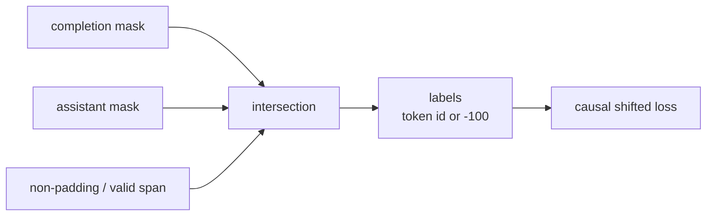

# Label Mask、截断、Padding 与 Packing

这一课处理四个不同问题：**label mask 决定哪些 target 计入 loss，attention boundary 决定 token 能看见哪些上下文，truncation 决定保留哪段，padding/packing 决定如何组成 batch。**它们不能互相替代。

## 四种 mask/边界

| 机制 | 作用对象 | 解决什么 | 常见混淆 |
| --- | --- | --- | --- |
| causal mask | attention | 不能看未来 token | 不决定哪些位置算 loss |
| padding attention mask | attention | 不读取 batch 补齐 token | 不是 assistant mask |
| labels `-100` | loss | 忽略 prompt/pad/非目标位置 | 不阻止 forward 看上下文 |
| packed sequence boundary | attention/positions | 同一物理 row 中样本互不可见 | 仅 reset position 不一定足够 |



当前 TRL 的 dataset preparation 会根据可用 `completion_mask` 与 `assistant_masks` 构建最终 `labels`：只有所有适用 mask 都为 1 的 token 保留 id，否则写 `-100`。源码见 [`_prepare_dataset()`](https://github.com/huggingface/trl/blob/f3adc504b93d634666c5628e7bdaa99ec8861028/trl/trainer/sft_trainer.py#L1374)。

## Completion-only 与 Assistant-only

### Completion-only

适用于明确的 `prompt` / `completion` dataset。当前 `completion_only_loss=None` 时，`SFTTrainer` 看到这两个字段会自动选择 completion-only；language-modeling dataset 则不会。

### Assistant-only

适用于 conversational dataset，由 chat template generation spans 产生 mask。多轮中可以监督所有 assistant turn，而不监督 system/user/tool content。

### 两者同时启用

最终取交集。例如 prompt 中含历史 assistant 回答、completion 中含新 assistant turn时，历史 assistant 即便属于 assistant role，也会因不在 completion 区间而被 mask。

## 截断顺序决定你丢什么

当前固定版本在非 packing 数据上先构建 labels，再按 `max_length` 截断；支持保留开头或结尾。截断后完全没有有效 label 的普通 Dataset 样本会被过滤。

```text
keep_start: [very long prompt........................][answer]
            [kept prompt................]  -> answer 全丢失

keep_end:   [very long prompt........................][answer]
                         [prompt tail...][answer] -> system/题干开头可能丢失
```

没有对所有任务通用的正确方向。更好的做法通常是先限制/重构原始数据，确保 prompt 与关键 answer 都能进入上下文；截断是最后保护，不是数据策略。

必须统计：截断样本比例、丢失的 prompt/completion token、截断后有效 labels 分布、各数据 slice 的差异。若只看最终长度，无法知道答案是否被系统性切掉。

## Padding 的浪费怎样计算

普通 batch padding 到批内最大长度 $L_{max}$：

$$
padding\ ratio=1-\frac{\sum_i L_i}{B\times L_{max}}
$$

长度为 `[100, 200, 1000, 1000]` 的 batch，padding ratio 为 $1-2300/4000=42.5\%$。长度分桶可在不改变语义的情况下减少浪费，是 packing 前应先做的简单基线。

Padding 位置：

- `input_ids` 使用 pad token id；
- `attention_mask=0`；
- `labels=-100`；
- 左/右 padding 要与模型、position ids 和训练实现兼容。

pad token 回退为 EOS id 并不意味着 EOS target 都会被忽略；只应按 attention/padding 位置 mask labels，不能把所有 `token_id == eos_id` 都设 `-100`。

## Packing：一个 row 装多个样本

```text
physical row (max_length=16):
[sample A: 6 tokens][sample B: 4 tokens][sample C: 6 tokens]
positions:
 0 1 2 3 4 5 | 0 1 2 3 | 0 1 2 3 4 5
```

收益来自减少 padding，提高每次 forward 的真实 token 比例。代价是需要明确样本边界：B 不能 attention 到 A，C 不能 attention 到 A/B；每段 position 应按模型/attention backend 的契约重置。

固定 TRL 的 BFD packing 会产生 `seq_lengths`，并启用 padding-free collator；[`DataCollatorForLanguageModeling`](https://github.com/huggingface/trl/blob/f3adc504b93d634666c5628e7bdaa99ec8861028/trl/trainer/sft_trainer.py#L394) 将 sequences flatten，基于长度构建重置的 `position_ids`。源码也明确警告该路径需要已知兼容的 Flash Attention 实现，否则 flattened sequence 可能被错误地当成一条连续文档。

::: danger Packing 正确性
吞吐提高不能证明边界正确。做一个“污染测试”：sample B 的标签在改变 sample A 内容后应保持 logits/gradient 语义不变（允许数值噪声）。若显著变化，样本间发生 attention leakage。
:::

## Packing 策略的权衡

| 策略直觉 | 优点 | 风险/代价 |
| --- | --- | --- |
| best-fit decreasing | 高填充率，较少浪费 | 要先知道长度/重排，边界 backend 要支持 |
| wrapped/chunk stream | 简单填满固定长度 | 可能跨样本切分，语义和 mask 更难审计 |
| length bucketing + padding | 机制最简单、兼容广 | 仍有 padding |
| padding-free without packing | 同 batch flatten、保留样本边界 | batch=1 无收益，依赖 backend |

先做 length bucketing 基线，再证明 packing 的增益超过复杂度。

## 有效 token 利用率

训练系统的三种 token 不应混在一个吞吐数里：

$$
input\ utilization=\frac{nonpad\ input\ tokens}{allocated\ batch\ tokens}
$$

$$
supervision\ density=\frac{nonmasked\ label\ tokens}{nonpad\ input\ tokens}
$$

$$
supervised\ throughput=\frac{nonmasked\ label\ tokens}{second}
$$

assistant-only 的监督密度可能很低，但 prompt forward 仍要计算。packing 主要提升 input utilization，不能消除被 mask prompt 的 forward 成本。

## 逐 token 审计表

每次模板/数据代码改变后，对固定 golden samples 输出：

| pos | token id | token text | message role | completion | assistant | final label |
| ---: | ---: | --- | --- | ---: | ---: | ---: |
| 0 | … | `<bos>` | meta | 0 | 0 | -100 |
| 1 | … | `<user>` | user | 0 | 0 | -100 |
| … | … | … | … | … | … | … |
| 17 | … | `5` | assistant | 1 | 1 | token id |
| 18 | … | `<eot>` | assistant | 1 | 1 | token id |

自动断言：长度一致；有效 labels > 0；pad labels 全为 -100；EOT 按目标受监督；截断比例不超阈值；packed boundaries/positions 正确。

## 通关标准

你应能说明 labels mask 与 attention mask 的正交关系；手算 padding ratio；解释 completion/assistant mask 的交集；为 keep-start/keep-end 提出数据依赖的选择；验证 packing 没有跨样本注意力泄漏。

下一步进入[第一次 TRL SFT](../practice/first-run)。
