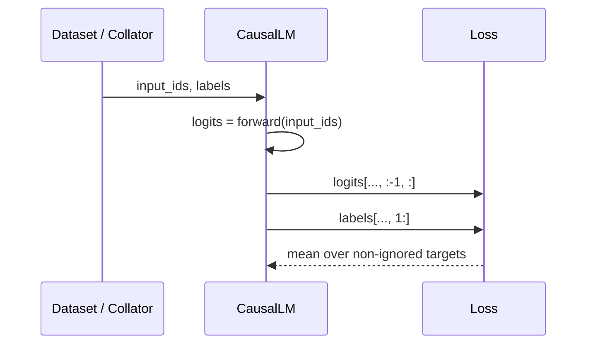

# Teacher Forcing、Next-token Loss 与 SFT 目标

SFT 对 causal LM 最核心的操作是：**把完整正确序列作为输入，但位置 $t$ 的 logits 用来预测位置 $t+1$ 的真实 token。**训练时前一个上下文 token 来自数据而非模型自己的采样，这就是 teacher forcing。

## 一次 shift

假设：

```text
input_ids = [BOS, 我, 喜欢, 猫, EOS]
labels    = [BOS, 我, 喜欢, 猫, EOS]
```

模型通常在内部或 loss function 中对齐：

```text
logits positions: [BOS, 我,   喜欢, 猫  ]
target labels:    [我,   喜欢, 猫,   EOS]
```

最后一个 input position 没有序列内的下一个 label；第一个 label `BOS` 也没有前一个 logits 与之配对。不要手工把 labels 再 shift 一次，除非自定义模型明确要求；多数 `AutoModelForCausalLM(..., labels=...)` 会处理 shift。

这不是约定俗成的猜测。固定 Transformers 的 [`ForCausalLMLoss`](https://github.com/huggingface/transformers/blob/e52d0fd6fa9eb874f7c2da048198276b04c919b9/src/transformers/loss/loss_utils.py#L49) 在 61–70 行先把 labels 右侧 pad `-100`，再取 `labels[..., 1:]` 并与 flatten logits 做 cross entropy；若调用方已提供 `shift_labels` 才跳过内部 shift。



## Teacher forcing 与推理的差异

| 阶段 | 第 $t$ 步上下文 | 是否一次并行计算整段 | 错误是否滚入后续上下文 |
| --- | --- | --- | --- |
| 训练 | 数据中的真实 $x_{<t}$ | 是，causal mask 保证不看未来 | 不会 |
| 自回归推理 | 模型已生成的 $\hat x_{<t}$ | decode 通常逐 token | 会 |

这解释了为什么 token-level loss 很好，长生成仍可能漂移：训练从正确历史预测一步，推理要从自己的历史连续走很多步。评估必须包含真实生成，而不只是 teacher-forced loss。

## 有效监督集合

令 $m_t\in\{0,1\}$ 表示 token 是否计入 loss：

$$
\mathcal L(\theta)=-\frac{1}{\sum_t m_t}\sum_{t=1}^{T}m_t\log p_\theta(x_t\mid x_{<t})
$$

实现里通常把不参与的位置设为 `labels[t] = -100`。`CrossEntropyLoss(ignore_index=-100)` 会忽略它们。

### 三种常见目标

```text
sequence: system | user question | assistant answer | eot

full LM:       ✓✓✓✓✓✓✓✓✓✓✓✓✓✓✓✓✓✓✓✓✓✓✓✓✓✓
completion:    ················✓✓✓✓✓✓✓✓✓✓
assistant-only:················✓✓✓✓✓✓✓✓✓✓
```

- language-modeling dataset 默认可能监督整段；
- prompt-completion dataset 可只监督 completion；
- conversational dataset 的 assistant-only 可跨多轮只监督 assistant 消息；
- 两个 mask 可以相交，最终只有同时满足条件的位置保留 label。

上下文被 mask 不代表模型看不见。attention 仍读取 user/system token；只是这些位置的 next-token error 不回传为直接监督目标。

## 为什么 EOS 是目标的一部分

模型要学会“回答结束”，必须在答案后看到 EOS/end-of-turn，并且该 token 对应 label 不能被 mask 掉。

```text
assistant: 北京。
labels:    北 京 。 [EOT]
```

若模板把 EOT 放在 `` 外，而又启用 assistant-only loss，模型可能永远没有因“不停止”受到监督。当前 TRL 初始化会对已知模板做检查并给出 warning，但自定义模板仍要逐 token 验证。

## loss 的分母影响实验可比性

两个 batch 都有 4096 input tokens：

- batch A：4000 个有效 labels；
- batch B：800 个有效 labels。

若 loss 对有效 token 取均值，两者数值可比较，但每个 optimizer step 聚合的监督量差五倍；gradient noise、训练进度和 tokens/s 含义都不同。记录至少三个量：input tokens、non-masked target tokens、optimizer steps。

分布式与 gradient accumulation 下，正确归一化还要考虑各 micro-batch/rank 的有效 token 数不同。不能简单平均“每个 rank 的平均 loss”再假设等价于全局 token 平均：

$$
L_{global}=\frac{\sum_r\sum_{t\in S_r}\ell_{r,t}}{\sum_r |S_r|}
$$

## global batch 与 tokens/update

无 pipeline 时常用：

$$
B_{global}=B_{micro/device}\times world\_size\times gradient\_accumulation
$$

但对变长 SFT，更有解释力的是：

$$
tokens/update=\sum_{all\ microbatches,ranks}nonmasked\_labels
$$

packing、长度分布与 assistant mask 会让相同 `B_global` 对应完全不同的监督 token 数。比较学习率或收敛速度时，应同时报告二者。

## 当前 TRL 的 loss 路径

固定版本的 SFT 数学目标仍是 token NLL。`SFTConfig.loss_type` 字段初始是 `None`，但 [`__post_init__` 334–336](https://github.com/huggingface/trl/blob/f3adc504b93d634666c5628e7bdaa99ec8861028/trl/trainer/sft_config.py#L334) 会解析为 `chunked_nll`；只有启用 Liger 时默认解析为 `nll`。所以应打印 resolved config，而不是把 dataclass 字段的 `None` 误解成“模型自行决定”。

[`_chunked_cross_entropy_loss` 117–234](https://github.com/huggingface/trl/blob/f3adc504b93d634666c5628e7bdaa99ec8861028/trl/trainer/sft_trainer.py#L117) 在 182–186 行完成 hidden/label shift 与有效 token 计数，在 200–226 行把有效位置排到前面并分块做 lm_head/CE，在 228–233 行按本地有效 token 或 `num_items_in_batch` 归一。它避免为所有被忽略位置同时保留完整 vocab logits，降低峰值 activation；`nll` 走模型常规路径。实现选择不应改变有效 token 上的数学目标，但会改变显存、兼容性和 profile。

自定义 loss 前先读 [`SFTTrainer`](https://github.com/huggingface/trl/blob/f3adc504b93d634666c5628e7bdaa99ec8861028/trl/trainer/sft_trainer.py#L790) 如何向 Transformers Trainer 传 `compute_loss_func`，再读 [`Trainer.compute_loss()`](https://github.com/huggingface/transformers/blob/e52d0fd6fa9eb874f7c2da048198276b04c919b9/src/transformers/trainer.py#L1953)。不要只替换一个函数名，却漏掉 gradient accumulation 的样本数归一化。

## 手算练习

给定：

```text
tokens = [U, 2, +, 3, ?, A, 5, EOT, PAD]
mask   = [0, 0, 0, 0, 0, 0, 1, 1, 0]
```

注意 causal shift：`mask` 表示 label 位置。有效预测是前一位置 logits 预测 `5` 与 `EOT`，共两个 target；不是让 token `5` 的 logits 预测自己。

实现一个断言：每条训练样本至少有一个有效 target，且 assistant 最后一个 end token 是有效 target。若任一失败，在训练前拒绝数据。

### 可运行的 shift 对照

```python
import torch
import torch.nn.functional as F

# 三个词表项；位置 0/1/2 的 logits 分别偏好 token 1/2/0。
logits = torch.tensor([[[0., 4., 0.], [0., 0., 4.], [4., 0., 0.]]])
labels = torch.tensor([[-100, 1, 2]])

# causal shift 后只有 logits[0]→label[1]、logits[1]→label[2] 有效；最后 logits 无目标。
loss = F.cross_entropy(
    logits[:, :-1].reshape(-1, 3),
    labels[:, 1:].reshape(-1),
    ignore_index=-100,
)
expected = -torch.log_softmax(torch.tensor([0., 4., 0.]), 0)[1]
assert torch.allclose(loss, expected)
assert (labels[:, 1:] != -100).sum().item() == 2
print(f"loss={loss.item():.6f}, targets=2")
```

预期 loss 约为 `0.035976`。把 labels 手工左移后再传给 causal LM 会发生二次 shift；本例应作为升级 loss/model 代码后的最小回归。

## 通关标准

你应能从 `input_ids/labels` 手工列出 shift 后 logits-target pairs；解释 teacher forcing 与生成的差异；计算 global batch 与有效 tokens/update；说明 `-100` 只影响 loss，不是 attention mask。

下一课进入[数据格式与质量](./data)。
