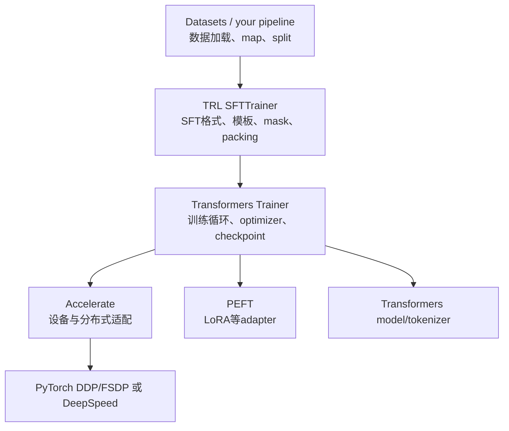

# SFT 学习地图与工具边界

最短可靠路线不是“找一份能跑的 YAML”，而是：**先让一个小数据集过拟合，再验证完整数据与评估，最后才扩模型和并行。**小规模无法过拟合时，多卡只会更昂贵地重复错误。

## 工具各自负责什么



TRL 没有重新实现整个训练系统；[`SFTTrainer`](https://github.com/huggingface/trl/blob/f3adc504b93d634666c5628e7bdaa99ec8861028/trl/trainer/sft_trainer.py#L790) 继承 TRL `_BaseTrainer`，后者继承 Transformers [`Trainer`](https://github.com/huggingface/transformers/blob/e52d0fd6fa9eb874f7c2da048198276b04c919b9/src/transformers/trainer.py#L257)。SFT 特有逻辑集中在模型/processor 装配、dataset preparation、collator、loss/metrics 扩展；通用 step、backward、checkpoint 和分布式由下层承担。

## 两条路线

### 路线 A：第一次做 SFT

1. [Teacher Forcing 与交叉熵](../fundamentals/objective)
2. [数据格式与质量](../fundamentals/data)
3. [Chat Template 与特殊 token](../fundamentals/chat-template)
4. [Label Mask、截断与 Packing](../fundamentals/masking-packing)
5. [第一次 TRL SFT](../practice/first-run)
6. [评估、过拟合与数据诊断](../practice/evaluation)

选择能单卡运行的小模型，先用 16–64 条样本证明训练链正确。此阶段不追求 benchmark，也不需要分布式。

### 路线 B：已有 run，但质量或性能不稳定

1. 保存环境、最终配置和一个坏 checkpoint；
2. 在[数据管线源码](../internals/data-pipeline)逐 token 检查 labels；
3. 在[Labels 到 Loss 与更新](../internals/loss-update)核对 global batch 与 step；
4. 用[评估与数据诊断](../practice/evaluation)区分欠拟合、过拟合和 metric 错位；
5. 再进入[显存、吞吐与分布式](../systems/scaling)或[失败模式](../systems/debugging)。

## 课程版本边界

| 项目 | 固定提交 | 本站主要用途 |
| --- | --- | --- |
| TRL | [`f3adc50`](https://github.com/huggingface/trl/tree/f3adc504b93d634666c5628e7bdaa99ec8861028) | `SFTConfig`、`SFTTrainer`、dataset/mask/packing |
| Transformers | [`e52d0fd`](https://github.com/huggingface/transformers/tree/e52d0fd6fa9eb874f7c2da048198276b04c919b9) | tokenizer/template、model、Trainer loop |

这一固定 TRL 版本默认 loss 路径、packing 策略和 assistant-only template patch 可能与旧教程不同。运行你自己的环境时先保存：

```bash
python - <<'PY'
import torch, transformers, trl
print("torch", torch.__version__)
print("transformers", transformers.__version__)
print("trl", trl.__version__)
PY

python -m pip freeze > requirements.lock.txt
```

还要固定 model revision、tokenizer 文件/chat template、dataset revision 和自定义预处理 commit。只固定 Python 包不能复现 token 序列。

## 每阶段的门禁


| 门禁 | 最低证据 | 失败时停止做什么 |
| --- | --- | --- |
| 数据 | schema、长度、语言、role、去重与 split 报告 | 不启动训练 |
| token | 20 条逐 token labels；EOS/特殊 token 单测 | 不调超参 |
| 过拟合 | 小数据 loss 接近低值，greedy 能复现答案 | 不扩数据/多卡 |
| 验证 | held-out 任务指标 + 人工错误分类 | 不只看 train loss |
| 性能 | tokens/s、MFU/利用、peak HBM、有效 token 比 | 不盲开 packing/checkpoint |
| 分布式 | 单卡 checkpoint 对照、多 rank loss/step 一致 | 不扩大 world size |

## 建议的实验目录

```text
runs/2026-07-16-sft-a/
  config.yaml
  environment.txt
  data_manifest.json
  token_audit.jsonl
  metrics.jsonl
  samples-before.jsonl
  samples-after.jsonl
  checkpoints/
  report.md
```

配置里记录“最终解析值”而不只是传入值；训练框架可能根据 dataset type、硬件或其他参数推导默认项。例如当前 `completion_only_loss=None` 会按样本是否含 `prompt`/`completion` 决定实际行为。

## 第一轮刻意不学什么

- 不穷举所有 PEFT 方法；先掌握 LoRA/QLoRA 的参数、显存与 checkpoint 契约。
- 不比较所有 Trainer 替代品；先把 token/label 主线建立起来。
- 不先调上百个参数；只控制 model、data、length、batch、LR、steps 和 precision。
- 不在数据链未验证时做 FSDP/ZeRO；分布式会让错误更难定位。
- 不把 instruction benchmark 单分数当唯一质量；要保留业务 slice 和生成样例。

这是范围控制，不是说这些主题不重要。它们应由已观察到的瓶颈触发。

## 14 天可执行学习计划

每天不是“看完页面”，而是交付一个能复核的文件。建议目录沿用前文的 `manifests/audits/configs/runs/reports`。

| 天 | 阅读与源码 | 实践 | 当日必须提交 | 通过条件 |
| ---: | --- | --- | --- | --- |
| 1 | objective；`ForCausalLMLoss` | 手算 6-token CE，再用 PyTorch 对照 | `audits/manual_ce.md` | shift、ignore index、分母一致 |
| 2 | data；TRL dataset formats | schema、role、空值、重复、group split | `reports/data_profile.json` | 无跨 split group；坏行有处置 |
| 3 | chat template；`apply_chat_template` | 五类 golden conversations 渲染/tokenize | `audits/template_golden.json` | special token、generation cue、前缀断言通过 |
| 4 | masking/packing；`build_labels`/collator | 逐 token 打印 masks/labels，构造截断反例 | `audits/token_labels.jsonl` | 每条有效 target>0；EOS/EOT 符合设计 |
| 5 | first-run | 单卡 `max_steps=1`，保存 batch/loss/grad/delta | `runs/one-step/` | finite loss；目标参数更新 |
| 6 | first-run | 32–128 条数据 tiny-overfit | `runs/tiny-overfit/` | loss 明显下降，greedy 复现训练映射 |
| 7 | evaluation | 固定 generation protocol，跑 held-out slices | `reports/baseline_eval.md` | 不以 train loss 代替生成指标 |
| 8 | architecture；SFTTrainer init | 逐分支读 901–1372，运行四个错误配置 | `audits/init-branches.md` | 每个启动条件定位到源码行 |
| 9 | data-pipeline | 断点追 raw→ids→labels→batch | `audits/sample-trace.md` | 字段、shape、mask 变化完整 |
| 10 | source walkthrough/loss-update | 追 `train()` 到 step，两 micro-batch 累积 | `audits/update-trace.md` | 解释 no-sync、backward、clip、step |
| 11 | LoRA | 全参 vs LoRA；列 trainable names/state dict | `reports/full-vs-lora.md` | 参数/显存/checkpoint 契约明确 |
| 12 | QLoRA | 4-bit base + LoRA；记录三种 dtype | `reports/qlora.md` | storage/compute/adapter dtype 没混淆 |
| 13 | scaling | 单卡 vs 2-rank DDP；需要时再 FSDP/ZeRO | `reports/scaling.md` | supervised tokens/update 保持一致 |
| 14 | debugging | 主动制造 OOM、全 mask、坏模板、resume | `reports/failure-drill.md` | 每个故障有证据、修复、回归测试 |

统一命令骨架：

```bash
mkdir -p manifests audits configs runs reports
python -m pip freeze > manifests/pip-freeze.txt
git -C /path/to/trl rev-parse HEAD > manifests/trl.commit
git -C /path/to/transformers rev-parse HEAD > manifests/transformers.commit

python experiment.py --config configs/day-N.yaml 2>&1 | tee runs/day-N.log
test "${PIPESTATUS[0]}" -eq 0
```

只有 7 天时，可把第 1–4 天两两合并、第 8–10 天合并；不要删除数据/labels 门禁或 tiny-overfit。算力不足就换更小模型和更短序列，原理与源码验证仍须保留。

## 通关标准

毕业不是“训练命令退出码为 0”。你要能从一条原始样本手工推导渲染文本、token、labels 和第一个 loss target；能计算 global batch/tokens per update；能说明 checkpoint 是完整模型还是 adapter；能从 loss 曲线和生成样例提出可证伪的故障假设。源码阶段以[从构造器到一次参数更新](../internals/source-walkthrough)为主实验，没有完成其中六份证据，不能把“读过代码”记为完成。

现在进入[Teacher Forcing 与交叉熵](../fundamentals/objective)。
