# 从这里开始：把 SFT 看成一条可审计的 token 监督流水线

SFT 不是“把 JSON 丢给 Trainer”。真正发生的是：**原始样本先被格式化为模型认识的 token 序列，再为每个位置决定是否计入 loss，最后才经过 forward、backward 和 optimizer update。**任何一段悄悄出错，训练 loss 仍可能下降，但模型学到的不是你的目标。

本站固定阅读 TRL 提交 [`f3adc50`](https://github.com/huggingface/trl/tree/f3adc504b93d634666c5628e7bdaa99ec8861028) 与 Transformers 提交 [`e52d0fd`](https://github.com/huggingface/transformers/tree/e52d0fd6fa9eb874f7c2da048198276b04c919b9)。配置默认值以这两个提交为准，不把旧教程中的 `SFTTrainer` 行为套到当前版本。

## 先回答五个问题

| 问题 | 真正考察 | 答不上从哪里开始 |
| --- | --- | --- |
| `messages` 怎样变成 `<|im_start|>user...`？ | Chat Template | [Chat Template 与特殊 token](./fundamentals/chat-template) |
| 为什么 `labels=-100` 的位置不会训练？ | ignore index 与监督 mask | [Label Mask、截断与 Packing](./fundamentals/masking-packing) |
| 模型看见 user prompt，但可以不在 user token 上算 loss 吗？ | 条件上下文与目标 token 的区别 | [Teacher Forcing 与交叉熵](./fundamentals/objective) |
| LoRA 为什么省 optimizer 显存，却未必大幅降低 activation？ | 可训练参数与计算图的不同账本 | [LoRA 与 QLoRA](./practice/lora-qlora) |
| train loss 下降为什么仍可能是坏模型？ | 数据泄漏、截断、模板与生成评估 | [评估与数据诊断](./practice/evaluation) |

如果这些问题都模糊，先不要调 learning rate，也不要直接上多卡。训练吞吐优化无法修复错误的 token/label 契约。

## 一条样本的完整闭环

```mermaid
flowchart LR
    R[raw example<br/>messages 或 prompt/completion] --> V[schema + quality validation]
    V --> T[chat template / formatting]
    T --> K[tokenizer]
    K --> M[assistant/completion mask]
    M --> X[truncate / pack / collate]
    X --> B[input_ids + labels + positions]
    B --> F[model forward]
    F --> L[shifted token loss]
    L --> G[backward gradients]
    G --> O[optimizer step]
    O --> C[checkpoint + evaluation]
```



每个箭头都应留下可检查证据。最小证据不是打印一条原始 JSON，而是打印：渲染文本、token id/token、label、mask、有效监督 token 数和截断结果。

## SFT 真正优化的目标

对一条 token 序列 $x_1,\ldots,x_T$，causal LM 在 teacher forcing 下学习：

$$
\mathcal L(\theta)=-\frac{1}{|S|}\sum_{t\in S}\log p_\theta(x_t\mid x_{<t})
$$

$S$ 是参与监督的位置集合。全序列 LM、completion-only 和 assistant-only 的主要区别不是 forward 看见哪些上下文，而是 $S$ 包含哪些 token。

```text
input_ids: [system] [user] [assistant] answer [eot]
labels:       -100    -100      -100  answer [eot]   # assistant-only 的一种形态
```

模型仍会读取 system/user token 作为条件，只是这些位置对应的预测不计入目标。`-100` 不是 token id，也不会作为输入喂给 embedding；它只是 loss 的 ignore index。

## 四本训练账

| 账本 | 需要回答 | 常见错误 |
| --- | --- | --- |
| 数据账 | 样本来自哪里、怎样去重/切分、质量规则是什么 | train/eval 泄漏、模板文本残留、错误角色 |
| token 账 | 每条样本渲染、截断、有效 labels 和长度分布 | completion 全被截掉、EOS 未训练、重复 BOS |
| 优化账 | global batch、tokens/update、LR、可训练参数、step | 把 micro-batch 当 global batch、LoRA LR 沿用全参 |
| 显存/性能账 | 权重、gradient、optimizer、activation、临时 buffer | 只算参数量、不看序列长度和 activation |

训练记录若缺其中一本，就很难复现“为什么这次有效”。

## 五个学习阶段

| 阶段 | 学习任务 | 必须留下的作品 |
| --- | --- | --- |
| 00 定位 | 明确工具边界与版本 | 一张端到端 token 流水线 |
| 01 地基 | objective、数据、模板、mask/packing | 一个逐 token 可视化检查器 |
| 02 实验 | 最小全参/LoRA run 与评估 | 配置、环境、曲线、样例与 checkpoint |
| 03 源码 | 沿样本追 `SFTTrainer → Trainer → model` | 文件/函数/对象/shape trace |
| 04 系统 | 显存、吞吐、分布式与排障 | 容量账、故障树、回退条件 |

完整顺序见[学习地图与工具边界](./guide/learning-path)。

## 第一遍只追七个对象

- 原始 dataset example；
- chat template 渲染后的 string/messages；
- `input_ids`；
- `assistant_masks` / `completion_mask`；
- 最终 `labels`；
- collator 返回的 batch；
- `loss`、gradient 与 optimizer state。

对每个对象问：谁创建、shape/长度是什么、在哪一步被截断或 padding、哪些位置不再参与 loss。能追完这七个对象，就具备阅读任何 SFT 框架的主线。

## 通关检查

学完本站后，你应能解释：

- teacher forcing 为什么训练时不需要模型先生成前一个 token；
- chat template 为什么属于模型契约，而不只是显示格式；
- completion-only 与 assistant-only 怎样组合；
- EOS 为什么既要出现在输入，也要处于有效 label mask 中；
- packing 如何提高有效 token 比例，为什么需要文档边界感知 attention；
- LoRA/QLoRA 分别省了哪些显存，哪些没有省；
- loss、perplexity、token accuracy 和真实生成质量各能说明什么；
- 单卡正确后，怎样选择 DDP、FSDP 或 DeepSpeed。

现在先读[Teacher Forcing 与交叉熵](./fundamentals/objective)，把“模型看见什么”和“模型因什么被惩罚”分开。
