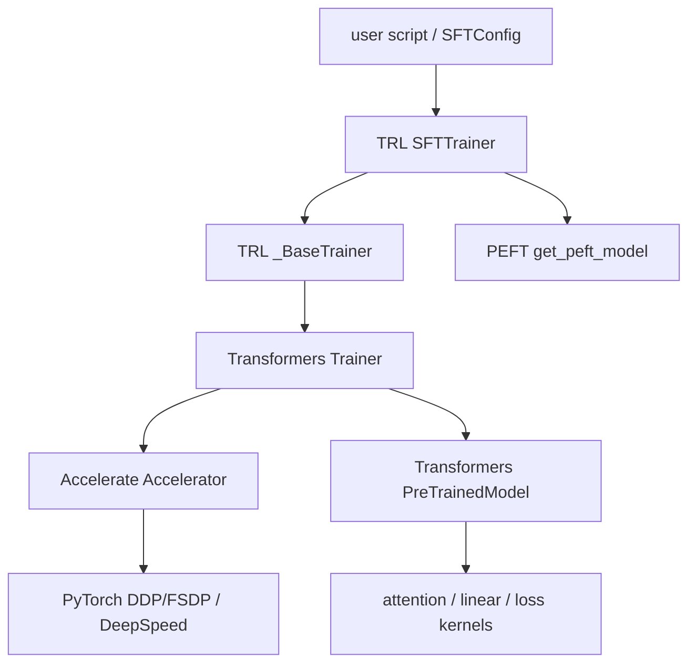
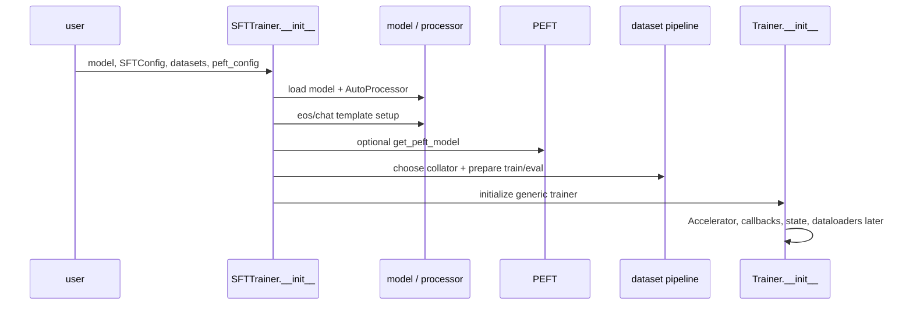

# TRL SFTTrainer、Transformers Trainer 与 Accelerate 架构

`SFTTrainer` 名字很大，但它没有重新实现所有训练。最重要的源码能力是：**遇到一个行为时，先判断它由哪一层拥有。**数据 mask 在 TRL；通用 step/checkpoint 在 Transformers；设备与 backward 适配在 Accelerate；具体 causal loss 常在 model forward；adapter 注入在 PEFT。

## 分层所有权



| 层 | 主要负责 | 不应归责的内容 |
| --- | --- | --- |
| 用户/配置 | model/data/revision、目标、超参、输出 | 自动证明数据正确 |
| TRL SFT | dataset type、template、labels、packing、SFT metrics/loss 扩展 | 完整分布式 runtime |
| Transformers Trainer | dataloader、loop、optimizer/scheduler、eval/save/callback | 理解业务数据质量 |
| Accelerate | device placement、mixed precision、distributed prepare/backward/gather | 选择训练目标 |
| PEFT | adapter 注入、冻结/保存/激活 | QLoRA quant backend 的全部实现 |
| Model/PyTorch | forward、causal shift/loss、autograd、kernels | prompt/completion boundary |

## 继承链与固定入口

- [`SFTTrainer`](https://github.com/huggingface/trl/blob/f3adc504b93d634666c5628e7bdaa99ec8861028/trl/trainer/sft_trainer.py#L790)
- [`_BaseTrainer`](https://github.com/huggingface/trl/blob/f3adc504b93d634666c5628e7bdaa99ec8861028/trl/trainer/base_trainer.py#L65)
- [`Trainer`](https://github.com/huggingface/transformers/blob/e52d0fd6fa9eb874f7c2da048198276b04c919b9/src/transformers/trainer.py#L257)

`_BaseTrainer` 在当前提交主要提供 TRL trainers 共用的 telemetry/model-card 辅助；真正训练循环仍继承 Transformers。调试 `save_strategy` 不应从 `SFTTrainer._prepare_dataset()` 找，调试 assistant mask 也不应先钻 `Trainer._inner_training_loop()`。

## 构造阶段发生什么



### 模型加载

`model` 是字符串时，SFTTrainer 用 `model_init_kwargs`/`quantization_config` 创建 model；分布式环境会避免 `device_map="auto"`。传入已实例化 model 时，再放 `model_init_kwargs` 不会重新加载。

### Processor / tokenizer

未显式提供 `processing_class` 时按 model config 加载 `AutoProcessor`。text model 取 tokenizer，VLM 保留 processor 并走 on-the-fly collator。pad/EOS/chat template 在这一阶段确定。

### PEFT

有 `peft_config` 时检查类型与组合、处理新 token、注入 adapter；quantized model、gradient checkpointing、ZeRO-3 有额外 dtype/compatibility 分支。最终 model 可能已变为 `PeftModel` wrapper。

### Dataset 与 collator

检查 dataset sample 决定 language-modeling/prompt-completion、vision、实际 completion-only；设置 assistant template、packing/padding-free，调用 `_prepare_dataset()` 产出 `input_ids/labels[/seq_lengths]`。

## 训练阶段调用链

```mermaid
flowchart LR
    A[trainer.train] --> B[Trainer._inner_training_loop]
    B --> C[get_train_dataloader]
    C --> D[data_collator]
    D --> E[SFTTrainer.training_step]
    E --> F[Trainer.training_step]
    F --> G[SFTTrainer.compute_loss]
    G --> H[Trainer.compute_loss]
    H --> I[model forward]
    I --> J[loss]
    J --> K[accelerator.backward]
    K --> L[clip + optimizer.step + scheduler.step]
    L --> M[log / eval / save]
    M --> B
```



当前 [`SFTTrainer.training_step()`](https://github.com/huggingface/trl/blob/f3adc504b93d634666c5628e7bdaa99ec8861028/trl/trainer/sft_trainer.py#L1839) 只额外包 activation offload context，主体委托给父类。通用 [`Trainer.training_step()`](https://github.com/huggingface/transformers/blob/e52d0fd6fa9eb874f7c2da048198276b04c919b9/src/transformers/trainer.py#L1880) 准备 inputs、调用 loss、处理 accumulation normalization，再交 `accelerator.backward()`。

## 为什么配置看起来来自多个地方

`SFTConfig` 继承 TRL `_BaseConfig`，后者最终包含 Transformers `TrainingArguments` 能力。配置可以分为：

| 组 | 示例 | 主要消费者 |
| --- | --- | --- |
| SFT data | `max_length`、packing、assistant/completion loss | SFTTrainer |
| model | `model_init_kwargs`、template、quantization | SFTTrainer/model loader |
| generic train | batch、LR、epochs、logging/save/eval | Trainer |
| precision/distributed | bf16、FSDP、DeepSpeed、gradient checkpoint | Trainer/Accelerate/backend |

当前 `SFTConfig` 还覆盖若干通用默认值，例如 LR、logging interval、gradient checkpointing 和 BF16 倾向。运行日志/序列化 config 才是最终值；不要只看 `TrainingArguments` 文档猜默认。

## Callback 不是训练语义的所有者

Trainer callback 可以在 step/eval/save 事件修改 control flow（例如 early stopping、logging integration），但通常不应悄悄重写 labels 或 optimizer math。若 callback 改模型/数据，必须把它当训练实现的一部分固定版本和测试。

事件大致是：

```text
on_train_begin
  on_epoch_begin
    on_step_begin
    microbatches / backward
    on_pre_optimizer_step / optimizer step / on_optimizer_step
    on_step_end
    maybe log/evaluate/save
  on_epoch_end
on_train_end
```

看到 checkpoint 数量异常，查 `TrainerControl.should_save`、strategy 和 callback；看到 labels 错，回到 dataset preparation。

## 启动与运行条件在哪一层失败

| 报错时机 | 常见所有者 | 示例 |
| --- | --- | --- |
| import | Python packages/native extension | bitsandbytes/flash-attn ABI |
| model load | model loader/Hub/quantization | revision、dtype、device map、remote code |
| trainer init | TRL validation | dataset type、VLM+packing、assistant template |
| first collate | dataset/collator | shape、pad、missing labels |
| first forward | model/backend | token id 越界、kernel/shape |
| first backward/step | precision/distributed/optimizer | NaN、unused params、ZeRO dtype |
| save/load | Trainer/PEFT/distributed checkpoint | adapter vs full、rank shards |

按失败阶段缩小源码范围，避免从整个仓库搜索异常字符串后随机改配置。

## 一次源码练习

在本地固定版本设置断点或临时日志：

1. `SFTTrainer.__init__`：记录 model class、processor class、实际 completion-only、padding-free；
2. `_prepare_dataset` 返回处：记录一条 ids/labels；
3. collator：记录 batch keys/shapes；
4. `SFTTrainer.compute_loss`：记录 mode、valid labels、loss type；
5. `Trainer.training_step`：记录 accumulation step 与 detached loss；
6. optimizer step 后：记录一个 trainable parameter norm。

不要在多 rank 首次练习；单卡 trace 清楚后再看 rank-specific 行为。

## 通关标准

你应能把问题分派给 TRL、Transformers、Accelerate、PEFT 或 model；从 `train()` 追到 optimizer step；解释为什么 SFTTrainer 的训练循环主体在父类，以及 config 默认值为何必须记录解析结果。

下一课沿一条样本读[Dataset 到 Batch](./data-pipeline)。
