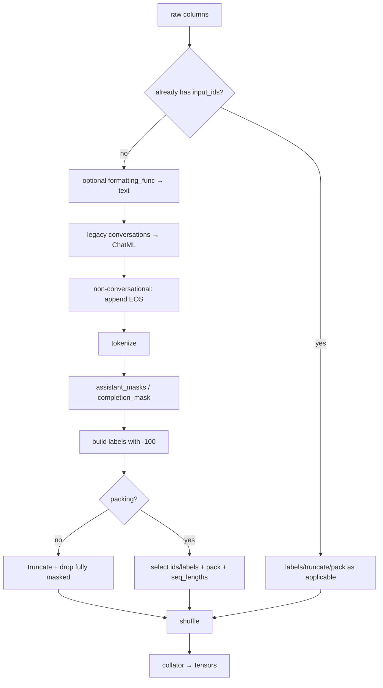
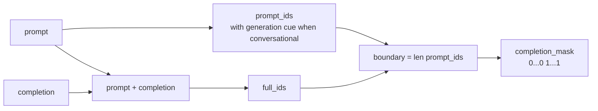

# 沿源码追一条样本：Dataset 到 Batch

主入口是 [`SFTTrainer._prepare_dataset()`](https://github.com/huggingface/trl/blob/f3adc504b93d634666c5628e7bdaa99ec8861028/trl/trainer/sft_trainer.py#L1374)。读它时不要逐行抄注释；追同一条 sample 的字段集合如何变化。

## 固定提交的执行顺序

| 顺序 | 源码 | 条件 | 字段变化 |
| ---: | --- | --- | --- |
| 0 | [`1383–1395`](https://github.com/huggingface/trl/blob/f3adc504b93d634666c5628e7bdaa99ec8861028/trl/trainer/sft_trainer.py#L1383) | custom transform / `input_ids` | 拒绝随机 transform；识别已处理数据 |
| 1 | [`1401–1417`](https://github.com/huggingface/trl/blob/f3adc504b93d634666c5628e7bdaa99ec8861028/trl/trainer/sft_trainer.py#L1401) | 有 formatter 且未处理 | 新增 `text` |
| 2 | [`1419–1430`](https://github.com/huggingface/trl/blob/f3adc504b93d634666c5628e7bdaa99ec8861028/trl/trainer/sft_trainer.py#L1419) | legacy conversational value | 转 ChatML schema |
| 3 | [`1432–1450`](https://github.com/huggingface/trl/blob/f3adc504b93d634666c5628e7bdaa99ec8861028/trl/trainer/sft_trainer.py#L1432) | 非 conversational | 给 text/completion 追加 EOS |
| 4 | [`1452–1539`](https://github.com/huggingface/trl/blob/f3adc504b93d634666c5628e7bdaa99ec8861028/trl/trainer/sft_trainer.py#L1452) | 未处理 | 生成 ids 与可选 masks |
| 5 | [`1541–1568`](https://github.com/huggingface/trl/blob/f3adc504b93d634666c5628e7bdaa99ec8861028/trl/trainer/sft_trainer.py#L1541) | 没有自带 labels | mask 交集生成 labels，随后删除 mask columns |
| 6 | [`1570–1597`](https://github.com/huggingface/trl/blob/f3adc504b93d634666c5628e7bdaa99ec8861028/trl/trainer/sft_trainer.py#L1570) | max length 且不 packing | 同步截 ids/labels、过滤全 mask |
| 7 | [`1599–1614`](https://github.com/huggingface/trl/blob/f3adc504b93d634666c5628e7bdaa99ec8861028/trl/trainer/sft_trainer.py#L1599) | packing | 只保留 ids/labels，pack 后新增 seq_lengths |
| 8 | [`1621–1624`](https://github.com/huggingface/trl/blob/f3adc504b93d634666c5628e7bdaa99ec8861028/trl/trainer/sft_trainer.py#L1621) | shuffle enabled | 最终 shuffle 并返回 |

注意 source order：formatter 之后 `is_processed` 没重新计算，因为 formatter 只在原本未处理的分支运行；随后整个未处理块继续执行。读局部变量生命周期，比仅看注释更可靠。

## 总流水线



`Dataset.map()` 的结果可能被 Hugging Face Datasets cache 复用。修改 template/formatting code 后若观察到旧 token，要核对 fingerprint/cache，而不是只重启 Python。

## Step 0：已 tokenized 的早分支

只要 columns 含 `input_ids`，源码认为 dataset 已处理，不再自动 chat template/tokenize。这个快速路径要求你自己保证：

- ids 使用同一个 tokenizer/model vocab；
- labels 已按目标构建；
- EOS、截断、special token 正确；
- 若 `skip_prepare_dataset=True`，mask columns 不能替代 labels。

固定版本专门拒绝“skip preparation + 只有 completion/assistant mask、没有 labels”的组合，因为 collator 已不负责把这些 mask 转为 labels；否则会静默训练整段。

守卫在 [`_reject_skip_prepare_without_labels` 1637–1655](https://github.com/huggingface/trl/blob/f3adc504b93d634666c5628e7bdaa99ec8861028/trl/trainer/sft_trainer.py#L1637)。它只在 skip、text dataset、默认 TRL LM collator 三个条件同时满足时检查；自定义 collator 的 labels 契约仍由你负责。

## Step 1：`formatting_func`

自定义 formatter 输出 `{"text": ...}`，会把数据变成 language-modeling type。若同时要求 completion-only，当前实现直接报错：formatter 抹掉了 prompt/completion 边界。

更可审计的做法是预先 `dataset.map()` 生成正式 `prompt/completion` 或 `messages`，保存版本，再交 Trainer；仅当目标确实是整段 text 时用 formatting_func。

## Step 2：兼容 ChatML 字段

`maybe_convert_to_chatml` 可把某些 `conversations`/`from`/`value` 风格转换成标准 `messages` role/content。转换只是 schema，不保证角色映射在你的数据语义上正确。转换后抽样检查 system、human、gpt、tool 等映射。

## Step 3：EOS

对非 conversational 的 `text` 或 `completion`，若字符串末尾不是 tokenizer EOS，源码追加 EOS。Conversational 则由 chat template 负责 turn/sequence token。

这意味着：

- tokenizer EOS 字符串必须正确；
- content 末尾“看起来像 EOS 的文本”未必是特殊 token；
- conversational template 漏 EOT/EOS 不由普通字符串 append 自动修复；
- template clone 新增 token 时 model embeddings/lm_head 也要处理。

## Step 4：Tokenize 两类数据

### Language modeling

- `messages`：调用 chat template，可请求 assistant mask；
- `text`：直接 tokenizer。

### Prompt-completion

源码分别得到 `prompt_ids` 和 `prompt+completion_ids`：



若 `full_ids[:len(prompt_ids)] != prompt_ids`，源码 warning。原因可能是 whitespace、tokenizer normalization、模板根据最后消息变化或 generation cue 不一致。此时 boundary 按长度切仍可能错，必须查看实际 tokens。

具体 warning 与“仍按长度构造 mask”的相邻代码在 [`1492–1503`](https://github.com/huggingface/trl/blob/f3adc504b93d634666c5628e7bdaa99ec8861028/trl/trainer/sft_trainer.py#L1492)。它不会改用最长公共前缀，所以 production gate 应把该 warning 升级为失败。

## Step 5：构建 labels

若 dataset 未自带 labels，源码收集适用 mask：

```python
labels = [
    token_id if all(bits) else -100
    for token_id, *bits in zip(input_ids, *masks)
]
```

没有适用 mask 时 `labels == input_ids`；completion-only 使用 completion mask；assistant mask 始终应用；两者同时存在取交集。

注意 `labels` 在 shift 前与 `input_ids` 等长。真正的 next-token 对齐发生在 model/loss，不在这里。

## Step 6：截断与空目标过滤

非 packing 时按 `max_length` 切 `input_ids/labels`，然后过滤 labels 全为 -100 的普通 Dataset example。IterableDataset 的能力/路径不同，不能假设所有全 mask sample 都被同样提前过滤。

源码顺序让你能从截断后的 labels 判断 target 是否消失；但生产数据仍应在训练前全量统计，而不是依赖运行期过滤后才发现样本少了。

## Step 7：Packing

packing 选择 `input_ids/labels`，可先 shuffle，然后调用 [`pack_dataset`](https://github.com/huggingface/trl/blob/f3adc504b93d634666c5628e7bdaa99ec8861028/trl/data_utils.py#L846)；结果增加 `seq_lengths`，供 document-aware FlashAttention/padding-free positions 使用。

packing 时 `max_length` 必须存在；截断/切分语义由 `bfd`、`bfd_split`、`wrapped` 决定。不要沿用非 packing 的“先截断”直觉。

## Collator：list 变 tensor

text-only 默认 [`DataCollatorForLanguageModeling`](https://github.com/huggingface/trl/blob/f3adc504b93d634666c5628e7bdaa99ec8861028/trl/trainer/sft_trainer.py#L394)：

### 普通模式

```text
input_ids      → right pad with pad_token_id
labels         → right pad with -100
attention_mask → real=1, pad=0
```

### Padding-free

把 batch sequences concat 成一行，返回 `position_ids` 而不是普通 attention mask；packed `seq_lengths` 决定每个文档位置从 0 重启，起始位置 label 也设 -100，避免跨文档预测目标。

模型/attention backend 还必须用 positions/sequence metadata 真正隔断 attention。只有 label boundary 无法阻止 B 读取 A。

## VLM 是另一条管线

视觉数据不会预先把所有图片处理为 pixel tensors，而由 `DataCollatorForVisionLanguageModeling` 在 batch 时 on-the-fly 处理。固定版本明确禁止 VLM 的 packing、padding-free、assistant-only 等若干组合，并检查 max length 不应截掉 image placeholder 却保留 pixel features。

第一遍 text SFT 不要把 VLM 特例混入主线；做 VLM 时重新审计 processor outputs、image token 对齐与 labels。

## 用一个 trace 表读源码

| 阶段 | columns | 长度/关键值 |
| --- | --- | --- |
| raw | `prompt, completion` | 字符/role |
| tokenize | `input_ids, completion_mask` | prompt boundary |
| labels | `input_ids, labels` | nonmasked count、EOS |
| truncate | 同上 | removed prompt/target |
| pack | `input_ids, labels, seq_lengths` | docs per row |
| collate | tensors + attention/position | `[B,S]`、dtype/device later |

给每个 golden sample 保存这张表。版本升级时 diff 它，比只比较 final loss 更早发现语义变化。

## 在 trainer 初始化后导出真实 trace

```python
import json

row = trainer.train_dataset[0]
ids = row["input_ids"]
labels = row["labels"]
assert len(ids) == len(labels) and any(x != -100 for x in labels)
tokens = trainer.processing_class.convert_ids_to_tokens(ids)

trace = [
    {
        "position": i,
        "token": token,
        "input_id": token_id,
        "label": label,
        "supervised": label != -100,
    }
    for i, (token, token_id, label) in enumerate(zip(tokens, ids, labels, strict=True))
]
print(json.dumps(trace, ensure_ascii=False, indent=2))

batch = trainer.data_collator([trainer.train_dataset[0], trainer.train_dataset[1]])
print({key: {"shape": list(value.shape), "dtype": str(value.dtype)} for key, value in batch.items()})
```

预期：同位置 `input_id==label` 或 `label==-100`；batch 的 ids/labels shape 相同；普通模式还有 attention mask，padding-free 模式还有 position ids。若 processing class 是 VLM processor，需要从其 tokenizer 取 token conversion，并单独记录 pixel/image 字段。

## 通关标准

你应能从 `_prepare_dataset()` 画出字段变化；解释 formatting_func 为什么与 completion-only 冲突；指出 prompt prefix mismatch 的风险；区分 normal/padding-free collator；说明 VLM 为什么在 batch 时处理。

下一课追[Labels 到 Loss 与参数更新](./loss-update)。
