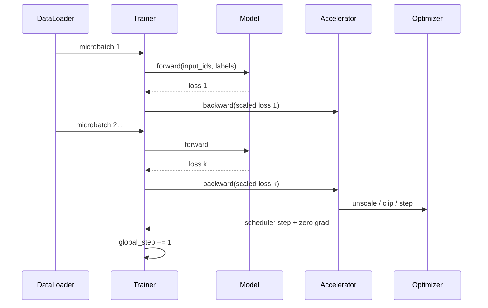
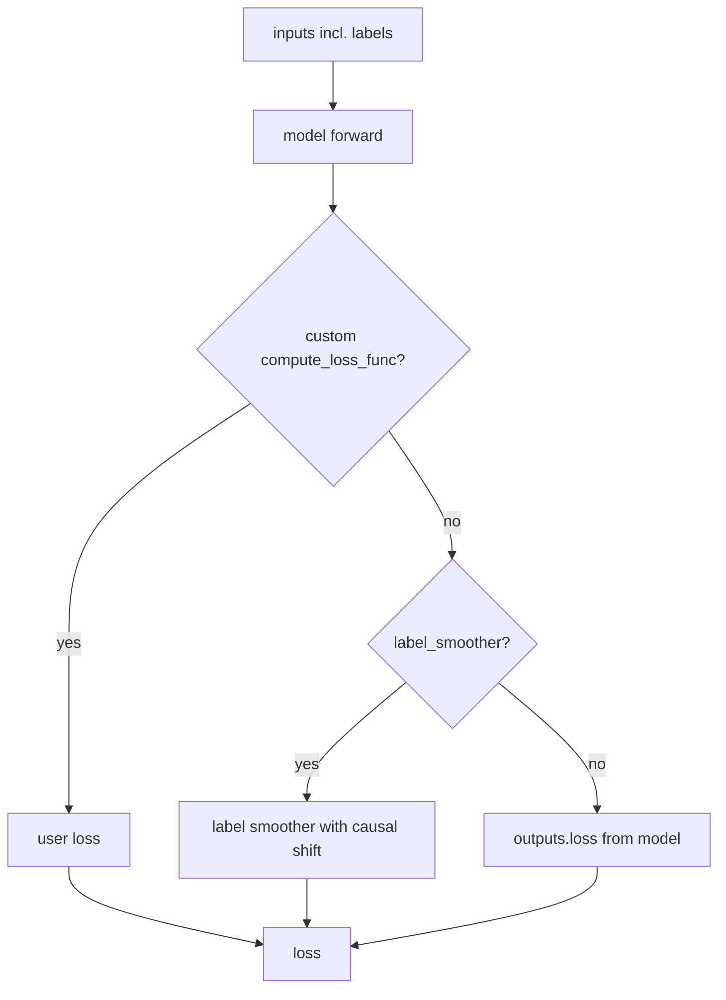
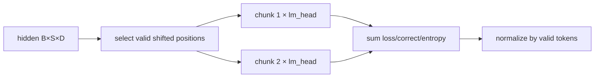

# 从 Labels 到 Loss、Backward 与 Optimizer Update

数据管线只定义监督。真正更新链是：**batch 移到设备 → model forward → causal shift/NLL → loss normalization → backward accumulate → unscale/clip → optimizer step → scheduler step → zero grad。**`global_step` 在 optimizer update 后增加，不是每读一个 batch 就增加。

## 单次 update 时间线



gradient accumulation 期间参数不更新，grad buffer 累积。第 $k$ 个 micro-batch 后才 optimizer step。

## `SFTTrainer.compute_loss()` 做的扩展

固定源码入口 [`SFTTrainer.compute_loss`](https://github.com/huggingface/trl/blob/f3adc504b93d634666c5628e7bdaa99ec8861028/trl/trainer/sft_trainer.py#L1699)：

1. 判断 train/eval，保存 labels；
2. 强制 `use_cache=False`；
3. MoE 可请求 router logits；
4. Liger/DFT 路径设置专用 forward kwargs；
5. 调父类 `Trainer.compute_loss()`；
6. 从 logits 或 chunked output 计算 entropy/token accuracy；
7. 跨 ranks gather counts，记录 token metrics；
8. 返回用于 backward 的 loss。

它没有直接调用 `optimizer.step()`；职责边界到 loss 和 metrics 为止。

固定代码的细节值得逐项核对：[`1699–1741`](https://github.com/huggingface/trl/blob/f3adc504b93d634666c5628e7bdaa99ec8861028/trl/trainer/sft_trainer.py#L1699) 保存 labels、关闭 cache、给 MoE/Liger 增加 kwargs 后才调父类；[`1751–1796`](https://github.com/huggingface/trl/blob/f3adc504b93d634666c5628e7bdaa99ec8861028/trl/trainer/sft_trainer.py#L1751) 对 chunked/普通 logits 分别统计 entropy 与 accuracy；[`1798–1814`](https://github.com/huggingface/trl/blob/f3adc504b93d634666c5628e7bdaa99ec8861028/trl/trainer/sft_trainer.py#L1798) 再按 attention/position 统计 input tokens。日志中的 `num_tokens` 不是 supervised token 数，不能拿它当 labels 密度。

## 父类怎样取得 loss

[`Trainer.compute_loss()`](https://github.com/huggingface/transformers/blob/e52d0fd6fa9eb874f7c2da048198276b04c919b9/src/transformers/trainer.py#L1953) 大致有三条：



标准 causal LM 收到 `labels` 时通常在 model forward 内完成 shift 与 cross entropy。自定义 model 若不返回 loss，Trainer 会报错；自定义 `compute_loss_func` 则必须正确处理 labels、有效 items 和 accumulation。

固定 causal loss 本体是 Transformers [`ForCausalLMLoss` 49–71](https://github.com/huggingface/transformers/blob/e52d0fd6fa9eb874f7c2da048198276b04c919b9/src/transformers/loss/loss_utils.py#L49)：logits 先转 float，labels 右 pad 后左移，flatten 后交 `fixed_cross_entropy`。因此不同 model family 是否走该映射，需查 model 的 `loss_type/loss_function`，不能仅凭类名猜。

## 普通 NLL 与 chunked NLL

### 普通路径

model 产生 `[B,S,V]` logits，再对 shift 后有效 labels 做 cross entropy。大词表、长序列时完整 logits activation 很大。

### 固定 TRL 的 `chunked_nll`

[`_chunked_cross_entropy_loss`](https://github.com/huggingface/trl/blob/f3adc504b93d634666c5628e7bdaa99ec8861028/trl/trainer/sft_trainer.py#L117) 从 hidden states 选出非 ignored target 对应位置，分 chunk 做 lm_head 与 CE，避免同时物化完整 `seq_len × vocab` logits；数学目标仍为 NLL。



该路径 patch model forward，并要求可识别的 top-level `lm_head`/兼容架构；PEFT 包裹 lm_head、Liger 等组合有显式限制。版本升级时要验证实际 resolved loss type，而不是假定旧版 full logits。

## Gradient accumulation 的归一化陷阱

若每个 micro-batch 有相同有效 token 数，对每个 mean loss 除以 accumulation steps 再 backward 可近似全局 mean。但变长/assistant mask 下有效 token 数不同：

$$
\frac{1}{K}\sum_{k=1}^K\frac{\sum_{t\in S_k}\ell_t}{|S_k|}
\ne
\frac{\sum_k\sum_{t\in S_k}\ell_t}{\sum_k|S_k|}
$$

固定 Trainer 先在 [`get_batch_samples` 2112–2127](https://github.com/huggingface/transformers/blob/e52d0fd6fa9eb874f7c2da048198276b04c919b9/src/transformers/trainer.py#L2112) 一次取齐一个 update 的 micro-batches；[`_get_num_items_in_batch` 2129–2189](https://github.com/huggingface/transformers/blob/e52d0fd6fa9eb874f7c2da048198276b04c919b9/src/transformers/trainer.py#L2129) 仅在 model 接受 loss kwargs 或有 custom loss 时计数，并对 causal LM 使用 `labels[...,1:] != -100`。`average_tokens_across_devices=True` 时才跨 ranks 求和。自定义 model/loss 是否接受并正确使用该参数决定最终语义；修改 loss 后要用不等长 micro-batches 与“拼成一个大 batch”的 gradients 做数值对照。

## `training_step()` 到 backward

固定 [`Trainer.training_step()`](https://github.com/huggingface/transformers/blob/e52d0fd6fa9eb874f7c2da048198276b04c919b9/src/transformers/trainer.py#L1880)：

- model/optimizer 切 train；
- `_prepare_inputs` 移到适当 device；
- mixed precision context 中 compute loss；
- 必要时按 accumulation normalization；
- `accelerator.backward(loss)`；
- 返回 detached loss 给日志。

Accelerator 根据 backend 选择普通 backward、GradScaler、DeepSpeed engine 等。不要在外层再手工 `loss.backward()`，否则重复反传。

这条分派的固定源码是 Accelerate [`Accelerator.backward` 2818](https://github.com/huggingface/accelerate/blob/665444ceb62211f2b410d0d0fdb4bc013c5effdf/src/accelerate/accelerator.py#L2818)。Trainer 在 [`1939–1949`](https://github.com/huggingface/transformers/blob/e52d0fd6fa9eb874f7c2da048198276b04c919b9/src/transformers/trainer.py#L1939) 判断是否自行除 accumulation steps，DeepSpeed 时传 `scale_wrt_gas=False`，随后只调用一次 accelerator backward。

## Optimizer step 前后

通用 loop 还会：

1. mixed precision 下 unscale gradients；
2. 按 `max_grad_norm` clip；
3. optimizer step；
4. 判断 step 是否因 overflow 被跳过；
5. LR scheduler step；
6. model zero grad；
7. 更新 state/callback，触发 log/eval/save。

所以看到 LR 在变但参数不变时，查 optimizer overflow/grad 是否存在；看到 `global_step` 比 dataloader batch 少，查 accumulation，而不是认为漏数据。

真实顺序在 [`_run_epoch` 1702–1747](https://github.com/huggingface/transformers/blob/e52d0fd6fa9eb874f7c2da048198276b04c919b9/src/transformers/trainer.py#L1702) 与 [`1766–1787`](https://github.com/huggingface/transformers/blob/e52d0fd6fa9eb874f7c2da048198276b04c919b9/src/transformers/trainer.py#L1766)：前者以 optimizer update 为外层循环、micro-batch 为内层循环并为非最后 microstep 使用 no-sync；后者 clip、optimizer step、检查 skipped、scheduler step、zero grad、global step++。这也解释了为何 step 后再读 `.grad` 常得到 `None`。

## 一次 update 的源码对照表

| 对象 | 进入时 shape/状态 | 离开时变化 | 最小断言 |
| --- | --- | --- | --- |
| batch | ids/labels `[B,S]` | 被移到 device | keys 与 shape 符合 model signature |
| logits/hidden | 普通 `[B,S,V]` 或 chunked hidden `[B,S,H]` | 得到 scalar loss | loss finite；有效 target 数正确 |
| micro loss | scalar | backward 累到 grad | 非最后 microstep 参数未变 |
| gradient | trainable params only | DDP sync/clip | adapter/full 参数集合符合设计 |
| optimizer | param groups + state | `step()` 更新参数 | 至少一个目标参数 delta>0 |
| scheduler/state | LR + global step | 未 overflow 才 scheduler；global step++ | update 数而非 batch 数 |

完整断点实验见[源码反推主实验](./source-walkthrough)。

## 混合精度的对象

| 对象 | 常见 dtype | 说明 |
| --- | --- | --- |
| model weights | BF16/FP16/FP32/quantized | 由加载/分布式策略决定 |
| forward activations | autocast BF16/FP16 等 | 某些 op 保持 FP32 |
| gradients | 常与参数/后端策略相关 | FP16 可能需 scaling |
| optimizer states | 常 FP32，具体 optimizer 可变 | 全参显存大头之一 |
| loss/reductions | 常提升精度 | 防止数值不稳 |

BF16 通常不需要 FP16 式 loss scaling，但仍可能 NaN；量化 base 与 BF16 adapter 又是不同组合。以实际 parameter/grad/state dtype 为证据。

## 分布式时哪一步同步

- DDP：backward 中按 bucket all-reduce gradients；可在 accumulation 的非同步 microsteps 使用 no-sync 语义；
- FSDP/ZeRO：参数、gradient、optimizer state 可能分片，forward/backward/step 前后发生 gather/reduce-scatter；
- TP/CP：forward/backward 内还存在模型维度 collective；
- metrics：SFTTrainer 对正确 token、entropy、valid counts 做 gather/reduce。

“每 rank loss 一样”不是唯一正确条件：数据不同会有局部 loss 差异；关键是全局归一化与同步后的参数一致。

## 参数更新验证

对一个 trainable parameter $w$ 保存：

```python
before = w.detach().float().cpu().clone()
# one optimizer update
delta = (w.detach().float().cpu() - before).norm()
print("grad", None if w.grad is None else w.grad.float().norm().item())
print("delta", delta.item())
```

应在 optimizer step **前**检查 grad，在 step 后检查 delta；zero_grad 后 `w.grad` 可能已为 None。LoRA 要选 adapter parameter，不要选 frozen base。

多卡 shard 参数需使用 backend 提供的 full-param/context 或逐 rank 合法检查，不能随意 gather 破坏状态。

## 故障定位表

| 现象 | 断点/证据 |
| --- | --- |
| loss 与手算 CE 不同 | shift、ignore labels、loss type、aux loss、normalization |
| grad=None | requires_grad、forward 是否使用该参数、adapter target |
| grad=0 | mask/数据、饱和、参数路径、错误 detach |
| 有 grad 但 delta=0 | optimizer param groups、overflow skip、LR=0、step 边界 |
| delta 过大/NaN | LR、scaler、clip 前 grad norm、dtype |
| accumulation 改变结果过多 | token 数不等与 loss normalization |
| rank 间 diverge | sampler、sync/no_sync、unused params、collective |

## 通关标准

你应能从有效 label 追到 shifted target、loss、backward、grad 和 parameter delta；解释普通/chunked NLL 的数学同一与内存差异；指出 accumulation 在变长 token 上的归一化风险；知道同步由 DDP/FSDP/DeepSpeed 的哪一阶段完成。

下一阶段进入[显存、吞吐与分布式](../systems/scaling)。
