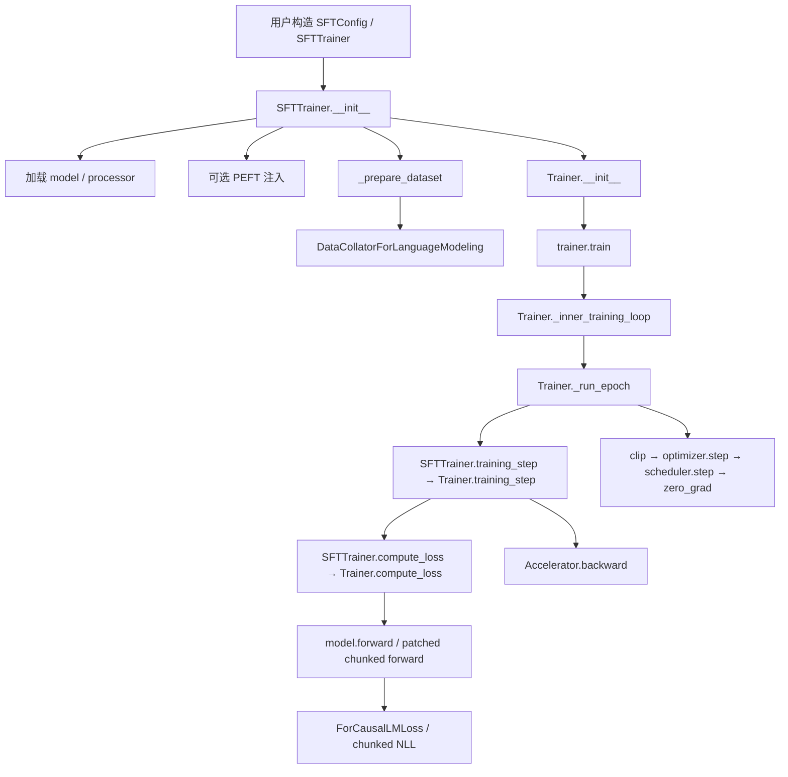
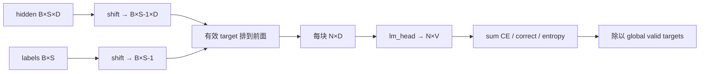

# SFT 源码反推实验：从构造器到一次参数更新

本实验不从“怎样调用 API”开始，而从一个可验证问题开始：**一条 `prompt/completion` 样本的哪个 token，在什么函数里变成 label，又在哪一个 optimizer update 中改变了哪个参数？**

源码快照：TRL [`f3adc504`](https://github.com/huggingface/trl/tree/f3adc504b93d634666c5628e7bdaa99ec8861028)、Transformers [`e52d0fd6`](https://github.com/huggingface/transformers/tree/e52d0fd6fa9eb874f7c2da048198276b04c919b9)、PEFT [`cea82131`](https://github.com/huggingface/peft/tree/cea8213158c8b682acc0839405c2062d57fdf867)、Accelerate [`665444ce`](https://github.com/huggingface/accelerate/tree/665444ceb62211f2b410d0d0fdb4bc013c5effdf)。先 `git checkout`，再按下面行号阅读；版本改变就重新做实验。

## 先画出真正的调用图



入口证据：[`SFTTrainer.__init__` 901–1372](https://github.com/huggingface/trl/blob/f3adc504b93d634666c5628e7bdaa99ec8861028/trl/trainer/sft_trainer.py#L901)、[`Trainer._inner_training_loop` 1444–1535](https://github.com/huggingface/transformers/blob/e52d0fd6fa9eb874f7c2da048198276b04c919b9/src/transformers/trainer.py#L1444)、[`Trainer._run_epoch` 1666–1804](https://github.com/huggingface/transformers/blob/e52d0fd6fa9eb874f7c2da048198276b04c919b9/src/transformers/trainer.py#L1666)。

`SFTTrainer` 没有重写整个训练循环。它在构造期接管 SFT 特有的数据和 loss，在训练期只用 activation-offload context 包住父类 `training_step`；真正的 accumulation、clip、step、scheduler、global step 在 Transformers 父类。

## 实验 1：把初始化拆成九个阶段

按顺序读，不要从类名猜行为。

| 阶段 | 固定源码 | 触发条件 | 输出/副作用 | 当场验证 |
| --- | --- | --- | --- | --- |
| 配置归一 | [`901–934`](https://github.com/huggingface/trl/blob/f3adc504b93d634666c5628e7bdaa99ec8861028/trl/trainer/sft_trainer.py#L901) | `args=None` 或普通 `TrainingArguments` | 得到 `SFTConfig` | `print(type(trainer.args), trainer.args.to_dict())` |
| 数据入口 | [`936–947`](https://github.com/huggingface/trl/blob/f3adc504b93d634666c5628e7bdaa99ec8861028/trl/trainer/sft_trainer.py#L936) | 总是；Iterable 有额外分支 | 无 train dataset 直接报错；Iterable 强制 `dispatch_batches=False` | 构造空/Iterable 两个反例 |
| model load | [`949–976`](https://github.com/huggingface/trl/blob/f3adc504b93d634666c5628e7bdaa99ec8861028/trl/trainer/sft_trainer.py#L949) | `model` 是字符串 | 合并 quant config；多 GPU/DS 清掉 auto device map | 打印 model class、quant flag、device map |
| processor | [`978–1013`](https://github.com/huggingface/trl/blob/f3adc504b93d634666c5628e7bdaa99ec8861028/trl/trainer/sft_trainer.py#L978) | 未传 `processing_class` 时自动加载 | tokenizer/VLM 分类、EOS、可选模板克隆 | 保存 tokenizer class、special ids、template hash |
| VLM guards | [`1015–1036`](https://github.com/huggingface/trl/blob/f3adc504b93d634666c5628e7bdaa99ec8861028/trl/trainer/sft_trainer.py#L1015) | processor 是 VLM | 禁止 packing、padding-free、assistant-only、keep-end | 用错误组合确认在 init 阶段失败 |
| PEFT | [`1038–1137`](https://github.com/huggingface/trl/blob/f3adc504b93d634666c5628e7bdaa99ec8861028/trl/trainer/sft_trainer.py#L1038) | `peft_config != None` 或 model 已是 PEFT | adapter 注入、k-bit/GC/dtype/ZeRO-3 兼容处理 | 打印 trainable names、dtype 与比例 |
| collator/mode | [`1139–1247`](https://github.com/huggingface/trl/blob/f3adc504b93d634666c5628e7bdaa99ec8861028/trl/trainer/sft_trainer.py#L1139) | 总是 | 决定 padding-free、completion-only、assistant template、collator | 打印四个 resolved flags 与 collator class |
| dataset | [`1249–1283`](https://github.com/huggingface/trl/blob/f3adc504b93d634666c5628e7bdaa99ec8861028/trl/trainer/sft_trainer.py#L1249) | 未 skip 且不是 vision dataset | train/eval 都进入 `_prepare_dataset` | 比较 raw/processed columns 和 row 数 |
| loss + parent | [`1285–1369`](https://github.com/huggingface/trl/blob/f3adc504b93d634666c5628e7bdaa99ec8861028/trl/trainer/sft_trainer.py#L1285) | 按 `loss_type`/Liger/MoE | 选择 loss、patch forward、调用 `Trainer.__init__` | 打印 loss type、forward identity、aux flag |

### 不能省略的启动条件

当前源码明确检查：

1. `train_dataset` 必须存在；Iterable dataset 必须用 `max_steps` 才能界定训练长度，且 dispatch 被关闭；
2. 已实例化 model 会忽略 `model_init_kwargs` 与 trainer 的 `quantization_config`；只有字符串 model path 才由 trainer 加载量化模型；
3. `PeftModel + peft_config` 同时传入会报错，避免二次注入；
4. BFD/BFD-split packing 强制 padding-free；自定义 collator 与 padding-free 不兼容；已知安全 attention backend 是固定列表中的 Flash Attention 变体；
5. `assistant_only_loss=True` 要求 conversational dataset；模板无 generation marker 时只对仓库已知模板自动替换，未知模板会报错；
6. padding-free 且不 packing 时，`max_length` 必须是 `None` 或数据必须预截断；
7. `completion_only_loss=True` 与 `formatting_func` 冲突，因为 formatter 会把边界抹成 LM text；
8. `chunked_nll` 与 Liger 冲突；LoRA 若直接包住 `lm_head` 也冲突，因为直读输出权重会漏 adapter delta。

不要把 warning 当成“代码会替你修好”。例如非 FlashAttention 的 packing 只是 warning，但可能发生跨样本 attention 污染。

## 实验 2：追一条样本的字段与张量

设 tokenizer 得到下面的抽象 token（真实 id 由模型决定）：

```text
prompt:     [BOS, Q, COLON]
completion:[SPACE, A, EOS]
full ids:   [11, 21, 31, 41, 51, 2]
```

### 2.1 tokenize 与 boundary

在 [`tokenize_fn` 1456–1528](https://github.com/huggingface/trl/blob/f3adc504b93d634666c5628e7bdaa99ec8861028/trl/trainer/sft_trainer.py#L1456) 中，标准 prompt-completion 分别 tokenize `prompt` 与 `prompt+completion`，然后按 `len(prompt_ids)` 构造：

```text
input_ids       [11, 21, 31, 41, 51,  2]
completion_mask [ 0,  0,  0,  1,  1,  1]
```

对 conversational prompt，prompt 单独 tokenize 时显式 `add_generation_prompt=True`，完整对话则请求可选 assistant mask。源码只在 prefix 不一致时 warning，不会替你重新推导正确 boundary。因此必须断言：

```python
assert full_ids[:len(prompt_ids)] == prompt_ids
```

### 2.2 masks 交集变 labels

[`build_labels` 1541–1568](https://github.com/huggingface/trl/blob/f3adc504b93d634666c5628e7bdaa99ec8861028/trl/trainer/sft_trainer.py#L1541) 收集适用 masks；completion mask 只有 resolved completion-only 为真才加入，assistant mask 只要存在就加入。对上例：

```text
labels [-100, -100, -100, 41, 51, 2]
```

若再有 `assistant_masks=[0,0,0,0,1,1]`，交集后变为：

```text
labels [-100, -100, -100, -100, 51, 2]
```

这里的 labels 尚未 shift。`labels[i]` 与 `input_ids[i]` 同位置，仅表达“token i 是否是监督目标”。

### 2.3 truncate / filter / pack

非 packing 路径在 [`1570–1597`](https://github.com/huggingface/trl/blob/f3adc504b93d634666c5628e7bdaa99ec8861028/trl/trainer/sft_trainer.py#L1570) 同时切 ids 与 labels，然后过滤完全没有有效 label 的样本。packing 路径在 [`1599–1614`](https://github.com/huggingface/trl/blob/f3adc504b93d634666c5628e7bdaa99ec8861028/trl/trainer/sft_trainer.py#L1599) 只保留 ids/labels 并调用 `pack_dataset`。

`bfd`、`bfd_split`、`wrapped` 的真实行为在 [`pack_dataset` 843–929](https://github.com/huggingface/trl/blob/f3adc504b93d634666c5628e7bdaa99ec8861028/trl/data_utils.py#L843)：`bfd` 截掉超长尾部、`bfd_split` 将溢出片段继续装箱、`wrapped` 无视样本边界切流。选择策略就是选择数据语义，不只是性能开关。

### 2.4 collator 组成 batch

[`DataCollatorForLanguageModeling.torch_call` 462–507](https://github.com/huggingface/trl/blob/f3adc504b93d634666c5628e7bdaa99ec8861028/trl/trainer/sft_trainer.py#L462) 对两条长度 6/4 的样本，在普通模式得到：

```text
input_ids      shape [2,6]，右侧 pad
labels         shape [2,6]，pad 位置为 -100
attention_mask shape [2,6]，真实 token=1，pad=0
```

padding-free 模式会先 concat 成 `[1,10]`，返回 `position_ids` 而不是 attention mask，并把每个 `position_id==0` 的 label 设为 `-100`，防止新文档第一个 token 被前文最后一个位置预测。**这只隔断 loss，不自动证明 attention 已隔断**；attention backend 必须理解重置 positions/sequence lengths。

把下面断言放在训练前：

```python
batch = trainer.data_collator([trainer.train_dataset[0], trainer.train_dataset[1]])
assert batch["input_ids"].shape == batch["labels"].shape
assert (batch["labels"] != -100).any()
if "attention_mask" in batch:
    assert (batch["labels"][batch["attention_mask"] == 0] == -100).all()
if "position_ids" in batch:
    assert (batch["labels"][batch["position_ids"] == 0] == -100).all()
print({k: tuple(v.shape) for k, v in batch.items()})
```

## 实验 3：反推 causal shift

Transformers 固定实现 [`ForCausalLMLoss` 49–71](https://github.com/huggingface/transformers/blob/e52d0fd6fa9eb874f7c2da048198276b04c919b9/src/transformers/loss/loss_utils.py#L49) 会先在 labels 右侧 pad 一个 `-100`，再取 `labels[..., 1:]`。因此：

```text
logits position 0  1  2  3  4  5
predicts label   1  2  3  4  5  ignored
effective target [-100, -100, 41, 51, 2, -100]
```

completion 第一个 token `41` 的梯度来自 prompt 最后位置 `2` 的 hidden/logits，而不是位置 `3`。这就是 teacher forcing 的 next-token 对齐。

手算检查：

```python
import torch
import torch.nn.functional as F

labels = torch.tensor([[-100, -100, -100, 41, 51, 2]])
logits = torch.randn(1, 6, 100, requires_grad=True)
manual = F.cross_entropy(
    logits[:, :-1].reshape(-1, 100).float(),
    labels[:, 1:].reshape(-1),
    ignore_index=-100,
)
manual.backward()
assert logits.grad[:, 2:5].abs().sum() > 0
assert logits.grad[:, :2].abs().sum() == 0
print("loss", manual.item(), "supervised shifted tokens", (labels[:, 1:] != -100).sum().item())
```

预期：有效 shifted target 数是 3；位置 2–4 有梯度，0–1 没有。随机 loss 数值每次不同，但必须有限。

## 实验 4：普通 NLL 与 chunked NLL

`SFTConfig.__post_init__` 在未显式指定时把 loss 定为 `chunked_nll`，Liger 时改为 `nll`，见 [`334–336`](https://github.com/huggingface/trl/blob/f3adc504b93d634666c5628e7bdaa99ec8861028/trl/trainer/sft_config.py#L334)。

普通模型 forward 通常物化 `[B,S,V]` logits，再用 causal loss。当前 TRL 的 [`_chunked_cross_entropy_loss` 117–234](https://github.com/huggingface/trl/blob/f3adc504b93d634666c5628e7bdaa99ec8861028/trl/trainer/sft_trainer.py#L117) 则：

1. 先把 hidden 与 labels 做 causal shift；
2. 用 mask 排序，把有效 target 对应 hidden 移到前面；
3. 只对覆盖有效 target 的 chunks 运行 `lm_head`；
4. 每个 chunk 用 checkpoint 重算，累计 loss/correct/entropy；
5. 有 `num_items_in_batch` 时按整个 accumulated batch 的有效 target 数归一。



它省的是完整 logits 激活，不会消除 decoder hidden/attention activation。若有效 labels 很少，收益更明显；若将 `lm_head` 本身做 LoRA，固定实现会在初始化时拒绝，以免直接读 weight 时漏掉 adapter forward。

## 实验 5：从 `train()` 到 optimizer update

真实调用顺序与责任如下：

| 顺序 | 固定源码 | 关键动作 | 观察点 |
| ---: | --- | --- | --- |
| 1 | [`get_train_dataloader` 875–893](https://github.com/huggingface/transformers/blob/e52d0fd6fa9eb874f7c2da048198276b04c919b9/src/transformers/trainer.py#L875) | sampler、batch size、collator 组成 dataloader | first batch keys/shapes |
| 2 | [`_prepare_for_training` 1568–1664](https://github.com/huggingface/transformers/blob/e52d0fd6fa9eb874f7c2da048198276b04c919b9/src/transformers/trainer.py#L1568) | optimizer、model wrap、`accelerator.prepare`、scheduler、resume | `model` 与 `model_wrapped` class |
| 3 | [`_run_epoch` 1702–1747](https://github.com/huggingface/transformers/blob/e52d0fd6fa9eb874f7c2da048198276b04c919b9/src/transformers/trainer.py#L1702) | 预取 accumulation 个 micro-batch；非最后一个用 no-sync | micro/update 对应关系 |
| 4 | [`Trainer.training_step` 1880–1951](https://github.com/huggingface/transformers/blob/e52d0fd6fa9eb874f7c2da048198276b04c919b9/src/transformers/trainer.py#L1880) | prepare inputs、autocast、compute loss、normalize、backward | detached micro loss、grad |
| 5 | [`Trainer.compute_loss` 1953–2040](https://github.com/huggingface/transformers/blob/e52d0fd6fa9eb874f7c2da048198276b04c919b9/src/transformers/trainer.py#L1953) | model forward；custom/label smoother/model loss 三选一 | outputs keys、loss source |
| 6 | [`Accelerator.backward` 2818](https://github.com/huggingface/accelerate/blob/665444ceb62211f2b410d0d0fdb4bc013c5effdf/src/accelerate/accelerator.py#L2818) | 普通 backward、scaler、DeepSpeed 等后端分派 | backend、scale、overflow |
| 7 | [`_run_epoch` 1766–1787](https://github.com/huggingface/transformers/blob/e52d0fd6fa9eb874f7c2da048198276b04c919b9/src/transformers/trainer.py#L1766) | clip、optimizer step、scheduler、zero grad、global step++ | grad norm、parameter delta、LR |

optimizer 只收 `requires_grad=True` 的参数，并按 weight-decay/non-decay 分组，见 [`create_optimizer` 1156–1211](https://github.com/huggingface/transformers/blob/e52d0fd6fa9eb874f7c2da048198276b04c919b9/src/transformers/trainer.py#L1156)。所以 LoRA 是否真正训练，最直接的证据不是“配置里写了 LoRA”，而是 adapter 参数出现在 optimizer group、反传后有 grad、step 后有 delta。

## 最小断点与日志实验

先单卡、`max_steps=1`、`gradient_accumulation_steps=2`。在 IDE 设置以下断点，或临时用 debugger 条件断点；不要修改第三方源码后忘记记录 dirty state。

```text
trl/trainer/sft_trainer.py:1170   resolved completion-only
trl/trainer/sft_trainer.py:1456   raw example → tokenize output
trl/trainer/sft_trainer.py:1555   masks → labels
trl/trainer/sft_trainer.py:462    examples → batch tensors
trl/trainer/sft_trainer.py:1699   SFT compute_loss inputs
transformers/trainer.py:1918      model forward 前
transformers/trainer.py:1949      backward
transformers/trainer.py:1773      optimizer.step
```

每个断点只记录：对象类型、keys、shape/dtype/device、有效 labels 数、global/micro step。不要打印完整模型或整个 dataset。

建议 trace 表：

| checkpoint | 必须保存的值 |
| --- | --- |
| init resolved | model class、processor、collator、loss type、packing/padding-free、completion/assistant-only |
| dataset row | raw/rendered、ids、labels、有效目标数、截断前后长度 |
| batch | keys、每个 tensor shape/dtype、每条有效目标数 |
| forward | model wrapper、outputs keys、loss、logits 是否为 None |
| backward | 一个 trainable param 的 grad norm、是否 sync |
| optimizer | step 前后 param norm/delta、LR、global step |

## 反例矩阵：让源码主动证明边界

| 反例 | 配置/输入 | 预期失败位置 |
| --- | --- | --- |
| 没数据 | `train_dataset=None` | init 936–937 |
| 错误 adapter | 已是 `PeftModel` 又传 `peft_config` | init 1050–1054 |
| 错误 vision 组合 | VLM + `packing=True` | init 1015–1019 |
| 错误目标 | 非 conversational + assistant-only | init 1219–1222 |
| 无 generation span | assistant-only 且任一样本无 assistant mask | tokenize 1521–1526 |
| 边界被 formatter 抹掉 | completion-only + `formatting_func` | init 1263–1268 |
| padding-free 长度不受控 | padding-free、无 packing、`max_length!=None` | init 1243–1247 |
| 无 labels 的跳过预处理 | skip + 只有 completion/assistant masks | guard 1637–1655 |
| 不兼容 loss | Liger + chunked NLL | init 1324–1325 |
| LoRA 包 lm_head | chunked NLL + output head tuner | init 1305–1318 |

这些反例就是最小回归测试：升级 TRL 后再次运行，若失败阶段或语义改变，就更新课程与生产 pipeline。

## 验收：你必须能提交六份证据

1. 固定 commit 与环境清单，源码 worktree 无未记录修改；
2. 一条 raw → rendered → ids → masks → labels → batch 的逐 token 表；
3. 一次普通 NLL 的手算 CE 对照，以及当前实际 loss type；
4. 两个 micro-batch 到一个 optimizer update 的断点 trace；
5. 一个 trainable 参数的 `grad_norm>0` 与 `delta_norm>0`；
6. 上表至少四个反例按预期在明确源码分支失败。

只记录 loss 曲线不算完成；它不能证明监督 token、causal shift、同步和参数更新都正确。完成后再进入[LoRA/QLoRA](../practice/lora-qlora)与[分布式扩展](../systems/scaling)。
