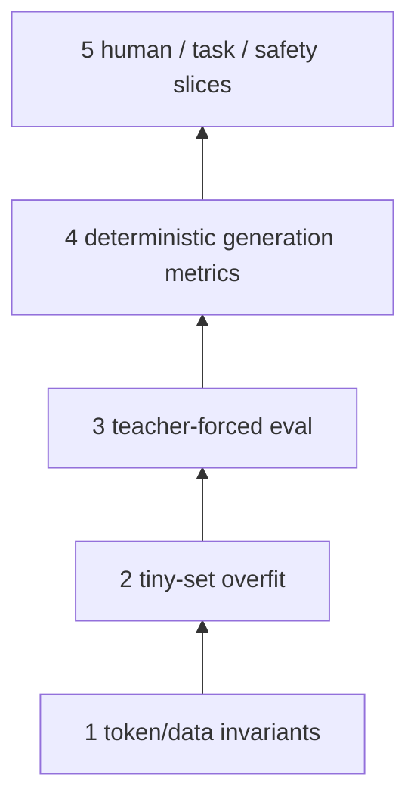
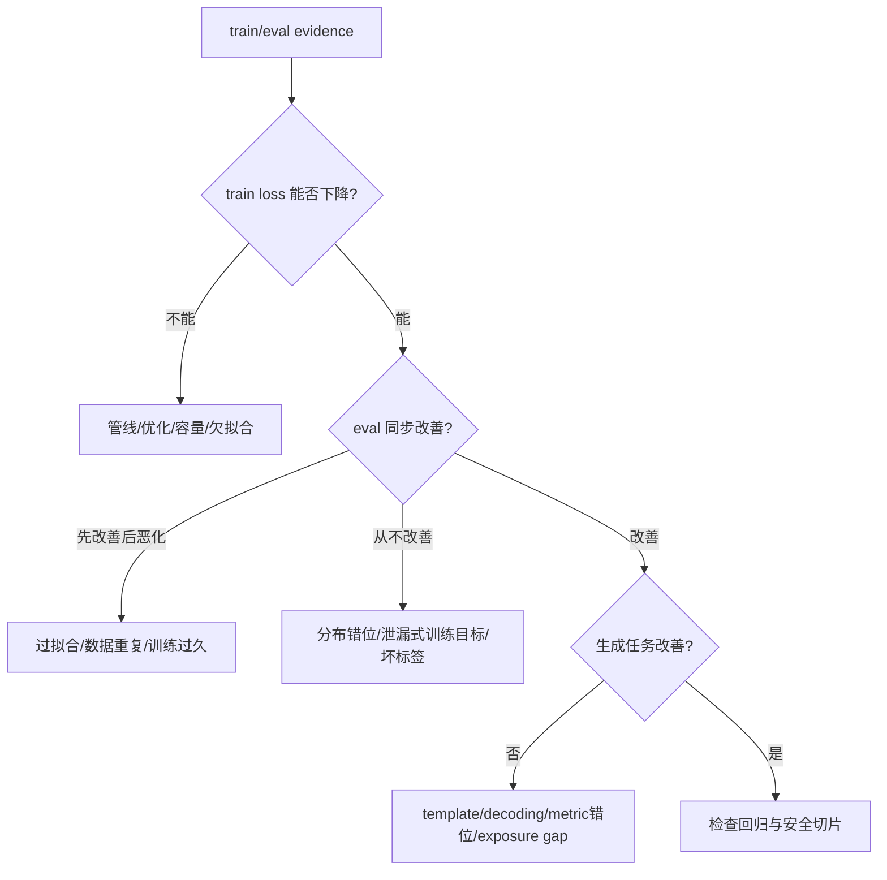

# SFT 评估、过拟合与数据诊断

没有单一指标能证明 SFT 成功。应建立一座证据梯：**管线正确 → 能过拟合小样本 → held-out loss 改善 → 真实生成完成任务 → 关键切片与回归不过度退化。**越靠后越接近产品目标，越靠前越适合定位错误。

## 五层评估



| 层 | 回答 | 不能单独回答 |
| --- | --- | --- |
| token invariants | labels/template/截断是否正确 | 模型质量 |
| tiny overfit | forward-backward-update 是否连通 | 泛化 |
| eval loss/perplexity | held-out target token 概率是否提高 | 自由生成长期行为 |
| task metric | exact match、执行、JSON 等任务结果 | 未覆盖的开放质量 |
| 人工/安全/回归 | 帮助性、事实、风格、风险与旧能力 | 全量统计稳定性 |

## Tiny-overfit 是单元测试

从 16–64 条无歧义样本构造固定集，关闭复杂增强，训练到模型能 greedy 复现目标。失败的常见原因：

- labels 全/大部被 mask；
- answer 被 `max_length` 截断；
- optimizer 没 step 或 trainable params=0；
- chat template 与生成 prompt 不一致；
- LR/precision 导致数值问题；
- checkpoint/load 路径错误。

tiny overfit 通过只证明管线有能力记忆，不证明数据量、正则或泛化配置合理。

## Teacher-forced 指标怎样读

### Eval loss

必须在相同 tokenizer/template、mask policy、max length 和 loss normalization 下比较。assistant-only 与 full-sequence loss 不能直接横比；有效 labels 不同。

### Perplexity

$$
PPL=\exp(\mathcal L_{token})
$$

它要求 loss 是可比较的平均 NLL。不同词表/tokenization、mask 或特殊 token 会改变单位。PPL 更低表示 target token 概率更高，不保证回答更事实、更安全或遵循指令。

### Mean token accuracy

当前 TRL 可记录非 masked token 的 top-1 accuracy。它直观但偏向容易/重复 token，也不反映概率校准和长生成错误传播。

### Gradient 与优化指标

`learning_rate`、`grad_norm`、有效 tokens/update、step time 与 NaN/overflow 是解释 loss 的上下文。只看平滑后的 loss 会掩盖 batch slice 异常。

## 真实生成要固定协议

建立 versioned prompt suite，保存渲染后 ids 与生成参数：

```python
GEN = dict(
    do_sample=False,
    max_new_tokens=128,
    repetition_penalty=1.0,
)
```

先用 greedy 做版本回归，避免 sampling noise；再用生产采样参数评估体验。对话模型必须使用与训练一致的 chat template 和 generation prompt。

每条记录：example id、data slice、model/base/adapter revision、rendered input hash、output、latency、自动分数、错误标签。不要只保存聚合分数。

## 自动指标按任务选

| 任务 | 主指标 | 必须防的“假通过” |
| --- | --- | --- |
| 分类/短答案 | normalized exact match、F1 | 格式/标点造成假错或答案泄漏 |
| 数学 | final answer + 独立求解/校验 | 只匹配字符串、错误推理碰巧同答案 |
| 代码 | sandboxed unit tests | 不可信代码逃逸、测试太弱 |
| JSON/工具 | schema + business constraints + tool simulation | 语法合法但调用无权限/语义错 |
| 摘要 | factuality/coverage + 人审 | n-gram 高但事实幻觉 |
| 对话 | rubric pairwise + blind review | position/verbosity bias |

LLM judge 可以扩展抽样，但要固定 judge version/prompt，做人工校准并报告不确定/分歧。它不能成为唯一 ground truth。

## 切片比总分更有诊断力

至少按以下维度分桶：来源、语言、任务、难度、prompt/output 长度、多轮数、工具/推理、有无截断、训练中频次、安全类别。

```text
overall +4% 可能由：
  easy FAQ      +12%
  code           +1%
  long context   -9%
  safety         -6%
```

总体改善不应掩盖关键业务 slice 回退。发布门禁要明确“必须不退化”的切片，而不是训练后临时挑指标。

## 用曲线区分三类问题



### 欠拟合

train loss 高且仍下降：增加有效 steps/capacity、检查 LR；但先确认标签不是高噪声。train loss 不动：检查管线优先于“模型太小”。

### 过拟合

train 持续降、eval 反弹：early stopping/最佳 checkpoint、去重、增加多样性、调 LR/正则/LoRA rank。不能只通过扩大 eval 集掩盖。

### 目标错位

eval NLL 降但生成没改善：检查 mask 是否监督了模板/思维噪声，推理模板是否一致，任务 metric 是否真正反映产品目标。

## 数据归因实验

当新增数据后质量变化，用受控 ablation：

1. 固定 base、seed、tokens/update、总监督 token budget；
2. baseline 数据 A；
3. A+B；
4. 只在关键 slice 上比较；
5. 若变化显著，再按 B 的来源/质量等级拆分。

不能让 A+B 因总训练 token 更多而自然占优，再把全部增益归功于 B 的质量。

## Checkpoint 选择与测试集纪律

- validation 用于选 step/超参；test 只在方案冻结后少量运行；
- 保存 best 与 last，区分“最后一步”和“最佳验证”；
- 多次试验盯同一 test 会把 test 变成 validation；
- 报告多 seed 或至少说明单 seed 方差未知；
- adapter/merged checkpoint 都做加载后的独立进程 smoke。

## 最小报告模板

```text
Hypothesis:
Model/base/adapter revisions:
Data manifest and split grouping:
Template/tokenizer/mask policy:
Global batch and supervised tokens/update:
Train/eval curves:
Task metrics by slice + confidence/seed:
Representative wins/failures:
Regression and safety gates:
Peak memory / supervised tokens per second:
Selected checkpoint and why:
Known limitations / rollback:
```

## 通关练习

现象：train loss 0.4、eval loss 0.6，均比 base 好；但服务端回答总以 `<|assistant|>` 开头两次。最强假设不是过拟合，而是训练/服务发生模板重复或数据 content 已含 role marker。比较离线与服务最终 `input_ids`，以及清洗前 content。

## 通关标准

你应能设计 tiny-overfit 单测、解释 PPL 的可比条件、建立 deterministic generation suite、按 slice 找到总体分数掩盖的回退，并用曲线区分优化失败、过拟合和目标错位。

下一阶段沿源码看[TRL / Transformers 架构](../internals/architecture)。
