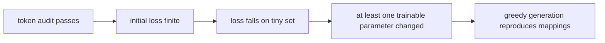

# 第一次可验证的 TRL SFT

第一次 run 的目标不是得到可上线模型，而是证明四件事：**样本被正确 token 化、目标 labels 正确、参数确实更新、模型能记住一小组监督。**因此使用小模型、内存构造的数据和短训练，不引入数据下载脚本、packing、LoRA 或多卡变量。

## 运行条件

推荐 Python 虚拟环境与一张可用 GPU；135M 级模型也可用 CPU 验证逻辑，但会慢。安装与你选定版本兼容的 PyTorch 后：

```bash
python -m venv .venv
source .venv/bin/activate
python -m pip install --upgrade pip
python -m pip install trl datasets

python - <<'PY'
import torch, transformers, trl
print("torch", torch.__version__)
print("transformers", transformers.__version__)
print("trl", trl.__version__)
print("cuda", torch.cuda.is_available())
PY
```

课程解释绑定固定提交；你可安装对应 release 或源码 commit。网络受限环境应提前把 model/tokenizer 按固定 revision 放到本地，并启用离线模式。不要在生产机直接运行未审查的 `trust_remote_code=True`。

## 最小训练脚本

下面刻意使用标准 `prompt`/`completion`，先绕开 chat template。模型 id 可替换为本地的 100M–600M causal LM；示例模型需要首次下载。

```python
import json
import os

import torch
from datasets import Dataset
from transformers import AutoTokenizer, set_seed
from trl import SFTConfig, SFTTrainer

MODEL = os.environ.get("MODEL", "HuggingFaceTB/SmolLM2-135M")
OUT = "runs/tiny-sft"
set_seed(42)

pairs = [
    ("代号 A17 对应什么颜色？", " 青绿色。"),
    ("代号 B04 对应什么动物？", " 雪豹。"),
    ("代号 C29 对应什么城市？", " 苏州。"),
    ("代号 D63 对应什么乐器？", " 大提琴。"),
]
rows = [
    {"prompt": f"问题：{q}\n答案：", "completion": a}
    for _ in range(16)
    for q, a in pairs
]
train_ds = Dataset.from_list(rows)

bf16 = torch.cuda.is_available() and torch.cuda.is_bf16_supported()
fp16 = torch.cuda.is_available() and not bf16

args = SFTConfig(
    output_dir=OUT,
    max_steps=120,
    per_device_train_batch_size=4,
    gradient_accumulation_steps=1,
    learning_rate=5e-5,
    warmup_ratio=0.05,
    logging_steps=5,
    save_strategy="no",
    report_to="none",
    max_length=128,
    completion_only_loss=True,
    packing=False,
    gradient_checkpointing=False,
    bf16=bf16,
    fp16=fp16,
    seed=42,
)

trainer = SFTTrainer(
    model=MODEL,
    args=args,
    train_dataset=train_ds,
)

# 在第一步前审计 Trainer 实际构建的数据，不猜测 mask。
example = trainer.train_dataset[0]
tokenizer = trainer.processing_class
tokens = tokenizer.convert_ids_to_tokens(example["input_ids"])
audit = [
    {"pos": i, "token": tok, "id": tid, "label": lab}
    for i, (tok, tid, lab) in enumerate(
        zip(tokens, example["input_ids"], example["labels"], strict=True)
    )
]
print(json.dumps(audit, ensure_ascii=False, indent=2))
assert any(x["label"] != -100 for x in audit)
assert all(
    x["label"] == -100
    for x in audit[: next(i for i, x in enumerate(audit) if x["label"] != -100)]
)

result = trainer.train()
print(result.metrics)
trainer.save_model(OUT)
tokenizer.save_pretrained(OUT)
```

命令：

```bash
python train_tiny.py 2>&1 | tee runs/tiny-sft.log
```

代码中的高学习率和重复数据只用于过拟合测试，不是生产配方。

## 第一批前必须看什么

把 audit 输出还原成人能读的表：

| 检查 | 通过条件 |
| --- | --- |
| prompt boundary | prompt 对应 labels 全为 `-100` |
| completion | 答案 token labels 为自身 token id |
| EOS | completion 末尾存在 EOS，且 label 有效 |
| 长度 | 未意外截断；`len(input_ids)==len(labels)` |
| 空监督 | 每条至少一个非 `-100` target |
| 特殊 token | 无重复 BOS/EOS 或乱码 token |

若这一步不通过，不运行 120 steps。loss 可能在错误 labels 上照样下降。

## 训练时的四项证据



### 1. Loss 有限且下降

NaN/Inf 先查 dtype、数据和 LR。小数据重复训练应明显下降；完全不动时先查有效 labels、trainable params 与 optimizer step，而不是先增加 epochs。

### 2. Global step 确实增加

`global_step` 是 optimizer update 数，不是 dataloader micro-batch 数。当前配置没有 accumulation，因此二者接近；改变 accumulation 后要重新计算。

### 3. 参数确实更新

严谨做法是在训练前保存一个代表参数副本，训练后比较 norm。全参训练应有大量参数 `requires_grad=True`；LoRA 则只允许 adapter/显式 modules 更新。

### 4. Greedy 生成

```python
model = trainer.model.eval()
device = next(model.parameters()).device

for q, expected in pairs:
    prompt = f"问题：{q}\n答案："
    inputs = tokenizer(prompt, return_tensors="pt").to(device)
    with torch.no_grad():
        ids = model.generate(
            **inputs,
            max_new_tokens=16,
            do_sample=False,
            eos_token_id=tokenizer.eos_token_id,
            pad_token_id=tokenizer.pad_token_id or tokenizer.eos_token_id,
        )
    completion = tokenizer.decode(ids[0, inputs.input_ids.shape[1]:], skip_special_tokens=True)
    print(q, repr(completion), "expected", repr(expected))
```

这四条都是训练数据，目的是检查连通性，不是泛化指标。

## 再加对话格式

基础 run 通过后，把相同事实改成：

```python
{"messages": [
    {"role": "user", "content": "代号 A17 对应什么颜色？"},
    {"role": "assistant", "content": "青绿色。"},
]}
```

并显式使用带 chat template 的 instruct tokenizer；如果启用 `assistant_only_loss=True`，先验证 generation markers 能产出 assistant mask。推理也必须：

```python
tokenizer.apply_chat_template(
    [{"role": "user", "content": question}],
    tokenize=True,
    add_generation_prompt=True,
    return_tensors="pt",
)
```

不要同时保留自己手工拼的 `<|user|>` 文本和自动模板。

## 基线记录

```text
model id + revision:
tokenizer/template hash:
TRL/Transformers/PyTorch/CUDA:
dataset rows + hash:
input/nonmasked token distribution:
global batch + tokens/update:
first/final loss:
steps/sec + supervised tokens/sec:
peak GPU memory:
four greedy outputs:
checkpoint contents:
```

`nvidia-smi` 的瞬时数值不能替代 `torch.cuda.max_memory_allocated()`/reserved 与 profiler；先至少记录 peak allocated/reserved。

## 常见失败

| 现象 | 首查 |
| --- | --- |
| `No columns in dataset` | schema 是否为 `text/messages` 或 `prompt/completion` |
| loss=0/NaN | labels 是否全 `-100`、精度/LR |
| loss 降但生成续写 prompt | completion mask/template boundary |
| 不生成 EOS | EOS 是否出现在有效 labels |
| checkpoint 无完整权重 | 是否其实用了 PEFT adapter |
| OOM | sequence/batch、dtype、activation，不先上多卡 |

## 通关标准

你应能在一台机器上复现：token audit 通过、tiny set loss 下降、参数改变、greedy 记住四条映射。任何一项失败，都能沿 dataset → labels → forward → backward → optimizer 找到证据。

下一课比较[LoRA 与 QLoRA](./lora-qlora)。
