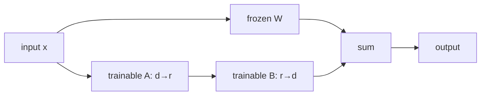
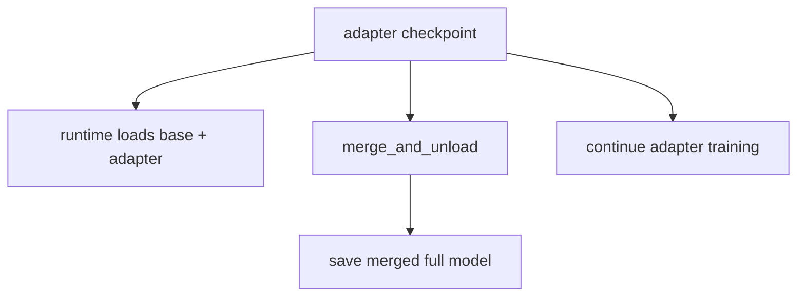

# LoRA 与 QLoRA：参数、显存和 checkpoint 契约

LoRA 冻结原权重 $W$，训练低秩更新；QLoRA 再把冻结 base 以低 bit 存储。它们主要减少**可训练参数、gradient、optimizer state 和 base weight 存储**，但完整模型 forward 与 activation 仍然存在。

本课的实现结论绑定 PEFT [`cea82131`](https://github.com/huggingface/peft/tree/cea8213158c8b682acc0839405c2062d57fdf867)、Transformers [`e52d0fd6`](https://github.com/huggingface/transformers/tree/e52d0fd6fa9eb874f7c2da048198276b04c919b9) 与 TRL [`f3adc504`](https://github.com/huggingface/trl/tree/f3adc504b93d634666c5628e7bdaa99ec8861028)。旧版 `prepare_model_for_kbit_training` 教程不等于当前 `SFTTrainer` 的真实分支，下面逐步指出谁调用谁。

## LoRA 的计算

对 $W\in\mathbb R^{d_{out}\times d_{in}}$：

$$
W'=W+\frac{\alpha}{r}BA
$$

其中 $A\in\mathbb R^{r\times d_{in}}$、$B\in\mathbb R^{d_{out}\times r}$，只有 $A/B$ 更新。参数量从 $d_{out}d_{in}$ 变为：

$$
N_{LoRA}=r(d_{in}+d_{out})
$$

当 $r\ll d$ 时大幅减少训练状态。



base 虽然 `requires_grad=False`，反向仍要把梯度穿过层以更新更早的 adapters；所以 activation 与大量 forward/backward compute 不会按 trainable parameter 比例一起消失。

公式直接对应固定 PEFT [`Linear.forward` 1030–1071](https://github.com/huggingface/peft/blob/cea8213158c8b682acc0839405c2062d57fdf867/src/peft/tuners/lora/layer.py#L1030)：未 merge 且 adapter enabled 时先执行 base layer，再在 1052–1059 行执行 `lora_B(lora_A(dropout(x))) * scaling` 并相加。合并时的权重增量在 [`get_delta_weight` 1000–1028](https://github.com/huggingface/peft/blob/cea8213158c8b682acc0839405c2062d57fdf867/src/peft/tuners/lora/layer.py#L1000) 明确为 `B @ A * scaling`。

默认 scaling 是 `alpha/r`，RS-LoRA 才是 `alpha/sqrt(r)`；固定 [`LoraConfig` 373–409](https://github.com/huggingface/peft/blob/cea8213158c8b682acc0839405c2062d57fdf867/src/peft/tuners/lora/config.py#L373) 同时定义 target 匹配规则、bias 与 `modules_to_save`。不能只从论文公式推断当前配置语义。

## 显存账对照

| 项 | 全参 BF16 + Adam | LoRA BF16 base | QLoRA 4-bit base |
| --- | --- | --- | --- |
| base weights | BF16 | BF16 frozen | 4-bit storage + quant metadata |
| base gradients | 有 | 无 | 无 |
| base optimizer states | 有 | 无 | 无 |
| adapters | 无 | trainable BF16/FP32 | trainable BF16 |
| adapter grad/optimizer | 无 | 有 | 有 |
| activations | 有 | 仍有 | 仍有 |
| temporary/dequant buffers | 常规 | 常规 | 额外存在 |

因此长上下文 OOM 即使换 QLoRA 仍可能发生；这通常是 activation/attention 临时量主导，需要 batch、sequence、checkpointing 或 attention kernel 处理。

## 一个真正可运行的 full / LoRA / QLoRA 共享入口

下面的 `train_peft_compare.py` 自建相同数据，三种模式固定同一个模型、revision、步数、batch、长度和生成协议；它会训练、保存、释放训练对象、从 checkpoint 重载并做一次 greedy smoke。这样后面的三条命令不再依赖未定义的 `train_ds/eval_ds` 或不存在的三个脚本。

QLoRA 路径明确要求 NVIDIA CUDA、bitsandbytes 和 BF16 GPU。这是固定 TRL 提交的兼容边界：该版本会把量化模型的可训练 adapter 转成 BF16，不能只改 `bf16=False` 假定它自动变成 FP16。

```python
# 保存为 train_peft_compare.py
import argparse
import json
import os
from collections import Counter
from pathlib import Path

import torch
from datasets import Dataset
from peft import LoraConfig, PeftModel
from transformers import (
    AutoModelForCausalLM,
    AutoTokenizer,
    BitsAndBytesConfig,
    set_seed,
)
from trl import SFTConfig, SFTTrainer

MODEL = os.environ.get("MODEL", "Qwen/Qwen3-0.6B")
REVISION = os.environ.get(
    "REVISION", "c1899de289a04d12100db370d81485cdf75e47ca"
)

parser = argparse.ArgumentParser()
parser.add_argument("--mode", choices=("full", "lora", "qlora"), required=True)
parser.add_argument("--max-steps", type=int, default=20)
parser.add_argument("--learning-rate", type=float, default=1e-4)
parser.add_argument("--output-dir")
cli = parser.parse_args()
out = Path(cli.output_dir or f"runs/qwen3-{cli.mode}")
out.parent.mkdir(parents=True, exist_ok=True)
set_seed(42)

pairs = [
    ("代号 A17 对应什么颜色？", " 青绿色。"),
    ("代号 B04 对应什么动物？", " 雪豹。"),
    ("代号 C29 对应什么城市？", " 苏州。"),
    ("代号 D63 对应什么乐器？", " 大提琴。"),
]
train_ds = Dataset.from_list([
    {"prompt": f"问题：{q}\n答案：", "completion": a}
    for _ in range(8)
    for q, a in pairs
])
tokenizer = AutoTokenizer.from_pretrained(MODEL, revision=REVISION)

bf16 = torch.cuda.is_available() and torch.cuda.is_bf16_supported()
fp16 = torch.cuda.is_available() and not bf16
dtype = torch.bfloat16 if bf16 else torch.float16 if fp16 else torch.float32
quant = None
peft_config = None
if cli.mode in ("lora", "qlora"):
    peft_config = LoraConfig(
        r=16,
        lora_alpha=32,
        lora_dropout=0.05,
        target_modules="all-linear",
        bias="none",
        task_type="CAUSAL_LM",
    )
if cli.mode == "qlora":
    if not torch.cuda.is_available() or not torch.cuda.is_bf16_supported():
        raise SystemExit("QLoRA in this pinned stack requires a CUDA BF16 GPU")
    quant = BitsAndBytesConfig(
        load_in_4bit=True,
        bnb_4bit_quant_type="nf4",
        bnb_4bit_use_double_quant=True,
        bnb_4bit_compute_dtype=torch.bfloat16,
    )

model_init_kwargs = {"revision": REVISION}
if cli.mode != "qlora":
    model_init_kwargs["dtype"] = dtype
args = SFTConfig(
    output_dir=str(out),
    model_init_kwargs=model_init_kwargs,
    max_steps=cli.max_steps,
    per_device_train_batch_size=1,
    gradient_accumulation_steps=4,
    learning_rate=cli.learning_rate,
    logging_steps=1,
    save_strategy="no",
    report_to="none",
    max_length=128,
    completion_only_loss=True,
    packing=False,
    loss_type="nll",
    bf16=cli.mode == "qlora" or bf16,
    fp16=cli.mode != "qlora" and fp16,
    seed=42,
)
trainer = SFTTrainer(
    model=MODEL,
    args=args,
    train_dataset=train_ds,
    processing_class=tokenizer,
    quantization_config=quant,
    peft_config=peft_config,
)

trainable_names = [
    name for name, parameter in trainer.model.named_parameters()
    if parameter.requires_grad
]
trainable = sum(
    parameter.numel() for parameter in trainer.model.parameters()
    if parameter.requires_grad
)
total = sum(parameter.numel() for parameter in trainer.model.parameters())
print("mode", cli.mode, "model", MODEL, "revision", REVISION)
print("trainable/total", trainable, total)
print("trainable_examples", trainable_names[:20])
print("all_dtypes", Counter(str(p.dtype) for p in trainer.model.parameters()))
print("trainable_dtypes", Counter(
    str(p.dtype) for p in trainer.model.parameters() if p.requires_grad
))
if cli.mode == "full":
    assert trainable == total
else:
    assert 0 < trainable < total
    assert any("lora_" in name for name in trainable_names)
if cli.mode == "qlora":
    assert getattr(trainer.model, "is_loaded_in_4bit", False)

if torch.cuda.is_available():
    torch.cuda.reset_peak_memory_stats()
result = trainer.train()
assert trainer.state.global_step == cli.max_steps
trainer.save_model(str(out))
tokenizer.save_pretrained(out)
peak_hbm = torch.cuda.max_memory_allocated() if torch.cuda.is_available() else None
print("train_metrics", json.dumps(result.metrics, default=str))
print("global_step", trainer.state.global_step)
print("peak_hbm_bytes", peak_hbm)

# 独立于训练中 model 对象重载 checkpoint；LoRA/QLoRA 目录只含 adapter。
del trainer
if torch.cuda.is_available():
    torch.cuda.empty_cache()
reload_tokenizer = AutoTokenizer.from_pretrained(out)
if cli.mode == "full":
    reloaded = AutoModelForCausalLM.from_pretrained(out, dtype=dtype)
elif cli.mode == "lora":
    base = AutoModelForCausalLM.from_pretrained(
        MODEL, revision=REVISION, dtype=dtype
    )
    reloaded = PeftModel.from_pretrained(base, out)
else:
    base = AutoModelForCausalLM.from_pretrained(
        MODEL,
        revision=REVISION,
        quantization_config=quant,
        device_map={"": torch.cuda.current_device()},
    )
    reloaded = PeftModel.from_pretrained(base, out)
reloaded.eval()
if cli.mode != "qlora":
    device = torch.device("cuda" if torch.cuda.is_available() else "cpu")
    reloaded.to(device)
else:
    device = next(reloaded.parameters()).device

prompt = "问题：代号 A17 对应什么颜色？\n答案："
inputs = reload_tokenizer(prompt, return_tensors="pt").to(device)
with torch.no_grad():
    generated = reloaded.generate(
        **inputs,
        do_sample=False,
        max_new_tokens=16,
        eos_token_id=reload_tokenizer.eos_token_id,
        pad_token_id=reload_tokenizer.pad_token_id
        or reload_tokenizer.eos_token_id,
    )
prediction = reload_tokenizer.decode(
    generated[0, inputs.input_ids.shape[1]:], skip_special_tokens=True
)
checkpoint_bytes = sum(p.stat().st_size for p in out.rglob("*") if p.is_file())
summary = {
    "mode": cli.mode,
    "model": MODEL,
    "revision": REVISION,
    "global_step": cli.max_steps,
    "trainable": trainable,
    "total": total,
    "peak_hbm_bytes": peak_hbm,
    "checkpoint_bytes": checkpoint_bytes,
    "reload_prediction": prediction,
}
(out / "run-summary.json").write_text(
    json.dumps(summary, ensure_ascii=False, indent=2), encoding="utf-8"
)
print("reload_prediction", repr(prediction))
print("checkpoint_bytes", checkpoint_bytes)
```

`target_modules="all-linear"` 是方便起点，不是所有架构/任务的最优规则。脚本打印实际注入模块；embedding、lm_head、MoE experts 或自定义线性层是否需要训练必须由任务决定。新增 special tokens 时尤其要保证相应 embeddings/lm_head 可训练和保存。

当前 TRL 的 PEFT 装配位于 [`SFTTrainer.__init__` 1038–1137](https://github.com/huggingface/trl/blob/f3adc504b93d634666c5628e7bdaa99ec8861028/trl/trainer/sft_trainer.py#L1038)：检查 config/重复 wrapper，在 1097 行调用 PEFT [`get_peft_model`](https://github.com/huggingface/peft/blob/cea8213158c8b682acc0839405c2062d57fdf867/src/peft/mapping_func.py#L30)，随后处理 ZeRO-3、gradient checkpointing、quantized adapter dtype 与 virtual tokens。

这个固定 TRL 路径没有显式调用 PEFT 的 `prepare_model_for_kbit_training()`；不要把旧教程中的该调用假装成当前 SFTTrainer 内部行为。PEFT tuner 在 [`BaseTuner._mark_only_adapters_as_trainable` 480–487](https://github.com/huggingface/peft/blob/cea8213158c8b682acc0839405c2062d57fdf867/src/peft/tuners/tuners_utils.py#L480) 冻结不含 adapter prefix 的参数，TRL 又在 1117–1129 行处理 input grads 与 quantized trainable dtype。最终仍以 `named_parameters()` 为证据。

若 `target_modules="all-linear"` 在实际 PEFT/model 组合中也包住 `lm_head`，固定 TRL 的 `chunked_nll` 会在 [`1305–1318`](https://github.com/huggingface/trl/blob/f3adc504b93d634666c5628e7bdaa99ec8861028/trl/trainer/sft_trainer.py#L1305) 明确报错，以免直读 output weight 时漏掉 adapter delta。解决方法是从 target 排除 lm_head 或显式使用 `loss_type="nll"`，不能删 guard。

当前 `SFTTrainer` 在分布式训练加载时会显式让 `device_map=None`。共享脚本只在**训练结束后的单卡量化重载**使用固定 GPU mapping；不要把这个推理/reload 放置写法误当成 DDP/FSDP。

## QLoRA 的三种精度不要混淆

- storage dtype：base 权重以 4-bit quantized representation 保存；
- compute dtype：matmul/dequant 计算常用 BF16/FP16；
- trainable adapter dtype：当前固定 TRL 对 quantized model 的 trainable params 转 BF16。

“4-bit training”不是所有计算和梯度都变 4-bit，也不是直接更新 4-bit base weights。

字段的固定实现位于 Transformers [`BitsAndBytesConfig` 391–494](https://github.com/huggingface/transformers/blob/e52d0fd6fa9eb874f7c2da048198276b04c919b9/src/transformers/utils/quantization_config.py#L391)：`load_in_4bit`、compute dtype、quant type、double quant 与 storage dtype 是独立字段；默认 compute dtype 是 FP32，必须显式打印而非把 BF16 当默认。

共享脚本在训练前保存 `loaded_in_4bit`、全部/可训练 dtype、trainable/total 和注入模块，并以断言阻止“实际未量化”或“没有 adapter”继续运行。

固定 TRL 在量化 model 上把所有 trainable params 转 BF16，见 [`1122–1129`](https://github.com/huggingface/trl/blob/f3adc504b93d634666c5628e7bdaa99ec8861028/trl/trainer/sft_trainer.py#L1122)。这是本提交行为；若硬件不支持 BF16，不能只把 `SFTConfig.bf16=False` 就假定 adapter dtype 随之改变，需实测并选择兼容版本/路径。

## 选 rank、alpha 与 target modules

| 参数 | 增大后的直接影响 | 需要一起测 |
| --- | --- | --- |
| `r` | adapter 容量、参数/状态/compute 增加 | quality、过拟合、HBM、速度 |
| `alpha` | 更新缩放变化 | LR 与 gradient norm |
| target modules | 可塑性与训练状态增加 | 哪类能力改变、部署兼容 |
| dropout | adapter path 正则更强 | train/eval gap |
| LR | 更新步幅 | loss、grad norm、稳定性 |

不要一次同时把 rank、target modules 与 LR 全改。推荐顺序：固定 target modules 比较 rank；固定 rank 比较 LR；再决定是否扩大 modules。

LoRA 通常使用比全参更高的 LR 是经验起点，不是“参数少所以数学上必然 10 倍”。用相同有效 target tokens、steps 和 eval slices 做 sweep。

## Adapter checkpoint 不是完整模型

典型 adapter 目录只含 adapter config/weights 与 tokenizer/训练文件。部署有三种方式：



每条路径都要固定 base model id/revision。仅复制 adapter 文件到无 base 权重的机器不能独立推理。

固定 PEFT [`PeftModel.save_pretrained` 212–324](https://github.com/huggingface/peft/blob/cea8213158c8b682acc0839405c2062d57fdf867/src/peft/peft_model.py#L212) 在 317–323 行调用 `get_peft_model_state_dict`，契约就是只取 adapter/显式 embedding layers；[`merge_and_unload` 696–732](https://github.com/huggingface/peft/blob/cea8213158c8b682acc0839405c2062d57fdf867/src/peft/tuners/tuners_utils.py#L696) 返回去掉 PEFT wrapper 的 model，并明确要求接住返回值。

合并会产生普通权重，方便不支持 adapter 的 runtime，但会失去动态切换，且 QLoRA 应在合适精度加载 base 后再合并，不应把量化训练表示误当成高精度完整 base。合并前后用固定 prompts 比较 logits/生成容差。

### Adapter 重新加载与合并验收

```python
import torch
from peft import PeftModel
from transformers import AutoModelForCausalLM, AutoTokenizer

BASE = "Qwen/Qwen3-0.6B"
REVISION = "c1899de289a04d12100db370d81485cdf75e47ca"
ADAPTER = "runs/qwen3-lora"
tok = AutoTokenizer.from_pretrained(ADAPTER)
base = AutoModelForCausalLM.from_pretrained(BASE, revision=REVISION, dtype=torch.bfloat16)
adapted = PeftModel.from_pretrained(base, ADAPTER).eval()
inputs = tok("测试：2+3=", return_tensors="pt").to(adapted.device)

with torch.no_grad():
    logits_adapter = adapted(**inputs).logits.float().cpu()
merged = adapted.merge_and_unload(safe_merge=True).eval()
with torch.no_grad():
    logits_merged = merged(**inputs).logits.float().cpu()

max_diff = (logits_adapter - logits_merged).abs().max().item()
print("max_abs_logit_diff", max_diff)
assert torch.allclose(logits_adapter, logits_merged, atol=2e-2, rtol=2e-2)
merged.save_pretrained("runs/qwen3-lora-merged", safe_serialization=True)
tok.save_pretrained("runs/qwen3-lora-merged")
```

容差取决于 dtype/backend，应先在本机建立基线而不是盲用 `2e-2`。`safe_merge=True` 会检查 adapter delta 的非有限值，但不能证明业务输出等价；仍需固定 prompts 的 logits 与 greedy generation 对照。

## 三组必做对照

1. **同小模型全参 vs LoRA**：相同数据/target tokens，比较质量、HBM、tokens/s；
2. **LoRA vs QLoRA**：相同 adapter config，区分 base storage 节省与速度/质量变化；
3. **adapter load vs merged model**：固定 deterministic prompts，验证部署等价性。

命令与最低判定：

```bash
mkdir -p runs
set -o pipefail

CUDA_VISIBLE_DEVICES=0 python train_peft_compare.py \
  --mode full --max-steps 20 2>&1 | tee runs/full.log
test "${PIPESTATUS[0]}" -eq 0

CUDA_VISIBLE_DEVICES=0 python train_peft_compare.py \
  --mode lora --max-steps 20 2>&1 | tee runs/lora.log
test "${PIPESTATUS[0]}" -eq 0

# 只在已安装 bitsandbytes 且 CUDA BF16 门禁通过后执行。
CUDA_VISIBLE_DEVICES=0 python train_peft_compare.py \
  --mode qlora --max-steps 20 2>&1 | tee runs/qlora.log
test "${PIPESTATUS[0]}" -eq 0
```

三者必须使用相同 split、plain prompt 契约、有效 target tokens/update、最大 steps 和 generation/eval protocol；共享入口已经固定这些变量。每个输出目录的 `run-summary.json` 记录 revision、global step、参数量、peak HBM、checkpoint bytes 和重载生成。预期：LoRA trainable params 与 checkpoint 显著小于全参；QLoRA base weight 驻留再下降；QLoRA 不保证比 LoRA 更快。任一 run 的有效 labels、trainable params、dtype 或 reload 测试失败，都不能进入质量比较。

报告 trainable parameter count、peak allocated/reserved HBM、supervised tokens/s、最终/最佳 eval、checkpoint size 与加载方式。只报“能在 24GB 跑”无法解释收益来源。

## 常见错误

| 现象 | 首查 |
| --- | --- |
| trainable params=0 | target modules 未匹配、model 已错误冻结 |
| trainable params 过多 | `modules_to_save`/target 范围、意外解冻 |
| 新 special token 不会生成 | embedding/lm_head 未训练或未保存 |
| QLoRA 一开始 NaN | compute dtype、LR、旧硬件/依赖组合 |
| 保存后输出回到 base | 推理未加载 adapter、active adapter 错 |
| merge 后结果差异大 | base revision/precision、漏权重、量化合并路径 |
| 多卡每卡都放完整模型还 OOM | DDP 复制语义，没做 state sharding |

## 通关标准

你应能手算一层 LoRA 参数量；逐项指出 LoRA/QLoRA 省与不省的显存；打印注入模块与可训练参数；解释 adapter、base、merged checkpoint 三者关系；设计全参/LoRA/QLoRA 的公平对照。

下一课进入[评估、过拟合与数据诊断](./evaluation)。
