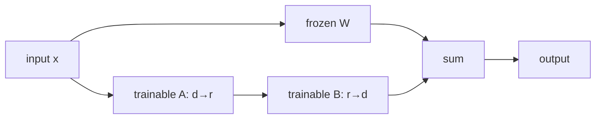
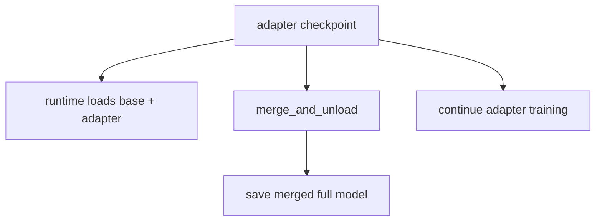

# LoRA 与 QLoRA：参数、显存和 checkpoint 契约

LoRA 冻结原权重 $W$，训练低秩更新；QLoRA 再把冻结 base 以低 bit 存储。它们主要减少**可训练参数、gradient、optimizer state 和 base weight 存储**，但完整模型 forward 与 activation 仍然存在。

## LoRA 的计算

对 $W\in\mathbb R^{d_{out}\times d_{in}}$：

$$
W'=W+\frac{\alpha}{r}BA
$$

其中 $A\in\mathbb R^{r\times d_{in}}$、$B\in\mathbb R^{d_{out}\times r}$，只有 $A/B$ 更新。参数量从 $d_{out}d_{in}$ 变为：

$$
N_{LoRA}=r(d_{in}+d_{out})
$$

当 $r\ll d$ 时大幅减少训练状态。



base 虽然 `requires_grad=False`，反向仍要把梯度穿过层以更新更早的 adapters；所以 activation 与大量 forward/backward compute 不会按 trainable parameter 比例一起消失。

## 显存账对照

| 项 | 全参 BF16 + Adam | LoRA BF16 base | QLoRA 4-bit base |
| --- | --- | --- | --- |
| base weights | BF16 | BF16 frozen | 4-bit storage + quant metadata |
| base gradients | 有 | 无 | 无 |
| base optimizer states | 有 | 无 | 无 |
| adapters | 无 | trainable BF16/FP32 | trainable BF16 |
| adapter grad/optimizer | 无 | 有 | 有 |
| activations | 有 | 仍有 | 仍有 |
| temporary/dequant buffers | 常规 | 常规 | 额外存在 |

因此长上下文 OOM 即使换 QLoRA 仍可能发生；这通常是 activation/attention 临时量主导，需要 batch、sequence、checkpointing 或 attention kernel 处理。

## 最小 LoRA 配置

```python
from peft import LoraConfig
from trl import SFTConfig, SFTTrainer

peft_config = LoraConfig(
    r=16,
    lora_alpha=32,
    lora_dropout=0.05,
    target_modules="all-linear",
    bias="none",
    task_type="CAUSAL_LM",
)

trainer = SFTTrainer(
    model="Qwen/Qwen3-0.6B",
    args=SFTConfig(
        output_dir="runs/qwen3-lora",
        learning_rate=2e-4,
        max_length=1024,
        per_device_train_batch_size=2,
        gradient_accumulation_steps=8,
        completion_only_loss=True,
        report_to="none",
    ),
    train_dataset=train_ds,
    eval_dataset=eval_ds,
    peft_config=peft_config,
)

trainer.model.print_trainable_parameters()
trainer.train()
trainer.save_model()
```

`target_modules="all-linear"` 是方便起点，不是所有架构/任务的最优规则。先打印实际注入模块；embedding、lm_head、MoE experts 或自定义线性层是否需要训练必须由任务决定。新增 special tokens 时尤其要保证相应 embeddings/lm_head 可训练和保存。

当前 TRL 的 PEFT 装配位于 [`SFTTrainer.__init__`](https://github.com/huggingface/trl/blob/f3adc504b93d634666c5628e7bdaa99ec8861028/trl/trainer/sft_trainer.py#L921)：检查 `peft_config`、调用 `get_peft_model`，并处理 gradient checkpointing、quantized adapter dtype 与新 token 等组合。

## QLoRA 配置

```python
import torch
from peft import LoraConfig
from transformers import BitsAndBytesConfig
from trl import SFTConfig, SFTTrainer

quant = BitsAndBytesConfig(
    load_in_4bit=True,
    bnb_4bit_quant_type="nf4",
    bnb_4bit_use_double_quant=True,
    bnb_4bit_compute_dtype=torch.bfloat16,
)

peft = LoraConfig(
    r=16,
    lora_alpha=32,
    lora_dropout=0.05,
    target_modules="all-linear",
    task_type="CAUSAL_LM",
)

trainer = SFTTrainer(
    model="Qwen/Qwen3-4B",
    args=SFTConfig(
        output_dir="runs/qwen3-qlora",
        learning_rate=2e-4,
        max_length=1024,
        per_device_train_batch_size=1,
        gradient_accumulation_steps=16,
        bf16=True,
        gradient_checkpointing=True,
        report_to="none",
    ),
    train_dataset=train_ds,
    quantization_config=quant,
    peft_config=peft,
)
```

启动条件：兼容的 NVIDIA GPU/CUDA、bitsandbytes、PEFT/Transformers/TRL 组合；BF16 需要硬件支持，否则选择受支持的 compute dtype 并重新验证数值。不要照抄 `device_map="auto"` 做多卡训练：它是模型放置/推理习惯，不等价于 DDP/FSDP；当前 `SFTTrainer` 在分布式加载时会显式让 `device_map=None`。

## QLoRA 的三种精度不要混淆

- storage dtype：base 权重以 4-bit quantized representation 保存；
- compute dtype：matmul/dequant 计算常用 BF16/FP16；
- trainable adapter dtype：当前固定 TRL 对 quantized model 的 trainable params 转 BF16。

“4-bit training”不是所有计算和梯度都变 4-bit，也不是直接更新 4-bit base weights。

## 选 rank、alpha 与 target modules

| 参数 | 增大后的直接影响 | 需要一起测 |
| --- | --- | --- |
| `r` | adapter 容量、参数/状态/compute 增加 | quality、过拟合、HBM、速度 |
| `alpha` | 更新缩放变化 | LR 与 gradient norm |
| target modules | 可塑性与训练状态增加 | 哪类能力改变、部署兼容 |
| dropout | adapter path 正则更强 | train/eval gap |
| LR | 更新步幅 | loss、grad norm、稳定性 |

不要一次同时把 rank、target modules 与 LR 全改。推荐顺序：固定 target modules 比较 rank；固定 rank 比较 LR；再决定是否扩大 modules。

LoRA 通常使用比全参更高的 LR 是经验起点，不是“参数少所以数学上必然 10 倍”。用相同有效 target tokens、steps 和 eval slices 做 sweep。

## Adapter checkpoint 不是完整模型

典型 adapter 目录只含 adapter config/weights 与 tokenizer/训练文件。部署有三种方式：



每条路径都要固定 base model id/revision。仅复制 adapter 文件到无 base 权重的机器不能独立推理。

合并会产生普通权重，方便不支持 adapter 的 runtime，但会失去动态切换，且 QLoRA 应在合适精度加载 base 后再合并，不应把量化训练表示误当成高精度完整 base。合并前后用固定 prompts 比较 logits/生成容差。

## 三组必做对照

1. **同小模型全参 vs LoRA**：相同数据/target tokens，比较质量、HBM、tokens/s；
2. **LoRA vs QLoRA**：相同 adapter config，区分 base storage 节省与速度/质量变化；
3. **adapter load vs merged model**：固定 deterministic prompts，验证部署等价性。

报告 trainable parameter count、peak allocated/reserved HBM、supervised tokens/s、最终/最佳 eval、checkpoint size 与加载方式。只报“能在 24GB 跑”无法解释收益来源。

## 常见错误

| 现象 | 首查 |
| --- | --- |
| trainable params=0 | target modules 未匹配、model 已错误冻结 |
| trainable params 过多 | `modules_to_save`/target 范围、意外解冻 |
| 新 special token 不会生成 | embedding/lm_head 未训练或未保存 |
| QLoRA 一开始 NaN | compute dtype、LR、旧硬件/依赖组合 |
| 保存后输出回到 base | 推理未加载 adapter、active adapter 错 |
| merge 后结果差异大 | base revision/precision、漏权重、量化合并路径 |
| 多卡每卡都放完整模型还 OOM | DDP 复制语义，没做 state sharding |

## 通关标准

你应能手算一层 LoRA 参数量；逐项指出 LoRA/QLoRA 省与不省的显存；打印注入模块与可训练参数；解释 adapter、base、merged checkpoint 三者关系；设计全参/LoRA/QLoRA 的公平对照。

下一课进入[评估、过拟合与数据诊断](./evaluation)。
