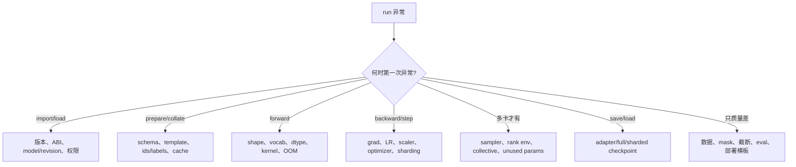
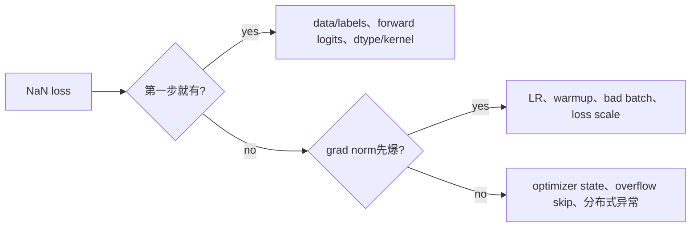

# SFT 失败模式与证据化排障

最昂贵的 SFT 故障不是 traceback，而是**训练正常结束、loss 也下降，但监督范围或部署协议错了。**排障应同时覆盖显式崩溃和静默语义错误，并按第一次失败的阶段缩小范围。

## 总故障树



先保存异常前的环境、最终 config、完整 traceback/所有 rank logs、最后成功 step 和一条实际 batch。不要先清 cache、重装和换五个参数，让现场不可复现。

## 最小化顺序

```text
multi-node → one node → one GPU
full data → 64 examples → 1 golden batch
long seq → 128 tokens
packing/flash/compile → eager padded baseline
QLoRA/FSDP → small full/LoRA baseline
custom template/collator → standard prompt-completion
```

每次只移除一个维度并记录是否复现。最小化不是最终修复，而是定位所有权。

## OOM：先确定发生在哪个 phase

| Phase | 常见主因 | 证据/实验 |
| --- | --- | --- |
| model load | 权重/quant temp、错误 device map | 分阶段 HBM、单 rank load |
| trainer init | optimizer/state、model 复制 | optimizer 创建前后、world size |
| first forward | activation、attention、logits | batch/seq sweep、chunked loss |
| backward | saved activations/grad | checkpointing 对照 |
| optimizer step | Adam states 首次 lazy init | first vs second step peak |
| eval | full logits 累积、generate cache | prediction_loss_only、eval batch |
| save | full state dict gather | sharded/full save mode、CPU RAM |

减少 batch 能修 forward activation OOM，却不能修单模型权重都放不下；gradient checkpoint 能修 activation，却不减少 optimizer state。根据 phase 选手段。

### Reserved 不等于 leak

PyTorch caching allocator 的 reserved 通常高于 allocated。判断 leak 要看同 shape 多 steps 的 allocated tensor 是否持续增长、是否保存带 graph 的 loss/logits、callback 是否持有 outputs。不要每 step 调 `empty_cache()` 当修复；它可能降低性能且不释放仍被引用的 tensor。

## NaN/Inf



逐层记录：input ids 范围、有效 label 数、forward logits min/max/finite、loss components、unscale 后 grad norm、LR、发生 NaN 的第一个参数。先用 FP32/单 batch/eager 对照确定是否 precision/backend 特有。

常见原因包括：全 mask batch 的错误归一化、过高 LR、FP16 overflow、坏数据/极长异常样本、quantization compute dtype、MoE aux loss、custom loss 除零。gradient clipping 只能限制有限梯度，无法修已经 NaN 的 forward。

## Loss 不降或下降异常快

| 现象 | 假设 | 最强下一证据 |
| --- | --- | --- |
| 完全不降 | 无有效 labels/参数不更新/LR=0 | nonmask count、grad、parameter delta |
| 极快接近 0 | 重复/泄漏、只监督固定模板 token | unique targets、去重、逐 token loss |
| sawtooth 很大 | 长度/slice 混合、LR、归一化 | 每 batch target tokens/source |
| train 降 eval 不降 | split shift、坏标签、过拟合 | group leakage、slice curves |
| loss 好生成坏 | teacher forcing/模板/停止/metric错位 | fixed greedy outputs 与 input ids |

按 token/source 记录 loss 比只看 batch mean 更有诊断力。若 90% 目标都是固定格式标记，模型可以先学会标记让总体 loss 显著下降，而答案能力不变。

## 多卡 hang

先区分 dataloader/进程没到 collective，还是 collective 本身卡住。所有 ranks 开启带 rank 的日志，记录最后进入的 phase/collective。

```bash
TORCH_DISTRIBUTED_DEBUG=DETAIL \
NCCL_DEBUG=INFO \
torchrun --standalone --nproc_per_node=4 train.py
```

详细日志可能很大且包含路径/拓扑，问题复现窗口使用，结束后关闭并妥善处理。

常见根因：

- 某 rank 因坏样本/exception 提前退出，其余等待 collective；
- 每 rank dataloader steps 不同或条件分支不同；
- unused parameter 只在部分 rank 路径出现；
- NCCL interface/firewall/IB/P2P/driver 问题；
- checkpoint/eval 只让错误的一部分 ranks 进入 collective；
- 多节点代码/model/data 不一致；
- accumulation/no_sync 边界不一致。

先用小 tensor collective 独立验证集群，再跑模型。NCCL test 通过只证明通信基线，不证明训练控制流一致。

## DataLoader 停滞与吞吐低

- `num_workers=0` 对照，区分 worker/fork/pickle；
- 记录 data wait vs GPU step；
- tokenization/materialization 尽量预处理并缓存固定结果；
- 网络文件系统小文件、图片 decode、Python formatter 常成为瓶颈；
- `dataset_num_proc` 不是越多越快，会增加内存/I/O；
- IterableDataset 在各 ranks 的 shard/终止条件必须一致；
- packing 预处理本身可能在训练前耗时长。

GPU utilization 周期性归零且 step time 对齐 data wait，先修输入管线，不调 attention kernel。

## Checkpoint 故障

### 保存成功但不能加载

先列目录并判断类型：完整 Transformers model、PEFT adapter、FSDP/ZeRO shards 或 merged model。记录 base revision、world size/backend 和保存 API。

### Resume 后曲线跳变

除 weights 外还需 optimizer、LR scheduler、scaler、Trainer state、RNG、sampler/data position。只加载 model 是 warm start，不是严格 resume。

### Adapter 输出像 base

确认 adapter 已加载且 active，base revision 精确一致，target modules/config 与 tokenizer/template 同步。独立进程加载，不依赖训练对象内存状态。

### Sharded save 时 CPU OOM

full state gather 可能把所有权重集中到 rank 0/CPU。使用与部署需求匹配的 sharded/distributed checkpoint 流程，在小模型先演练合并。

## 静默语义错误的回归测试

```text
[ ] golden raw sample → exact rendered text/hash
[ ] exact input_ids/labels and effective target count
[ ] EOS/EOT is a valid target
[ ] prompt append keeps expected prefix
[ ] packed sample isolation test
[ ] one-step loss matches manual reference within tolerance
[ ] one optimizer update changes intended params only
[ ] save/load output matches before-save output
[ ] offline and serving input_ids match
```

这些测试应随数据/template/model code 一起版本化。升级 TRL/Transformers 后先跑它们，再跑长训练。

## 可复现性边界

固定 seed 还不够；还要保存数据顺序/shard、world size、accumulation、kernel、precision、GPU/driver、PyTorch flags 与依赖。并行 reduction 顺序、非确定 kernel、batch composition 都可能带来差异。

可接受的目标通常是：关键 metric 在容差内、golden deterministic cases 稳定、错误分布不发生显著回归，而不是不同 GPU 拓扑每一位权重 bitwise 相同。

## 事故记录模板

```text
Symptom and first bad step:
User/quality impact:
Last known good run:
Exact versions/config/data/template hashes:
Single GPU / single batch reproducibility:
First failing boundary and evidence:
Hypotheses ruled out:
Mitigation:
Root cause:
Permanent regression test/monitor:
```

## 通关标准

你应能按 phase 定位 OOM；从第一处非有限值追 NaN；区分 collective hang 与 rank 控制流分叉；识别 adapter/full/sharded checkpoint；为 template、labels、packing、one-step update 和 save/load 建立自动回归。

最后查看[源码、论文与术语](../appendix/references)。
