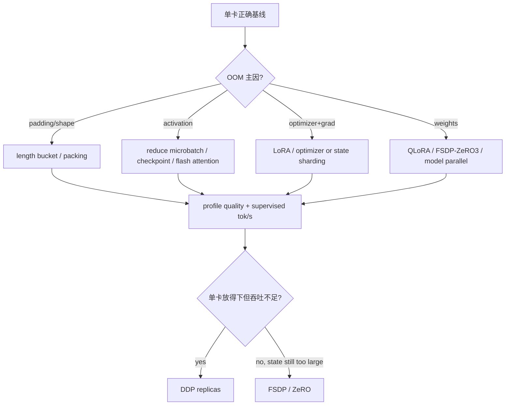

# SFT 显存、吞吐与分布式扩展

扩展前先分清两个目标：**模型/训练状态能否放下**与**每秒能处理多少有效监督 token**。DDP 主要增加吞吐，不降低每卡模型状态；FSDP/ZeRO 通过分片降低每卡状态，但增加通信、重算和 checkpoint 复杂度。

## 五本显存账

$$
M_{peak}\approx M_{weights}+M_{grads}+M_{optimizer}+M_{activations}+M_{temporary}
$$

| 账本 | 主要由什么决定 | 常用手段 |
| --- | --- | --- |
| weights | 参数量、dtype/quant、sharding | QLoRA、FSDP/ZeRO-3、TP |
| gradients | 可训练参数、dtype、sharding | LoRA、ZeRO-2/3、FSDP |
| optimizer | 可训练参数、optimizer states/master params | LoRA、8-bit optimizer、ZeRO/FSDP |
| activations | micro-batch、seq、layers、hidden、attention | checkpointing、Flash Attention、减 batch/seq |
| temporary | logits、kernel workspace、collective/flatten buffer | chunked loss、backend/profile、留余量 |

全参 BF16 + AdamW 常被粗估为每参数十几字节：BF16 weight/grad，加 FP32 master/moments等；具体框架可能不保留某些副本或使用不同 optimizer/dtype，因此不能拿固定“16 bytes/param”当实测。以 allocator snapshot 和参数/optimizer state dtype 校准。

## 为什么序列长度特别昂贵

activation 粗略随 $B\times S\times H\times L$ 增长；普通 attention score 还可能随 $S^2$ 增长。现代 memory-efficient attention 可避免物化完整 $S\times S$ 矩阵，但 FLOPs 与其他 activation 仍随长度增加。

同样 4096 tokens：

- 16 条 × 256 tokens；
- 1 条 × 4096 tokens。

总 token 相同，但 attention 计算、padding、kernel shape 与 activation 峰值不同。性能报告必须包含长度分布和 micro-batch shape。

## 先按最小代价优化



Gradient checkpointing 用重算换 activation 显存，通常减速；packing 减 padding，但有 attention boundary 条件；LoRA 减可训练状态，但不消除 activation；这些手段不可只按宣传数字相加。

## 并行策略选择

| 策略 | 每卡持有什么 | 适合 | 主要成本 |
| --- | --- | --- | --- |
| 单卡 | 全部 | correctness baseline、小模型 | 无扩展 |
| DDP | 完整 weights/grads/optimizer（概念上） | 每卡放得下、要数据吞吐 | backward all-reduce、状态复制 |
| ZeRO-1 | shard optimizer | optimizer 主导 | step/通信、checkpoint |
| ZeRO-2 | 再 shard gradients | optimizer+grad 主导 | reduce-scatter/all-gather |
| FSDP/ZeRO-3 | shard params+grads+optimizer | 完整状态单卡放不下 | layer gather、通信、wrap/checkpoint 复杂 |
| TP/PP/CP | 切模型计算/层/序列 | 单层/长序列或超大模型 | 框架与模型侵入、频繁通信 |

SFT 的 Transformers/Accelerate 路线通常先在 DDP、FSDP、DeepSpeed 中选；TP/PP/CP 的系统主线放在本站的[分布式训练门户](/distributed/)。

## DDP：吞吐扩展，不是显存分片

无 pipeline 的 global batch：

$$
B_{global}=B_{micro}\times N_{data\ ranks}\times K_{accum}
$$

四卡从单卡启动而不改 micro-batch/accum，global batch 变四倍。若想做等价性对照，要保持 global batch 或有效 target tokens/update，并按训练规则决定 LR 是否调整。

启动最小形态：

```bash
torchrun --standalone --nproc_per_node=4 train.py
```

或先生成 Accelerate 配置再：

```bash
accelerate launch --num_processes 4 train.py
```

不要在每个 rank 手工选择不同 data slice；DistributedSampler/Accelerate 负责划分。所有 ranks 必须加载相同 model/tokenizer/template 与代码。

### DDP scaling efficiency

$$
efficiency_N=\frac{throughput_N}{N\times throughput_1}
$$

比较相同总 workload 与 shape。数据加载、all-reduce、短 step、CPU preprocessing 会降低效率；GPU utilization 高也可能主要在通信/重算，仍需 profile。

## FSDP 与 ZeRO 的启动条件

选择 state sharding 前确认：

- 单卡 correctness/tiny overfit 已通过；
- module wrap boundary 与模型层结构匹配；
- frozen/trainable params（尤其 LoRA）受当前后端组合支持；
- mixed precision policy 明确；
- activation checkpoint 与 wrap 对齐；
- state dict/checkpoint 类型和合并方式已测试；
- 节点内/跨节点 collective 通过；
- model/tokenizer/data path 所有节点可达。

Transformers 固定提交的 FSDP 用法见[官方文档](https://github.com/huggingface/transformers/blob/e52d0fd6fa9eb874f7c2da048198276b04c919b9/docs/source/en/fsdp.md)。真正的 FSDP2/DTensor 与 Megatron 细节在分布式门户展开。

## LoRA 与分布式怎么组合

### Base 能放下：LoRA + DDP

通常是最简单的多卡吞吐路径。每卡复制 frozen base 和小 adapter，只同步可训练 adapter grads。仍要检查 DDP 是否因 frozen/unused parameter 设置产生额外 traversal。

### Base 放不下：QLoRA 或 LoRA + sharding

QLoRA 先减少每卡 base storage；如果仍不够，再考虑支持 quantized/frozen params 的 sharding 组合。不同版本对 PEFT + FSDP/ZeRO-3 + quantization 的支持变化很快，必须用你固定的组合做 first-forward、first-step、save/load 测试。

当前固定 TRL 对 PEFT + ZeRO-3 + checkpointing、adapter dtype 有特定兼容分支，这恰恰说明不能从单独项目文档推断组合行为。

## 吞吐应报告哪种 token

| 指标 | 分子 | 适合回答 |
| --- | --- | --- |
| raw allocated tok/s | batch tensor slots | kernel shape/含 padding 容量 |
| nonpad input tok/s | attention 有效输入 | 数据处理与 padding 效率 |
| supervised tok/s | labels != -100 | 训练目标处理速率 |
| samples/s | examples | 只有长度分布固定时可比较 |

packing 可能显著提高 nonpad/input tok/s；assistant-only 使 supervised density 下降，但 prompt forward 仍花算力。优化结果至少同时报告 nonpad 与 supervised tokens/s。

## Profile 的分层顺序

1. dataloader waiting / CPU tokenize 是否堵塞；
2. forward、loss head、backward、optimizer 的时间比例；
3. attention/GEMM kernel shape 与空洞/padding；
4. DDP/FSDP collective 与计算是否重叠；
5. HBM allocated/reserved、fragmentation 与峰值在哪个 phase；
6. checkpoint/eval 是否周期性造成吞吐断崖。

短模型/小 micro-batch 的 step 很短，通信 latency 与 Python overhead 占比会高；超大模型则更可能 bandwidth/compute 主导。不存在对所有 SFT 都最佳的 bucket/accum 配置。

## Scale-up 实验表

| Run | world | strategy | micro×accum | target tok/update | peak HBM | target tok/s | eval | 结论 |
| --- | ---: | --- | --- | ---: | ---: | ---: | ---: | --- |
| A | 1 | single | 4×8 | … | … | … | … | baseline |
| B | 2 | DDP | 4×4 | same | … | … | … | scaling |
| C | 4 | DDP | 2×4 | same | … | … | … | scaling |
| D | 4 | FSDP | 2×4 | same | … | … | … | memory tradeoff |

保持 model/data/template/seed 与有效 token budget，才能把变化归因于系统策略。

## 通关标准

你应能把 OOM 归入五本账；解释 DDP 为何不减少每卡完整模型状态；按单卡放置与吞吐需求选择 DDP/FSDP/ZeRO；计算 global batch/scaling efficiency，并用 supervised tokens/s 而非只有 samples/s 比较。

下一课进入[失败模式与排障](./debugging)。
