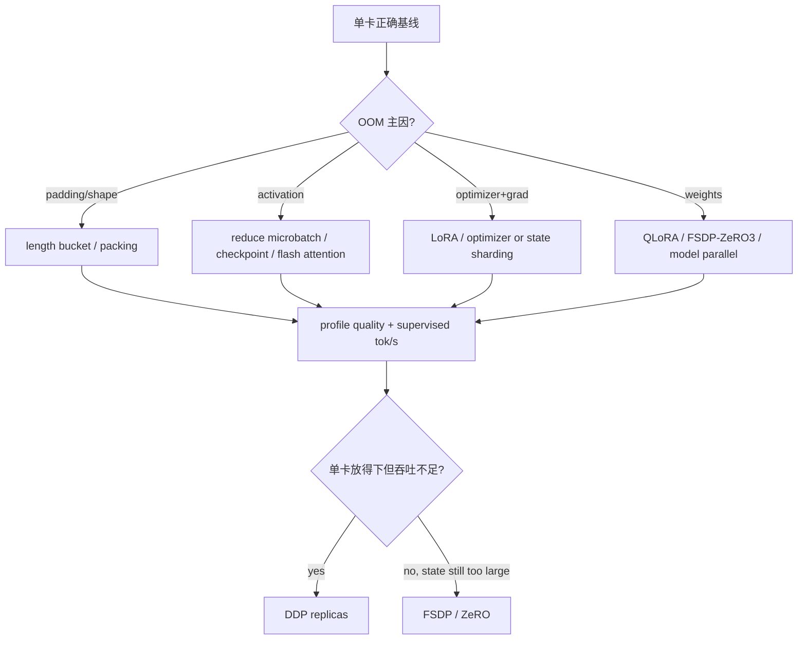

# SFT 显存、吞吐与分布式扩展

扩展前先分清两个目标：**模型/训练状态能否放下**与**每秒能处理多少有效监督 token**。DDP 主要增加吞吐，不降低每卡模型状态；FSDP/ZeRO 通过分片降低每卡状态，但增加通信、重算和 checkpoint 复杂度。

本课的框架路径绑定 Transformers [`e52d0fd6`](https://github.com/huggingface/transformers/tree/e52d0fd6fa9eb874f7c2da048198276b04c919b9)、Accelerate [`665444ce`](https://github.com/huggingface/accelerate/tree/665444ceb62211f2b410d0d0fdb4bc013c5effdf)、TRL [`f3adc504`](https://github.com/huggingface/trl/tree/f3adc504b93d634666c5628e7bdaa99ec8861028) 与 DeepSpeed [`53a2ac44`](https://github.com/deepspeedai/DeepSpeed/tree/53a2ac44fb664bea838df3981ba4366b91643070)。分布式 API 随版本变化快，以下结论只对这些阅读快照与实际运行环境的交集负责。

## 五本显存账

$$
M_{peak}\approx M_{weights}+M_{grads}+M_{optimizer}+M_{activations}+M_{temporary}
$$

| 账本 | 主要由什么决定 | 常用手段 |
| --- | --- | --- |
| weights | 参数量、dtype/quant、sharding | QLoRA、FSDP/ZeRO-3、TP |
| gradients | 可训练参数、dtype、sharding | LoRA、ZeRO-2/3、FSDP |
| optimizer | 可训练参数、optimizer states/master params | LoRA、8-bit optimizer、ZeRO/FSDP |
| activations | micro-batch、seq、layers、hidden、attention | checkpointing、Flash Attention、减 batch/seq |
| temporary | logits、kernel workspace、collective/flatten buffer | chunked loss、backend/profile、留余量 |

全参 BF16 + AdamW 常被粗估为每参数十几字节：BF16 weight/grad，加 FP32 master/moments等；具体框架可能不保留某些副本或使用不同 optimizer/dtype，因此不能拿固定“16 bytes/param”当实测。以 allocator snapshot 和参数/optimizer state dtype 校准。

## 为什么序列长度特别昂贵

activation 粗略随 $B\times S\times H\times L$ 增长；普通 attention score 还可能随 $S^2$ 增长。现代 memory-efficient attention 可避免物化完整 $S\times S$ 矩阵，但 FLOPs 与其他 activation 仍随长度增加。

同样 4096 tokens：

- 16 条 × 256 tokens；
- 1 条 × 4096 tokens。

总 token 相同，但 attention 计算、padding、kernel shape 与 activation 峰值不同。性能报告必须包含长度分布和 micro-batch shape。

## 先按最小代价优化



Gradient checkpointing 用重算换 activation 显存，通常减速；packing 减 padding，但有 attention boundary 条件；LoRA 减可训练状态，但不消除 activation；这些手段不可只按宣传数字相加。

## 并行策略选择

| 策略 | 每卡持有什么 | 适合 | 主要成本 |
| --- | --- | --- | --- |
| 单卡 | 全部 | correctness baseline、小模型 | 无扩展 |
| DDP | 完整 weights/grads/optimizer（概念上） | 每卡放得下、要数据吞吐 | backward all-reduce、状态复制 |
| ZeRO-1 | shard optimizer | optimizer 主导 | step/通信、checkpoint |
| ZeRO-2 | 再 shard gradients | optimizer+grad 主导 | reduce-scatter/all-gather |
| FSDP/ZeRO-3 | shard params+grads+optimizer | 完整状态单卡放不下 | layer gather、通信、wrap/checkpoint 复杂 |
| TP/PP/CP | 切模型计算/层/序列 | 单层/长序列或超大模型 | 框架与模型侵入、频繁通信 |

SFT 的 Transformers/Accelerate 路线通常先在 DDP、FSDP、DeepSpeed 中选；TP/PP/CP 的系统主线放在本站的[分布式训练门户](/distributed/)。

## DDP：吞吐扩展，不是显存分片

无 pipeline 的 global batch：

$$
B_{global}=B_{micro}\times N_{data\ ranks}\times K_{accum}
$$

四卡从单卡启动而不改 micro-batch/accum，global batch 变四倍。若想做等价性对照，要保持 global batch 或有效 target tokens/update，并按训练规则决定 LR 是否调整。

启动最小形态：

```bash
torchrun --standalone --nproc_per_node=4 \
  train_scale.py --backend ddp --max-steps 10 --output-dir runs/scale-ddp4
```

或先生成 Accelerate 配置再：

```bash
accelerate launch --num_processes 4 \
  train_scale.py --backend ddp --max-steps 10 --output-dir runs/scale-ddp4
```

不要在每个 rank 手工选择不同 data slice；DistributedSampler/Accelerate 负责划分。所有 ranks 必须加载相同 model/tokenizer/template 与代码。

### DDP scaling efficiency

$$
efficiency_N=\frac{throughput_N}{N\times throughput_1}
$$

比较相同总 workload 与 shape。数据加载、all-reduce、短 step、CPU preprocessing 会降低效率；GPU utilization 高也可能主要在通信/重算，仍需 profile。

## FSDP 与 ZeRO 的启动条件

选择 state sharding 前确认：

- 单卡 correctness/tiny overfit 已通过；
- module wrap boundary 与模型层结构匹配；
- frozen/trainable params（尤其 LoRA）受当前后端组合支持；
- mixed precision policy 明确；
- activation checkpoint 与 wrap 对齐；
- state dict/checkpoint 类型和合并方式已测试；
- 节点内/跨节点 collective 通过；
- model/tokenizer/data path 所有节点可达。

Transformers 固定提交的 FSDP 用法见[官方文档](https://github.com/huggingface/transformers/blob/e52d0fd6fa9eb874f7c2da048198276b04c919b9/docs/source/en/fsdp.md)。真正的 FSDP2/DTensor 与 Megatron 细节在分布式门户展开。

### 框架真正在哪一层切换 backend

固定 Transformers [`_prepare_for_training` 1568–1664](https://github.com/huggingface/transformers/blob/e52d0fd6fa9eb874f7c2da048198276b04c919b9/src/transformers/trainer.py#L1568) 先判定 optimizer 是否延后创建，再创建/wrap model，随后调用 `accelerator.prepare` 包装 model/optimizer；DeepSpeed 在 1582–1584 行先走 `deepspeed_init`，FSDP 与 DeepSpeed 最终 wrapper 的对象关系在 1632–1635 行写明。

Accelerate 固定入口分别是 [`prepare` 1414](https://github.com/huggingface/accelerate/blob/665444ceb62211f2b410d0d0fdb4bc013c5effdf/src/accelerate/accelerator.py#L1414)、[`backward` 2818](https://github.com/huggingface/accelerate/blob/665444ceb62211f2b410d0d0fdb4bc013c5effdf/src/accelerate/accelerator.py#L2818) 与 [`get_state_dict` 4002](https://github.com/huggingface/accelerate/blob/665444ceb62211f2b410d0d0fdb4bc013c5effdf/src/accelerate/accelerator.py#L4002)。因此 backend 不只影响启动器，也改变 optimizer 包装、backward 和保存。

### 共享可执行入口：单卡、DDP、FSDP2、ZeRO-2

将下面保存为 `train_scale.py`。脚本自建固定数据，解析页面命令中的全部参数；每 5 steps 保存包含 optimizer/scheduler/RNG 的 checkpoint，并支持显式 `--resume-from-checkpoint`。它不假设当前机器有多卡：非 single 模式会在没有 CUDA 或不足两个进程时明确失败。

```python
# train_scale.py
import argparse
import json
import os
from pathlib import Path

import torch
from datasets import Dataset
from transformers import AutoTokenizer, set_seed
from trl import SFTConfig, SFTTrainer

MODEL = os.environ.get("MODEL", "Qwen/Qwen3-0.6B")
REVISION = os.environ.get(
    "REVISION", "c1899de289a04d12100db370d81485cdf75e47ca"
)

parser = argparse.ArgumentParser()
parser.add_argument(
    "--backend", choices=("single", "ddp", "fsdp2", "zero2"), required=True
)
parser.add_argument("--max-steps", type=int, required=True)
parser.add_argument("--output-dir", required=True)
parser.add_argument("--resume-from-checkpoint")
cli = parser.parse_args()

world_size = int(os.environ.get("WORLD_SIZE", "1"))
if cli.backend == "single" and world_size != 1:
    raise SystemExit("single backend must be launched with exactly one process")
if cli.backend != "single":
    if world_size < 2:
        raise SystemExit(f"{cli.backend} requires torchrun/accelerate with >=2 processes")
    if not torch.cuda.is_available():
        raise SystemExit(f"{cli.backend} requires CUDA devices")
if cli.backend == "zero2" and not Path("configs/zero2.json").is_file():
    raise SystemExit("missing configs/zero2.json; create it from this page first")
if cli.resume_from_checkpoint and not Path(cli.resume_from_checkpoint).is_dir():
    raise SystemExit(f"checkpoint not found: {cli.resume_from_checkpoint}")

out = Path(cli.output_dir)
out.mkdir(parents=True, exist_ok=True)
set_seed(42)
pairs = [
    ("代号 A17 对应什么颜色？", " 青绿色。"),
    ("代号 B04 对应什么动物？", " 雪豹。"),
    ("代号 C29 对应什么城市？", " 苏州。"),
    ("代号 D63 对应什么乐器？", " 大提琴。"),
]
train_ds = Dataset.from_list([
    {"prompt": f"问题：{q}\n答案：", "completion": a}
    for _ in range(16)
    for q, a in pairs
])
tokenizer = AutoTokenizer.from_pretrained(MODEL, revision=REVISION)

bf16 = torch.cuda.is_available() and torch.cuda.is_bf16_supported()
fp16 = torch.cuda.is_available() and not bf16
dtype = torch.bfloat16 if bf16 else torch.float16 if fp16 else torch.float32
backend_args = {}
if cli.backend == "fsdp2":
    backend_args = {
        "fsdp": True,
        "fsdp_config": {
            "version": 2,
            "auto_wrap_policy": "TRANSFORMER_BASED_WRAP",
            "transformer_layer_cls_to_wrap": ["Qwen3DecoderLayer"],
            "state_dict_type": "SHARDED_STATE_DICT",
            "activation_checkpointing": False,
            "reshard_after_forward": True,
        },
    }
elif cli.backend == "zero2":
    backend_args = {"deepspeed": "configs/zero2.json"}

# world=2 时每 rank micro=2，与 single 的 micro=4 保持 global batch=4。
micro_batch = 4 if world_size == 1 else 2
args = SFTConfig(
    output_dir=str(out),
    model_init_kwargs={"revision": REVISION, "dtype": dtype},
    max_steps=cli.max_steps,
    per_device_train_batch_size=micro_batch,
    gradient_accumulation_steps=1,
    learning_rate=5e-5,
    logging_steps=1,
    save_strategy="steps",
    save_steps=5,
    save_total_limit=2,
    report_to="none",
    max_length=128,
    completion_only_loss=True,
    packing=False,
    bf16=bf16,
    fp16=fp16,
    seed=42,
    **backend_args,
)
trainer = SFTTrainer(
    model=MODEL,
    args=args,
    train_dataset=train_ds,
    processing_class=tokenizer,
)
if torch.cuda.is_available():
    torch.cuda.reset_peak_memory_stats()
result = trainer.train(resume_from_checkpoint=cli.resume_from_checkpoint or None)
assert trainer.state.global_step == cli.max_steps
trainer.save_model(str(out))

if trainer.is_world_process_zero():
    tokenizer.save_pretrained(out)
    checkpoint_files = sorted(
        str(path.relative_to(out)) for path in out.rglob("*") if path.is_file()
    )
    summary = {
        "backend": cli.backend,
        "model": MODEL,
        "revision": REVISION,
        "world_size": world_size,
        "micro_batch_per_rank": micro_batch,
        "global_step": trainer.state.global_step,
        "resumed_from": cli.resume_from_checkpoint,
        "peak_hbm_bytes": (
            torch.cuda.max_memory_allocated() if torch.cuda.is_available() else None
        ),
        "train_metrics": result.metrics,
        "checkpoint_files": checkpoint_files,
    }
    (out / "scale-summary.json").write_text(
        json.dumps(summary, ensure_ascii=False, indent=2, default=str),
        encoding="utf-8",
    )
    print(json.dumps(summary, ensure_ascii=False, default=str))
```

脚本的 `scale-summary.json` 是 resolved evidence，不是性能结论；公平扩展实验还要从各 rank 日志/profile 统计 supervised tokens/s 和通信时间。FSDP2 的 sharded checkpoint 只承诺在 FSDP 环境恢复，最终要给普通推理加载时另存 `FULL_STATE_DICT` 并做独立进程 smoke。

### FSDP2 最小起点

在 `SFTConfig` 中加入：

```python
fsdp=True,
fsdp_config={
    "version": 2,
    "auto_wrap_policy": "TRANSFORMER_BASED_WRAP",
    "transformer_layer_cls_to_wrap": ["Qwen3DecoderLayer"],
    "state_dict_type": "SHARDED_STATE_DICT",
    "activation_checkpointing": False,
    "reshard_after_forward": True,
},
```

层类名必须来自 `print(model)`/源码，不能跨模型照抄。固定 Transformers 对 FSDP config 的归一与默认值在 [`TrainingArguments` 2693–2782](https://github.com/huggingface/transformers/blob/e52d0fd6fa9eb874f7c2da048198276b04c919b9/src/transformers/training_args.py#L2693)：`version` 默认 2，字符串 layer class 会规范成 list，state dict 默认 full；显式写出是为了让 checkpoint 契约可见。

```bash
mkdir -p runs
set -o pipefail
torchrun --standalone --nproc_per_node=2 train_scale.py \
  --backend fsdp2 --max-steps 10 --output-dir runs/scale-fsdp2 \
  2>&1 | tee runs/fsdp2.log
test "${PIPESTATUS[0]}" -eq 0
```

预期：两 rank 启动、首个 forward/backward/step 完成、每卡 peak HBM 低于 DDP、sharded checkpoint 能 resume。任一 rank hang、trainable params 不一致、保存后无法加载都算失败；先退回 2 ranks/1 step，不直接扩大。

### DeepSpeed ZeRO 最小起点

从空目录先创建 `configs/zero2.json`：

```bash
mkdir -p configs runs
cat > configs/zero2.json <<'JSON'
{
  "bf16": {"enabled": "auto"},
  "fp16": {"enabled": "auto"},
  "gradient_accumulation_steps": "auto",
  "train_micro_batch_size_per_gpu": "auto",
  "zero_optimization": {
    "stage": 2,
    "overlap_comm": true,
    "contiguous_gradients": true
  }
}
JSON
python -m json.tool configs/zero2.json >/dev/null
```

在 `SFTConfig` 中设置 `deepspeed="configs/zero2.json"`，再启动：

```bash
set -o pipefail
torchrun --standalone --nproc_per_node=2 train_scale.py \
  --backend zero2 --max-steps 10 --output-dir runs/scale-zero2 \
  2>&1 | tee runs/zero2.log
test "${PIPESTATUS[0]}" -eq 0
```

先用 ZeRO-2 验证；只有参数驻留仍是瓶颈才改 stage 3。固定 TRL 对 PEFT + ZeRO-3 的特殊分支在 [`1078–1120`](https://github.com/huggingface/trl/blob/f3adc504b93d634666c5628e7bdaa99ec8861028/trl/trainer/sft_trainer.py#L1078)：非量化 BF16 adapter 禁止默认 FP32 upcast，PEFT+ZeRO-3+checkpointing 强制 reentrant，并启用 input grads。说明这种组合必须按固定版本实测，不能只改 JSON stage。

## LoRA 与分布式怎么组合

### Base 能放下：LoRA + DDP

通常是最简单的多卡吞吐路径。每卡复制 frozen base 和小 adapter，只同步可训练 adapter grads。仍要检查 DDP 是否因 frozen/unused parameter 设置产生额外 traversal。

### Base 放不下：QLoRA 或 LoRA + sharding

QLoRA 先减少每卡 base storage；如果仍不够，再考虑支持 quantized/frozen params 的 sharding 组合。不同版本对 PEFT + FSDP/ZeRO-3 + quantization 的支持变化很快，必须用你固定的组合做 first-forward、first-step、save/load 测试。

当前固定 TRL 对 PEFT + ZeRO-3 + checkpointing、adapter dtype 有特定兼容分支，这恰恰说明不能从单独项目文档推断组合行为。

## 单卡到多卡的验收命令

```bash
mkdir -p runs
set -o pipefail

# correctness baseline
CUDA_VISIBLE_DEVICES=0 python train_scale.py \
  --backend single --max-steps 10 --output-dir runs/scale-single \
  2>&1 | tee runs/single.log
test "${PIPESTATUS[0]}" -eq 0

# DDP：保持目标 global supervised tokens/update
torchrun --standalone --nproc_per_node=2 train_scale.py \
  --backend ddp --max-steps 10 --output-dir runs/scale-ddp2 \
  2>&1 | tee runs/ddp2.log
test "${PIPESTATUS[0]}" -eq 0

# 只有 state memory 确实是瓶颈才运行 FSDP/ZeRO 版本
torchrun --standalone --nproc_per_node=2 train_scale.py \
  --backend fsdp2 --max-steps 10 --output-dir runs/scale-fsdp2 \
  2>&1 | tee runs/fsdp2.log
test "${PIPESTATUS[0]}" -eq 0

torchrun --standalone --nproc_per_node=2 train_scale.py \
  --backend zero2 --max-steps 10 --output-dir runs/scale-zero2 \
  2>&1 | tee runs/zero2.log
test "${PIPESTATUS[0]}" -eq 0
```

共享脚本真实解析 `--max-steps` 并断言最终 `global_step`。每次记录 resolved config、world size/ranks、10-step loss、peak allocated/reserved、supervised tok/s、checkpoint file list 与独立 resume 结果。

先用单卡做一次从 step 10 到 step 14 的恢复门禁；日志必须显示从 10 继续，而不是重新从 0 训练：

```bash
set -o pipefail
CUDA_VISIBLE_DEVICES=0 python train_scale.py \
  --backend single \
  --max-steps 14 \
  --output-dir runs/scale-single \
  --resume-from-checkpoint runs/scale-single/checkpoint-10 \
  2>&1 | tee runs/single-resume.log
test "${PIPESTATUS[0]}" -eq 0
rg '"global_step": 14' runs/scale-single/scale-summary.json
```

FSDP2/ZeRO-2 也必须用各自 launcher 和同一 backend 恢复自己的 checkpoint；不能拿单卡 checkpoint 的可加载性替代 sharded/ZeRO 状态恢复。

## 吞吐应报告哪种 token

| 指标 | 分子 | 适合回答 |
| --- | --- | --- |
| raw allocated tok/s | batch tensor slots | kernel shape/含 padding 容量 |
| nonpad input tok/s | attention 有效输入 | 数据处理与 padding 效率 |
| supervised tok/s | labels != -100 | 训练目标处理速率 |
| samples/s | examples | 只有长度分布固定时可比较 |

packing 可能显著提高 nonpad/input tok/s；assistant-only 使 supervised density 下降，但 prompt forward 仍花算力。优化结果至少同时报告 nonpad 与 supervised tokens/s。

## Profile 的分层顺序

1. dataloader waiting / CPU tokenize 是否堵塞；
2. forward、loss head、backward、optimizer 的时间比例；
3. attention/GEMM kernel shape 与空洞/padding；
4. DDP/FSDP collective 与计算是否重叠；
5. HBM allocated/reserved、fragmentation 与峰值在哪个 phase；
6. checkpoint/eval 是否周期性造成吞吐断崖。

短模型/小 micro-batch 的 step 很短，通信 latency 与 Python overhead 占比会高；超大模型则更可能 bandwidth/compute 主导。不存在对所有 SFT 都最佳的 bucket/accum 配置。

## Scale-up 实验表

| Run | world | strategy | micro×accum | target tok/update | peak HBM | target tok/s | eval | 结论 |
| --- | ---: | --- | --- | ---: | ---: | ---: | ---: | --- |
| A | 1 | single | 4×8 | … | … | … | … | baseline |
| B | 2 | DDP | 4×4 | same | … | … | … | scaling |
| C | 4 | DDP | 2×4 | same | … | … | … | scaling |
| D | 4 | FSDP | 2×4 | same | … | … | … | memory tradeoff |

保持 model/data/template/seed 与有效 token budget，才能把变化归因于系统策略。

## 通关标准

你应能把 OOM 归入五本账；解释 DDP 为何不减少每卡完整模型状态；按单卡放置与吞吐需求选择 DDP/FSDP/ZeRO；计算 global batch/scaling efficiency，并用 supervised tokens/s 而非只有 samples/s 比较。

下一课进入[失败模式与排障](./debugging)。
