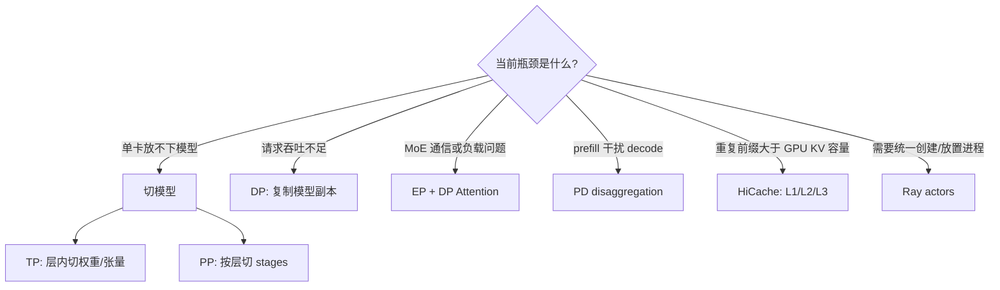
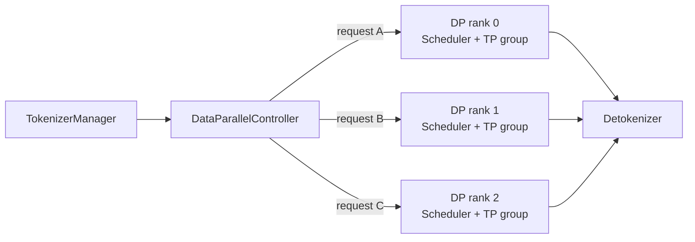
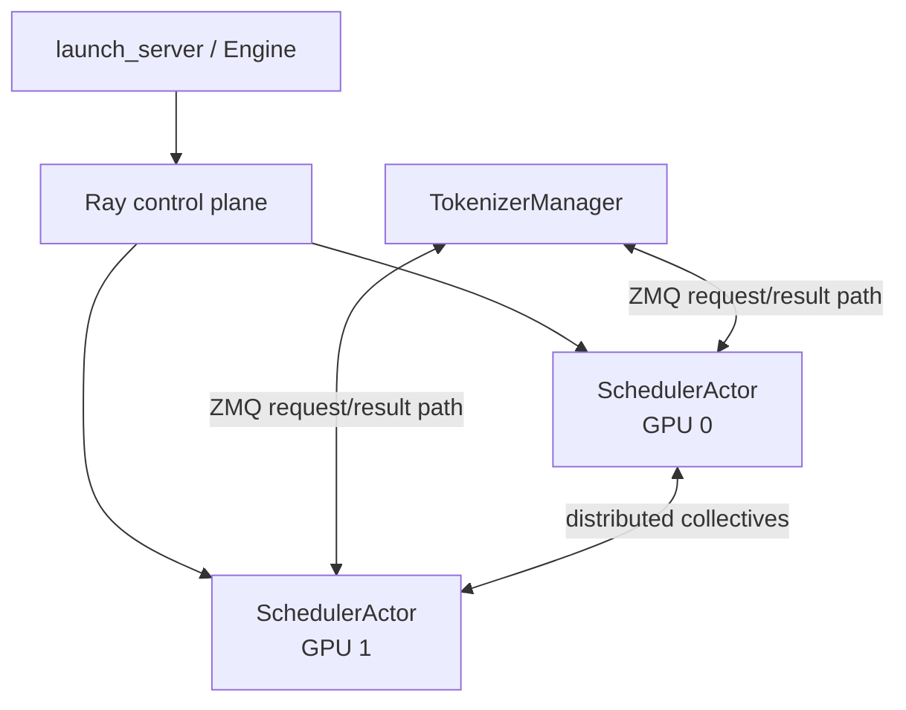
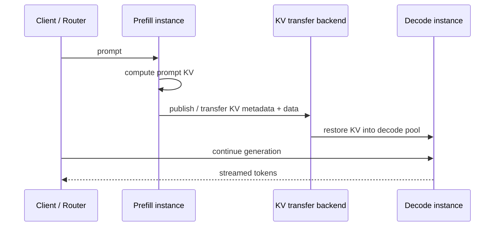

# SGLang 并行、PD 解耦、HiCache 与 Ray

先把六个经常混用的概念拆开：**TP/PP 切一个模型副本，DP 复制副本，DP Attention 改变 MoE 中 attention 与 expert 的并行关系，Ray 管 Scheduler 进程生命周期，PD 把 prefill 与 decode 拆成不同实例，HiCache 把 KV 扩展到更慢、更大的存储层。**它们可以组合，但解决的不是同一个问题。

## 一张选择地图



先用单实例、统一调度、GPU KV 做基线。只有指标证明对应瓶颈存在，才引入下一层；否则增加的是故障面，而不一定是吞吐。

## TP、PP、DP 与 EP 各切什么

| 维度 | 被切分或复制的对象 | 常见通信 | 适合解决 | 主要代价 |
| --- | --- | --- | --- | --- |
| TP | 每层权重、attention heads、中间张量 | 层内 all-reduce/all-gather 等 | 单卡放不下、利用高速互联 | 高频通信，受拓扑影响大 |
| PP | Transformer layers/stages | stage 间 activation | 模型跨节点、减少跨节点层内 collective | bubble、stage 不均衡、控制更复杂 |
| DP | 完整模型或 TP×PP 副本 | 请求路由；MoE 场景另有 collective | 提高请求吞吐、故障隔离 | 权重与 KV 复制、负载不均 |
| EP | MoE experts | token dispatch/combine、all-to-all | 利用稀疏专家结构 | 热专家、路由不均与网络成本 |

普通拓扑的 GPU 数可先用下式核对：

$$
N_{GPU}=DP\times TP\times PP
$$

EP、attention TP/DP、context parallel 可能复用或重组既有 rank group，不能机械地再乘一个维度。最终应以启动日志中的 rank 映射为准。

### 多节点的保守起点

两节点、每节点八卡时，可先让节点内做 TP，节点间做 PP：

```bash
# node 0
python -m sglang.launch_server \
  --model-path /models/model \
  --tp 8 --pp-size 2 --nnodes 2 --node-rank 0 \
  --dist-init-addr 10.0.0.10:5000

# node 1：其余参数保持一致
python -m sglang.launch_server \
  --model-path /models/model \
  --tp 8 --pp-size 2 --nnodes 2 --node-rank 1 \
  --dist-init-addr 10.0.0.10:5000
```

参数名会随版本演进，运行课程外版本时先看 `python -m sglang.launch_server --help`。启动前独立验证模型路径、CUDA/PyTorch/NCCL、节点互通与 GPU collective；HTTP 健康不等于跨节点 collective 健康。

## DP Controller：把请求交给哪个副本

当 `dp_size > 1` 时，[`DataParallelController`](https://github.com/sgl-project/sglang/blob/c879f3da5ceaaef3cb197c4e59ce683d420ce96c/python/sglang/srt/managers/data_parallel_controller.py#L129) 创建多个 Scheduler groups，并通过 ZMQ 将 tokenized request 分发给某个 DP rank。

可选路由策略包括 round robin、累计请求量、累计 token 量，以及 PD 场景的 bootstrap room。它说明两个事实：

1. DP 的控制对象是**请求**，不是一个 forward 内的 tensor shard；
2. request count 相同不代表负载相同，长 prompt、长输出、prefix hit 与 KV occupancy 都会改变成本。



做容量诊断时必须按 DP rank 看 queue、running requests、token usage 和 cache hit。总平均正常而某个 rank 堵塞，优先修路由，不要先扩总 GPU。

## DP Attention：为什么 MoE 需要另一种组合

MoE 模型的 attention 是 dense 计算，experts 是稀疏计算。若二者沿完全相同的 TP group 切分，attention 可能产生不必要的同步，而 experts 又需要较大的 EP group。DP Attention 的思路是让 attention 部分在若干 ranks 上采用数据并行式的独立输入，同时让 MoE experts 使用更适合的 expert parallel 分布。

它不是“打开后所有模型都更快”的通用开关。需要核对：

- 模型是否为受支持的 MoE 架构；
- attention TP、MoE DP/EP rank 怎样映射；
- token dispatch 是否负载均衡；
- 节点间 all-to-all 是否成为新瓶颈；
- 相同 workload 下 TTFT、ITL、吞吐和输出正确性是否同时通过。

## Ray 在 SGLang 中到底做什么

固定提交中的 [`SchedulerActor`](https://github.com/sgl-project/sglang/blob/c879f3da5ceaaef3cb197c4e59ce683d420ce96c/python/sglang/srt/ray/scheduler_actor.py#L31) 给出了最精确的边界：**每个 actor 管一张 GPU，并运行 Scheduler + `TpModelWorker`；Ray 用于进程生命周期，正常 request/response 仍由 ZMQ 传输。**



因此要分三层排障：

| 层 | 负责什么 | 典型证据 |
| --- | --- | --- |
| Ray | actor 创建、GPU resource assignment、存活与异常传播 | actor state、assigned GPU、Ray logs |
| SGLang + ZMQ | TokenizerManager、Scheduler、Detokenizer 的请求与结果流 | rid trace、socket/port、各进程日志 |
| PyTorch distributed/NCCL | TP/PP/EP rank 间 tensor 通信 | rank mapping、collective timeout、NCCL logs/profile |

`--use-ray` 不会自动选择 TP/PP/DP，也不会让坏的 NCCL 网络变快。它适合你已经有 Ray 集群资源管理需求、需要跨节点统一 actor 生命周期或希望由 Ray 分配 GPU 的场景；单机基线通常先保留原生进程路径。

::: warning 集群安全
Ray 控制面、SGLang 内部 ZMQ 和 distributed init 地址都应放在可信私网。不要把 actor/control ports 直接暴露到公网；公网流量只应进入带 TLS、认证、限流和审计的 API 网关。
:::

## PD 解耦：为什么要拆 prefill 与 decode

Prefill 对长 prompt 做大量并行矩阵计算，偏 compute-intensive；decode 每步 query 很小却要反复读大段 KV，偏 memory-bandwidth-intensive。统一 batch 中插入大 prefill，可能拉长正在 decode 请求的 inter-token latency；同一组 GPU 也很难同时为两种形态调到最佳。

PD disaggregation 将它们放到不同实例：



固定源码以 [`DisaggregationMode`](https://github.com/sgl-project/sglang/blob/c879f3da5ceaaef3cb197c4e59ce683d420ce96c/python/sglang/srt/disaggregation/utils.py#L68) 区分 prefill/decode；Scheduler 在 [`init_disaggregation()`](https://github.com/sgl-project/sglang/blob/c879f3da5ceaaef3cb197c4e59ce683d420ce96c/python/sglang/srt/managers/scheduler.py#L1103) 装配对应 mixin/连接。Prefill 主线见 [`SchedulerDisaggregationPrefillMixin`](https://github.com/sgl-project/sglang/blob/c879f3da5ceaaef3cb197c4e59ce683d420ce96c/python/sglang/srt/disaggregation/prefill.py#L422)，decode 主线见 [`SchedulerDisaggregationDecodeMixin`](https://github.com/sgl-project/sglang/blob/c879f3da5ceaaef3cb197c4e59ce683d420ce96c/python/sglang/srt/disaggregation/decode.py#L1985)。

SGLang 在该版本包含 Mooncake、NIXL 等 KV transfer 路径。选后端不是只看“支持”二字，还要测：

$$
T_{PD}=T_{queue,p}+T_{prefill}+T_{KV-transfer}+T_{queue,d}+T_{decode}
$$

若 `T_KV-transfer`、router handoff 或 decode 等待抵消了隔离收益，PD 反而更慢。它通常在 prompt 很长、prefill 对 ITL 干扰明显、两阶段需要不同 GPU 配比时才值得。

### PD 的容量不能只配一边

稳态必须同时满足：

$$
\lambda < \mu_{prefill},\qquad \lambda < \mu_{decode},\qquad bandwidth_{KV}>demand_{KV}
$$

prefill 富余但 decode 饱和，KV 会在中间堆积；decode 富余但 prefill 饱和，首 token 仍排队。监控必须同时覆盖两个 queue、handoff 失败/超时、KV 传输带宽和端到端 rid。

## HiCache：把 KV 从一层扩成三层

RadixCache 解决“哪些 prefix 相同”；HiCache 进一步解决“命中的 KV 放在哪里”。概念层级是：

| 层 | 典型位置 | 容量/速度 | 所有权 |
| --- | --- | --- | --- |
| L1 | GPU HBM | 最快、最小 | 单实例私有 |
| L2 | host memory | 更大、更慢 | 单实例私有 |
| L3 | distributed storage | 最大、延迟/带宽最不稳定 | 多实例共享 |

[`UnifiedRadixCache.init_hicache()`](https://github.com/sgl-project/sglang/blob/c879f3da5ceaaef3cb197c4e59ce683d420ce96c/python/sglang/srt/mem_cache/unified_radix_cache.py#L499) 将层次缓存接入 Radix 元数据；[`HostKVCache`](https://github.com/sgl-project/sglang/blob/c879f3da5ceaaef3cb197c4e59ce683d420ce96c/python/sglang/srt/mem_cache/pool_host/base.py#L81) 管 host pool；[`HiCacheController`](https://github.com/sgl-project/sglang/blob/c879f3da5ceaaef3cb197c4e59ce683d420ce96c/python/sglang/srt/managers/cache_controller.py#L202) 协调 transfer；[`HiCacheStorage`](https://github.com/sgl-project/sglang/blob/c879f3da5ceaaef3cb197c4e59ce683d420ce96c/python/sglang/srt/mem_cache/hicache_storage.py#L141) 定义更远端存储接口。

一次命中大致经历：本地 radix match → 查询/预取较慢层 → 等待、超时或 best-effort 决策 → 将 KV 恢复到可执行位置 → 本轮 forward → 按 write policy 回写。

### 策略改变的是延迟风险

- `best_effort`：来不及就重算，尾延迟较可控，但可能浪费算力；
- `wait_complete`：尽量等缓存，命中收益高，但慢存储会进入关键路径；
- timeout：在等待与重算之间设上界；
- write-through：更快进入远端层，但写带宽进入请求成本；
- write-back/selective：减少写放大，但一致性与淘汰更复杂。

多 rank 执行还需对命中长度达成一致；某 rank 不能读取完整 prefix 时，整个 group 只能采用共同可用的安全前缀。测 HiCache 时至少报告 L1/L2/L3 分层命中、load/store 带宽、restore latency、重算 token 与端到端 TTFT，不能只报“cache hit rate”。

## 组合时的启动顺序

1. 单 GPU 统一服务，确认语义与 workload；
2. TP/PP 解决模型放置，保存 rank 与网络基线；
3. DP 解决吞吐，并验证逐 rank 负载；
4. 有 MoE 证据再试 EP/DP Attention；
5. 有 prefill 干扰证据再做 PD；
6. 有大量可复用长前缀且 GPU cache 不够，再做 HiCache；
7. 只有需要统一进程资源编排时，再把 Scheduler 生命周期交给 Ray。

每一步只改变一个主变量，并保留前一步可回滚配置。

## 通关练习

给定：四节点、每节点八卡的 MoE 模型；模型单节点放不下；短 prompt chat 的 ITL 正常，但长文档流量进入后 ITL p99 翻十倍；prefix 跨租户不可共享。请提出两阶段实验，而不是一次打开所有开关。

一个合理答案是：先以节点内 TP、节点间 PP 放下模型并测统一调度；随后隔离长文档 workload，比较 chunked prefill 与 PD。因 prefix 不可跨租户共享，不能用全局 HiCache 命中率掩盖隔离要求；Ray 只有在集群进程编排需要时才进入实验。

下一课看这些系统能力怎样接入[结构化输出与 RL 工作流](./features)。
