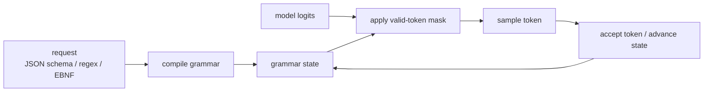
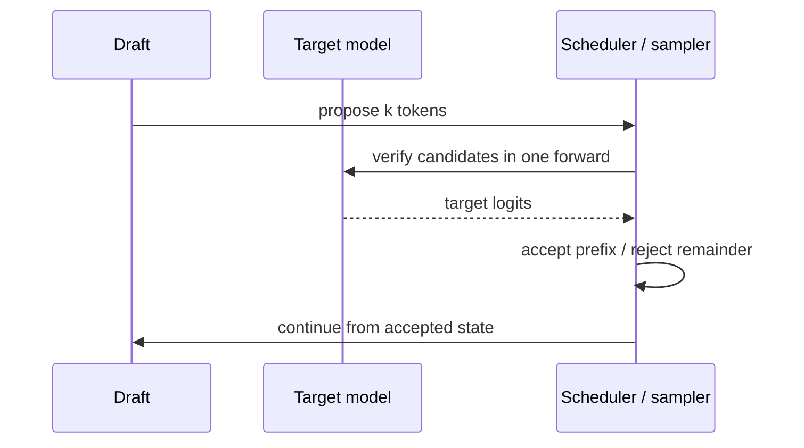
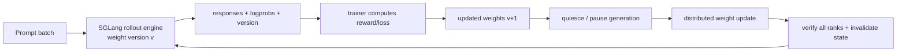
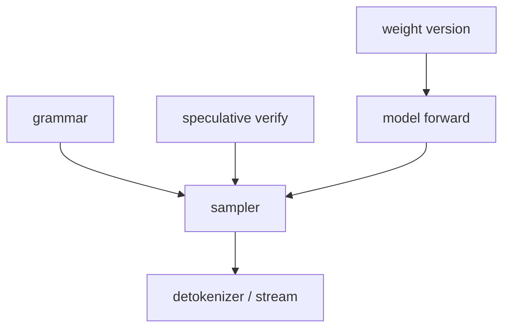

# SGLang 结构化输出、Speculative Decoding 与 RL 接入

三类能力处在不同边界：结构化输出在**每步采样前约束合法 token**，speculative decoding 改变**一次验证多少候选 token**，RL 接入则管理**推理引擎暂停、显存释放和新权重生效**。先认清边界，才能判断错误属于哪一层。

## 结构化输出不是生成后的 JSON 校验

普通生成从完整词表采样。Grammar-guided decoding 根据当前自动机状态构造合法 token mask，在采样前屏蔽不合法 token：

$$
p'(x_t)=\operatorname{softmax}(z_t+m_t),\qquad
m_{t,i}=\begin{cases}0&i\in V_{valid}(state_t)\\-\infty&otherwise\end{cases}
$$

采到 token 后，grammar state 前进，再为下一步生成新 mask。这样能保证语法形状，而不是先自由生成、最后发现 JSON 解析失败。

固定源码的抽象入口是 [`BaseGrammarBackend`](https://github.com/sgl-project/sglang/blob/c879f3da5ceaaef3cb197c4e59ce683d420ce96c/python/sglang/srt/constrained/base_grammar_backend.py#L131)，编译与生命周期由 [`GrammarManager`](https://github.com/sgl-project/sglang/blob/c879f3da5ceaaef3cb197c4e59ce683d420ce96c/python/sglang/srt/constrained/grammar_manager.py#L26) 管理。Scheduler 创建 manager，batch result 路径应用 mask 并接受采样结果。

### Grammar 能保证什么，不能保证什么

| 能保证 | 不能保证 |
| --- | --- |
| JSON/regex/EBNF 的语法合法性 | 字段内容符合真实业务事实 |
| enum、类型、嵌套结构等 schema 约束 | 数字单位、跨字段关系一定正确 |
| 工具调用外壳可解析 | 工具名称有权限、参数调用安全 |
| 在 decode 中阻止非法 token | 模型质量与任务答案正确 |

所以服务端仍需做 schema validation、业务规则校验、权限检查与超时。尤其不能因为输出满足工具 schema，就直接执行文件、数据库或外部系统操作。

### Grammar 的性能来自哪里

成本可能出现在 grammar 编译、ready queue 等待、每步 mask 计算、GPU/CPU 同步和低熵约束造成的输出变长。基准至少分开：

- 首次 schema 与缓存后相同 schema；
- 简单 enum 与深层 JSON schema；
- 无约束对照；
- TTFT、ITL、成功率与业务校验率。

若首次请求慢而后续正常，先查编译缓存；若每 token 都慢，查 mask/backend 与同步；若结构合法但语义错，回到模型、prompt 与业务校验。

## Speculative Decoding：草拟多个，目标模型一次验证

自回归 decode 通常每次昂贵 forward 只接受一个 token。Speculative decoding 用较便宜的 draft 机制提出多个候选，再由 target model 批量验证；只接受符合目标分布规则的前缀。

理想收益近似取决于每次 target forward 接受的平均 token 数，而真实收益还要扣除 draft、verify metadata、额外 KV、采样和同步开销。接受率高不自动等于端到端更快。

评估时固定 prompt/output 分布并报告：

- acceptance length / rate；
- draft 与 verify 时间；
- target forward 次数；
- TTFT、ITL、output tok/s；
- 额外显存以及输出分布/确定性检查。

短输出、小模型、低接受率或已有很大 decode batch 时，额外路径可能不划算。SGLang 的具体算法与支持矩阵在 [`srt/speculative/`](https://github.com/sgl-project/sglang/tree/c879f3da5ceaaef3cb197c4e59ce683d420ce96c/python/sglang/srt/speculative)；不要把某算法的参数套到另一算法上。

## RL 接入：SGLang 是 rollout engine，不是 trainer

RLHF/RLVR 流程中，trainer 产生新权重，SGLang 负责按当前 policy 批量生成 rollouts。两者之间的核心契约是：**哪一版权重生成了哪些样本，新权重何时对所有推理 ranks 一致可见，以及切换时旧请求怎样处理。**

### 一次安全的权重切换

1. 停止把新 rollout 交给旧 policy，或给请求标记明确 version；
2. pause/drain 到允许切换的边界；
3. 通过磁盘、tensor 或 distributed transfer 更新所有目标 ranks；
4. 验证模型名称、shape、dtype、版本与 rank 一致性；
5. 清理会跨权重污染语义的 cache/state；
6. 用小批确定性请求验证后继续生成；
7. rollout 结果携带 weight version，训练侧拒绝混版样本。

固定源码中，TokenizerManager 暴露控制入口；Scheduler 侧由 [`WeightUpdaterManager`](https://github.com/sgl-project/sglang/blob/c879f3da5ceaaef3cb197c4e59ce683d420ce96c/python/sglang/srt/managers/scheduler_components/weight_updater.py#L74) 协调，模型执行侧的更新接口见 [`model_runner_components/weight_updater.py`](https://github.com/sgl-project/sglang/blob/c879f3da5ceaaef3cb197c4e59ce683d420ce96c/python/sglang/srt/model_executor/model_runner_components/weight_updater.py#L36)。

### 释放显存与停止计算不是一回事

RL 训练和 rollout 可能时分复用 GPU。常见动作需要分开理解：

| 动作 | 目标 | 风险 |
| --- | --- | --- |
| pause generation | 暂停接收/推进请求 | 已在途请求、router backpressure |
| release memory / sleep | 归还 KV、权重或 allocator 占用 | 恢复成本、状态失效 |
| resume / wake | 重新建立执行所需状态 | ranks 不一致、首次 batch 抖动 |
| update weights | policy v → v+1 | 部分 rank 更新、旧 cache 污染 |

必须把这些动作当分布式事务处理：要么所有需要的 ranks 都成功并进入同一版本，要么停止服务并回滚/重建，不能让半数 ranks 继续生成。

## 确定性要定义口径

“同 seed”并不足以保证不同 batch、不同并行度、不同 kernel 都逐 token 相同。RL 场景应先决定需要哪种性质：

- 同一版本、相同请求顺序和 batch 形状可复现；
- batch-invariant sampling；
- 只要求统计分布等价；
- logprob 允许的数值误差范围。

然后固定模型 revision、tokenizer/chat template、sampling args、backend、并行拓扑与请求排序。改变 TP、CUDA Graph 或 speculative path 后重新做对照，不能沿用旧结论。

## 功能交叉处最容易出错

- grammar + speculative：draft token 也必须经过正确的约束/接受语义；
- weight update + prefix cache：旧权重产生的 KV 不能无条件复用于新权重；
- pause + streaming：客户端断连与取消必须传播，不能恢复后继续算已过期请求；
- dynamic update + DP/TP：每个 replica、每个 shard 都要确认版本；
- deterministic rollout + load balancing：不同 batch composition 可能改变随机数消费顺序。

测试矩阵要从单功能开始，再加入实际会同时启用的两两组合；不需要穷举生产中永远不会出现的组合。

::: danger 管理接口
暂停服务、释放显存和动态更新权重都属于高权限控制面。它们不应只依赖普通推理 API key，更不能直接暴露公网。使用独立管理凭证、私网、审计、允许的权重来源与版本校验。
:::

## 最小实验

### 实验 A：证明 grammar 是采样前约束

使用只有两个枚举值的 schema，记录每步合法 token 集合与最终输出。再用“两个字段之和必须为 10”作为业务规则：JSON 可以语法合法但违反跨字段关系，由此验证 grammar 与业务校验的边界。

### 实验 B：证明 spec 的收益来自接受长度

对相同 200 条请求依次运行 baseline 和 speculative，固定到达模式与输出上限。画 `acceptance length → ITL` 散点，并同时记录 draft 时间；若接受率提高但 ITL 未下降，继续查 draft/verify 开销，而不是只宣传接受率。

### 实验 C：证明 rollout 不混版

让模型 v 与 v+1 对一个 probe prompt 输出可区分结果。更新期间持续发送带 request id 的小批请求，要求每条结果能映射到唯一 weight version，且任何一次失败不会产生“部分 rank 新、部分 rank 旧”的可用响应。

## 通关标准

你应能判断一个功能修改了 grammar state、Scheduler execution plan，还是 model weight lifecycle；能解释结构合法不等于业务安全、spec 接受率不等于加速、update endpoint 成功不等于所有 ranks 已一致。

下一课把这些能力放入[生产指标、容量与故障处置](./production)。
