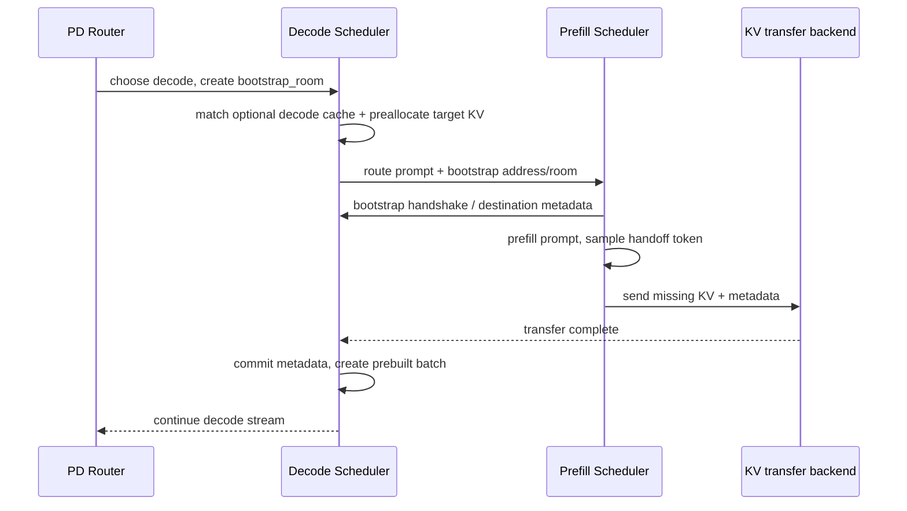
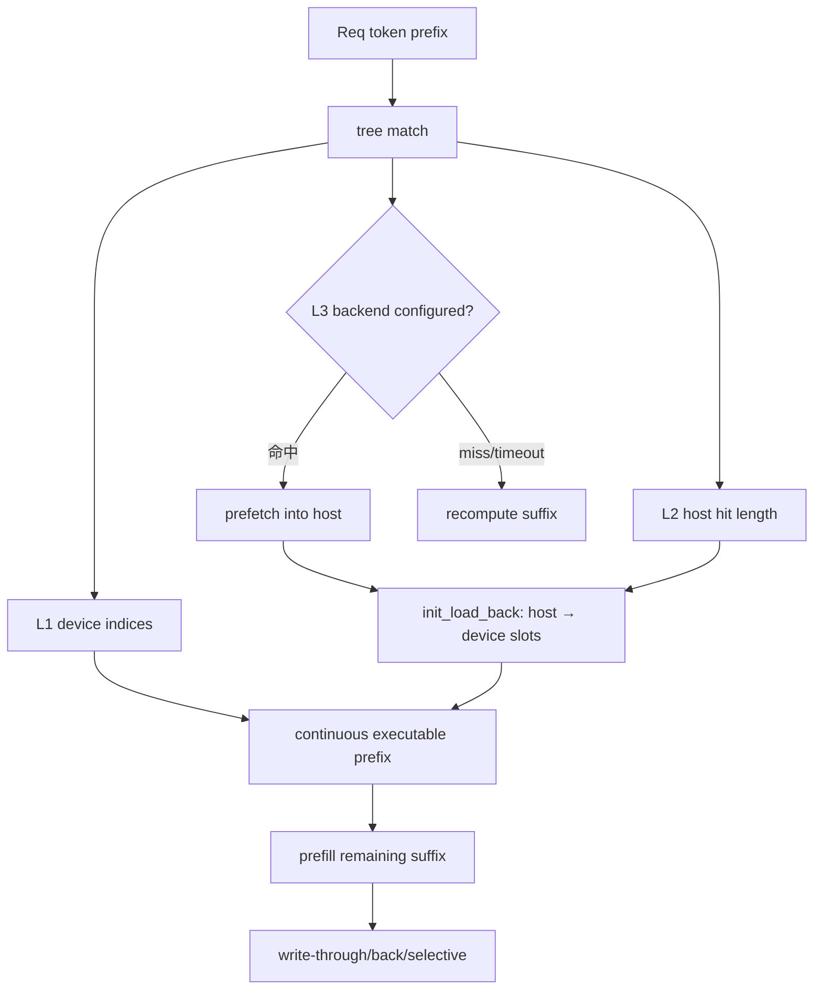

# PD 解耦与 HiCache：KV 怎样跨实例、跨层移动

PD disaggregation 与 HiCache 都会“搬 KV”，但方向与目的不同：PD 把一次请求的 prompt KV 从 prefill 实例交给 decode 实例；HiCache 在一个实例的 GPU、host 和共享存储层之间保存/恢复可复用 prefix。二者可组合，却有不同的一致性、容量和故障边界。

## 为什么统一调度会互相干扰

Prefill 处理一段 prompt，矩阵乘形状大、算力密集；decode 每轮只新增少量 token，却反复读取权重与历史 KV，常受显存带宽和 batch 组织影响。统一 Scheduler 中，新 prefill batch 可能让正在流式 decode 的请求等待较长 forward，抬高 ITL。

固定版本[官方 PD 文档](https://github.com/sgl-project/sglang/blob/c879f3da5ceaaef3cb197c4e59ce683d420ce96c/docs_new/docs/advanced_features/pd_disaggregation.mdx)列出的直接目标就是隔离两种阶段，并分别扩缩。代价是新增 router、bootstrap、目标端预分配、KV transfer 和两侧队列：

$$
T_{first}=T_{route}+T_{queue,P}+T_{prefill}+T_{handoff}+T_{queue,D}
$$

只有统一调度干扰的减少大于 handoff 成本时，PD 才改善目标 SLO。

## 三个进程域和一份请求身份



这张图的关键不是先后顺序的每个网络细节，而是**decode 端先为将到来的 KV 建立 receiver 和目标空间，prefill 端才能向正确位置发送**。`bootstrap_room` 是一次 handoff 的关联键，不能在并发请求间碰撞。

## 启动条件与初始化分支

参数定义见 [`ServerArgs.disaggregation_mode`](https://github.com/sgl-project/sglang/blob/c879f3da5ceaaef3cb197c4e59ce683d420ce96c/python/sglang/srt/server_args.py#L2434)：

- `null`：普通统一服务；
- `prefill`：只执行 prompt 阶段并发送 KV；
- `decode`：接收 KV 后继续自回归生成；
- transfer backend 默认 `mooncake`，可选项以该提交 `--help` 为准；
- prefill bootstrap port 默认 8998；
- decode 默认不开 radix reuse，需显式 `--disaggregation-decode-enable-radix-cache`。

[`Scheduler.init_disaggregation()`](https://github.com/sgl-project/sglang/blob/c879f3da5ceaaef3cb197c4e59ce683d420ce96c/python/sglang/srt/managers/scheduler.py#L1103) 按 mode 构造不同 queue/mixin 状态。普通 `event_loop_normal/overlap` 也会被 PD-specific event loop 替代，而不是只在 `run_batch()` 后加一次 memcpy。

## Prefill 侧：先 bootstrap，再 admission

[`PrefillBootstrapQueue`](https://github.com/sgl-project/sglang/blob/c879f3da5ceaaef3cb197c4e59ce683d420ce96c/python/sglang/srt/disaggregation/prefill.py#L106) 管尚未完成对端握手的请求。

### `create_sender()` 改了什么

[`create_sender()`](https://github.com/sgl-project/sglang/blob/c879f3da5ceaaef3cb197c4e59ce683d420ce96c/python/sglang/srt/disaggregation/prefill.py#L252) 根据 transfer backend 构造 sender，保存 bootstrap address/room 与目标 TP rank，并设置：

```text
req.disagg_kv_sender = backend sender
req.pending_bootstrap = True
req.sampling_params.max_new_tokens = 1
```

最后一项很重要：prefill 节点只需生成 handoff 的一个 token，不能按客户端完整输出长度预留 KV，否则 admission 会严重过度保守。客户端的完整生成上限在 decode 侧语义中继续生效。

### `finalize_bootstrap()` 得到什么

[`finalize_bootstrap()`](https://github.com/sgl-project/sglang/blob/c879f3da5ceaaef3cb197c4e59ce683d420ce96c/python/sglang/srt/disaggregation/prefill.py#L289) 只有在握手完成且 metadata buffer 可分配时成功。它从 sender 取 decode 已命中的 prefix length：

```text
req.start_send_idx = decode_prefix_len
num_to_send = prompt_len - decode_prefix_len
sender.init(page_count(num_to_send), metadata_buffer_index)
pending_bootstrap = False
```

如果 decode 侧已经有前缀，prefill 不必重复发送整段 KV。这也是启用 decode radix cache 后必须把命中长度纳入 transfer 指标的原因。

### PD prefill event loop

[`event_loop_normal_disagg_prefill()`](https://github.com/sgl-project/sglang/blob/c879f3da5ceaaef3cb197c4e59ce683d420ce96c/python/sglang/srt/disaggregation/prefill.py#L506) 每轮：收请求 → 从 bootstrap queue 取 ready 请求 → 走 prefill admission/forward → 处理 transfer inflight queue。

[`process_batch_result_disagg_prefill()`](https://github.com/sgl-project/sglang/blob/c879f3da5ceaaef3cb197c4e59ce683d420ce96c/python/sglang/srt/disaggregation/prefill.py#L590) 在最后 chunk：

- 记录 prefill finished；
- 追加 handoff token；
- cache unfinished request；
- 放入 `disagg_prefill_inflight_queue`；
- 等 sender 完成后再释放/输出对应状态。

因此“prefill forward 返回”不等于“decode 已可运行”。transfer completion 是独立状态。

## Decode 侧：预分配、transfer、commit

decode 端有两层显式 queue：

1. [`DecodePreallocQueue`](https://github.com/sgl-project/sglang/blob/c879f3da5ceaaef3cb197c4e59ce683d420ce96c/python/sglang/srt/disaggregation/decode.py#L284)：建立 receiver、可选前缀匹配、申请 request row/KV/metadata buffer；
2. [`DecodeTransferQueue`](https://github.com/sgl-project/sglang/blob/c879f3da5ceaaef3cb197c4e59ce683d420ce96c/python/sglang/srt/disaggregation/decode.py#L1632)：轮询 KV/metadata 是否到齐，成功后提交给 `Req`。

[`DecodeRequest`](https://github.com/sgl-project/sglang/blob/c879f3da5ceaaef3cb197c4e59ce683d420ce96c/python/sglang/srt/disaggregation/decode.py#L261) 同时保存 request、receiver、metadata buffer 和可选 HiCache restore 状态。这些状态属于 handoff，不等于普通 Scheduler `Req` 的 waiting/running 状态。

### 为什么先 match decode cache

当显式启用 decode radix cache 时，`_match_prefix_and_lock()` 调用与普通服务相同的 `match_prefix_for_req()`，锁住匹配节点并把 prefix 信息交给 bootstrap。目标端只为缺失部分预分配，prefill 只发送缺失 KV。

安全条件：命中的 KV 必须来自兼容的模型权重、tokenizer/extra_key 和并行布局。RL 更新权重时若不 flush，会把旧 policy KV 当成新 policy prefix，这是语义错误，不只是性能问题。

### commit 前为什么校验 bootstrap room

[`DecodeTransferQueue._commit_transfer_to_req()`](https://github.com/sgl-project/sglang/blob/c879f3da5ceaaef3cb197c4e59ce683d420ce96c/python/sglang/srt/disaggregation/decode.py#L1670) 读取 metadata buffer，先比较实际与期望 `bootstrap_room`。值为 0 或不一致会 abort，避免 metadata buffer collision 把另一请求的 handoff token/logprob/KV 提交给当前 rid。

成功后才把 transferred indices、handoff token、logprob/spec metadata 等写回 `Req`，并释放 receiver/metadata 临时所有权。

## 为什么要造一个 `prebuilt` batch

KV 已经由 prefill 计算并传到 decode，所以 decode 不应再跑 prompt forward。但普通 running batch 需要经过统一的 `Req`/pool/sampling/result 状态转换。

[`process_decode_queue()`](https://github.com/sgl-project/sglang/blob/c879f3da5ceaaef3cb197c4e59ce683d420ce96c/python/sglang/srt/disaggregation/decode.py#L2185) 把 transferred requests 放入 waiting queue；[`get_new_prebuilt_batch()`](https://github.com/sgl-project/sglang/blob/c879f3da5ceaaef3cb197c4e59ce683d420ce96c/python/sglang/srt/disaggregation/decode.py#L2116) 构造 `ScheduleBatch` 并 `prepare_for_prebuilt()`，让 result processor 以“伪完成 prefill”方式接入 running decode。

这层适配保证后续 decode 可以复用普通 `update_running_batch()`、finish、streaming 与回收逻辑。

## PD 的五类失败

| 失败点 | 表现 | 首要证据 | 安全处置 |
| --- | --- | --- | --- |
| router 选不到 P/D | 入口 5xx/排队 | router backend state | 不创建半成品 handoff |
| bootstrap 超时 | P 等不到目标 metadata | room、P/D 地址、timeout | 两侧取消同一 rid，释放 buffer |
| decode 预分配不足 | transfer 前卡住/拒绝 | KV/request rows、reserved decode tokens | backpressure/retry，不覆盖活跃 KV |
| transfer 失败 | P 已算完，D 未 ready | backend poll、bytes、IB/NIXL/Mooncake logs | sender/receiver 同时终止，客户端失败 |
| metadata room 不匹配 | context corruption error | expected/actual room、buffer idx | 确定性 abort，不继续 decode |

只看 HTTP 健康接口无法证明 PD 数据面健康。验收必须真正完成 prompt→KV transfer→多 token decode。

## 最小单机 PD 实验

固定版本官方文档给出 Mooncake 例子；需要对应依赖和可用设备。以下保持官方结构，端口和 GPU 按机器调整：

```bash
export IB_DEVICE=mlx5_roce0  # 用 ibv_devices/官方文档替换成实际设备

# GPU 0: prefill
python3 -m sglang.launch_server \
  --model-path "$MODEL" \
  --disaggregation-mode prefill \
  --port 30000 \
  --disaggregation-ib-device "$IB_DEVICE"

# GPU 1: decode
python3 -m sglang.launch_server \
  --model-path "$MODEL" \
  --disaggregation-mode decode \
  --port 30001 \
  --base-gpu-id 1 \
  --disaggregation-ib-device "$IB_DEVICE"

# router（包内模块名以当前安装的官方文档/--help 为准）
python3 -m sglang_router.launch_router \
  --pd-disaggregation \
  --prefill http://127.0.0.1:30000 \
  --decode http://127.0.0.1:30001 \
  --host 0.0.0.0 --port 8000
```

预期证据：

- P、D 都完成模型/transport 初始化；
- router 同时注册 P/D；
- 一个 rid 在 P 出现 prefill/transfer，在 D 出现 prealloc/commit/decode；
- router 端获得多个输出 token，而不是只有 handoff token；
- transfer/queue 指标非空，P 不继续长 decode。

验收：相同 workload 分别跑 unified 与 PD，报告 TTFT/ITL/E2E、P/D queue、KV transfer bytes/latency/failure、两侧 GPU utilization。没有统一基线就无法证明 PD 有收益。

## HiCache：从 prefix identity 到存放位置

固定版本[官方 HiCache 设计](https://github.com/sgl-project/sglang/blob/c879f3da5ceaaef3cb197c4e59ce683d420ce96c/docs_new/docs/advanced_features/hicache_design.mdx)定义：

| 层 | 位置 | 范围 | 主要代价 |
| --- | --- | --- | --- |
| L1 | GPU KV pool | 实例私有 | HBM 容量 |
| L2 | host KV pool | 实例私有 | PCIe/NVLink transfer、host pinned memory |
| L3 | file/Mooncake/HF3FS/NIXL 等 | 可跨实例共享 | 查询、网络/存储、序列化与尾延迟 |

Radix tree 决定 token prefix identity 和连续命中；HiCache node 还要记录本地 device/host 位置，L3 metadata 则可按 backend 查询。

## 实现选择不是永远一个类

[`mem_cache/registry.py`](https://github.com/sgl-project/sglang/blob/c879f3da5ceaaef3cb197c4e59ce683d420ce96c/python/sglang/srt/mem_cache/registry.py#L80) 是权威 factory：

- 普通 MHA/MLA 且开启 hierarchical cache：通常构造 [`HiRadixCache`](https://github.com/sgl-project/sglang/blob/c879f3da5ceaaef3cb197c4e59ce683d420ce96c/python/sglang/srt/mem_cache/hiradix_cache.py#L75)；
- hybrid SWA/SSM、DSA 或显式 unified tree：走 [`UnifiedRadixCache`](https://github.com/sgl-project/sglang/blob/c879f3da5ceaaef3cb197c4e59ce683d420ce96c/python/sglang/srt/mem_cache/unified_radix_cache.py#L306)，再 `init_hicache()`；
- 实验 C++ tree、LMCache、FlexKV 等开关会选择其他 factory 分支。

所以排障第一步应打印 `type(scheduler.tree_cache)` 和 resolved args，而不是在 `HiRadixCache` 下断点后认定 HiCache 没运行。

## 一次 L1/L2/L3 恢复流程



Scheduler 在 prefill pass 调用 `tree_cache.check_hicache_events()`；若 L3 prefetch 仍在进行，当前请求先跳过。本地/远端 ready 后，`PrefillAdder.add_one_req()` 在 node lock 内调用 `init_load_back()`，分配 device slots 并把 host 命中追加到 `prefix_indices`。随后 `prepare_for_extend()` 记录 device/host/storage 的 cached token 分解。

重要不变量：可执行 prefix 必须连续。即使 L3 命中了后半段，只要中间缺页，就不能跳过中间计算直接使用后半 KV。

## 写策略改变关键路径

参数见 [`server_args.py#L2118`](https://github.com/sgl-project/sglang/blob/c879f3da5ceaaef3cb197c4e59ce683d420ce96c/python/sglang/srt/server_args.py#L2118)：

- `write_through`：较早把新 KV 备份到 host/storage，复用窗口好，但写入可能增加带宽压力；
- `write_back`：淘汰/需要时再回写，减少前台写，但脏数据和回收时序更复杂；
- `write_through_selective`：只选部分节点，收益取决于选取策略与 workload；
- storage prefetch `best_effort/wait_complete/timeout` 决定等待缓存还是回退重算。

不能只报总体 cache hit。至少拆出：device hit tokens、host hit tokens、storage hit tokens、prefetch wait、host→device load、write bytes、recomputed tokens。

## 最小 HiCache 实验

先只测 L1/L2，不上 L3：

```bash
python3 -m sglang.launch_server \
  --model-path "$MODEL" \
  --enable-hierarchical-cache \
  --hicache-ratio 2 \
  --enable-metrics \
  --port 30000
```

具体 CLI 名以当前固定版本 `--help` 为准。发送三轮同前缀请求：冷启动、L1 热命中、通过显存压力促使部分 prefix 到 L2 后再请求。验收：

1. 三轮输出语义一致；
2. 冷轮主要计算，L1 轮 device hit 上升；
3. L2 轮出现 host hit/load，且 restore 后才 forward suffix；
4. pool 与 lock 在完成/淘汰后回到一致状态；
5. 关闭 HiCache 的对照能区分 L2 收益与普通 Radix L1 收益。

增加 L3 时再选一个官方 backend，并独立注入 storage 超时。`timeout/best_effort` 应可回退重算并保持正确；`wait_complete` 可能把存储尾延迟带入 TTFT，必须有 SLO 上界。

## PD × HiCache 组合边界

典型用途包括：prefill instances 通过 L3 共享 system prompt，或 decode 侧缓存多轮对话 prefix 以减少后续 handoff bytes。组合时至少验证：

- P/D 的 page size、KV dtype、模型 revision、TP layout 是否兼容；
- decode prefix hit length 是否正确反馈给 P；
- P 不发送的 KV 确实已在 D 锁定且可读；
- weight update/restart 后 L3 namespace 不复用陈旧 KV；
- 任一 P/D/L3 故障时，bootstrap room 和两侧 allocations 都清理。

## 本课验收

闭卷解释一个 rid 的六个状态：decode prealloc、prefill bootstrap、prefill running、transfer inflight、decode transferred、decode running。每次转移都写出拥有者、必要输入、可失败条件和清理动作。再说明 HiCache 的 L2/L3 hit 怎样减少 PD transfer，以及为什么错误的命中比 cache miss 更危险。

下一课进入[RL rollout 生命周期](./rl-lifecycle)，研究权重变化时这些 KV 为什么必须失效。
