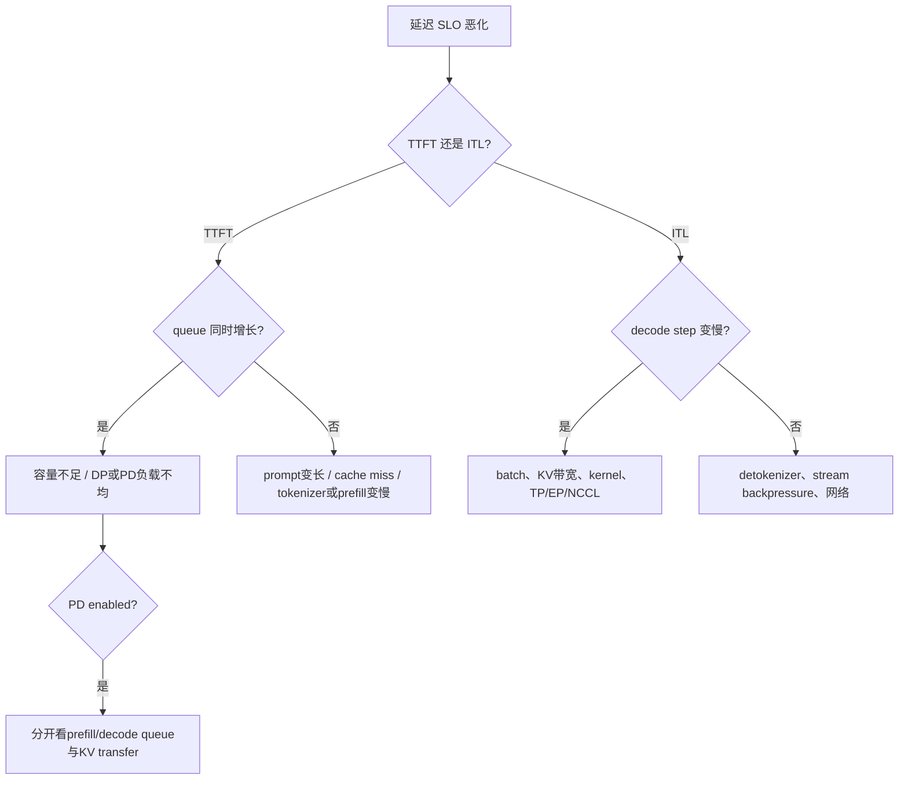

# SGLang 生产诊断与容量规划

生产目标不是“GPU 跑满”，而是**在真实输入/输出长度、到达过程和功能组合下，持续完成满足 SLO 的请求。**吞吐、TTFT、ITL、正确性和成本要一起看；任何单个平均数都可能隐藏坏节点或长尾。

## 先写 workload contract

容量测试前固定：

- prompt/output token 的分布与高分位；
- streaming 与非 streaming 比例；
- chat、structured output、LoRA、multimodal、spec 等 feature mix；
- prefix 重复模式与租户隔离规则；
- open-loop 到达率还是 closed-loop concurrency；
- TTFT、ITL、E2E、成功率和 goodput SLO；
- 模型、tokenizer、SGLang commit、backend、并行拓扑和硬件。

若线上是突发开放流量，离线只测固定 concurrency 的满载 tok/s，结论无法回答 queue 是否稳定。

## 两本容量账

### KV 容量账

对普通 decoder-only 模型，每 token KV 字节数可粗估为：

$$
B_{KV/token}\approx 2\times L\times H_{kv}\times D_{head}\times bytes(dtype)
$$

乘以驻留 token 数，再考虑 TP shard、page 对齐、allocator 与其他 workspace。真实上限以启动日志、pool capacity 和压力下 token usage 为准。

理论并发可初筛为：

$$
C_{KV}\approx\frac{available\ KV\ tokens}{P_q(context+generated\ tokens)}
$$

分母应选符合风险目标的高分位。prefix hit 减少本次 prefill compute，不代表所有共享 KV 不占显存；HiCache 命中也可能需要 L2/L3 restore 带宽。

### 服务速率账

$$
demand_{tok/s}=\lambda\times(E[input\ computed]+E[output])
$$

prefill token 与 decode token 成本不同，公式只能做数量级检查。最终用逐级提高 arrival rate 的实验找稳定区：完成速率能追上到达率、queue 不持续增长、SLO goodput 仍达标。

Little 定律提供交叉核对：

$$
L=\lambda W
$$

到达 20 req/s、平均端到端 3s 时，系统内平均约 60 请求。若 running+waiting 长期只有 8，统计口径或采样必有不一致。

## 启用并认识指标

服务启动时显式启用 metrics，并从受控网络抓取 `/metrics`：

```bash
python -m sglang.launch_server \
  --model-path /models/model \
  --host 127.0.0.1 --port 30000 \
  --enable-metrics

curl -fsS http://127.0.0.1:30000/metrics | rg '^sglang:'
```

固定提交的指标定义集中在 [`metrics_collector.py`](https://github.com/sgl-project/sglang/blob/c879f3da5ceaaef3cb197c4e59ce683d420ce96c/python/sglang/srt/observability/metrics_collector.py)。指标名会演进，上线前保存该版本实际 exposition，并让 dashboard 与代码版本一起发布。

### 最小仪表盘

| 层 | 代表指标/证据 | 回答什么 |
| --- | --- | --- |
| 用户结果 | `time_to_first_token_seconds`、`time_per_output_token_seconds`、`e2e_request_latency_seconds`、HTTP success/error | 用户是否拿到合格结果 |
| 流量 | `prompt_tokens_total`、`generation_tokens_total`、请求长度分布 | workload 是否变化 |
| Scheduler | `num_running_reqs`、`num_queue_reqs`、`num_used_tokens` | 是否排队、是否接近 KV 容量 |
| 缓存 | `cache_hit_rate`、HiCache host used/total tokens、restore/store stats | prefix/cache 层是否真的受益 |
| 速率 | `gen_throughput` 与完成请求速率 | 服务是否追上到达流量 |
| Spec | draft/accept/step 相关指标 | speculative 是否减少 target work |
| 基础设施 | GPU HBM/util/clock、CPU、NCCL/network、Ray actor state | 系统瓶颈在哪个资源层 |

一个 TTFT p99 查询形态是：

```text
histogram_quantile(
  0.99,
  sum by (le, model) (
    rate(sglang:time_to_first_token_seconds_bucket[5m])
  )
)
```

实际 label 以 `/metrics` 为准。先聚合 histogram buckets 再算 quantile，不要平均各实例的 p99。

## 从 TTFT 与 ITL 反推阶段



### 症状矩阵

| 现象 | 最强的下一项证据 | 不要立即下的结论 |
| --- | --- | --- |
| TTFT 高、ITL 正常、queue 高 | arrival/completion、逐 DP/PD queue | “GPU kernel 退化” |
| TTFT 高、queue 低、prompt 变长 | prefill time、tokenize、prefix hit | “需要更多 decode GPU” |
| TTFT 正常、ITL 高 | decode batch、step time、KV/NCCL | “入口网络慢” |
| GPU 低利用但 queue 高 | Scheduler 是否推进、CPU/ZMQ/collective | “batch 一定太小” |
| cache hit 高但 TTFT 高 | hit token、restore latency、锁与带宽 | “缓存工作正常” |
| 只有一个 DP rank 堵塞 | per-rank 长度、tokens、cache locality | “总容量不足” |
| PD 中间堆积 | 两阶段完成率、KV handoff failure/bandwidth | “prefill 与 decode 都要扩” |

## 调参按瓶颈分组

`mem_fraction_static` 粗略控制权重与 KV 等静态显存占比，但其余 workspace、CUDA Graph、通信 buffer 和临时张量仍需空间。调高前先分阶段记录 HBM，避免把运行期峰值挤没。

| 瓶颈 | 可做的受控实验 | 同时观察 |
| --- | --- | --- |
| queue 饱和 | 限流、增加 replica、调整 DP route | success、逐 rank queue、成本 |
| 长 prefill 干扰 | chunked prefill 参数、隔离 workload、PD 对照 | TTFT/ITL、prefill throughput |
| KV 紧张 | 降并发/长度、调静态显存、TP 对照、HiCache | token usage、retraction/OOM、ITL |
| decode launch 开销 | CUDA Graph shape/backend 对照 | HBM、首次捕获与稳态 ITL |
| spec 无收益 | 关 spec、改 draft steps/model | acceptance、draft/verify time |
| TP/EP 通信慢 | 节点内外拓扑对照、collective profile | rank step、network、GPU idle |

一次只改变一个主变量；每次保存最终解析后的参数、启动日志和相同 workload 结果。参数能启动不代表输出正确，也不代表 p99 改善。

## Admission control 与取消传播

当到达率超过服务能力，无界排队只是把失败推迟到网关 timeout。入口应：

- 在进入 GPU 前估算/限制 prompt 与 max output tokens；
- 设置并发与 queue 上限，超限返回明确可重试状态；
- 按租户/业务优先级做 quota，而不是让单个长请求群淹没 chat；
- 客户端断连/超时要传播 abort，释放 Scheduler 与 KV 状态；
- retry 使用指数退避与 jitter，避免同步重试风暴；
- structured output、LoRA、多模态等高成本 feature 可独立分池。

最大输出长度是容量承诺。不能因为多数请求提前 EOS，就忽略每个请求声明的 32K worst case。

## 健康、watchdog 与故障边界

SGLang 的 [`Watchdog`](https://github.com/sgl-project/sglang/blob/c879f3da5ceaaef3cb197c4e59ce683d420ce96c/python/sglang/srt/utils/watchdog.py#L109) 可在 forward 长时间不返回时输出证据或终止卡死服务。`watchdog_timeout` 与 `soft_watchdog_timeout` 的目的不同：前者避免永久 hang，后者用于提前 dump 调试信息。

- liveness：进程是否需要重启；
- readiness：是否已经加载、warmup 完成且可接新请求；
- business probe：低频真实生成，验证模型语义主线；
- Ray/NCCL health：独立检查 actor/ranks/collective，不由 HTTP 200 替代。

watchdog 触发是症状，不是根因。保存所有 rank stack、最后 batch/rid、NCCL/Ray 状态、GPU Xid 与最近配置，再重启；否则最关键的现场会丢失。

## 安全边界

固定源码区分普通 [`api_key`](https://github.com/sgl-project/sglang/blob/c879f3da5ceaaef3cb197c4e59ce683d420ce96c/python/sglang/srt/server_args.py#L1085) 与 [`admin_api_key`](https://github.com/sgl-project/sglang/blob/c879f3da5ceaaef3cb197c4e59ce683d420ce96c/python/sglang/srt/server_args.py#L1089)。仍应由网关提供 TLS、身份与租户授权、body/token 限制、rate limit 和审计。

- 推理 key 与管理 key 分离并定期轮换；
- 权重更新、memory release、profile 等管理端点只在私网开放；
- Ray、ZMQ、NCCL/distributed init ports 不暴露公网；
- 默认不记录完整 prompt、token、Authorization header 或用户隐私；
- 动态加载模型/权重只允许受信来源、固定 revision 和校验值；
- `/metrics` 可能泄漏模型/租户 label，也需受控网络与 label 审计。

## 发布清单

```text
[ ] image digest + SGLang commit + PyTorch/CUDA/driver/model revision fixed
[ ] cold start, warm start, CUDA Graph capture and model load time measured
[ ] deterministic smoke, stream, cancel, over-limit, grammar tests pass
[ ] real workload rate sweep meets TTFT/ITL/E2E/success goodput SLO
[ ] per-rank queue/token/cache balance checked
[ ] TP/PP/DP/EP rank map and collective test saved
[ ] PD/HiCache/spec enabled only with feature-specific evidence
[ ] readiness blocks traffic before warmup; termination drains streams
[ ] normal/admin APIs, internal ports and logs pass security review
[ ] previous image/model/config can actually roll back
```

Canary 必须包含代表性的长 prompt、streaming 和已启用 feature。只测 `hello` 会漏掉 cache、grammar、PD handoff 和多 rank 性能回归。

## 事故处置顺序

1. **保护用户**：限流、从路由摘除坏实例、停止放大重试；
2. **保存现场**：版本、参数、所有进程/rank 日志、5–15 分钟指标、代表 rid；
3. **定边界**：网关 → TokenizerManager → DP controller → Scheduler/cache → ModelRunner/kernel → collective → Detokenizer；
4. **做一个缓解**：回滚、禁用单 feature、降并发或隔离坏节点；
5. **同版本复现**：用最小 workload 证伪假设；
6. **补门禁**：加入能更早暴露该问题的测试、指标或配置校验。

## 通关标准

你应能从 workload contract 建立 KV/服务速率账，用逐 rank、逐阶段指标区分 queue、prefill、decode、cache restore 和网络问题；能解释为什么高 GPU 利用、高 cache hit 或 HTTP 200 都不单独等于健康。

把本页诊断动作按[实验工作簿](../practice/lab-workbook)预演一遍，再到课程最后一页查[固定源码、官方文档与术语](../appendix/references)。
