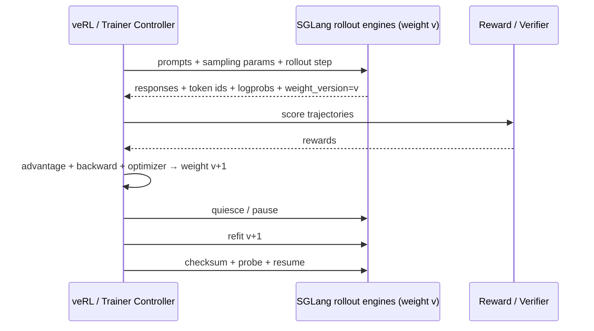
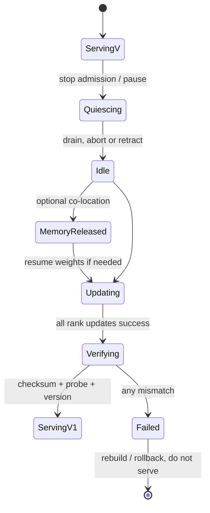

# SGLang 在 RL 中的生命周期：rollout、暂停、换权与验权

SGLang 在 RL 系统中通常是 rollout/reward serving engine，不负责计算 PPO/GRPO loss。训练框架（例如 veRL）决定 prompt、采样批次、reward/advantage、训练 step 和新权重；SGLang 负责高吞吐生成，以及暂停、显存释放、更新权重、恢复和版本观测。

固定版本官方入口：

- [SGLang for RL](https://github.com/sgl-project/sglang/blob/c879f3da5ceaaef3cb197c4e59ce683d420ce96c/docs_new/docs/advanced_features/sglang_for_rl.mdx)
- [Post-training integrations](https://github.com/sgl-project/sglang/blob/c879f3da5ceaaef3cb197c4e59ce683d420ce96c/docs_new/docs/references/post_training_integration.mdx)，其中明确列出 veRL 的模块化 SGLang integration
- 本站 veRL 专区负责 trainer/controller 侧：[veRL 架构与 HybridFlow](../../verl/internals/architecture)与[角色/Ray 启动条件](../../verl/internals/workers)

## 先画清一个 RL step



必须守住三个不变量：

1. 每条样本能关联唯一 policy version；
2. 一个 TP/PP/DP rollout engine 的所有必要 ranks 同时处于同一版本；
3. 旧权重计算的 KV/graph/state 不会在不兼容时污染新权重结果。

## API 到源码的控制链

管理 route 在 [`http_server.py`](https://github.com/sgl-project/sglang/blob/c879f3da5ceaaef3cb197c4e59ce683d420ce96c/python/sglang/srt/entrypoints/http_server.py)：

| HTTP API | TokenizerManager | Scheduler/worker |
| --- | --- | --- |
| `/pause_generation` | [`pause_generation()`](https://github.com/sgl-project/sglang/blob/c879f3da5ceaaef3cb197c4e59ce683d420ce96c/python/sglang/srt/managers/tokenizer_manager.py#L1718) | [`Scheduler.pause_generation()`](https://github.com/sgl-project/sglang/blob/c879f3da5ceaaef3cb197c4e59ce683d420ce96c/python/sglang/srt/managers/scheduler.py#L4064)（非 abort） |
| `/continue_generation` | [`continue_generation()`](https://github.com/sgl-project/sglang/blob/c879f3da5ceaaef3cb197c4e59ce683d420ce96c/python/sglang/srt/managers/tokenizer_manager.py#L1733) | [`Scheduler.continue_generation()`](https://github.com/sgl-project/sglang/blob/c879f3da5ceaaef3cb197c4e59ce683d420ce96c/python/sglang/srt/managers/scheduler.py#L4153) |
| `/update_weights_from_disk` | model update lock + fanout | `SchedulerWeightUpdaterManager.update_weights_from_disk()` |
| `/update_weights_from_tensor` | payload normalize + fanout | `update_weights_from_tensor()` + TP barrier |
| `/update_weights_from_distributed` | update group fanout | distributed loader |
| `/release_memory_occupation` | control communicator | idle assert + memory saver pause |
| `/resume_memory_occupation` | control communicator | memory saver resume + state restore |
| `/weights_checker` | merge rank payload | per-rank checksum/quant-aware check |

这些 route 在固定提交使用 `ADMIN_OPTIONAL` 权限。生产必须设置独立 admin key、可信私网和审计；不要让普通 rollout 客户端拥有换权/释放显存权限。

## Pause 的三种语义

[`PauseGenerationReqInput`](https://github.com/sgl-project/sglang/blob/c879f3da5ceaaef3cb197c4e59ce683d420ce96c/python/sglang/srt/managers/io_struct.py#L1490) 支持 `abort`、`in_place`、`retract`。

### `abort`

TokenizerManager 先将 `is_pause=True`，然后反复发送 `AbortReq(abort_all=True)`，并等待 model update reader lock 不再被生成持有。它不把 `mode="abort"` 交给 Scheduler 的 pause handler；普通 abort/finish 路径负责逐请求资源清理。

适合：样本可以丢弃、希望最快清空旧 policy 请求。代价：必须在训练侧标记这些 rollout 失败，不能把截断响应当完整样本。

### `in_place`

Scheduler 设置 `_engine_paused=True`，保留 running/last/chunk/result queue 和 KV，恢复后从原状态继续。优点是不中断长 rollout；缺点是仍占 KV，并且 cache 非空时 flush 会失败。

适合：短暂停顿且不换权，或明确保证恢复后仍使用同一版权重。**不适合在保留旧 KV 的同时换成新权重。**

### `retract`

Scheduler 先处理必要的 overlap result，再把活跃请求从 running/chunk 状态退回 waiting，释放或重建 KV，允许 cache flush。恢复后请求重新 prefill。

PD decode 有特殊处理：保存一个已经对客户端发出的边界 token，暂存 rebootstrap 请求；`continue_generation()` 后才重新进入 prealloc，让 prefix 在新权重下重新计算。这样避免换权期间 prealloc queue 非空导致 flush 失败。

::: warning 固定提交的 PD-prefill 边界
源码在 `Scheduler.pause_generation()` 中明确保留 disaggregated prefill 的 live mid-chunk request，因为直接拆 sender/free KV 会崩溃；注释也指出换权暂停可能留下 stale-weight prefix KV。这是需要在系统层规避和专项测试的已知边界，不能把 `retract` 宣称为所有 PD 状态下完全同义。
:::

## 生成与换权怎样互斥

普通生成在 [`TokenizerManager.generate_request()`](https://github.com/sgl-project/sglang/blob/c879f3da5ceaaef3cb197c4e59ce683d420ce96c/python/sglang/srt/managers/tokenizer_manager.py#L612) 中：

1. 等待 `is_pause_cond` 允许；
2. 持有 `model_update_lock.reader_lock`；
3. token 化、发送并等待请求完成。

未暂停时，disk/tensor/distributed update 获取 writer lock；已暂停时则直接 fanout。锁保证新换权不会和普通完整请求生命周期任意交错，但系统仍要决定是 drain、abort 还是 retract。在高并发长 rollout 下只依赖 writer lock，换权可能长时间等待。

## 三种 refit 路径怎样选

### 从磁盘

请求类型 [`UpdateWeightFromDiskReqInput`](https://github.com/sgl-project/sglang/blob/c879f3da5ceaaef3cb197c4e59ce683d420ce96c/python/sglang/srt/managers/io_struct.py#L1533) 需要 `model_path`，可带 `load_format`、`weight_version`、`abort_all_requests`、`recapture_cuda_graph`、`token_step` 与 `flush_cache`。

优点：checkpoint 是明确的持久化真相源，rollout engines 可弹性加入。代价：磁盘/对象存储 I/O 与加载时延。适合低频同步、容错优先、训练/推理分离。

### 从 tensor

[`UpdateWeightsFromTensorReqInput`](https://github.com/sgl-project/sglang/blob/c879f3da5ceaaef3cb197c4e59ce683d420ce96c/python/sglang/srt/managers/io_struct.py#L1588) 携带 serialized named tensors。HTTP JSON 中 bytes 需 base64；共置 Python/IPC 路径可以避免把大 tensor 当普通 JSON body。

优点：共置时避免落盘。约束：参数名称/shape/dtype、设备和 draft/target 选择必须一致；固定提交在成功/失败后都通过 TP CPU group barrier 保持 ranks 时序一致。

### 从 distributed group

[`UpdateWeightsFromDistributedReqInput`](https://github.com/sgl-project/sglang/blob/c879f3da5ceaaef3cb197c4e59ce683d420ce96c/python/sglang/srt/managers/io_struct.py#L1565) 指定 names/dtypes/shapes/group。需先初始化专用 update group，训练 ranks 向 rollout ranks 传参。

优点：避免落盘，适合训练/rollout 分离且有高速网络。代价：组生命周期、rank mapping、超时和任一 rank 失败都成为分布式事务的一部分。

固定提交的 Tokenizer control 层对 tensor/distributed path 断言：普通 `dp_size` 必须为 1，或者启用 DP attention。部署前必须实测当前拓扑，而不是假设所有 DP replicas 自动 fanout。

## 为什么默认 `flush_cache=True`

Transformer KV 是权重函数：

$$
KV_v(x_{1:n}) \neq KV_{v+1}(x_{1:n})
$$

即使 token prefix 完全相同，只要权重变化，旧 KV 通常不再等价。`SchedulerWeightUpdaterManager.flush_cache_after_weight_update()` 在请求允许时清 prefix cache；失败会 assert，不静默继续。

还要考虑：

- speculative draft model 是否同步更新；
- CUDA graph 的参数/地址假设是否仍有效，是否需 recapture；
- HiCache L2/L3 namespace 是否按 model/weight version 隔离或清理；
- PD 两侧是否同时升级；
- LoRA/quantization layout 是否改变。

只有能证明权重没有改变会影响 KV 的部分，且 cache key 明确含版本，才有理由关闭 flush；这需要专项正确性测试，不是性能开关。

## Memory release 不是 pause 的替代品

[`SchedulerWeightUpdaterManager.release_memory_occupation()`](https://github.com/sgl-project/sglang/blob/c879f3da5ceaaef3cb197c4e59ce683d420ce96c/python/sglang/srt/managers/scheduler_components/weight_updater.py#L184) 首先断言 engine fully idle。它按 tags 处理：

- `kv_cache`：暂停 KV memory region、flush cache；PD 还暂停 prealloc/transfer/bootstrap queues；
- `weights`：导出必要 static state、TP barrier、暂停权重 region；
- CUDA graph 若被内部 tag 集合包含，也可单独 pause；公开请求注释以当前支持列表为准。

resume 的顺序反向恢复 graph/weights/KV，并为 weights 做 barrier 和 static state import。它的目标是让训练与 rollout 在同一 GPU 时分复用显存，不是让正在生成的请求“边跑边释放”。

## 一个安全的权重切换状态机



建议事务步骤：

1. 上游停止把新 prompt 发给目标 rollout group；
2. 选择 drain/abort/retract，并记录被取消/需恢复的 rid；
3. 等待 engine idle；若共置，释放相应 memory tags；
4. 更新 target，必要时更新 draft；
5. 默认 flush GPU/host/remote prefix cache；
6. 调 `/weights_checker`，汇总每 rank checksum；
7. 使用固定 greedy probe 检查 token ids/logprobs 与 expected version；
8. 更新 `weight_version` 后恢复 admission；
9. 训练侧拒绝缺失或混合 version 的 samples。

任何一步失败：保持 group 不接流量，重建或回滚。HTTP 200 只证明 control request 返回，不证明所有外部 rollout replicas、PD 另一侧和 L3 cache 都一致。

## 最小控制面演练

以下在隔离测试环境中演示；服务启动时设置 `--admin-api-key "$ADMIN_KEY"`，再为每个控制请求注入 admin 认证：

```bash
export ADMIN_KEY='replace-with-a-test-only-secret'

# 1. 终止旧请求并停止新生成
curl -sS -X POST http://127.0.0.1:30000/pause_generation \
  -H "Authorization: Bearer $ADMIN_KEY" \
  -H 'Content-Type: application/json' \
  -d '{"mode":"abort"}'

# 2. 从新 checkpoint 更新；默认 flush_cache=true
curl -sS -X POST http://127.0.0.1:30000/update_weights_from_disk \
  -H "Authorization: Bearer $ADMIN_KEY" \
  -H 'Content-Type: application/json' \
  -d '{"model_path":"/checkpoints/step-42","weight_version":"step-42","token_step":42,"flush_cache":true}'

# 3. 汇总 rank checksum
curl -sS -X POST http://127.0.0.1:30000/weights_checker \
  -H "Authorization: Bearer $ADMIN_KEY" \
  -H 'Content-Type: application/json' \
  -d '{"action":"checksum"}'

# 4. 恢复
curl -sS -X POST http://127.0.0.1:30000/continue_generation \
  -H "Authorization: Bearer $ADMIN_KEY" \
  -H 'Content-Type: application/json' \
  -d '{"torch_empty_cache":true}'
```

再调用受保护的 `/model_info` 或发一条 probe。预期：update response `success=true` 且 message 显示 version；checksum 返回所有预期 ranks，不能缺 rank；恢复后的生成 metadata 中 `weight_version=step-42`；旧请求为明确 abort，不产生被训练接收的半样本。

失败模式：

| 现象 | 根因候选 | 下一证据 |
| --- | --- | --- |
| pause 一直不结束 | reader lock 有长请求、abort 未传播 | 活跃 rid、Scheduler queues、lock state |
| update 成功但 flush assert | engine 并非 fully idle、in-place 保留 KV | running/last/chunk/PD queues |
| checksum ranks 不同 | shard mapping/部分更新/旧 replica | per-rank payload、group membership |
| probe token 一样但 logprob 漂移 | kernel/batch/precision 或权重不一致 | fixed batch、deterministic mode、per-rank checksum |
| 新版结果还命中大量旧前缀 | cache 没 flush、HiCache namespace 未换 | device/host/storage hit 和 cache version |

## veRL 与 SGLang 的接口边界

在 veRL 里，Single Controller/HybridFlow 负责决定 Actor rollout 何时运行、训练角色如何共置、权重何时同步；SGLang backend 负责把一次 rollout 请求转成高效 token generation。两者连接时建议显式记录：

| veRL/训练侧 | SGLang 侧契约 |
| --- | --- |
| global step / policy version | `weight_version`、`token_step` |
| rollout prompts 与 sampling config | request ids、token ids、logprobs |
| actor weights/sharding | disk/tensor/distributed refit schema |
| colocated GPU phase | pause、idle、release/resume tags |
| rollout cancellation | abort/retract 与样本丢弃规则 |
| correctness gate | rank checksum、probe、KL/logprob tolerance |

不要把 SGLang 的 Ray actor path与 veRL 的 Ray role orchestration混为一层。前者可管理 SGLang Scheduler rank 生命周期；后者编排 trainer/rollout/reward 等更高层角色。是否两边都用 Ray，不改变 token request、weight update 和版本一致性契约。

## On-policy 与确定性边界

相同权重不自动保证训练 forward 与 rollout engine 的逐 token logprob 完全相同。batch shape、TP、kernel、quantization、sampling RNG、speculative path 和数值精度都可能产生差异。

验收应分三层：

1. 权重身份：checksum/version 一致；
2. 模型数值：固定 token sequence 的 logits/logprobs 在容差内；
3. 采样行为：固定 seed、请求顺序、batch invariant 配置下可复现，或明确只要求统计等价。

RL 算法若要求严格 importance ratio/KL 口径，应由训练团队定义容差并对实际 rollout/training backend做对照，不能用“temperature=0”替代全部验证。

## 本课验收

设计一个 4 个 rollout replicas、每个 TP=2 的 veRL+SGLang step。必须写出：停止 admission 的位置、8 个 scheduler ranks 如何验权、选择哪种 refit、失败回滚、GPU/host/L3 cache 清理、每条 sample 的 version 字段，以及一个 replica 超时时 trainer 如何处理。能回答这些，才算完成了“RL 接入”，而不是只调用过 update endpoint。

实践步骤继续看[完整实验手册](../practice/lab-workbook)。
