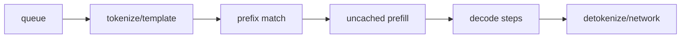

# 调度、缓存与性能：从指标反推瓶颈

“更快”不是一个指标。在线推理至少同时面对首 token、后续 token、总完成时间、吞吐和失败率。SGLang 的 radix cache、chunked prefill、overlap schedule 和并行策略作用在不同阶段，必须先说清优化目标。

## 四个核心指标

设请求到达时间 (t_0)，首 token 到达 (t_1)，第 (i) 个 token 到达 (t_i)，完成时间 (t_e)：

$$
TTFT=t_1-t_0
$$

$$
ITL_i=t_i-t_{i-1},\qquad E2E=t_e-t_0
$$

吞吐需明确口径：request/s、input token/s、output token/s 或 total token/s 不能互换。

| 指标 | 包含哪些时间 | 常见主因 |
| --- | --- | --- |
| TTFT | 排队、tokenize、prefix match、未缓存 prefill、首轮执行 | 长 prompt、拥塞、prefill budget、cache miss |
| ITL | decode 排队、每步 forward、采样和输出传输 | batch、带宽、collective、CPU/stream 同步 |
| E2E | TTFT + 所有输出 token 间隔 | 输出长度、排队与 ITL |
| throughput | 固定时间完成的工作量 | 饱和度、batch、cache hit、kernel/通信效率 |

必须报告 p50/p95/p99。平均值会掩盖长 prompt、突发排队和少数 stalled 请求。

## 一次请求的时间账本



Radix hit 主要缩短 `uncached prefill`；overlap 主要隐藏 Scheduler CPU 处理与 GPU execution 的串行空隙；speculative 试图让一次 target verification 接受多个输出 token；TP/PP/DP 改变权重放置、通信和副本容量。

## Token budget 的取舍

增大单轮 prefill token budget 通常能提高长 prompt 处理效率，却可能让 decode 请求等更久，伤害 ITL。过小则产生更多 chunk、launch 和调度开销。

```text
大 chunk / 大 budget
  + prefill 吞吐可能更高
  - 单轮占用更久，尾部 ITL 可能变差

小 chunk / 小 budget
  + 更容易穿插 decode，公平性更好
  - chunk 数和调度开销增加
```

正确值由输入长度分布、SLO 和硬件决定，不存在跨模型通用的“最佳数字”。

## Radix cache 的收益怎样估

设 prompt 长度 (L)，命中前缀 (H)，则本请求至少仍需计算：

$$
L_{extend}=L-H
$$

但 TTFT 加速不等于 (L/(L-H))，因为还有排队、tokenization、调度、首轮 decode、kernel 固定开销和可能的 page 对齐。可靠实验应保持请求到达过程相同，只改变 cache on/off 或前缀共享率。

缓存也有成本：树维护、metadata、被锁 KV、热点分散到不同 DP rank，以及为了命中而改变调度顺序。

## Overlap scheduler 的边界

Overlap 在 Scheduler CPU 工作占比明显、GPU 能提前获得下一批工作时更有价值。以下情况收益可能小或为负：

- 单请求且每步都强依赖上一 token；
- CPU 本来不是瓶颈；
- batch shape 频繁变化，额外同步多；
- 某高级路径主动禁用 overlap；
- profile/debug 需要严格串行时序。

做 on/off A/B 时同时观察 output 正确性、显存、ITL 分布和 GPU idle gap，不能只看 total throughput。

## 显存不是一个比例

大致分为：

```text
模型权重
+ KV cache pool
+ activation / temporary buffers
+ CUDA Graph captured buffers
+ attention / sampling backend workspace
+ 通信与框架开销
```

`mem_fraction_static` 影响静态预留空间，但不是“安全使用 GPU 的百分比”万能旋钮。提高它可能扩大 token capacity，也可能挤压 runtime workspace 导致 OOM。多实例共卡时尤其不能照搬单实例数值。

## 现象到假设

| 现象 | 先验证 | 不要立刻做 |
| --- | --- | --- |
| TTFT 高、ITL 正常 | queue、prompt 长度、cache hit、prefill chunk | 直接换 decode kernel |
| TTFT 正常、ITL 高 | decode batch、GPU/通信、sampling、输出路径 | 只增大 KV cache |
| GPU 利用率呈锯齿 | CPU 调度 gap、形状变化、同步、到达率 | 默认认定显存不足 |
| 高并发突然尾延迟崩 | 饱和点、queue depth、KV pressure、preemption/拒绝 | 只看平均 tokens/s |
| prefix hit 低 | token ids、路由、cache identity、容量与淘汰 | 假设相同字符串必命中 |
| OOM 在高并发出现 | KV slot、graph/workspace、长度分布 | 只降低 batch request 数 |

## 一次只调一个旋钮

建议顺序：

1. 固定模型、精度、revision 与硬件；
2. 固定请求数据和到达过程；
3. 记录默认参数的原始结果；
4. 只改一个参数；
5. 预先写出希望改善的指标与可能受损指标；
6. 重复多次并保存完整命令；
7. 结果不符合预期时先解释，不继续堆参数。

## 三类负载的预测

| 负载 | 优先关注 | 可能有效 |
| --- | --- | --- |
| 共享长前缀、多轮对话 | prefix hit、TTFT、DP 路由 | radix cache、cache-aware routing |
| 独立长文档、短回答 | prefill throughput、短请求尾延迟 | chunked prefill、budget 调优 |
| 短输入、长 reasoning | ITL、output throughput、KV 增长 | decode batch、speculative、并行/quantization |

同一配置不必同时最适合三种负载。生产容量规划应使用真实长度与前缀分布，而不是只跑一个合成 prompt。

## 通关检查

拿任一参数建议，补全：

```text
假设：
它改变哪个阶段：
主指标：
可能受损指标：
固定变量：
最小 A/B：
什么结果会推翻假设：
```

能这样表达后，再去[启动第一台服务](../practice/first-server)采集证据。
