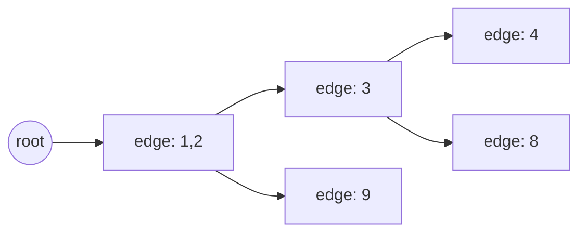
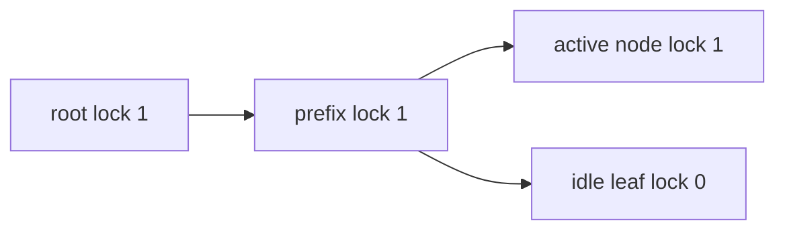

# RadixAttention：把跨请求前缀变成可复用的 KV

自回归推理中，同一 token 前缀在相同模型和相关执行条件下会产生相同 K/V。若多条请求共享 system prompt、few-shot 示例或多轮对话历史，重复 prefill 是浪费。RadixAttention 的核心是：**把 token 前缀与对应 KV slot 组织成压缩 radix tree，并让调度与淘汰感知这棵树。**

## 从三条序列开始

插入：

```text
A = [1, 2, 3, 4]
B = [1, 2, 3, 8]
C = [1, 2, 9]
```

压缩 radix tree 可以表示为：



边存一段 token，而不是一个 token，所以长的唯一前缀不需要制造大量单子节点。插入 B 时，已有 `[1,2,3,4]` 的边会在分叉处被拆分。

查询 `[1,2,3,7]` 时，最长命中是 `[1,2,3]`。对应物理 KV indices 可复用，只需为 `[7]` 分配新 slot 并计算 extend。

## 树里真正存什么

固定源码中的 [`TreeNode`](https://github.com/sgl-project/sglang/blob/c879f3da5ceaaef3cb197c4e59ce683d420ce96c/python/sglang/srt/mem_cache/radix_cache.py#L217) 关键字段可简化为：

| 字段 | 含义 |
| --- | --- |
| `key` | 这条压缩边的 token segment 与 extra key |
| `value` | 与该 segment 对齐的物理 KV indices |
| `children` / `parent` | 树结构 |
| `lock_ref` | 自己或后代正在被活跃请求引用的计数 |
| access / creation time | LRU 等淘汰策略的证据 |
| priority / hit count | 可选调度与淘汰信息 |

树不保存完整 KV tensor。`value` 是地址索引；真正设备内存在 KV pool 中。

## `extra_key` 为什么存在

token ids 相同不必然代表 KV 一定可共用。图像、多模态、LoRA、cache salt 或其他执行上下文可能改变 hidden state。`RadixKey` 因此不仅包含 token ids，还可包含额外身份信息，防止语义不同的请求错误命中。

原则是：**所有会改变该前缀 K/V 的条件，都必须进入 cache identity 或让缓存失效。**

## 最长前缀匹配与节点分裂

[`match_prefix()`](https://github.com/sgl-project/sglang/blob/c879f3da5ceaaef3cb197c4e59ce683d420ce96c/python/sglang/srt/mem_cache/radix_cache.py#L355) 大致做：

1. 从 root 按下一个 token/extra key 找 child；
2. 比较压缩边与剩余查询；
3. 完全匹配则继续向下；
4. 只匹配边的一部分时，在边内分裂节点；
5. 拼接所有命中节点的 KV indices；
6. 更新访问时间并返回最后命中节点。

边内分裂很重要：否则树只能返回“整条边命中”或“完全不命中”，会浪费合法的部分前缀。

## 完成请求和未完成请求怎样入树

| 时机 | 方法 | 关键动作 |
| --- | --- | --- |
| 请求完成 | [`cache_finished_req()`](https://github.com/sgl-project/sglang/blob/c879f3da5ceaaef3cb197c4e59ce683d420ce96c/python/sglang/srt/mem_cache/radix_cache.py#L437) | 插入 token→KV 映射，释放与已有树重复的 slot，处理未对齐尾部，释放锁 |
| 请求仍运行 | [`cache_unfinished_req()`](https://github.com/sgl-project/sglang/blob/c879f3da5ceaaef3cb197c4e59ce683d420ce96c/python/sglang/srt/mem_cache/radix_cache.py#L489) | 插入已计算前缀，重新 match，把请求映射改指向共享 slot，更新锁 |

“缓存未完成请求”不等于它已结束，而是把目前稳定的已计算部分变为可复用前缀，同时请求继续生成。

## 为什么需要 `lock_ref`

一个活跃请求可能正从节点 N 的 KV 继续 decode。如果 LRU 只看最近访问时间，可能在 forward 前把 N 逐出。锁沿节点及祖先计数，使从 root 到活跃前缀的路径不可淘汰。



只有 `lock_ref == 0` 的可淘汰叶子才能进入 eviction 候选；删叶后，父节点若也变成可淘汰叶子，才可继续向上处理。

## LRU 淘汰不是“删最老请求”

[`evict()`](https://github.com/sgl-project/sglang/blob/c879f3da5ceaaef3cb197c4e59ce683d420ce96c/python/sglang/srt/mem_cache/radix_cache.py#L564) 选择的是**可淘汰树叶**，释放对应 token KV slots，并维护树结构。一个请求可能已结束但其前缀仍在树里；反过来，活跃请求的路径必须被锁住。

因此缓存指标应关注可淘汰 token、受锁 token、实际命中 token和 pool 空闲量，而不是只数“缓存了多少请求”。

## Cache-aware scheduling

若请求 X 命中 900 token，Y 命中 10 token，在其他条件接近时先运行 X 可能：

- 减少本轮新 prefill token；
- 更快释放或复用 cache；
- 提高同一前缀请求的局部性。

SGLang 的 `SchedulePolicy` 支持 cache-aware 策略，例如 LPM；也有 FCFS、LOF、随机等 cache-agnostic 策略。命中收益、公平性和饥饿风险需要结合负载验证，不能把 LPM 当作所有场景的唯一答案。

## 页对齐与不完整尾部

某些 KV allocator 以 page 为单位。只有对齐到完整 page 的前缀才能稳定共享；未对齐尾部可能需要裁剪或单独处理。课程里的“一个 token 一个 slot”是理解模型，实际行为要结合 `page_size` 与 allocator。

## 什么时候收益小

- 请求之间几乎没有共同前缀；
- prompt 很短而输出很长，时间主要在 decode；
- 相同文本使用不同 LoRA/多模态上下文，不能安全共用；
- cache 容量太小，热点前缀频繁被逐出；
- 路由把相同前缀分散到独立 DP replicas；
- tokenization/chat template 不一致，表面文本相同但 token ids 不同。

## 手工通关题

对 `[1,2,3,4]`、`[1,2,3,8]`、`[1,2,9]`：

1. 画压缩树；
2. 查询 `[1,2,3,7]`，写出命中长度；
3. 假设 `[1,2,3]` 被活跃请求锁定，指出哪些叶可淘汰；
4. 删除 `[1,2,9]` 后，哪些节点可合并；
5. 说明命中三个 token 后新请求仍需做什么。

能回答后，再到[RadixCache 与内存池](../internals/cache-pools)把树节点接到实际 pool。
